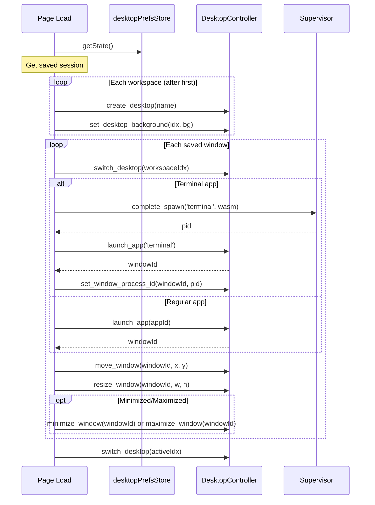

# Full Session Persistence

## Current State

The `desktopPrefsStore.ts` currently persists:

- Active workspace index
- Per-workspace backgrounds

Missing persistence for:

- Workspace names (currently only "Desktop 1" exists by default)
- Open windows (appId, position, size, state, which workspace)
- Window z-order and focus state

## Data Model

Extend the preferences store to include:

```typescript
interface WorkspaceConfig {
  name: string;
  background: string;
}

interface SavedWindow {
  appId: string;
  workspaceIndex: number;
  position: { x: number; y: number };
  size: { width: number; height: number };
  state: 'normal' | 'minimized' | 'maximized';
}

interface DesktopPrefsState {
  activeWorkspace: number;
  workspaces: WorkspaceConfig[];  // NEW - replaces backgrounds Record
  windows: SavedWindow[];         // NEW
  // ... actions
}
```

## Implementation

### 1. Extend `desktopPrefsStore.ts`

- Add `workspaces: WorkspaceConfig[]` array (replaces `backgrounds` Record for cleaner workspace data)
- Add `windows: SavedWindow[]` array
- Add actions: `addWorkspace`, `setWorkspaces`, `setWindows`, `saveWindowState`

### 2. Persist Workspace Creation

In [`web/src/desktop/hooks/useDesktops.ts`](web/src/desktop/hooks/useDesktops.ts):

- When `createDesktop()` is called, also persist the new workspace to the store
- Include the workspace name and default background

### 3. Persist Window State

Two approaches (recommend Option A for simplicity):

**Option A - Persist on beforeunload**: Add an event listener in `DesktopWithPermissions.tsx` that captures window state when the page is about to close. This is simpler and avoids excessive writes.

**Option B - Persist on changes**: Track window moves/resizes with debouncing. More complex but provides real-time persistence.

Key implementation in [`web/src/desktop/DesktopWithPermissions/DesktopWithPermissions.tsx`](web/src/desktop/DesktopWithPermissions/DesktopWithPermissions.tsx):

- Add `beforeunload` handler that:

  1. Gets all windows via `desktop.get_windows_json()`
  2. Gets all desktops via `desktop.get_desktops_json()`
  3. Builds a map of window-to-workspace from the desktop data
  4. Saves to the prefs store

### 4. Restore Session on Init

In [`web/src/desktop/DesktopWithPermissions/DesktopWithPermissions.tsx`](web/src/desktop/DesktopWithPermissions/DesktopWithPermissions.tsx):

Modify the existing restore `useEffect` to:

1. **Restore workspaces first**: For each saved workspace (beyond the default), call `desktop.create_desktop(name)` and `desktop.set_desktop_background(index, bg)`

2. **Restore windows**: For each saved window:

   - Switch to the correct workspace
   - Launch the app: `desktop.launch_app(appId)` returns window ID
   - Move/resize: `desktop.move_window(id, x, y)` + `desktop.resize_window(id, w, h)`
   - Apply state: `desktop.minimize_window(id)` or `desktop.maximize_window(id)` if needed
   - For terminals: use `launchTerminal()` async flow, then reposition

3. **Restore active workspace**: Switch back to the saved active workspace

### 5. Track Window-to-Workspace Mapping

Currently `get_windows_json()` only returns windows on the active desktop. To save all windows, we need to iterate through each desktop. The restore logic will:

- Switch desktop, get windows, record with workspace index
- Repeat for all desktops
- Switch back to original

## Files to Modify

- [`web/src/stores/desktopPrefsStore.ts`](web/src/stores/desktopPrefsStore.ts) - Extend state and actions
- [`web/src/desktop/hooks/useDesktops.ts`](web/src/desktop/hooks/useDesktops.ts) - Persist workspace creation
- [`web/src/desktop/DesktopWithPermissions/DesktopWithPermissions.tsx`](web/src/desktop/DesktopWithPermissions/DesktopWithPermissions.tsx) - Save on unload, restore on init

## Restore Sequence



## Edge Cases

- **Deleted apps**: Skip windows for apps that no longer exist (graceful failure)
- **Screen size changed**: Windows may be off-screen; could clamp positions or leave as-is
- **Terminal process state**: Terminals restore as empty (no command history) - this is expected behavior