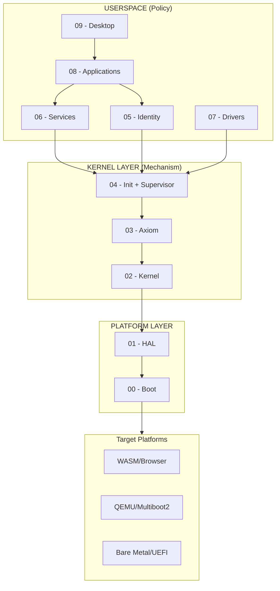
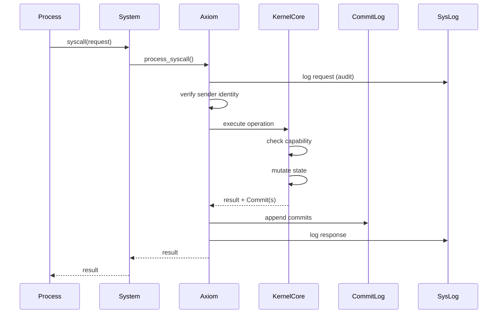

# Zero OS

A capability-based microkernel operating system with deterministic state via commit log.

## Core Invariants

These architectural constraints are **non-negotiable** across all targets (WASM, QEMU, bare metal):

| # | Invariant | Description |
|---|-----------|-------------|
| 1 | **All Authority Through Axiom** | No process may directly invoke the kernel. Axiom verifies, logs, and gates all syscalls. |
| 2 | **State Mutated Only by Commits** | All kernel state changes are atomic Commits appended to an immutable CommitLog. |
| 4 | **Kernel Minimality** | Kernel implements only: IPC, scheduling, address spaces, capability enforcement, commit emission. |
| 5 | **3,000 LOC Limit** | The kernel must remain ≤ 3,000 lines of executable code. |
| 7 | **No Policy in Kernel** | Kernel enforces mechanism only. No paths, identities, permissions, or security labels. |
| 13 | **Supervisor Is Thin Transport** | Supervisor only relays data between web client and processes via IPC. No policy, no authority. |
| 17 | **Capabilities Are Primitive** | Capabilities reference kernel objects only: endpoints, processes, memory, IRQs, I/O ports. |
| 31 | **Filesystem Through VFS** | All filesystem access must flow through VFS Service (PID 3). |
| 32 | **Keystore Physically Separate** | Cryptographic keys stored in separate `zos-keystore` database, not through VFS. |

See [docs/invariants/invariants.md](docs/invariants/invariants.md) for the complete list.

---

## Architecture

### System Layers



### Syscall Flow

Every syscall flows through Axiom for verification and recording:



**Key invariant**: No process ever directly invokes `KernelCore`. All access is mediated through `System` which routes through `Axiom`.

### Two-Log Model

| Log | Purpose | Used for Replay |
|-----|---------|-----------------|
| **SysLog** | Audit trail (what was asked, what was answered) | No |
| **CommitLog** | State mutations (what actually changed) | Yes |

The CommitLog is the source of truth. SysLog can be deleted without losing state.

---

## Table of Contents

### Platform Layer

| Layer | Component | Description | Spec |
|-------|-----------|-------------|------|
| **0** | [Boot](docs/spec/v0.1.3/00-boot.md) | Platform-specific initialization (browser load, UEFI, Multiboot2) | [Spec](docs/spec/v0.1.3/00-boot.md) |
| **1** | [HAL](docs/spec/v0.1.3/01-hal.md) | Hardware abstraction trait enabling single codebase for all platforms | [Spec](docs/spec/v0.1.3/01-hal.md) |

### Kernel Layer

| Layer | Component | Description | Spec |
|-------|-----------|-------------|------|
| **2** | [Kernel](docs/spec/v0.1.3/02-kernel.md) | Minimal microkernel: IPC, scheduling, capabilities, memory. Target: <3000 LOC | [Spec](docs/spec/v0.1.3/02-kernel.md) |
| **3** | [Axiom](docs/spec/v0.1.3/03-axiom.md) | Verification layer. Gates all syscalls, maintains SysLog and CommitLog | [Spec](docs/spec/v0.1.3/03-axiom.md) |
| **4** | [Init + Supervisor](docs/spec/v0.1.3/04-init-supervisor.md) | PID 1. Service registry, IPC routing, supervisor boundary | [Spec](docs/spec/v0.1.3/04-init-supervisor.md) |

### Userspace Layer

| Layer | Component | Description | Spec |
|-------|-----------|-------------|------|
| **5** | [Identity](docs/spec/v0.1.3/05-identity.md) | User management, sessions, Zero-ID integration, neural keys | [Spec](docs/spec/v0.1.3/05-identity.md) |
| **6** | [Services](docs/spec/v0.1.3/06-services.md) | VFS, Network, Time, Keystore services | [Spec](docs/spec/v0.1.3/06-services.md) |
| **7** | [Drivers](docs/spec/v0.1.3/07-drivers.md) | User-space device drivers (future: virtio, NVMe, NIC) | [Spec](docs/spec/v0.1.3/07-drivers.md) |
| **8** | [Applications](docs/spec/v0.1.3/08-applications.md) | Sandboxed apps via ZeroApp trait, capability-controlled access | [Spec](docs/spec/v0.1.3/08-applications.md) |
| **9** | [Desktop](docs/spec/v0.1.3/09-desktop.md) | WebGPU compositor, window manager, infinite canvas, React surfaces | [Spec](docs/spec/v0.1.3/09-desktop.md) |

---

## Platform Capabilities

The HAL enables the same kernel code to run on multiple platforms:

| Capability | WASM | QEMU | Bare Metal |
|------------|------|------|------------|
| Process isolation | Web Workers + WASM sandbox | WASM sandbox (wasmi) | Hardware MMU |
| Preemption | Cooperative | APIC timer interrupt | Timer interrupt |
| Memory protection | WASM linear memory | WASM + page tables | Page tables |
| Storage | IndexedDB | VirtIO-blk | NVMe/SATA |
| Network | Fetch/WebSocket | VirtIO-net | NIC drivers |
| Scheduling | Single-threaded | Cooperative (WASM) | Multi-core |
| Binary loading | Network fetch (async) | Embedded (include_bytes!) | Disk/EFI |
| CommitLog persistence | None (in-memory) | VirtIO-blk | Disk |

---

## Quick Start

### Prerequisites

```bash
rustup target add wasm32-unknown-unknown
cargo install wasm-pack
```

### Build and Run

```bash
make dev          # Build WASM and start dev server
# Or manually:
make build        # Build the WASM module
make server       # Start the dev server
```

Open http://localhost:8080 in your browser.

### Development

```bash
make check        # Run cargo check
make test         # Run tests
make clean        # Clean build artifacts
```

---

## Project Structure

```
zero-os/
├── crates/
│   ├── zos-hal/              # HAL trait (no_std)
│   ├── zos-axiom/            # Axiom verification layer
│   ├── zos-kernel/           # Core kernel (no_std)
│   ├── zos-init/             # Init process
│   ├── zos-process/          # Process-side syscall lib
│   ├── zos-ipc/              # IPC protocol constants
│   ├── zos-identity/         # Identity service client
│   ├── zos-vfs/              # Virtual filesystem
│   ├── zos-apps/             # Userspace apps
│   ├── zos-desktop/          # Desktop compositor
│   ├── zos-network/          # Network service
│   └── zos-supervisor/       # WASM supervisor
├── web/                      # Browser UI
│   ├── desktop/              # React desktop environment
│   └── services/             # TypeScript service clients
├── docs/
│   ├── spec/v0.1.3/          # Current specification
│   ├── invariants/           # Architectural invariants
│   └── whitepaper/           # Design documents
```

---

## Documentation

| Document | Description |
|----------|-------------|
| [Invariants](docs/invariants/invariants.md) | Non-negotiable architectural constraints |
| [Specification](docs/spec/v0.1.3/) | Current version spec by layer |
| [Whitepaper](docs/whitepaper/) | Design principles and rationale |

---

## License

MIT
