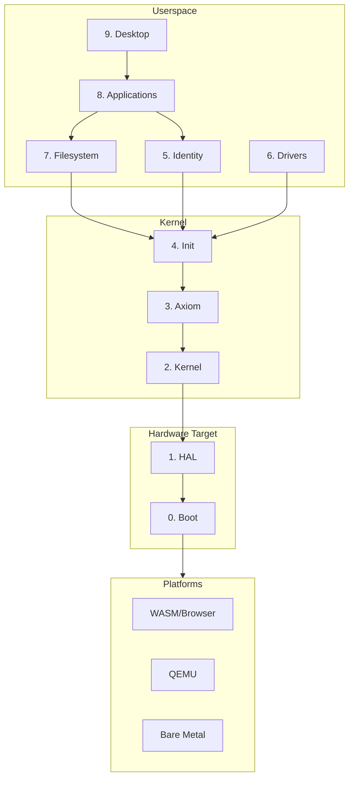
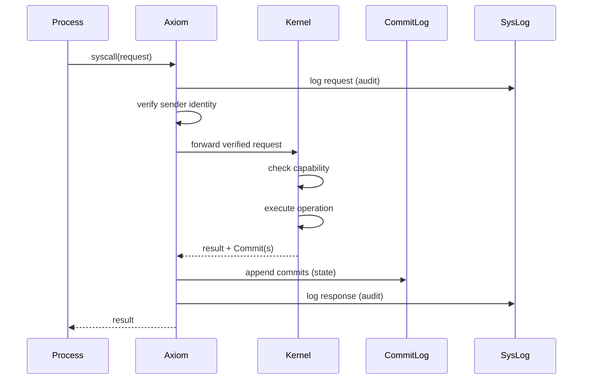

# Zero OS

A capability-based microkernel operating system with deterministic state via commit log.

## Core Invariants

These architectural constraints are **non-negotiable** across all targets (WASM, QEMU, bare metal):

| Invariant | Description |
|-----------|-------------|
| **All Authority Flows Through Axiom** | No process may directly invoke the kernel. Axiom verifies, logs, and gates all syscalls. |
| **State Mutated Only by Commits** | All kernel state changes are atomic Commits appended to an immutable CommitLog. State = `reduce(genesis, commits)`. |
| **Kernel Size Limit: 3,000 LOC** | The kernel implements only IPC, scheduling, address spaces, capability enforcement, and commit emission. Everything else is userspace. |
| **No Policy in the Kernel** | Kernel enforces mechanism only. It does not interpret paths, identities, permissions, or security labels. |
| **Supervisor Is a Thin Boundary** | The supervisor only relays data between web client and processes via IPC. No policy, no authority, no kernel calls. |
| **Capabilities Are Unforgeable** | Capabilities can only be created by the kernel, derived through grant (with attenuation), or transferred via IPC. |

---

## Architecture

### System Layers



### Syscall Flow

Every syscall flows through Axiom for verification and recording:



### Two-Log Model

| Log | Purpose | Used for Replay |
|-----|---------|-----------------|
| **SysLog** | Audit trail (what was asked, what was answered) | No |
| **CommitLog** | State mutations (what actually changed) | Yes |

The CommitLog is the source of truth. SysLog can be deleted without losing state.

---

## Table of Contents

### Hardware Target

| Layer | Component | Description | Spec |
|-------|-----------|-------------|------|
| **0** | [Boot](docs/spec/v0.1.2/00-boot/) | Platform-specific initialization (browser load, UEFI, Multiboot2) | [README](docs/spec/v0.1.2/00-boot/README.md) |
| **1** | [HAL](docs/spec/v0.1.2/01-hal/) | Hardware abstraction trait enabling single codebase for all platforms | [README](docs/spec/v0.1.2/01-hal/README.md) |

### Kernel

| Layer | Component | Description | Spec |
|-------|-----------|-------------|------|
| **2** | [Kernel](docs/spec/v0.1.2/03-kernel/) | Minimal microkernel: IPC, scheduling, capabilities, memory. Target: <3000 LOC | [README](docs/spec/v0.1.2/03-kernel/README.md) |
| **3** | [Axiom](docs/spec/v0.1.2/02-axiom/) | Verification layer. Gates all syscalls, maintains SysLog and CommitLog | [README](docs/spec/v0.1.2/02-axiom/README.md) |
| **4** | [Init](docs/spec/v0.1.2/04-init/) | PID 1. Bootstraps services, supervises processes, routes IPC | [README](docs/spec/v0.1.2/04-init/README.md) |

### Userspace

| Layer | Component | Description | Spec |
|-------|-----------|-------------|------|
| **5** | [Identity](docs/spec/v0.1.2/05-identity/) | User management, sessions, Zero-ID integration, permissions | [README](docs/spec/v0.1.2/05-identity/README.md) |
| **6** | [Drivers](docs/spec/v0.1.2/06-drivers/) | User-space device drivers (future: virtio, NVMe, NIC) | [README](docs/spec/v0.1.2/06-drivers/README.md) |
| **7** | [Filesystem](docs/spec/v0.1.2/06-filesystem/) | VFS with hierarchical paths, per-user home directories, encryption | [README](docs/spec/v0.1.2/06-filesystem/README.md) |
| **8** | [Applications](docs/spec/v0.1.2/07-applications/) | Sandboxed apps via ZeroApp trait, capability-controlled access | [README](docs/spec/v0.1.2/07-applications/README.md) |
| **9** | [Desktop](docs/spec/v0.1.2/08-desktop/) | WebGPU compositor, window manager, infinite canvas, React surfaces | [README](docs/spec/v0.1.2/08-desktop/README.md) |

---

## Platform Capabilities

The HAL enables the same kernel code to run on multiple platforms:

| Capability | WASM | QEMU | Bare Metal |
|------------|------|------|------------|
| Process isolation | Web Workers | Hardware VMM | Hardware MMU |
| Preemption | Cooperative | Timer interrupt | Timer interrupt |
| Memory protection | WASM sandbox | Page tables | Page tables |
| Storage | IndexedDB | virtio-blk | NVMe/SATA |
| Network | Fetch/WebSocket | virtio-net | NIC drivers |

---

## Quick Start

### Prerequisites

```bash
rustup target add wasm32-unknown-unknown
cargo install wasm-pack
```

### Build and Run

```bash
make dev          # Build WASM and start dev server
# Or manually:
make build        # Build the WASM module
make server       # Start the dev server
```

Open http://localhost:8080 in your browser.

### Development

```bash
make check        # Run cargo check
make test         # Run tests
make clean        # Clean build artifacts
```

---

## Project Structure

```
zero-os/
├── crates/
│   ├── zos-hal/              # HAL trait (no_std)
│   ├── zos-axiom/            # Axiom verification layer
│   ├── zos-kernel/           # Core kernel (no_std)
│   ├── zos-init/             # Init process
│   ├── zos-process/          # Process-side syscall lib
│   ├── zos-ipc/              # IPC protocol constants
│   ├── zos-identity/         # Identity service client
│   ├── zos-vfs/              # Virtual filesystem
│   ├── zos-apps/             # Userspace apps
│   ├── zos-desktop/          # Desktop compositor
│   ├── zos-network/          # Network service
│   └── zos-supervisor/       # WASM supervisor
├── web/                      # Browser UI
│   ├── desktop/              # React desktop environment
│   └── services/             # TypeScript service clients
├── docs/
│   ├── spec/v0.1.2/          # Current specification
│   ├── invariants/           # Architectural invariants
│   └── whitepaper/           # Design documents
└── tools/
    └── dev-server/           # Static file server
```

---

## Documentation

| Document | Description |
|----------|-------------|
| [Invariants](docs/invariants/invariants.md) | Non-negotiable architectural constraints |
| [Specification](docs/spec/v0.1.2/) | Current version spec by layer |
| [Whitepaper](docs/whitepaper/) | Design principles and rationale |

---

## License

MIT
