# Orbital OS State Machine Diagrams

**Version:** 1.0  
**Status:** Specification  
**Component:** System-wide

---

## Overview

This document contains all formal state machine diagrams for Orbital OS components.

---

## 1. System Boot State Machine

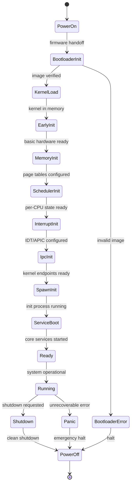
```mermaid
stateDiagram-v2
    [*] --> PowerOn
    
    PowerOn --> BootloaderInit: firmware handoff
    
    BootloaderInit --> BootloaderError: invalid image
    BootloaderInit --> KernelLoad: image verified
    
    KernelLoad --> EarlyInit: kernel in memory
    
    EarlyInit --> MemoryInit: basic hardware ready
    
    MemoryInit --> SchedulerInit: page tables configured
    
    SchedulerInit --> InterruptInit: per-CPU state ready
    
    InterruptInit --> IpcInit: IDT/APIC configured
    
    IpcInit --> SpawnInit: kernel endpoints ready
    
    SpawnInit --> ServiceBoot: init process running
    
    ServiceBoot --> Ready: core services started
    
    Ready --> Running: system operational
    
    Running --> Shutdown: shutdown requested
    Running --> Panic: unrecoverable error
    
    Shutdown --> PowerOff: clean shutdown
    
    Panic --> PowerOff: emergency halt
    
    BootloaderError --> PowerOff: halt
    
    PowerOff --> [*]
```

---

## 2. Three-Phase Action Lifecycle

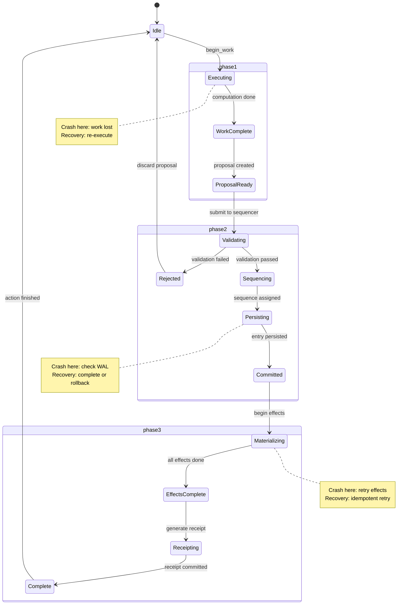
```mermaid
stateDiagram-v2
    [*] --> Idle
    
    state phase1 [Phase 1: Pre-Commit]
    state phase2 [Phase 2: Commit]
    state phase3 [Phase 3: Effect]
    
    Idle --> Executing: begin_work
    
    state phase1 {
        Executing --> WorkComplete: computation done
        WorkComplete --> ProposalReady: proposal created
    }
    
    ProposalReady --> Validating: submit to sequencer
    
    state phase2 {
        Validating --> Rejected: validation failed
        Validating --> Sequencing: validation passed
        Sequencing --> Persisting: sequence assigned
        Persisting --> Committed: entry persisted
    }
    
    Rejected --> Idle: discard proposal
    
    Committed --> Materializing: begin effects
    
    state phase3 {
        Materializing --> EffectsComplete: all effects done
        EffectsComplete --> Receipting: generate receipt
        Receipting --> Complete: receipt committed
    }
    
    Complete --> Idle: action finished
    
    note right of Executing
        Crash here: work lost
        Recovery: re-execute
    end note
    
    note right of Persisting
        Crash here: check WAL
        Recovery: complete or rollback
    end note
    
    note right of Materializing
        Crash here: retry effects
        Recovery: idempotent retry
    end note
```

---

## 3. Axiom Entry Lifecycle

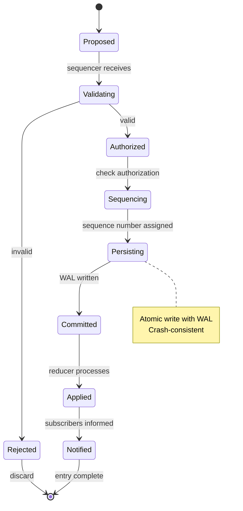
```mermaid
stateDiagram-v2
    [*] --> Proposed
    
    Proposed --> Validating: sequencer receives
    
    Validating --> Rejected: invalid
    Validating --> Authorized: valid
    
    Rejected --> [*]: discard
    
    Authorized --> Sequencing: check authorization
    
    Sequencing --> Persisting: sequence number assigned
    
    Persisting --> Committed: WAL written
    
    Committed --> Applied: reducer processes
    
    Applied --> Notified: subscribers informed
    
    Notified --> [*]: entry complete
    
    note right of Persisting
        Atomic write with WAL
        Crash-consistent
    end note
```

---

## 4. Job Execution State Machine

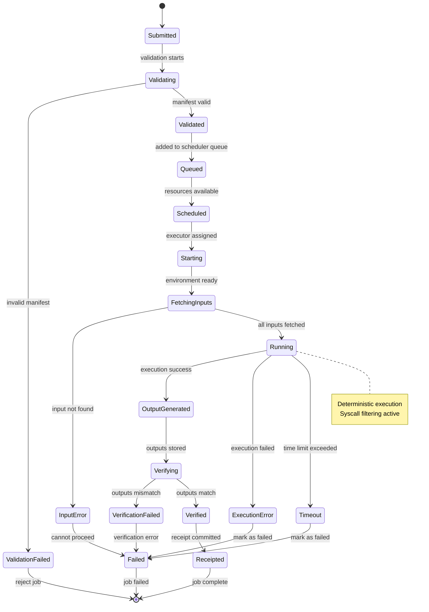
```mermaid
stateDiagram-v2
    [*] --> Submitted
    
    Submitted --> Validating: validation starts
    
    Validating --> ValidationFailed: invalid manifest
    Validating --> Validated: manifest valid
    
    ValidationFailed --> [*]: reject job
    
    Validated --> Queued: added to scheduler queue
    
    Queued --> Scheduled: resources available
    
    Scheduled --> Starting: executor assigned
    
    Starting --> FetchingInputs: environment ready
    
    FetchingInputs --> InputError: input not found
    FetchingInputs --> Running: all inputs fetched
    
    InputError --> Failed: cannot proceed
    
    Running --> OutputGenerated: execution success
    Running --> ExecutionError: execution failed
    Running --> Timeout: time limit exceeded
    
    ExecutionError --> Failed: mark as failed
    Timeout --> Failed: mark as failed
    
    OutputGenerated --> Verifying: outputs stored
    
    Verifying --> VerificationFailed: outputs mismatch
    Verifying --> Verified: outputs match
    
    VerificationFailed --> Failed: verification error
    
    Verified --> Receipted: receipt committed
    
    Receipted --> [*]: job complete
    Failed --> [*]: job failed
    
    note right of Running
        Deterministic execution
        Syscall filtering active
    end note
```

---

## 5. Process Lifecycle State Machine

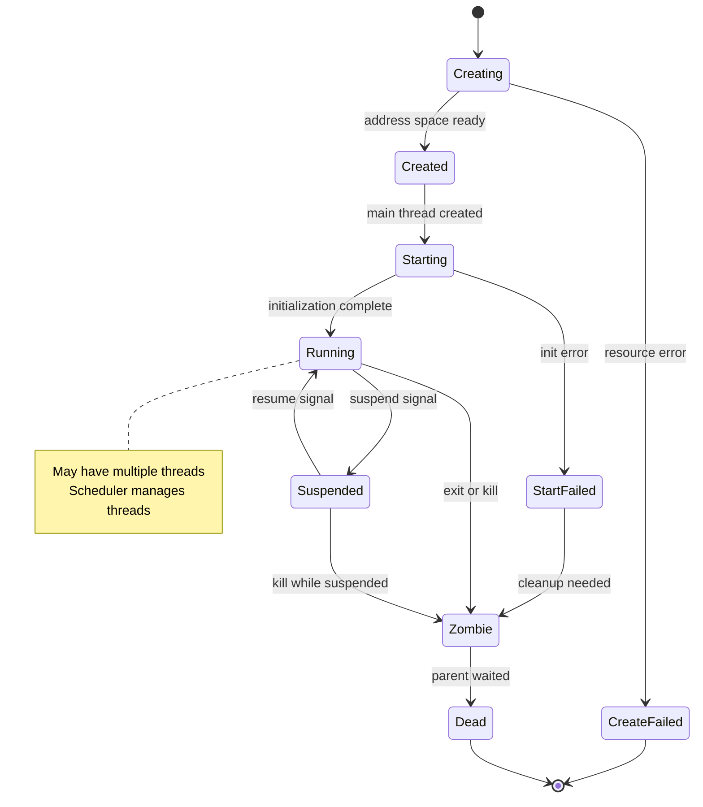
```mermaid
stateDiagram-v2
    [*] --> Creating
    
    Creating --> Created: address space ready
    Creating --> CreateFailed: resource error
    
    CreateFailed --> [*]
    
    Created --> Starting: main thread created
    
    Starting --> Running: initialization complete
    Starting --> StartFailed: init error
    
    StartFailed --> Zombie: cleanup needed
    
    Running --> Suspended: suspend signal
    Running --> Zombie: exit or kill
    
    Suspended --> Running: resume signal
    Suspended --> Zombie: kill while suspended
    
    Zombie --> Dead: parent waited
    
    Dead --> [*]
    
    note right of Running
        May have multiple threads
        Scheduler manages threads
    end note
```

---

## 6. Thread Lifecycle State Machine

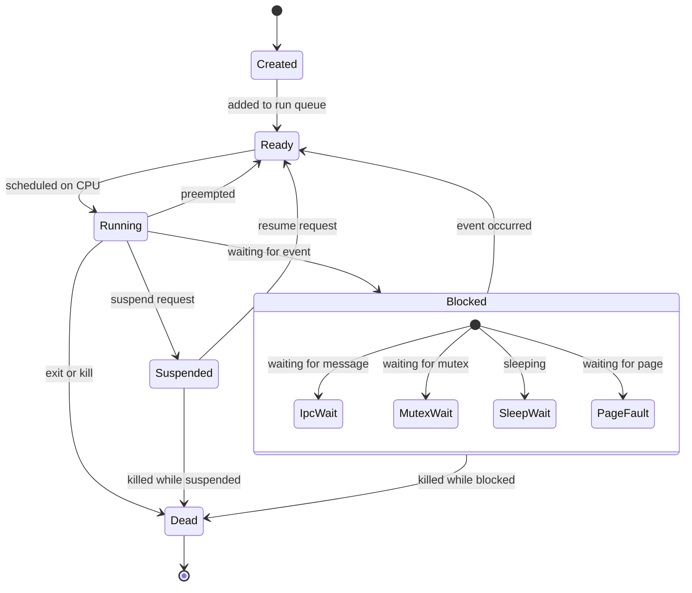
```mermaid
stateDiagram-v2
    [*] --> Created
    
    Created --> Ready: added to run queue
    
    Ready --> Running: scheduled on CPU
    
    Running --> Ready: preempted
    Running --> Blocked: waiting for event
    Running --> Suspended: suspend request
    Running --> Dead: exit or kill
    
    Blocked --> Ready: event occurred
    Blocked --> Dead: killed while blocked
    
    Suspended --> Ready: resume request
    Suspended --> Dead: killed while suspended
    
    Dead --> [*]
    
    state Blocked {
        [*] --> IpcWait: waiting for message
        [*] --> MutexWait: waiting for mutex
        [*] --> SleepWait: sleeping
        [*] --> PageFault: waiting for page
    }
```

---

## 7. Service Lifecycle State Machine

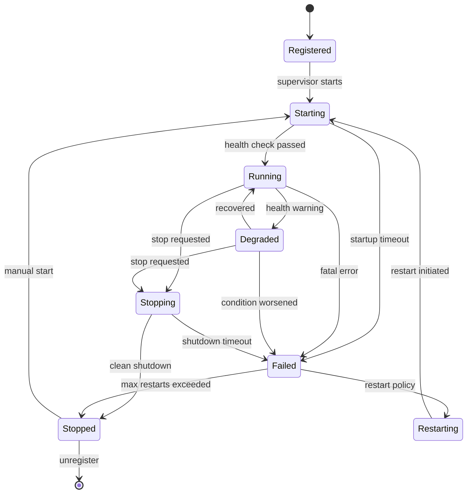
```mermaid
stateDiagram-v2
    [*] --> Registered
    
    Registered --> Starting: supervisor starts
    
    Starting --> Running: health check passed
    Starting --> Failed: startup timeout
    
    Running --> Degraded: health warning
    Running --> Stopping: stop requested
    Running --> Failed: fatal error
    
    Degraded --> Running: recovered
    Degraded --> Stopping: stop requested
    Degraded --> Failed: condition worsened
    
    Stopping --> Stopped: clean shutdown
    Stopping --> Failed: shutdown timeout
    
    Failed --> Restarting: restart policy
    Failed --> Stopped: max restarts exceeded
    
    Restarting --> Starting: restart initiated
    
    Stopped --> Starting: manual start
    Stopped --> [*]: unregister
```

---

## 8. Filesystem Transaction State Machine

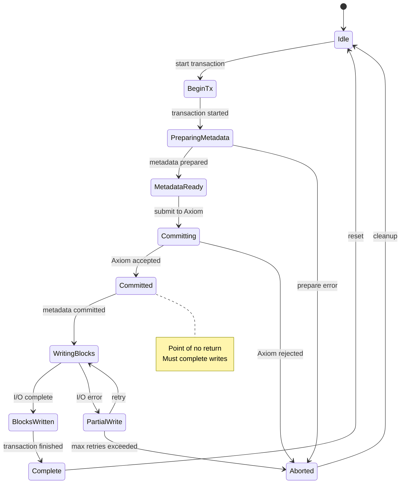
```mermaid
stateDiagram-v2
    [*] --> Idle
    
    Idle --> BeginTx: start transaction
    
    BeginTx --> PreparingMetadata: transaction started
    
    PreparingMetadata --> MetadataReady: metadata prepared
    PreparingMetadata --> Aborted: prepare error
    
    MetadataReady --> Committing: submit to Axiom
    
    Committing --> Committed: Axiom accepted
    Committing --> Aborted: Axiom rejected
    
    Committed --> WritingBlocks: metadata committed
    
    WritingBlocks --> BlocksWritten: I/O complete
    WritingBlocks --> PartialWrite: I/O error
    
    PartialWrite --> WritingBlocks: retry
    PartialWrite --> Aborted: max retries exceeded
    
    BlocksWritten --> Complete: transaction finished
    
    Complete --> Idle: reset
    Aborted --> Idle: cleanup
    
    note right of Committed
        Point of no return
        Must complete writes
    end note
```

---

## 9. Network Connection State Machine

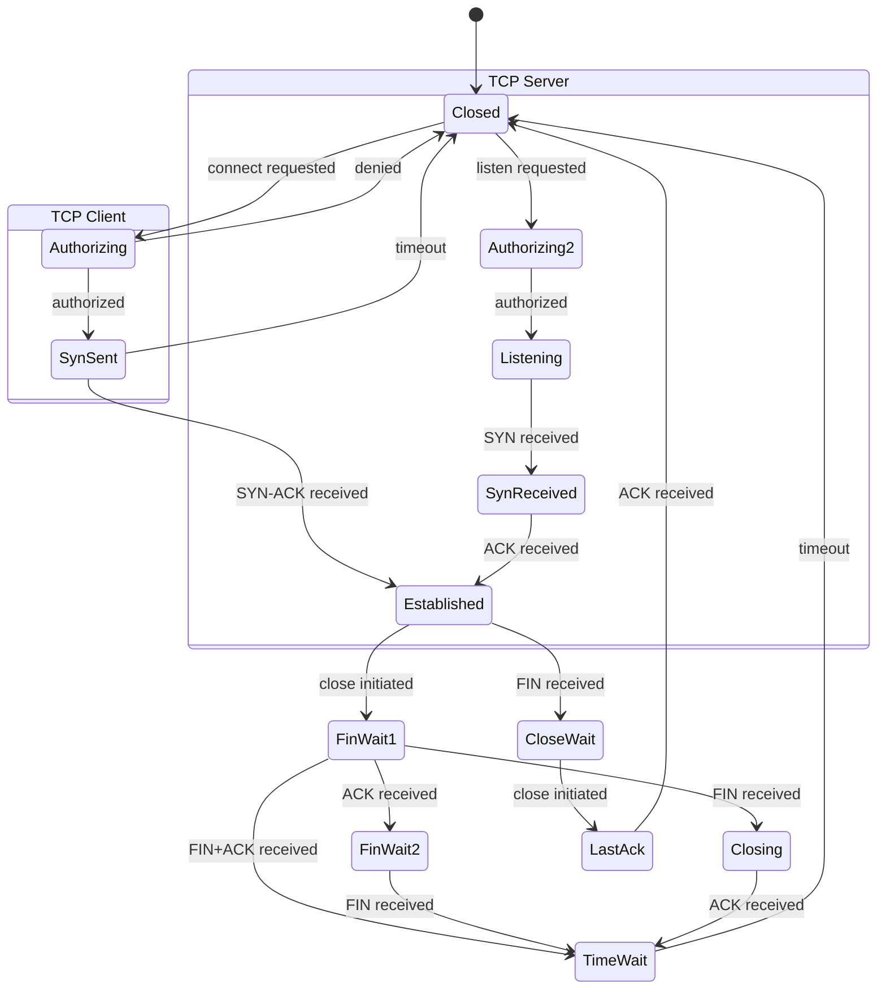
```mermaid
stateDiagram-v2
    [*] --> Closed
    
    state "TCP Client" as client {
        Closed --> Authorizing: connect requested
        Authorizing --> SynSent: authorized
        Authorizing --> Closed: denied
        SynSent --> Established: SYN-ACK received
        SynSent --> Closed: timeout
    }
    
    state "TCP Server" as server {
        Closed --> Authorizing2: listen requested
        Authorizing2 --> Listening: authorized
        Listening --> SynReceived: SYN received
        SynReceived --> Established: ACK received
    }
    
    Established --> FinWait1: close initiated
    Established --> CloseWait: FIN received
    
    FinWait1 --> FinWait2: ACK received
    FinWait1 --> Closing: FIN received
    FinWait1 --> TimeWait: FIN+ACK received
    
    FinWait2 --> TimeWait: FIN received
    
    Closing --> TimeWait: ACK received
    
    CloseWait --> LastAck: close initiated
    
    LastAck --> Closed: ACK received
    
    TimeWait --> Closed: timeout
```

---

## 10. IPC Message Exchange State Machine

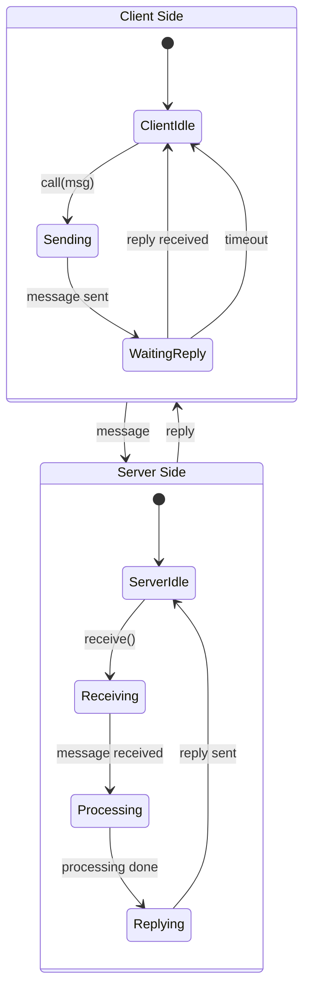
```mermaid
stateDiagram-v2
    state "Client Side" as client {
        [*] --> ClientIdle
        ClientIdle --> Sending: call(msg)
        Sending --> WaitingReply: message sent
        WaitingReply --> ClientIdle: reply received
        WaitingReply --> ClientIdle: timeout
    }
    
    state "Server Side" as server {
        [*] --> ServerIdle
        ServerIdle --> Receiving: receive()
        Receiving --> Processing: message received
        Processing --> Replying: processing done
        Replying --> ServerIdle: reply sent
    }
    
    client --> server: message
    server --> client: reply
```

---

## 11. Scheduler State Machine (Per CPU)

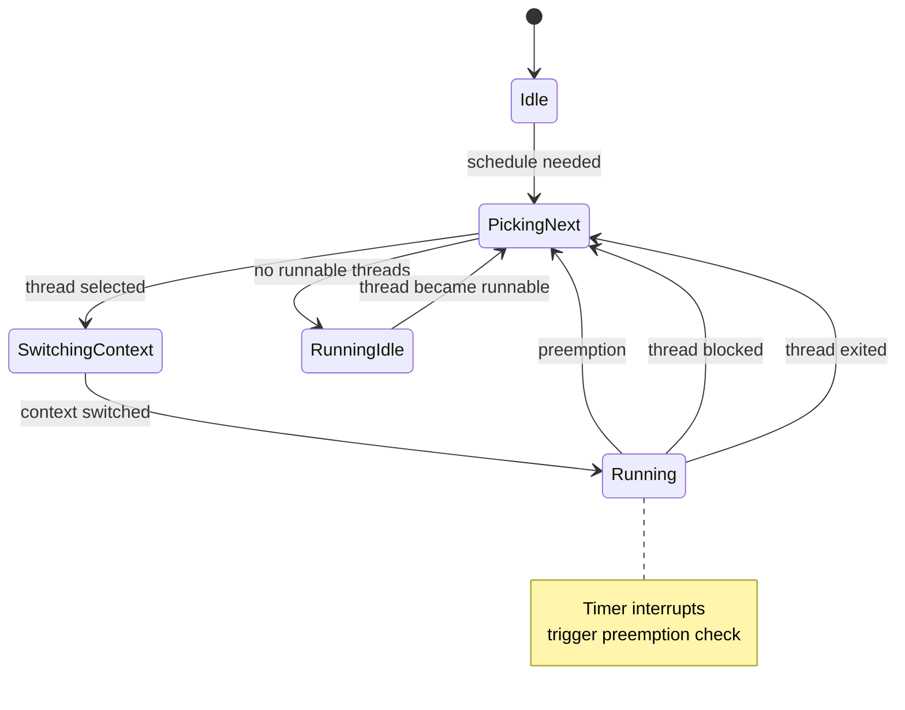
```mermaid
stateDiagram-v2
    [*] --> Idle
    
    Idle --> PickingNext: schedule needed
    
    PickingNext --> SwitchingContext: thread selected
    PickingNext --> RunningIdle: no runnable threads
    
    SwitchingContext --> Running: context switched
    
    Running --> PickingNext: preemption
    Running --> PickingNext: thread blocked
    Running --> PickingNext: thread exited
    
    RunningIdle --> PickingNext: thread became runnable
    
    note right of Running
        Timer interrupts
        trigger preemption check
    end note
```

---

## 12. Axiom Sequencer State Machine

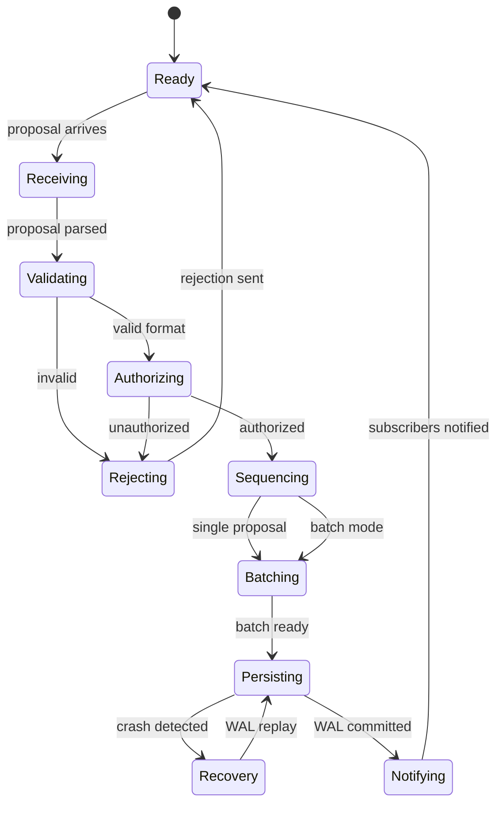
```mermaid
stateDiagram-v2
    [*] --> Ready
    
    Ready --> Receiving: proposal arrives
    
    Receiving --> Validating: proposal parsed
    
    Validating --> Rejecting: invalid
    Validating --> Authorizing: valid format
    
    Authorizing --> Rejecting: unauthorized
    Authorizing --> Sequencing: authorized
    
    Rejecting --> Ready: rejection sent
    
    Sequencing --> Batching: single proposal
    Sequencing --> Batching: batch mode
    
    Batching --> Persisting: batch ready
    
    Persisting --> Notifying: WAL committed
    Persisting --> Recovery: crash detected
    
    Recovery --> Persisting: WAL replay
    
    Notifying --> Ready: subscribers notified
```

---

## 13. Content Store State Machine

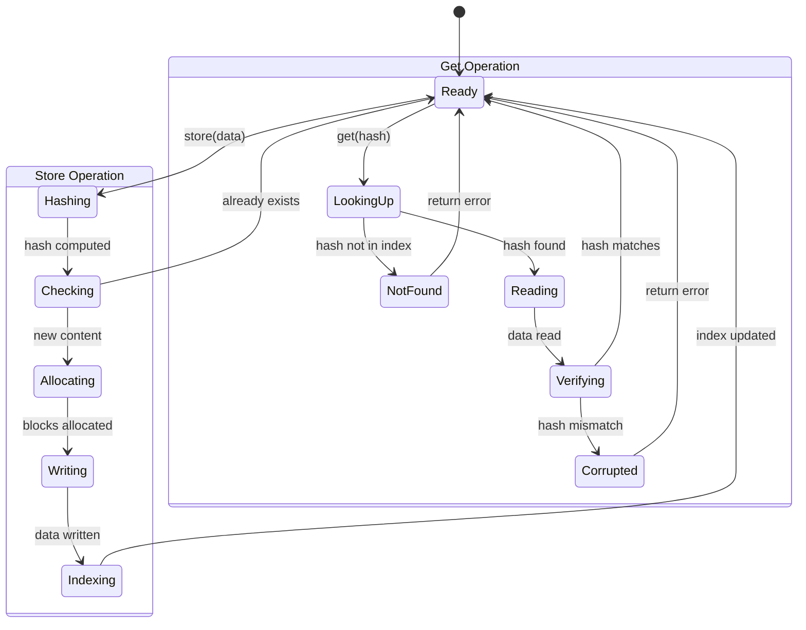
```mermaid
stateDiagram-v2
    [*] --> Ready
    
    state "Store Operation" as store {
        Ready --> Hashing: store(data)
        Hashing --> Checking: hash computed
        Checking --> Ready: already exists
        Checking --> Allocating: new content
        Allocating --> Writing: blocks allocated
        Writing --> Indexing: data written
        Indexing --> Ready: index updated
    }
    
    state "Get Operation" as get {
        Ready --> LookingUp: get(hash)
        LookingUp --> NotFound: hash not in index
        LookingUp --> Reading: hash found
        Reading --> Verifying: data read
        Verifying --> Ready: hash matches
        Verifying --> Corrupted: hash mismatch
    }
    
    NotFound --> Ready: return error
    Corrupted --> Ready: return error
```

---

## 14. Receipt Generation State Machine

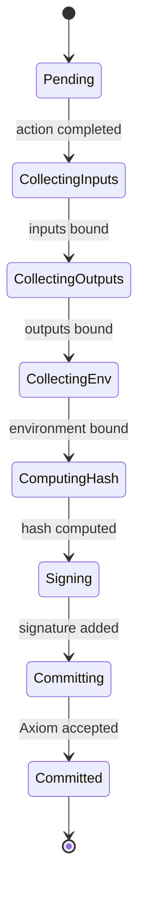
```mermaid
stateDiagram-v2
    [*] --> Pending
    
    Pending --> CollectingInputs: action completed
    
    CollectingInputs --> CollectingOutputs: inputs bound
    
    CollectingOutputs --> CollectingEnv: outputs bound
    
    CollectingEnv --> ComputingHash: environment bound
    
    ComputingHash --> Signing: hash computed
    
    Signing --> Committing: signature added
    
    Committing --> Committed: Axiom accepted
    
    Committed --> [*]
```

---

## 15. Verification State Machine

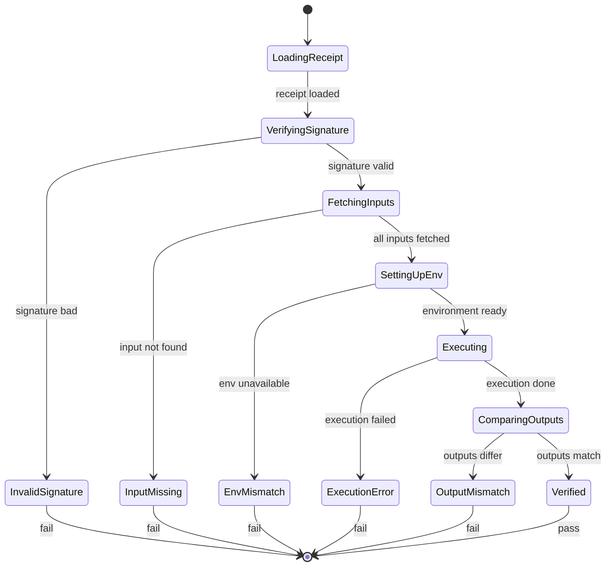
```mermaid
stateDiagram-v2
    [*] --> LoadingReceipt
    
    LoadingReceipt --> VerifyingSignature: receipt loaded
    
    VerifyingSignature --> InvalidSignature: signature bad
    VerifyingSignature --> FetchingInputs: signature valid
    
    InvalidSignature --> [*]: fail
    
    FetchingInputs --> InputMissing: input not found
    FetchingInputs --> SettingUpEnv: all inputs fetched
    
    InputMissing --> [*]: fail
    
    SettingUpEnv --> EnvMismatch: env unavailable
    SettingUpEnv --> Executing: environment ready
    
    EnvMismatch --> [*]: fail
    
    Executing --> ComparingOutputs: execution done
    Executing --> ExecutionError: execution failed
    
    ExecutionError --> [*]: fail
    
    ComparingOutputs --> OutputMismatch: outputs differ
    ComparingOutputs --> Verified: outputs match
    
    OutputMismatch --> [*]: fail
    
    Verified --> [*]: pass
```

---

## 16. System Upgrade State Machine

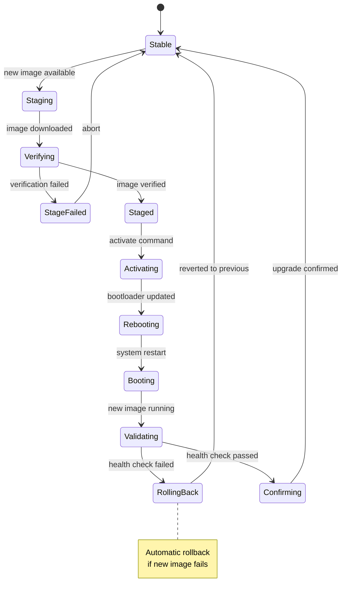
```mermaid
stateDiagram-v2
    [*] --> Stable
    
    Stable --> Staging: new image available
    
    Staging --> Verifying: image downloaded
    
    Verifying --> StageFailed: verification failed
    Verifying --> Staged: image verified
    
    StageFailed --> Stable: abort
    
    Staged --> Activating: activate command
    
    Activating --> Rebooting: bootloader updated
    
    Rebooting --> Booting: system restart
    
    Booting --> Validating: new image running
    
    Validating --> RollingBack: health check failed
    Validating --> Confirming: health check passed
    
    RollingBack --> Stable: reverted to previous
    
    Confirming --> Stable: upgrade confirmed
    
    note right of RollingBack
        Automatic rollback
        if new image fails
    end note
```

---

## State Machine Legend

| Symbol | Meaning |
|--------|---------|
| `[*]` | Initial or final state |
| `-->` | Transition |
| `state { }` | Composite state |
| `note` | Annotation |

---

*[← Visual OS](../specs/10-visual-os.md) | [Implementation Roadmap →](../implementation/00-roadmap.md)*
