# Orbital OS State Machine Diagrams

**Version:** 1.0  
**Status:** Specification  
**Component:** System-wide

---

## Overview

This document contains all formal state machine diagrams for Orbital OS components.

**Key Principle:** All consequential state transitions flow through the Policy Engine before reaching the Axiom.

---

## 1. System Boot State Machine

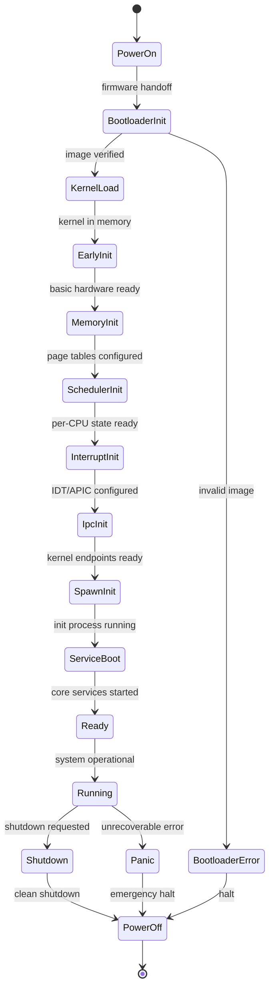
```mermaid
stateDiagram-v2
    [*] --> PowerOn
    
    PowerOn --> BootloaderInit: firmware handoff
    
    BootloaderInit --> BootloaderError: invalid image
    BootloaderInit --> KernelLoad: image verified
    
    KernelLoad --> EarlyInit: kernel in memory
    
    EarlyInit --> MemoryInit: basic hardware ready
    
    MemoryInit --> SchedulerInit: page tables configured
    
    SchedulerInit --> InterruptInit: per-CPU state ready
    
    InterruptInit --> IpcInit: IDT/APIC configured
    
    IpcInit --> SpawnInit: kernel endpoints ready
    
    SpawnInit --> ServiceBoot: init process running
    
    ServiceBoot --> Ready: core services started
    
    Ready --> Running: system operational
    
    Running --> Shutdown: shutdown requested
    Running --> Panic: unrecoverable error
    
    Shutdown --> PowerOff: clean shutdown
    
    Panic --> PowerOff: emergency halt
    
    BootloaderError --> PowerOff: halt
    
    PowerOff --> [*]
```

---

## 2. Three-Phase Action Lifecycle (with Policy Engine)

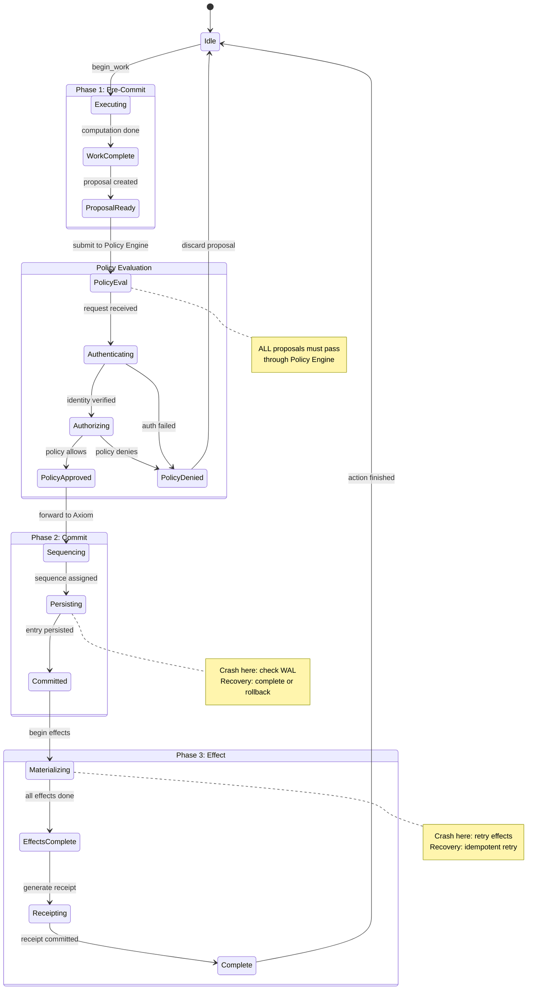
```mermaid
stateDiagram-v2
    [*] --> Idle
    
    state "Phase 1: Pre-Commit" as phase1
    state "Policy Evaluation" as policy
    state "Phase 2: Commit" as phase2
    state "Phase 3: Effect" as phase3
    
    Idle --> Executing: begin_work
    
    state phase1 {
        Executing --> WorkComplete: computation done
        WorkComplete --> ProposalReady: proposal created
    }
    
    ProposalReady --> PolicyEval: submit to Policy Engine
    
    state policy {
        PolicyEval --> Authenticating: request received
        Authenticating --> Authorizing: identity verified
        Authorizing --> PolicyApproved: policy allows
        Authorizing --> PolicyDenied: policy denies
        Authenticating --> PolicyDenied: auth failed
    }
    
    PolicyDenied --> Idle: discard proposal
    
    PolicyApproved --> Sequencing: forward to Axiom
    
    state phase2 {
        Sequencing --> Persisting: sequence assigned
        Persisting --> Committed: entry persisted
    }
    
    Committed --> Materializing: begin effects
    
    state phase3 {
        Materializing --> EffectsComplete: all effects done
        EffectsComplete --> Receipting: generate receipt
        Receipting --> Complete: receipt committed
    }
    
    Complete --> Idle: action finished
    
    note right of PolicyEval
        ALL proposals must pass
        through Policy Engine
    end note
    
    note right of Persisting
        Crash here: check WAL
        Recovery: complete or rollback
    end note
    
    note right of Materializing
        Crash here: retry effects
        Recovery: idempotent retry
    end note
```

---

## 3. Axiom Entry Lifecycle (Policy-Gated)

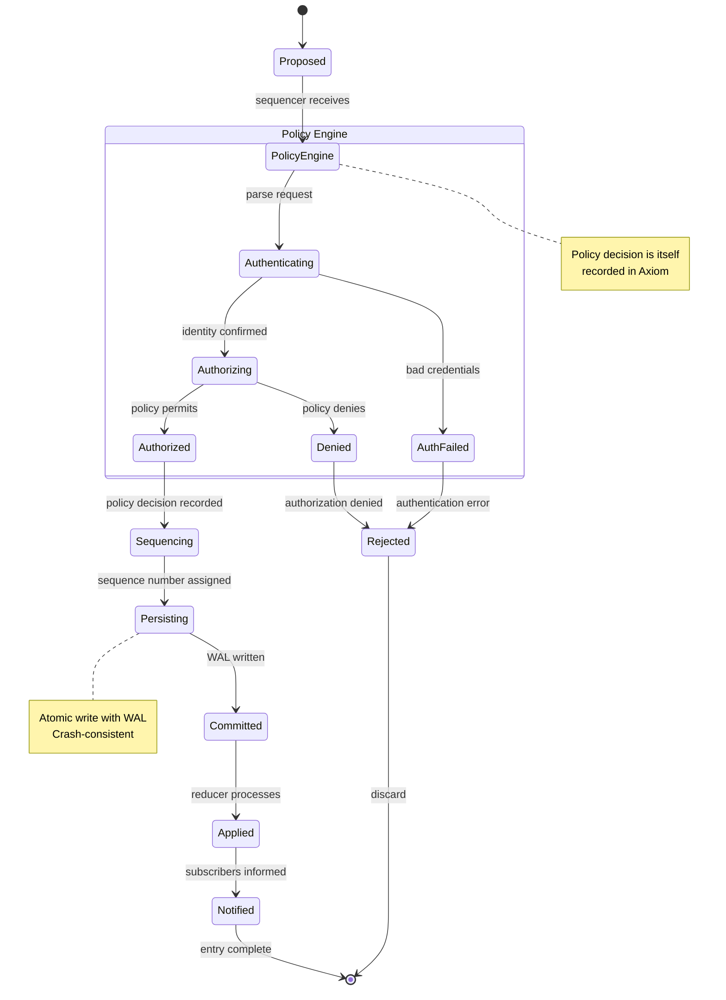
```mermaid
stateDiagram-v2
    [*] --> Proposed
    
    Proposed --> PolicyEngine: sequencer receives
    
    state "Policy Engine" as pe {
        PolicyEngine --> Authenticating: parse request
        Authenticating --> AuthFailed: bad credentials
        Authenticating --> Authorizing: identity confirmed
        Authorizing --> Authorized: policy permits
        Authorizing --> Denied: policy denies
    }
    
    AuthFailed --> Rejected: authentication error
    Denied --> Rejected: authorization denied
    
    Rejected --> [*]: discard
    
    Authorized --> Sequencing: policy decision recorded
    
    Sequencing --> Persisting: sequence number assigned
    
    Persisting --> Committed: WAL written
    
    Committed --> Applied: reducer processes
    
    Applied --> Notified: subscribers informed
    
    Notified --> [*]: entry complete
    
    note right of PolicyEngine
        Policy decision is itself
        recorded in Axiom
    end note
    
    note right of Persisting
        Atomic write with WAL
        Crash-consistent
    end note
```

---

## 4. Job Execution State Machine (Policy-Controlled)

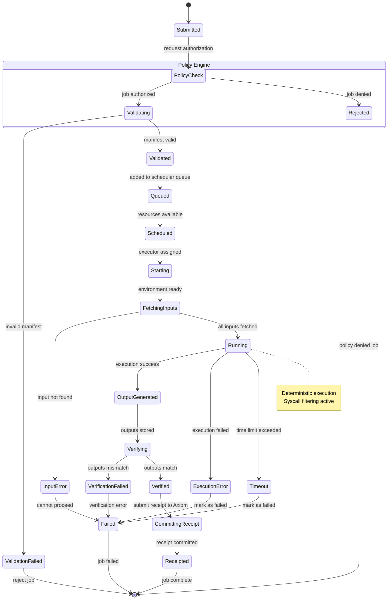
```mermaid
stateDiagram-v2
    [*] --> Submitted
    
    Submitted --> PolicyCheck: request authorization
    
    state "Policy Engine" as pe {
        PolicyCheck --> Validating: job authorized
        PolicyCheck --> Rejected: job denied
    }
    
    Rejected --> [*]: policy denied job
    
    Validating --> ValidationFailed: invalid manifest
    Validating --> Validated: manifest valid
    
    ValidationFailed --> [*]: reject job
    
    Validated --> Queued: added to scheduler queue
    
    Queued --> Scheduled: resources available
    
    Scheduled --> Starting: executor assigned
    
    Starting --> FetchingInputs: environment ready
    
    FetchingInputs --> InputError: input not found
    FetchingInputs --> Running: all inputs fetched
    
    InputError --> Failed: cannot proceed
    
    Running --> OutputGenerated: execution success
    Running --> ExecutionError: execution failed
    Running --> Timeout: time limit exceeded
    
    ExecutionError --> Failed: mark as failed
    Timeout --> Failed: mark as failed
    
    OutputGenerated --> Verifying: outputs stored
    
    Verifying --> VerificationFailed: outputs mismatch
    Verifying --> Verified: outputs match
    
    VerificationFailed --> Failed: verification error
    
    Verified --> CommittingReceipt: submit receipt to Axiom
    
    CommittingReceipt --> Receipted: receipt committed
    
    Receipted --> [*]: job complete
    Failed --> [*]: job failed
    
    note right of Running
        Deterministic execution
        Syscall filtering active
    end note
```

---

## 5. Process Lifecycle State Machine (Policy-Controlled)

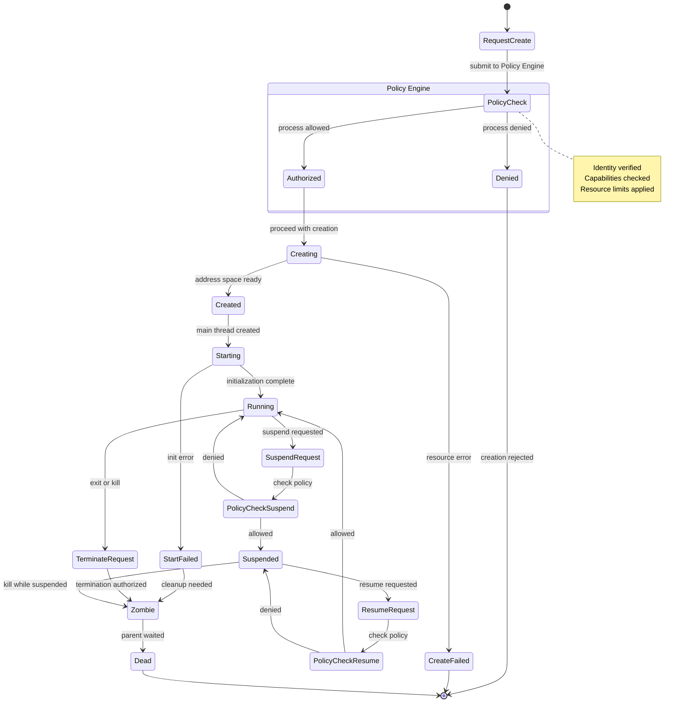
```mermaid
stateDiagram-v2
    [*] --> RequestCreate
    
    RequestCreate --> PolicyCheck: submit to Policy Engine
    
    state "Policy Engine" as pe {
        PolicyCheck --> Authorized: process allowed
        PolicyCheck --> Denied: process denied
    }
    
    Denied --> [*]: creation rejected
    
    Authorized --> Creating: proceed with creation
    
    Creating --> Created: address space ready
    Creating --> CreateFailed: resource error
    
    CreateFailed --> [*]
    
    Created --> Starting: main thread created
    
    Starting --> Running: initialization complete
    Starting --> StartFailed: init error
    
    StartFailed --> Zombie: cleanup needed
    
    Running --> SuspendRequest: suspend requested
    Running --> TerminateRequest: exit or kill
    
    SuspendRequest --> PolicyCheckSuspend: check policy
    PolicyCheckSuspend --> Suspended: allowed
    PolicyCheckSuspend --> Running: denied
    
    TerminateRequest --> Zombie: termination authorized
    
    Suspended --> ResumeRequest: resume requested
    Suspended --> Zombie: kill while suspended
    
    ResumeRequest --> PolicyCheckResume: check policy
    PolicyCheckResume --> Running: allowed
    PolicyCheckResume --> Suspended: denied
    
    Zombie --> Dead: parent waited
    
    Dead --> [*]
    
    note right of PolicyCheck
        Identity verified
        Capabilities checked
        Resource limits applied
    end note
```

---

## 6. Thread Lifecycle State Machine

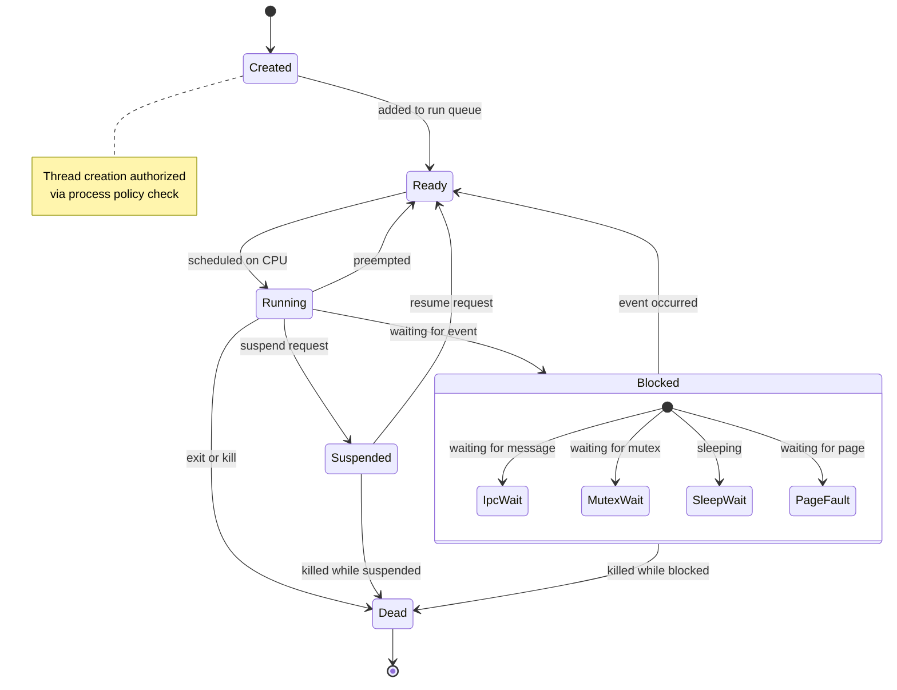
```mermaid
stateDiagram-v2
    [*] --> Created
    
    Created --> Ready: added to run queue
    
    Ready --> Running: scheduled on CPU
    
    Running --> Ready: preempted
    Running --> Blocked: waiting for event
    Running --> Suspended: suspend request
    Running --> Dead: exit or kill
    
    Blocked --> Ready: event occurred
    Blocked --> Dead: killed while blocked
    
    Suspended --> Ready: resume request
    Suspended --> Dead: killed while suspended
    
    Dead --> [*]
    
    state Blocked {
        [*] --> IpcWait: waiting for message
        [*] --> MutexWait: waiting for mutex
        [*] --> SleepWait: sleeping
        [*] --> PageFault: waiting for page
    }
    
    note right of Created
        Thread creation authorized
        via process policy check
    end note
```

---

## 7. Service Lifecycle State Machine (Policy-Controlled)

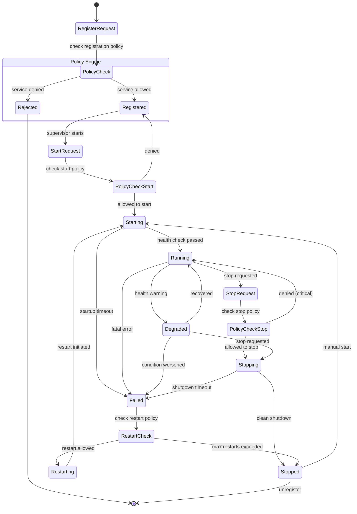
```mermaid
stateDiagram-v2
    [*] --> RegisterRequest
    
    RegisterRequest --> PolicyCheck: check registration policy
    
    state "Policy Engine" as pe {
        PolicyCheck --> Registered: service allowed
        PolicyCheck --> Rejected: service denied
    }
    
    Rejected --> [*]
    
    Registered --> StartRequest: supervisor starts
    
    StartRequest --> PolicyCheckStart: check start policy
    PolicyCheckStart --> Starting: allowed to start
    PolicyCheckStart --> Registered: denied
    
    Starting --> Running: health check passed
    Starting --> Failed: startup timeout
    
    Running --> Degraded: health warning
    Running --> StopRequest: stop requested
    Running --> Failed: fatal error
    
    StopRequest --> PolicyCheckStop: check stop policy
    PolicyCheckStop --> Stopping: allowed to stop
    PolicyCheckStop --> Running: denied (critical)
    
    Degraded --> Running: recovered
    Degraded --> Stopping: stop requested
    Degraded --> Failed: condition worsened
    
    Stopping --> Stopped: clean shutdown
    Stopping --> Failed: shutdown timeout
    
    Failed --> RestartCheck: check restart policy
    RestartCheck --> Restarting: restart allowed
    RestartCheck --> Stopped: max restarts exceeded
    
    Restarting --> Starting: restart initiated
    
    Stopped --> Starting: manual start
    Stopped --> [*]: unregister
```

---

## 8. Filesystem Transaction State Machine (Policy-Gated)

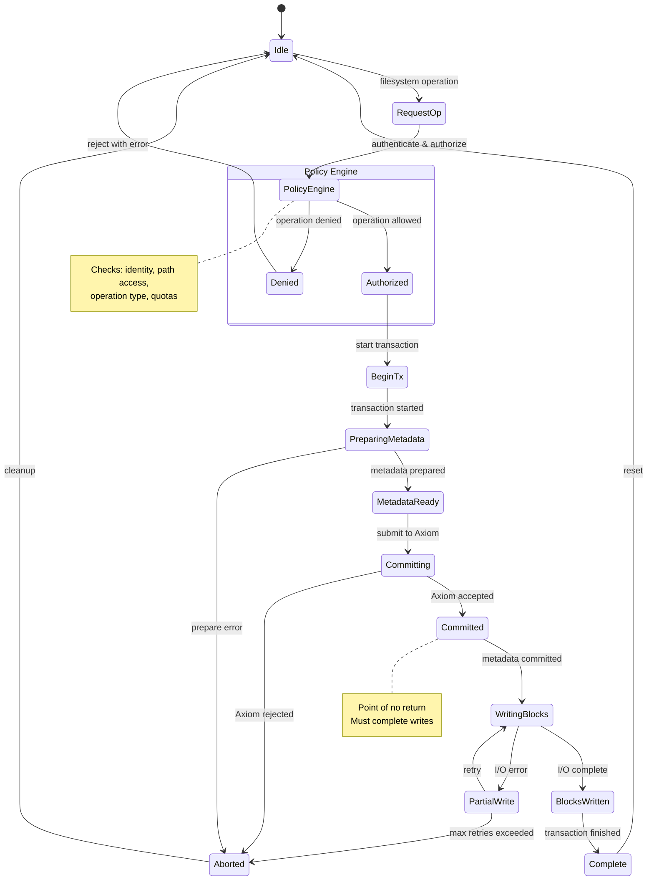
```mermaid
stateDiagram-v2
    [*] --> Idle
    
    Idle --> RequestOp: filesystem operation
    
    RequestOp --> PolicyEngine: authenticate & authorize
    
    state "Policy Engine" as pe {
        PolicyEngine --> Authorized: operation allowed
        PolicyEngine --> Denied: operation denied
    }
    
    Denied --> Idle: reject with error
    
    Authorized --> BeginTx: start transaction
    
    BeginTx --> PreparingMetadata: transaction started
    
    PreparingMetadata --> MetadataReady: metadata prepared
    PreparingMetadata --> Aborted: prepare error
    
    MetadataReady --> Committing: submit to Axiom
    
    Committing --> Committed: Axiom accepted
    Committing --> Aborted: Axiom rejected
    
    Committed --> WritingBlocks: metadata committed
    
    WritingBlocks --> BlocksWritten: I/O complete
    WritingBlocks --> PartialWrite: I/O error
    
    PartialWrite --> WritingBlocks: retry
    PartialWrite --> Aborted: max retries exceeded
    
    BlocksWritten --> Complete: transaction finished
    
    Complete --> Idle: reset
    Aborted --> Idle: cleanup
    
    note right of PolicyEngine
        Checks: identity, path access,
        operation type, quotas
    end note
    
    note right of Committed
        Point of no return
        Must complete writes
    end note
```

---

## 9. Network Connection State Machine (Policy-Gated)

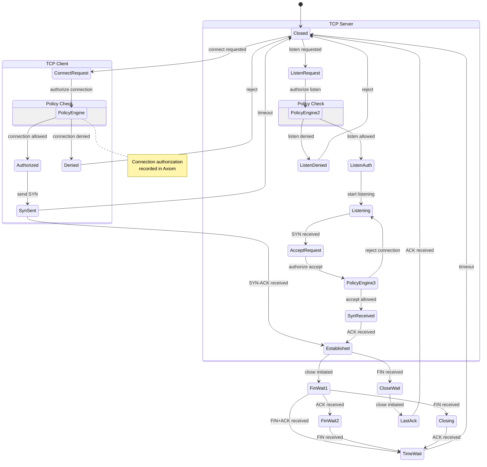
```mermaid
stateDiagram-v2
    [*] --> Closed
    
    state "TCP Client" as client {
        Closed --> ConnectRequest: connect requested
        ConnectRequest --> PolicyEngine: authorize connection
        
        state "Policy Check" as pc {
            PolicyEngine --> Authorized: connection allowed
            PolicyEngine --> Denied: connection denied
        }
        
        Denied --> Closed: reject
        Authorized --> SynSent: send SYN
        SynSent --> Established: SYN-ACK received
        SynSent --> Closed: timeout
    }
    
    state "TCP Server" as server {
        Closed --> ListenRequest: listen requested
        ListenRequest --> PolicyEngine2: authorize listen
        
        state "Policy Check" as pc2 {
            PolicyEngine2 --> ListenAuth: listen allowed
            PolicyEngine2 --> ListenDenied: listen denied
        }
        
        ListenDenied --> Closed: reject
        ListenAuth --> Listening: start listening
        Listening --> AcceptRequest: SYN received
        AcceptRequest --> PolicyEngine3: authorize accept
        PolicyEngine3 --> SynReceived: accept allowed
        PolicyEngine3 --> Listening: reject connection
        SynReceived --> Established: ACK received
    }
    
    Established --> FinWait1: close initiated
    Established --> CloseWait: FIN received
    
    FinWait1 --> FinWait2: ACK received
    FinWait1 --> Closing: FIN received
    FinWait1 --> TimeWait: FIN+ACK received
    
    FinWait2 --> TimeWait: FIN received
    
    Closing --> TimeWait: ACK received
    
    CloseWait --> LastAck: close initiated
    
    LastAck --> Closed: ACK received
    
    TimeWait --> Closed: timeout
    
    note right of PolicyEngine
        Connection authorization
        recorded in Axiom
    end note
```

---

## 10. IPC Message Exchange State Machine

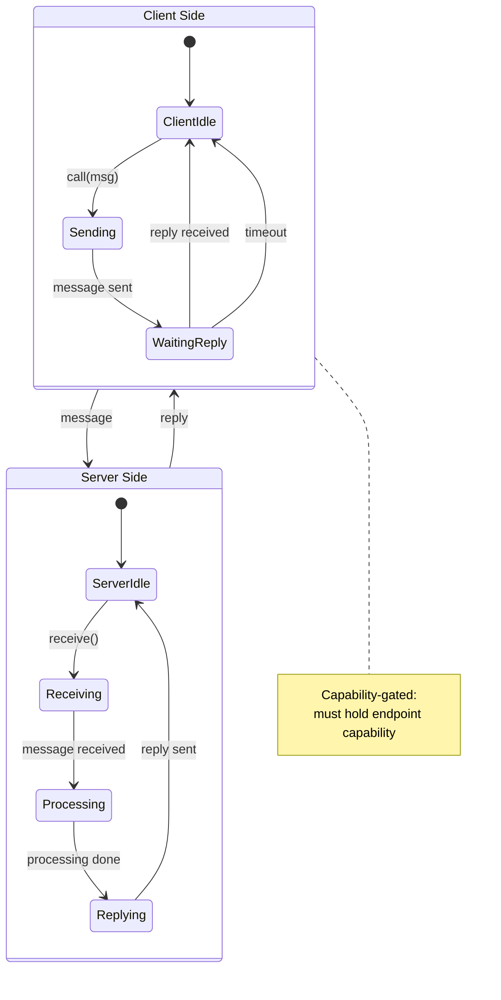
```mermaid
stateDiagram-v2
    state "Client Side" as client {
        [*] --> ClientIdle
        ClientIdle --> Sending: call(msg)
        Sending --> WaitingReply: message sent
        WaitingReply --> ClientIdle: reply received
        WaitingReply --> ClientIdle: timeout
    }
    
    state "Server Side" as server {
        [*] --> ServerIdle
        ServerIdle --> Receiving: receive()
        Receiving --> Processing: message received
        Processing --> Replying: processing done
        Replying --> ServerIdle: reply sent
    }
    
    client --> server: message
    server --> client: reply
    
    note right of client
        Capability-gated:
        must hold endpoint capability
    end note
```

---

## 11. Scheduler State Machine (Per CPU)

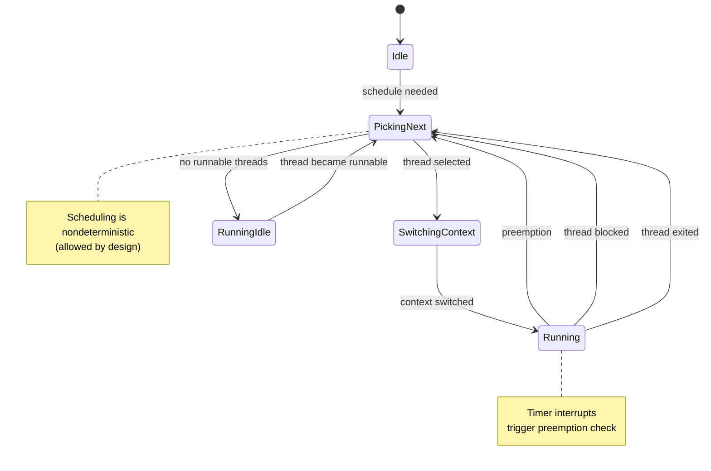
```mermaid
stateDiagram-v2
    [*] --> Idle
    
    Idle --> PickingNext: schedule needed
    
    PickingNext --> SwitchingContext: thread selected
    PickingNext --> RunningIdle: no runnable threads
    
    SwitchingContext --> Running: context switched
    
    Running --> PickingNext: preemption
    Running --> PickingNext: thread blocked
    Running --> PickingNext: thread exited
    
    RunningIdle --> PickingNext: thread became runnable
    
    note right of Running
        Timer interrupts
        trigger preemption check
    end note
    
    note right of PickingNext
        Scheduling is nondeterministic
        (allowed by design)
    end note
```

---

## 12. Axiom Sequencer State Machine (Policy-First)

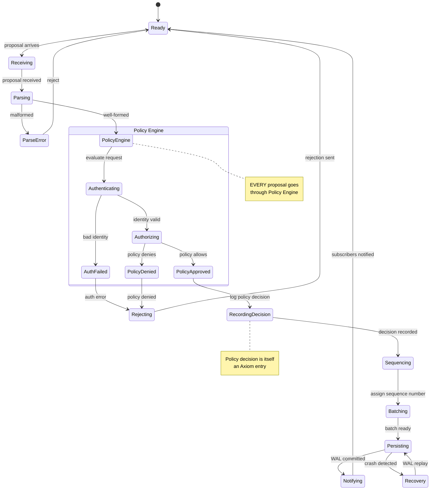
```mermaid
stateDiagram-v2
    [*] --> Ready
    
    Ready --> Receiving: proposal arrives
    
    Receiving --> Parsing: proposal received
    
    Parsing --> ParseError: malformed
    Parsing --> PolicyEngine: well-formed
    
    ParseError --> Ready: reject
    
    state "Policy Engine" as pe {
        PolicyEngine --> Authenticating: evaluate request
        Authenticating --> AuthFailed: bad identity
        Authenticating --> Authorizing: identity valid
        Authorizing --> PolicyApproved: policy allows
        Authorizing --> PolicyDenied: policy denies
    }
    
    AuthFailed --> Rejecting: auth error
    PolicyDenied --> Rejecting: policy denied
    
    Rejecting --> Ready: rejection sent
    
    PolicyApproved --> RecordingDecision: log policy decision
    
    RecordingDecision --> Sequencing: decision recorded
    
    Sequencing --> Batching: assign sequence number
    
    Batching --> Persisting: batch ready
    
    Persisting --> Notifying: WAL committed
    Persisting --> Recovery: crash detected
    
    Recovery --> Persisting: WAL replay
    
    Notifying --> Ready: subscribers notified
    
    note right of PolicyEngine
        EVERY proposal goes
        through Policy Engine
    end note
    
    note right of RecordingDecision
        Policy decision is itself
        an Axiom entry
    end note
```

---

## 13. Content Store State Machine

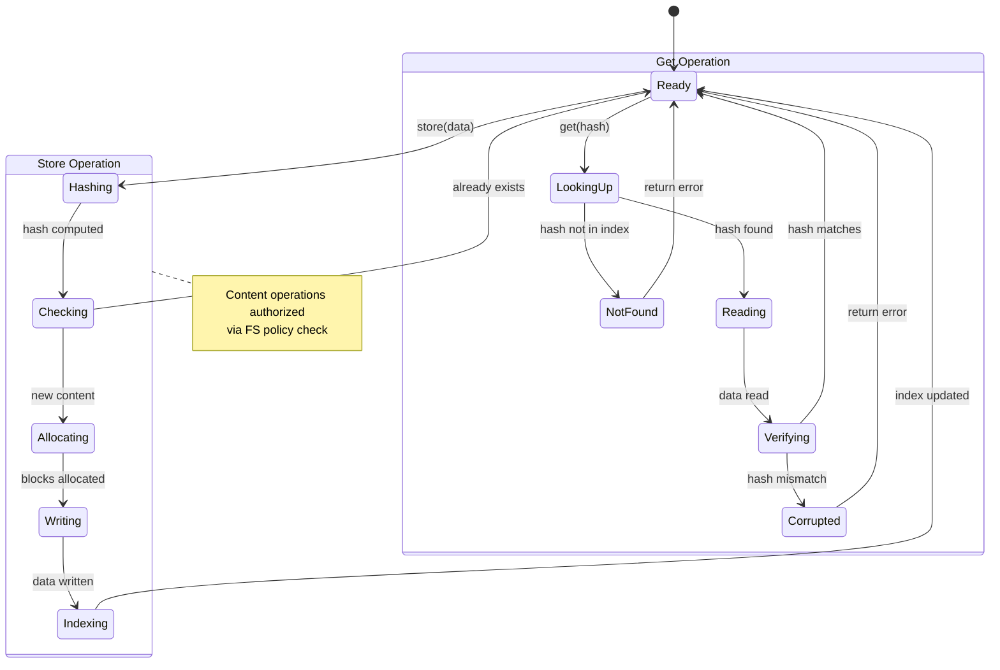
```mermaid
stateDiagram-v2
    [*] --> Ready
    
    state "Store Operation" as store {
        Ready --> Hashing: store(data)
        Hashing --> Checking: hash computed
        Checking --> Ready: already exists
        Checking --> Allocating: new content
        Allocating --> Writing: blocks allocated
        Writing --> Indexing: data written
        Indexing --> Ready: index updated
    }
    
    state "Get Operation" as get {
        Ready --> LookingUp: get(hash)
        LookingUp --> NotFound: hash not in index
        LookingUp --> Reading: hash found
        Reading --> Verifying: data read
        Verifying --> Ready: hash matches
        Verifying --> Corrupted: hash mismatch
    }
    
    NotFound --> Ready: return error
    Corrupted --> Ready: return error
    
    note right of store
        Content operations authorized
        via FS policy check
    end note
```

---

## 14. Receipt Generation State Machine

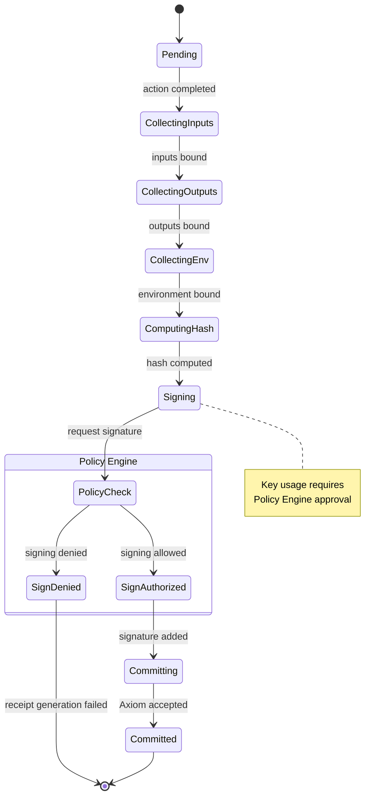
```mermaid
stateDiagram-v2
    [*] --> Pending
    
    Pending --> CollectingInputs: action completed
    
    CollectingInputs --> CollectingOutputs: inputs bound
    
    CollectingOutputs --> CollectingEnv: outputs bound
    
    CollectingEnv --> ComputingHash: environment bound
    
    ComputingHash --> Signing: hash computed
    
    Signing --> PolicyCheck: request signature
    
    state "Policy Engine" as pe {
        PolicyCheck --> SignAuthorized: signing allowed
        PolicyCheck --> SignDenied: signing denied
    }
    
    SignDenied --> [*]: receipt generation failed
    
    SignAuthorized --> Committing: signature added
    
    Committing --> Committed: Axiom accepted
    
    Committed --> [*]
    
    note right of Signing
        Key usage requires
        Policy Engine approval
    end note
```

---

## 15. Verification State Machine

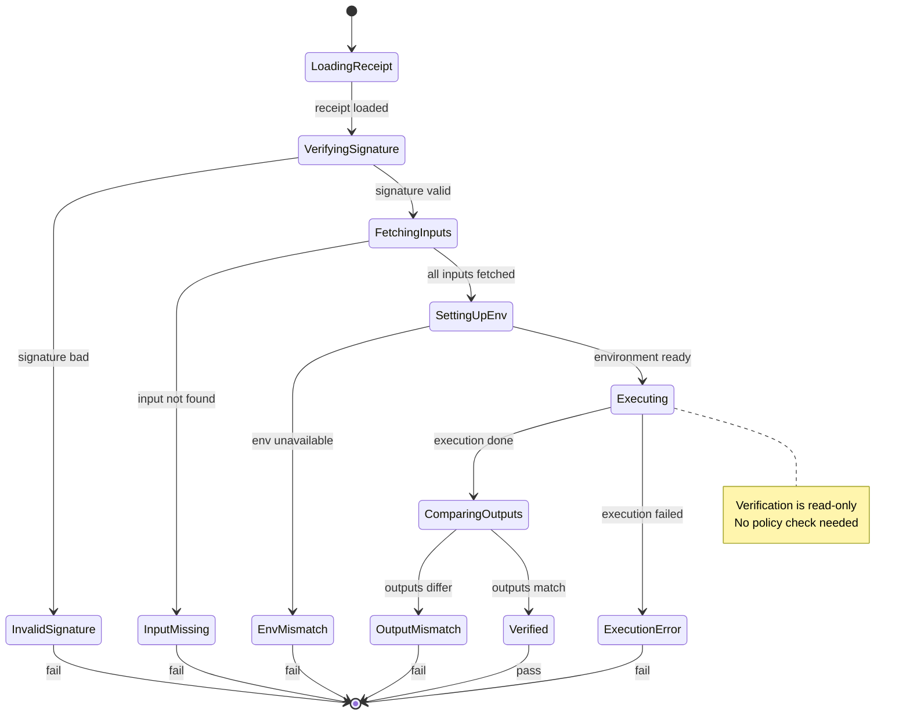
```mermaid
stateDiagram-v2
    [*] --> LoadingReceipt
    
    LoadingReceipt --> VerifyingSignature: receipt loaded
    
    VerifyingSignature --> InvalidSignature: signature bad
    VerifyingSignature --> FetchingInputs: signature valid
    
    InvalidSignature --> [*]: fail
    
    FetchingInputs --> InputMissing: input not found
    FetchingInputs --> SettingUpEnv: all inputs fetched
    
    InputMissing --> [*]: fail
    
    SettingUpEnv --> EnvMismatch: env unavailable
    SettingUpEnv --> Executing: environment ready
    
    EnvMismatch --> [*]: fail
    
    Executing --> ComparingOutputs: execution done
    Executing --> ExecutionError: execution failed
    
    ExecutionError --> [*]: fail
    
    ComparingOutputs --> OutputMismatch: outputs differ
    ComparingOutputs --> Verified: outputs match
    
    OutputMismatch --> [*]: fail
    
    Verified --> [*]: pass
    
    note right of Executing
        Verification is read-only
        No policy check needed
    end note
```

---

## 16. System Upgrade State Machine (Policy-Gated)

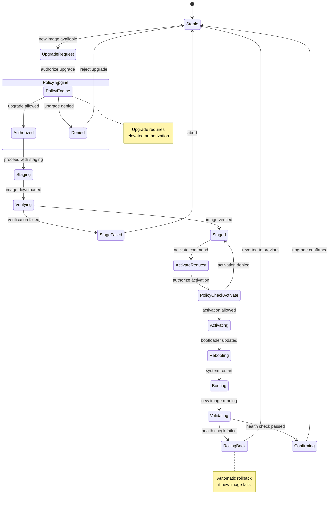
```mermaid
stateDiagram-v2
    [*] --> Stable
    
    Stable --> UpgradeRequest: new image available
    
    UpgradeRequest --> PolicyEngine: authorize upgrade
    
    state "Policy Engine" as pe {
        PolicyEngine --> Authorized: upgrade allowed
        PolicyEngine --> Denied: upgrade denied
    }
    
    Denied --> Stable: reject upgrade
    
    Authorized --> Staging: proceed with staging
    
    Staging --> Verifying: image downloaded
    
    Verifying --> StageFailed: verification failed
    Verifying --> Staged: image verified
    
    StageFailed --> Stable: abort
    
    Staged --> ActivateRequest: activate command
    
    ActivateRequest --> PolicyCheckActivate: authorize activation
    
    PolicyCheckActivate --> Activating: activation allowed
    PolicyCheckActivate --> Staged: activation denied
    
    Activating --> Rebooting: bootloader updated
    
    Rebooting --> Booting: system restart
    
    Booting --> Validating: new image running
    
    Validating --> RollingBack: health check failed
    Validating --> Confirming: health check passed
    
    RollingBack --> Stable: reverted to previous
    
    Confirming --> Stable: upgrade confirmed
    
    note right of PolicyEngine
        Upgrade requires
        elevated authorization
    end note
    
    note right of RollingBack
        Automatic rollback
        if new image fails
    end note
```

---

## 17. Key Derivation Service State Machine (Policy-Controlled)

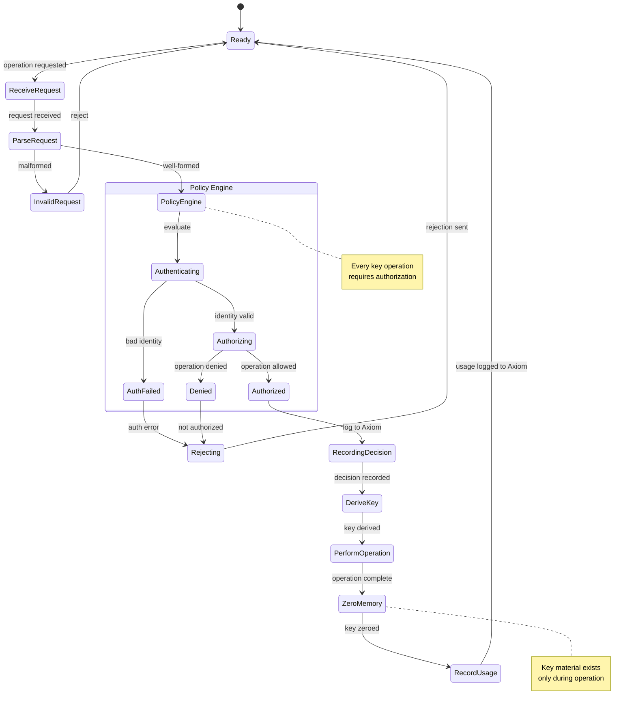
```mermaid
stateDiagram-v2
    [*] --> Ready
    
    Ready --> ReceiveRequest: operation requested
    
    ReceiveRequest --> ParseRequest: request received
    
    ParseRequest --> InvalidRequest: malformed
    ParseRequest --> PolicyEngine: well-formed
    
    InvalidRequest --> Ready: reject
    
    state "Policy Engine" as pe {
        PolicyEngine --> Authenticating: evaluate
        Authenticating --> AuthFailed: bad identity
        Authenticating --> Authorizing: identity valid
        Authorizing --> Authorized: operation allowed
        Authorizing --> Denied: operation denied
    }
    
    AuthFailed --> Rejecting: auth error
    Denied --> Rejecting: not authorized
    
    Rejecting --> Ready: rejection sent
    
    Authorized --> RecordingDecision: log to Axiom
    
    RecordingDecision --> DeriveKey: decision recorded
    
    DeriveKey --> PerformOperation: key derived
    
    PerformOperation --> ZeroMemory: operation complete
    
    ZeroMemory --> RecordUsage: key zeroed
    
    RecordUsage --> Ready: usage logged to Axiom
    
    note right of PolicyEngine
        Every key operation
        requires authorization
    end note
    
    note right of ZeroMemory
        Key material exists
        only during operation
    end note
```

---

## 18. Identity Authentication State Machine

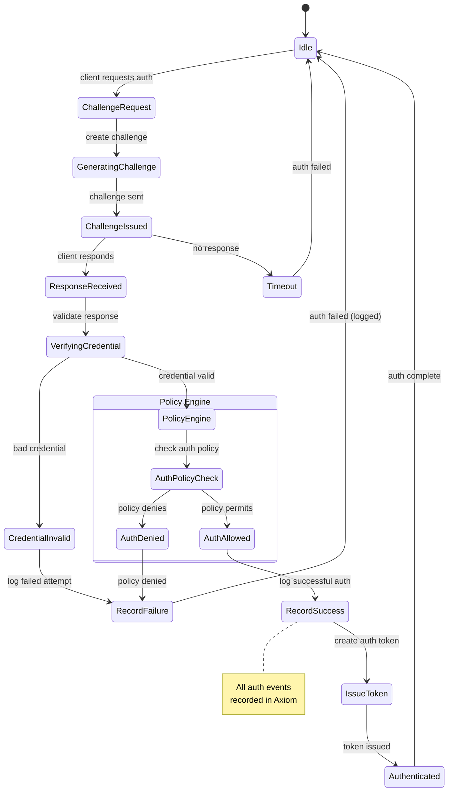
```mermaid
stateDiagram-v2
    [*] --> Idle
    
    Idle --> ChallengeRequest: client requests auth
    
    ChallengeRequest --> GeneratingChallenge: create challenge
    
    GeneratingChallenge --> ChallengeIssued: challenge sent
    
    ChallengeIssued --> ResponseReceived: client responds
    ChallengeIssued --> Timeout: no response
    
    Timeout --> Idle: auth failed
    
    ResponseReceived --> VerifyingCredential: validate response
    
    VerifyingCredential --> CredentialInvalid: bad credential
    VerifyingCredential --> PolicyEngine: credential valid
    
    CredentialInvalid --> RecordFailure: log failed attempt
    
    state "Policy Engine" as pe {
        PolicyEngine --> AuthPolicyCheck: check auth policy
        AuthPolicyCheck --> AuthAllowed: policy permits
        AuthPolicyCheck --> AuthDenied: policy denies
    }
    
    AuthDenied --> RecordFailure: policy denied
    
    RecordFailure --> Idle: auth failed (logged)
    
    AuthAllowed --> RecordSuccess: log successful auth
    
    RecordSuccess --> IssueToken: create auth token
    
    IssueToken --> Authenticated: token issued
    
    Authenticated --> Idle: auth complete
    
    note right of RecordSuccess
        All auth events
        recorded in Axiom
    end note
```

---

## State Machine Legend

| Symbol | Meaning |
|--------|---------|
| `[*]` | Initial or final state |
| `-->` | Transition |
| `state { }` | Composite state |
| `note` | Annotation |
| `PolicyEngine` | Policy evaluation required |

---

## Policy Engine Integration Summary

Every consequential operation flows through the Policy Engine:

| Operation Type | Policy Check Point |
|---------------|-------------------|
| Process creation | Before address space allocation |
| File operations | Before metadata changes |
| Network connections | Before socket operations |
| Job execution | Before scheduling |
| Key operations | Before derivation/signing |
| Service lifecycle | Before state changes |
| System upgrades | Before staging and activation |
| Authentication | After credential verification |

**The Axiom only accepts entries that have been authorized by the Policy Engine.**

---

*[← Visual OS](../specs/10-visual-os.md) | [Implementation Roadmap →](../implementation/00-roadmap.md)*
