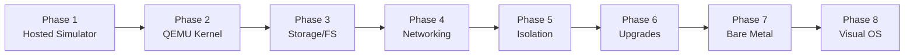
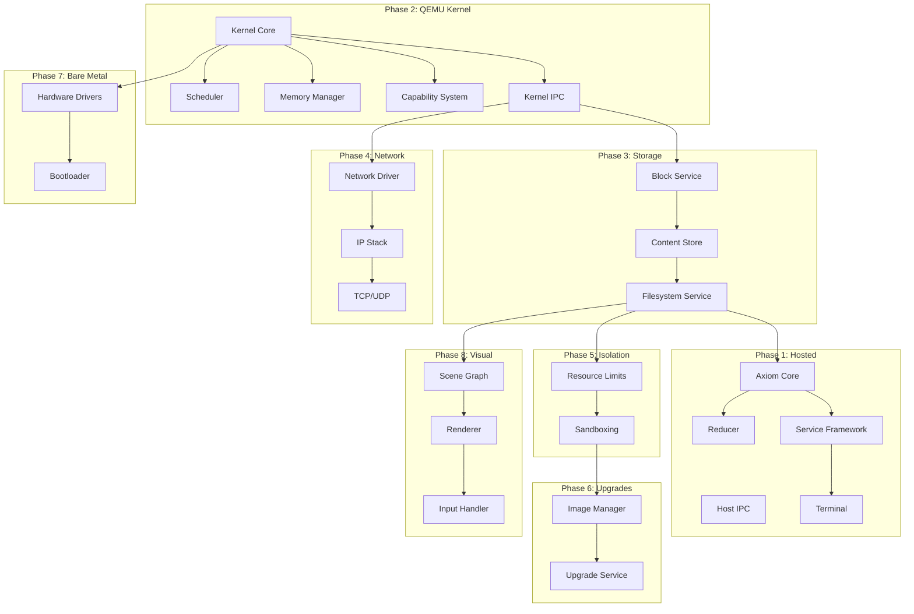

# Orbital OS Implementation Roadmap

**Version:** 1.0  
**Status:** Implementation Guide  
**Audience:** Engineers

---

## Overview

This document outlines the phased implementation plan for Orbital OS, from initial hosted prototype through bare-metal production deployment.

---

## Implementation Phases

---

## Phase Summary

| Phase | Name | Duration | Key Deliverable |
|-------|------|----------|-----------------|
| 1 | Hosted Simulator | 8-12 weeks | Axiom + services running on host OS |
| 2 | QEMU Kernel | 8-12 weeks | Minimal kernel booting in QEMU |
| 3 | Storage & Filesystem | 6-8 weeks | User-space FS with Axiom integration |
| 4 | Networking | 6-8 weeks | User-space TCP/IP stack |
| 5 | Isolation Tiers | 4-6 weeks | Resource limits, sandboxing |
| 6 | Transactional Upgrades | 4-6 weeks | Atomic image updates |
| 7 | Bare Metal | 8-12 weeks | Real hardware boot |
| 8 | Visual OS | 12-16 weeks | GUI subsystem |

**Total estimated: 56-80 weeks**

---

## Dependency Graph

---

## Phase 1: Hosted Simulator

**Goal:** Prove Axiom architecture and three-phase model work correctly.

### Deliverables

| Component | Description |
|-----------|-------------|
| Axiom core | Append-only, hash-chained log |
| Reducer | Deterministic state derivation |
| Sequencer | Single-writer sequencing |
| Service framework | IPC simulation on host |
| Terminal | Command-line interface |
| Test harness | Property-based tests |

### Success Criteria

- [ ] Axiom entries append and chain correctly
- [ ] Reducer produces identical state on replay
- [ ] Three-phase actions complete with receipts
- [ ] Terminal can inspect Axiom
- [ ] Jobs execute deterministically
- [ ] Crash recovery works correctly

### Detailed Plan

See [Phase 1: Hosted Simulator](01-phase-hosted-simulator.md)

---

## Phase 2: QEMU Kernel

**Goal:** Minimal kernel running in QEMU with basic IPC.

### Deliverables

| Component | Description |
|-----------|-------------|
| Boot code | Multiboot2 compatible |
| Memory manager | Page tables, virtual memory |
| Scheduler | SMP preemptive scheduler |
| Capability system | Token validation |
| IPC primitives | Send/receive/call/reply |
| Init process | First user-space process |

### Success Criteria

- [ ] Kernel boots in QEMU
- [ ] Multiple processes run concurrently
- [ ] IPC messages transfer correctly
- [ ] Capabilities enforce access control
- [ ] Preemption works correctly
- [ ] SMP works on multiple virtual CPUs

### Detailed Plan

See [Phase 2: QEMU Kernel](02-phase-qemu-kernel.md)

---

## Phase 3: Storage & Filesystem

**Goal:** User-space filesystem with Axiom-backed metadata.

### Deliverables

| Component | Description |
|-----------|-------------|
| Block driver | virtio-blk support |
| Block service | Block allocation, I/O scheduling |
| Content store | Content-addressed storage |
| Filesystem service | Namespace, metadata |
| Snapshot support | Point-in-time snapshots |

### Success Criteria

- [ ] Block I/O works via virtio
- [ ] Content deduplication works
- [ ] Metadata transactions commit to Axiom
- [ ] Snapshots can be created and restored
- [ ] Crash recovery preserves consistency

### Detailed Plan

See [Phase 3: Storage & Filesystem](03-phase-storage-filesystem.md)

---

## Phase 4: Networking

**Goal:** User-space TCP/IP stack with Axiom authorization.

### Deliverables

| Component | Description |
|-----------|-------------|
| Network driver | virtio-net support |
| IP layer | IPv4/IPv6, routing |
| TCP/UDP | Transport protocols |
| Socket API | BSD-like interface |
| Authorization | Axiom-based network policy |

### Success Criteria

- [ ] Packets send/receive via virtio
- [ ] TCP connections establish correctly
- [ ] Connection authorization flows through Axiom
- [ ] Data-plane traffic not logged
- [ ] Network policy enforced

### Detailed Plan

See [Phase 4: Networking](04-phase-networking.md)

---

## Phase 5: Isolation Tiers

**Goal:** Resource limits and enhanced sandboxing.

### Deliverables

| Component | Description |
|-----------|-------------|
| Resource limits | CPU, memory, I/O caps |
| Process isolation | Enhanced sandboxing |
| Capability scoping | Fine-grained permissions |
| Quota management | Usage tracking |

### Success Criteria

- [ ] CPU limits enforced
- [ ] Memory limits enforced
- [ ] I/O bandwidth limits work
- [ ] Capability attenuation works
- [ ] Quota violations handled gracefully

### Detailed Plan

See [Phase 5: Isolation Tiers](05-phase-isolation-tiers.md)

---

## Phase 6: Transactional Upgrades

**Goal:** Atomic system image updates with rollback.

### Deliverables

| Component | Description |
|-----------|-------------|
| Image format | Content-addressed, signed |
| Image manager | Stage, verify, activate |
| Upgrade service | Orchestrate upgrades |
| Rollback | Automatic failure recovery |

### Success Criteria

- [ ] Images verify before activation
- [ ] Upgrade is atomic
- [ ] Failed upgrade triggers rollback
- [ ] Previous image preserved
- [ ] Axiom records upgrade transactions

### Detailed Plan

See [Phase 6: Transactional Upgrades](06-phase-transactional-upgrades.md)

---

## Phase 7: Bare Metal

**Goal:** Boot and run on real x86_64 hardware.

### Deliverables

| Component | Description |
|-----------|-------------|
| UEFI bootloader | Direct hardware boot |
| Hardware drivers | AHCI, NVMe, USB, etc. |
| ACPI support | Power management |
| Real timer | RTC, HPET |

### Success Criteria

- [ ] System boots on real hardware
- [ ] Storage works (AHCI or NVMe)
- [ ] Keyboard/display work
- [ ] Network works (Intel/Realtek NIC)
- [ ] System stable under load

### Detailed Plan

See [Phase 7: Bare Metal](07-phase-bare-metal.md)

---

## Phase 8: Visual OS

**Goal:** Graphical user interface with GPU acceleration.

### Deliverables

| Component | Description |
|-----------|-------------|
| Scene graph | Deterministic UI state |
| Layout engine | Flex-based layout |
| GPU renderer | wgpu-based rendering |
| Input handling | Semantic input processing |
| Compositor | Window management |

### Success Criteria

- [ ] Scene graph updates deterministically
- [ ] Layout computed correctly
- [ ] GPU rendering achieves 60fps
- [ ] Input processed semantically
- [ ] Actions flow through Axiom

### Detailed Plan

See [Phase 8: Visual OS](08-phase-visual-os.md)

---

## Technology Choices

### Language

| Component | Language | Rationale |
|-----------|----------|-----------|
| Kernel | Rust (no_std) | Memory safety, zero-cost abstractions |
| Services | Rust (std) | Full language features |
| Drivers | Rust (no_std) | Safety in privileged code |
| Build tools | Rust | Consistency |

### Key Dependencies

| Dependency | Purpose |
|------------|---------|
| `blake3` | Content hashing |
| `bincode` | Serialization |
| `x86_64` | CPU architecture support |
| `wgpu` | GPU abstraction |

### Build System

- **Cargo** for Rust builds
- **Custom bootimage** tool for kernel images
- **QEMU** for testing

---

## Testing Strategy

### Unit Testing

- Property-based tests for Axiom
- Fuzzing for parsers
- Mocking for IPC

### Integration Testing

- Multi-service tests in hosted mode
- QEMU-based system tests
- Crash injection tests

### Verification Testing

- Replay verification for all phases
- Determinism checks
- Chaos testing

---

## Risk Mitigation

| Risk | Mitigation |
|------|------------|
| Kernel complexity | Start minimal, add incrementally |
| Performance | Profile early, optimize bottlenecks |
| Hardware compatibility | Focus on QEMU first, then common hardware |
| Determinism bugs | Extensive testing, formal methods for critical paths |

---

## Milestone Checkpoints

### M1: Proof of Concept (End of Phase 1)
- Axiom works
- Three-phase model proven
- Terminal functional

### M2: Kernel Viable (End of Phase 2)
- Kernel boots
- IPC works
- Multiple processes run

### M3: Storage Viable (End of Phase 3)
- Filesystem works
- Content addressing works
- Snapshots work

### M4: Network Viable (End of Phase 4)
- TCP/IP works
- Authorization works
- End-to-end connectivity

### M5: Production Ready (End of Phase 6)
- All isolation in place
- Upgrades work
- System stable

### M6: Hardware Ready (End of Phase 7)
- Bare metal works
- Real drivers work
- Deployable

### M7: Complete (End of Phase 8)
- Visual OS works
- Full system functional
- Ready for users

---

*[← State Machine Diagrams](../diagrams/state-machines.md) | [Phase 1: Hosted Simulator →](01-phase-hosted-simulator.md)*
