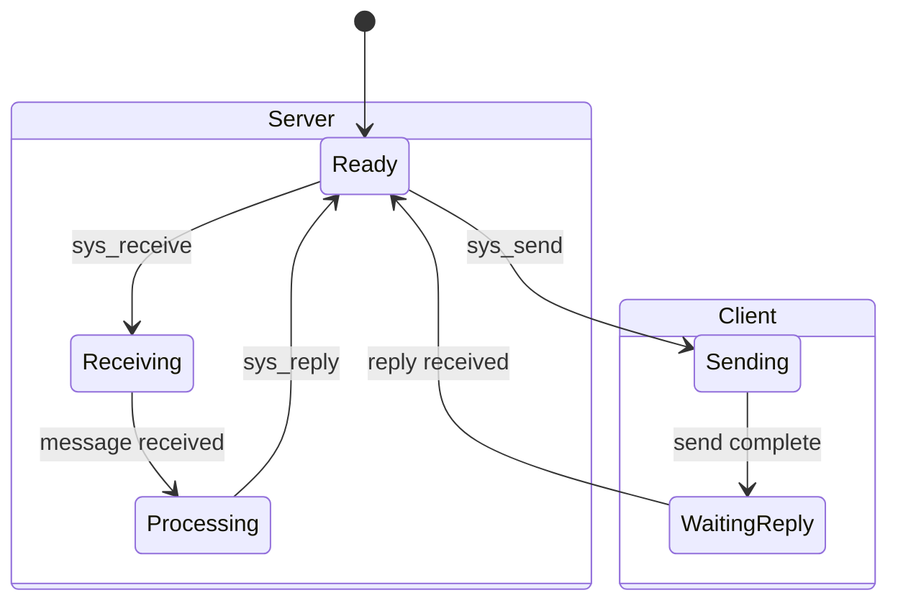
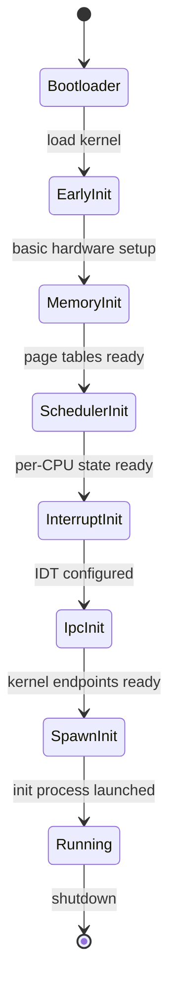

# Kernel Specification

**Version:** 1.0  
**Status:** Specification  
**Component:** Core Infrastructure

---

## 1. Overview

The Orbital kernel is a minimal microkernel providing exactly five services:

1. Preemptive multitasking (SMP)
2. Virtual memory and address-space isolation
3. Capability enforcement
4. Fast IPC primitives
5. Interrupt and timer handling

Everything else runs in user space.

---

## 2. Kernel Responsibilities

### 2.1 Preemptive Scheduler

| Requirement | Description |
|-------------|-------------|
| **SMP support** | Utilize all available CPU cores |
| **Preemption** | Time-slice based, no cooperative scheduling |
| **Priority levels** | Multiple priority tiers |
| **Affinity** | Optional CPU affinity hints |
| **Fairness** | Prevent starvation |

### 2.2 Memory Management

| Requirement | Description |
|-------------|-------------|
| **Virtual memory** | Per-process address spaces |
| **Isolation** | Processes cannot access each other's memory |
| **Kernel protection** | User code cannot access kernel memory |
| **Demand paging** | Pages loaded on fault |
| **Shared memory** | Via explicit capability grants |

### 2.3 Capability Enforcement

| Requirement | Description |
|-------------|-------------|
| **Token validation** | Verify capability authenticity |
| **Permission check** | Verify operation is permitted |
| **No forgery** | Capabilities cannot be fabricated |
| **Revocation** | Capabilities can be invalidated |

### 2.4 IPC Primitives

| Requirement | Description |
|-------------|-------------|
| **Synchronous send** | Blocking message delivery |
| **Call/reply** | RPC-style communication |
| **Asynchronous notify** | Non-blocking signals |
| **Capability transfer** | Pass capabilities in messages |

### 2.5 Interrupt Handling

| Requirement | Description |
|-------------|-------------|
| **Routing** | Deliver interrupts to user-space handlers |
| **Timer** | System timer for scheduling |
| **IPI** | Inter-processor interrupts for SMP |
| **Acknowledgment** | Proper EOI handling |

---

## 3. Kernel Prohibitions

The kernel MUST NOT contain:

| Prohibited | Rationale |
|------------|-----------|
| Filesystem code | User-space service |
| Network stack | User-space service |
| Device drivers | User-space (except bootstrap) |
| Axiom logic | User-space sequencer |
| Policy decisions | User-space policy service |
| User authentication | User-space service |
| Resource accounting | User-space (kernel enforces limits) |

---

## 4. Kernel Objects

### 4.1 Object Types

```rust
/// Kernel object types
#[derive(Clone, Copy, Debug, PartialEq, Eq)]
pub enum ObjectType {
    /// Process (address space + threads)
    Process,
    
    /// Thread (execution context)
    Thread,
    
    /// Address space
    AddressSpace,
    
    /// IPC endpoint
    Endpoint,
    
    /// Interrupt handler registration
    Interrupt,
    
    /// Memory region (for sharing)
    MemoryRegion,
    
    /// I/O port range (x86)
    IoPort,
}
```

### 4.2 Process Object

```rust
/// Process descriptor
pub struct Process {
    /// Unique process ID
    pub pid: ProcessId,
    
    /// Address space
    pub address_space: AddressSpaceId,
    
    /// Capability space
    pub cap_space: CapabilitySpaceId,
    
    /// Threads in this process
    pub threads: Vec<ThreadId>,
    
    /// Process state
    pub state: ProcessState,
    
    /// Resource limits
    pub limits: ResourceLimits,
    
    /// Accumulated resource usage
    pub usage: ResourceUsage,
}

#[derive(Clone, Copy, Debug, PartialEq, Eq)]
pub enum ProcessState {
    /// Process is active
    Running,
    
    /// Process is suspended
    Suspended,
    
    /// Process has exited
    Zombie { exit_code: i32 },
}
```

### 4.3 Thread Object

```rust
/// Thread descriptor
pub struct Thread {
    /// Unique thread ID
    pub tid: ThreadId,
    
    /// Owning process
    pub process: ProcessId,
    
    /// Thread state
    pub state: ThreadState,
    
    /// Saved CPU state (when not running)
    pub context: CpuContext,
    
    /// Stack pointer
    pub stack: VirtualAddress,
    
    /// Thread-local storage pointer
    pub tls: VirtualAddress,
    
    /// Current priority
    pub priority: Priority,
    
    /// CPU affinity mask
    pub affinity: CpuMask,
}

#[derive(Clone, Copy, Debug, PartialEq, Eq)]
pub enum ThreadState {
    /// Ready to run
    Ready,
    
    /// Currently executing
    Running { cpu: CpuId },
    
    /// Blocked on IPC
    Blocked { reason: BlockReason },
    
    /// Suspended
    Suspended,
    
    /// Terminated
    Dead,
}

#[derive(Clone, Copy, Debug, PartialEq, Eq)]
pub enum BlockReason {
    /// Waiting to receive on endpoint
    Receiving { endpoint: EndpointId },
    
    /// Waiting for reply
    WaitingReply { from: ThreadId },
    
    /// Waiting for notification
    WaitingNotification,
}
```

### 4.4 Address Space Object

```rust
/// Address space descriptor
pub struct AddressSpace {
    /// Unique address space ID
    pub id: AddressSpaceId,
    
    /// Page table root (physical address)
    pub page_table: PhysicalAddress,
    
    /// Mapped regions
    pub regions: BTreeMap<VirtualAddress, MemoryRegion>,
    
    /// Reference count
    pub ref_count: usize,
}

/// A mapped memory region
pub struct MemoryRegion {
    /// Start virtual address
    pub start: VirtualAddress,
    
    /// Size in bytes
    pub size: usize,
    
    /// Protection flags
    pub protection: MemoryProtection,
    
    /// Backing (physical memory, file, etc.)
    pub backing: RegionBacking,
}

#[derive(Clone, Copy, Debug)]
pub struct MemoryProtection {
    pub read: bool,
    pub write: bool,
    pub execute: bool,
    pub user: bool,
}

pub enum RegionBacking {
    /// Anonymous memory (demand-paged)
    Anonymous,
    
    /// Physical memory (DMA, MMIO)
    Physical { phys_addr: PhysicalAddress },
    
    /// Shared region
    Shared { region_id: MemoryRegionId },
}
```

### 4.5 Endpoint Object

```rust
/// IPC endpoint descriptor
pub struct Endpoint {
    /// Unique endpoint ID
    pub id: EndpointId,
    
    /// Owning process
    pub owner: ProcessId,
    
    /// Threads waiting to receive
    pub receivers: VecDeque<ThreadId>,
    
    /// Pending messages
    pub pending: VecDeque<Message>,
    
    /// Endpoint state
    pub state: EndpointState,
}

#[derive(Clone, Copy, Debug, PartialEq, Eq)]
pub enum EndpointState {
    /// Normal operation
    Active,
    
    /// No receivers, messages queue
    NoReceivers,
    
    /// Endpoint is being closed
    Closing,
}
```

---

## 5. Capability System

### 5.1 Capability Token

```rust
/// A capability token (unforgeable reference)
#[derive(Clone, Debug)]
pub struct Capability {
    /// Unique identifier
    pub id: CapabilityId,
    
    /// Object type this grants access to
    pub object_type: ObjectType,
    
    /// Object identifier
    pub object_id: u64,
    
    /// Granted permissions
    pub permissions: Permissions,
    
    /// Generation (for revocation)
    pub generation: u64,
}

/// Permission bits
#[derive(Clone, Copy, Debug)]
pub struct Permissions {
    /// Can read/receive
    pub read: bool,
    
    /// Can write/send
    pub write: bool,
    
    /// Can execute
    pub execute: bool,
    
    /// Can grant (delegate) to others
    pub grant: bool,
    
    /// Can revoke
    pub revoke: bool,
}
```

### 5.2 Capability Space

```rust
/// Per-process capability table
pub struct CapabilitySpace {
    /// Process ID
    pub process: ProcessId,
    
    /// Slot table
    pub slots: BTreeMap<CapSlot, Capability>,
    
    /// Next available slot
    pub next_slot: CapSlot,
}

/// Capability slot index
pub type CapSlot = u32;
```

### 5.3 Capability Operations

```rust
impl Kernel {
    /// Validate and lookup a capability
    pub fn lookup_cap(
        &self,
        process: ProcessId,
        slot: CapSlot,
    ) -> Result<&Capability, CapError> {
        let cap_space = self.cap_spaces.get(&process)
            .ok_or(CapError::InvalidProcess)?;
        
        let cap = cap_space.slots.get(&slot)
            .ok_or(CapError::InvalidSlot)?;
        
        // Check generation (for revocation)
        if self.is_revoked(cap) {
            return Err(CapError::Revoked);
        }
        
        Ok(cap)
    }
    
    /// Grant a capability to another process
    pub fn grant_cap(
        &mut self,
        from_process: ProcessId,
        from_slot: CapSlot,
        to_process: ProcessId,
        new_perms: Permissions,
    ) -> Result<CapSlot, CapError> {
        let source_cap = self.lookup_cap(from_process, from_slot)?;
        
        // Check grant permission
        if !source_cap.permissions.grant {
            return Err(CapError::PermissionDenied);
        }
        
        // Permissions can only be reduced, never increased
        let granted_perms = source_cap.permissions.intersect(new_perms);
        
        let new_cap = Capability {
            id: self.next_cap_id(),
            object_type: source_cap.object_type,
            object_id: source_cap.object_id,
            permissions: granted_perms,
            generation: source_cap.generation,
        };
        
        let to_space = self.cap_spaces.get_mut(&to_process)
            .ok_or(CapError::InvalidProcess)?;
        
        let slot = to_space.insert(new_cap);
        
        Ok(slot)
    }
}
```

---

## 6. IPC Specification

### 6.1 Message Format

```rust
/// IPC message
#[derive(Clone, Debug)]
pub struct Message {
    /// Message tag (type identifier)
    pub tag: MessageTag,
    
    /// Small inline data (fits in registers)
    pub words: [usize; 4],
    
    /// Capability slots to transfer
    pub caps: [Option<CapSlot>; 4],
    
    /// Large data buffer (optional)
    pub buffer: Option<BufferDescriptor>,
}

#[derive(Clone, Copy, Debug)]
pub struct MessageTag {
    /// Message label (application-defined)
    pub label: u32,
    
    /// Number of words used
    pub word_count: u8,
    
    /// Number of caps used
    pub cap_count: u8,
}

#[derive(Clone, Copy, Debug)]
pub struct BufferDescriptor {
    /// Virtual address in sender's space
    pub address: VirtualAddress,
    
    /// Length in bytes
    pub length: usize,
}
```

### 6.2 IPC Operations

```rust
/// System calls for IPC
impl Kernel {
    /// Send a message (blocking)
    pub fn sys_send(
        &mut self,
        endpoint: CapSlot,
        message: &Message,
    ) -> Result<(), IpcError> {
        let cap = self.lookup_cap(self.current_process(), endpoint)?;
        
        if !cap.permissions.write {
            return Err(IpcError::PermissionDenied);
        }
        
        let endpoint = self.endpoints.get_mut(&cap.object_id.into())
            .ok_or(IpcError::InvalidEndpoint)?;
        
        if let Some(receiver) = endpoint.receivers.pop_front() {
            // Direct transfer to waiting receiver
            self.transfer_message(receiver, message)?;
            self.wake_thread(receiver);
        } else {
            // Queue message
            endpoint.pending.push_back(message.clone());
        }
        
        Ok(())
    }
    
    /// Receive a message (blocking)
    pub fn sys_receive(
        &mut self,
        endpoint: CapSlot,
    ) -> Result<Message, IpcError> {
        let cap = self.lookup_cap(self.current_process(), endpoint)?;
        
        if !cap.permissions.read {
            return Err(IpcError::PermissionDenied);
        }
        
        let endpoint = self.endpoints.get_mut(&cap.object_id.into())
            .ok_or(IpcError::InvalidEndpoint)?;
        
        if let Some(message) = endpoint.pending.pop_front() {
            // Message already waiting
            Ok(message)
        } else {
            // Block until message arrives
            endpoint.receivers.push_back(self.current_thread());
            self.block_current(BlockReason::Receiving { 
                endpoint: endpoint.id 
            });
            Err(IpcError::Blocked)
        }
    }
    
    /// Call (send + receive reply)
    pub fn sys_call(
        &mut self,
        endpoint: CapSlot,
        message: &Message,
    ) -> Result<Message, IpcError> {
        self.sys_send(endpoint, message)?;
        self.sys_receive(endpoint)
    }
    
    /// Reply to a call
    pub fn sys_reply(
        &mut self,
        to: ThreadId,
        message: &Message,
    ) -> Result<(), IpcError> {
        self.transfer_message(to, message)?;
        self.wake_thread(to);
        Ok(())
    }
}
```

### 6.3 IPC State Machine



---

## 7. Scheduler Specification

### 7.1 Scheduler Requirements

| Requirement | Specification |
|-------------|---------------|
| **Algorithm** | Multi-level feedback queue |
| **Time slice** | 10ms default, configurable |
| **Priorities** | 32 levels (0 = highest) |
| **SMP** | Per-CPU run queues with load balancing |
| **Preemption** | Always enabled |

### 7.2 Run Queue Structure

```rust
/// Per-CPU scheduler state
pub struct PerCpuScheduler {
    /// CPU identifier
    pub cpu: CpuId,
    
    /// Run queues by priority
    pub queues: [VecDeque<ThreadId>; 32],
    
    /// Currently running thread
    pub current: Option<ThreadId>,
    
    /// Idle thread for this CPU
    pub idle_thread: ThreadId,
    
    /// Time slice remaining (nanoseconds)
    pub time_remaining: u64,
}
```

### 7.3 Scheduling Algorithm

```rust
impl PerCpuScheduler {
    /// Select next thread to run
    pub fn pick_next(&mut self) -> ThreadId {
        // Find highest priority non-empty queue
        for priority in 0..32 {
            if let Some(thread) = self.queues[priority].pop_front() {
                return thread;
            }
        }
        
        // No runnable threads — idle
        self.idle_thread
    }
    
    /// Handle timer interrupt
    pub fn timer_tick(&mut self, kernel: &mut Kernel) {
        self.time_remaining = self.time_remaining.saturating_sub(TICK_NS);
        
        if self.time_remaining == 0 {
            // Time slice expired — preempt
            if let Some(current) = self.current {
                let thread = kernel.threads.get(&current).unwrap();
                let priority = thread.priority.0 as usize;
                
                // Re-queue at back
                self.queues[priority].push_back(current);
                
                // Switch to next thread
                let next = self.pick_next();
                self.switch_to(next, kernel);
            }
        }
    }
}
```

---

## 8. Memory Management

### 8.1 Address Space Layout (x86_64)

```
User Space (per-process):
    0x0000_0000_0000_0000 - 0x0000_0000_003F_FFFF  : Null guard (unmapped)
    0x0000_0000_0040_0000 - 0x0000_7FFF_FFFF_FFFF  : User space
    
Kernel Space (shared):
    0xFFFF_8000_0000_0000 - 0xFFFF_FFFF_FFFF_FFFF  : Kernel space
```

### 8.2 Page Table Structure

```rust
/// x86_64 page table hierarchy
pub struct PageTable {
    /// PML4 entries (512)
    pub pml4: [PageTableEntry; 512],
}

/// Page table entry
#[derive(Clone, Copy)]
pub struct PageTableEntry(u64);

impl PageTableEntry {
    pub fn present(&self) -> bool { self.0 & 1 != 0 }
    pub fn writable(&self) -> bool { self.0 & 2 != 0 }
    pub fn user(&self) -> bool { self.0 & 4 != 0 }
    pub fn address(&self) -> PhysicalAddress {
        PhysicalAddress(self.0 & 0x000F_FFFF_FFFF_F000)
    }
}
```

### 8.3 Memory Operations

```rust
impl Kernel {
    /// Map memory region
    pub fn sys_map(
        &mut self,
        address: VirtualAddress,
        size: usize,
        protection: MemoryProtection,
    ) -> Result<(), MemoryError> {
        let process = self.current_process();
        let address_space = self.address_spaces.get_mut(&process)?;
        
        // Validate address range
        if !address.is_user() || !address.checked_add(size)?.is_user() {
            return Err(MemoryError::InvalidAddress);
        }
        
        // Check for overlaps
        if address_space.overlaps(address, size) {
            return Err(MemoryError::AlreadyMapped);
        }
        
        // Create region
        let region = MemoryRegion {
            start: address,
            size,
            protection,
            backing: RegionBacking::Anonymous,
        };
        
        address_space.regions.insert(address, region);
        
        // Actual page table updates happen on page fault
        Ok(())
    }
    
    /// Handle page fault
    pub fn handle_page_fault(
        &mut self,
        address: VirtualAddress,
        access: AccessType,
    ) -> Result<(), FaultError> {
        let process = self.current_process();
        let address_space = self.address_spaces.get_mut(&process)?;
        
        // Find containing region
        let region = address_space.find_region(address)
            .ok_or(FaultError::InvalidAddress)?;
        
        // Check permissions
        if !region.protection.allows(access) {
            return Err(FaultError::PermissionDenied);
        }
        
        // Allocate physical page
        let phys_page = self.page_allocator.allocate()?;
        
        // Map in page table
        address_space.map_page(address, phys_page, region.protection)?;
        
        Ok(())
    }
}
```

---

## 9. Interrupt Handling

### 9.1 Interrupt Routing

```rust
/// Interrupt handler registration
pub struct InterruptRegistration {
    /// Interrupt number
    pub irq: u8,
    
    /// Handler endpoint
    pub endpoint: EndpointId,
    
    /// Handler thread
    pub thread: ThreadId,
}

impl Kernel {
    /// Register interrupt handler
    pub fn sys_register_irq(
        &mut self,
        irq: u8,
        endpoint: CapSlot,
    ) -> Result<(), IrqError> {
        // Validate capability (must have IRQ permission)
        let cap = self.lookup_cap(self.current_process(), endpoint)?;
        
        if cap.object_type != ObjectType::Interrupt {
            return Err(IrqError::InvalidCapability);
        }
        
        // Register handler
        let registration = InterruptRegistration {
            irq,
            endpoint: cap.object_id.into(),
            thread: self.current_thread(),
        };
        
        self.irq_handlers.insert(irq, registration);
        
        Ok(())
    }
    
    /// Handle hardware interrupt
    pub fn handle_interrupt(&mut self, irq: u8) {
        if let Some(handler) = self.irq_handlers.get(&irq) {
            // Send notification to handler
            let message = Message::irq_notification(irq);
            
            if let Some(endpoint) = self.endpoints.get_mut(&handler.endpoint) {
                endpoint.pending.push_back(message);
                
                // Wake handler if blocked
                if let Some(&receiver) = endpoint.receivers.front() {
                    self.wake_thread(receiver);
                }
            }
        }
        
        // Acknowledge interrupt
        self.pic.eoi(irq);
    }
}
```

---

## 10. System Calls

### 10.1 System Call Table

| Number | Name | Description |
|--------|------|-------------|
| 0 | `sys_debug` | Debug output |
| 1 | `sys_exit` | Terminate current thread |
| 2 | `sys_yield` | Yield time slice |
| 10 | `sys_send` | Send IPC message |
| 11 | `sys_receive` | Receive IPC message |
| 12 | `sys_call` | Send and wait for reply |
| 13 | `sys_reply` | Reply to caller |
| 20 | `sys_map` | Map memory region |
| 21 | `sys_unmap` | Unmap memory region |
| 22 | `sys_protect` | Change protection |
| 30 | `sys_create_endpoint` | Create IPC endpoint |
| 31 | `sys_close_endpoint` | Close endpoint |
| 40 | `sys_grant_cap` | Grant capability |
| 41 | `sys_revoke_cap` | Revoke capability |
| 50 | `sys_register_irq` | Register IRQ handler |
| 51 | `sys_ack_irq` | Acknowledge interrupt |

### 10.2 System Call Convention (x86_64)

```
Entry:
    rax = syscall number
    rdi = arg1
    rsi = arg2
    rdx = arg3
    r10 = arg4
    r8  = arg5
    r9  = arg6

Exit:
    rax = return value (or error code)
```

---

## 11. Boot Sequence

### 11.1 Boot Stages



### 11.2 Init Process

The kernel spawns a single init process with:
- Full system capabilities
- All IRQ capabilities
- All I/O port capabilities (x86)
- Responsibility to start OS services

---

## 12. Implementation Notes

### 12.1 Size Targets

| Metric | Target |
|--------|--------|
| Kernel binary | < 256 KB |
| Lines of code | < 15,000 |
| System calls | < 60 |

### 12.2 Language

- **Primary**: Rust (no_std)
- **Assembly**: Minimal (boot, context switch)
- **No C**: Avoid C interop complexity

---

*[← Specifications Index](../README.md) | [Processes and Scheduling →](02-processes.md)*
