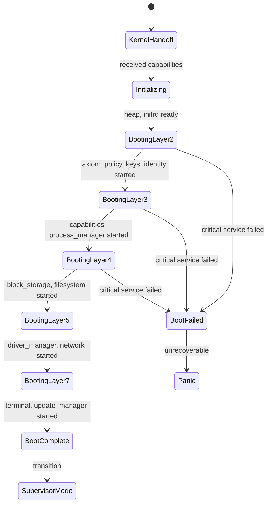

# Init Specification

**Version:** 1.0  
**Status:** Specification  
**Component:** Layer 1 - Bootstrap

---

## 1. Overview

Init is the **boot-time initialization phase** of the first user-space process. It receives control from the kernel, starts all system services in dependency order, and transitions to the Supervisor phase once the system is running.

### 1.1 Position in Architecture

| Layer | Component | Description |
|-------|-----------|-------------|
| Layer 0 | Kernel | Spawns PID 1 with full capabilities |
| **Layer 1** | **Init** | **Bootstraps all services** |
| Layer 1 | Supervisor | Takes over after boot completes |
| Layer 2+ | Services | Started by Init |

### 1.2 Responsibilities

| Responsibility | Description |
|----------------|-------------|
| **Kernel Handoff** | Receive capabilities and control from kernel |
| **Service Bootstrap** | Start all system services in layer order |
| **Capability Distribution** | Grant initial capabilities to services |
| **Boot Verification** | Ensure critical services are running before proceeding |
| **Transition to Supervisor** | Hand off to runtime supervision once boot completes |

---

## 2. Kernel Handoff

### 2.1 Initial State

When the kernel transfers control to Init:

```rust
/// State received from kernel at handoff
struct KernelHandoff {
    /// All IRQ capabilities
    pub irq_caps: Vec<IrqCapability>,
    
    /// All I/O port capabilities (x86)
    pub io_port_caps: Vec<IoPortCapability>,
    
    /// All physical memory regions
    pub memory_caps: Vec<MemoryCapability>,
    
    /// Capability to create processes
    pub process_create_cap: ProcessCreateCapability,
    
    /// Capability to create IPC endpoints
    pub endpoint_create_cap: EndpointCreateCapability,
    
    /// Boot parameters
    pub boot_params: BootParams,
    
    /// Initial ramdisk location
    pub initrd: Option<MemoryRegion>,
}
```

### 2.2 Early Initialization

```rust
impl Init {
    pub fn start(handoff: KernelHandoff) -> ! {
        // 1. Validate handoff
        Self::validate_handoff(&handoff);
        
        // 2. Set up minimal heap
        Self::init_heap(&handoff.memory_caps);
        
        // 3. Parse boot parameters
        let config = Self::parse_boot_params(&handoff.boot_params);
        
        // 4. Mount initrd (contains service binaries and manifests)
        let initrd = Self::mount_initrd(handoff.initrd);
        
        // 5. Load service manifests
        let manifests = Self::load_manifests(&initrd);
        
        // 6. Begin service bootstrap
        let mut init = Init::new(handoff, config, manifests);
        init.boot();
        
        // 7. Transition to Supervisor
        init.become_supervisor()
    }
}
```

---

## 3. Boot Sequence

### 3.1 Service Start Order

Services are started in layer order, ensuring dependencies are satisfied:

```rust
impl Init {
    pub fn boot(&mut self) -> Result<(), BootError> {
        // Layer 2: Core Authority Services (must be first)
        // These have no dependencies and form the "authority spine"
        self.start_service("axiom")?;
        self.start_service("policy")?;
        self.start_service("keys")?;
        self.start_service("identity")?;
        
        // Layer 3: Process & Capability Services
        self.start_service("capability_service")?;
        self.start_service("process_manager")?;
        
        // Layer 4: Storage Services
        self.start_service("block_storage")?;
        self.start_service("filesystem")?;
        
        // Layer 5: Network & Device Services
        self.start_service("driver_manager")?;
        self.start_service("network")?;
        
        // Layer 7: User-Facing Services
        self.start_service("terminal")?;
        self.start_service("update_manager")?;
        
        self.state = BootState::Complete;
        Ok(())
    }
}
```

### 3.2 Service Startup Process

```rust
impl Init {
    fn start_service(&mut self, name: &str) -> Result<ServiceId, BootError> {
        let manifest = self.get_manifest(name)?;
        
        // 1. Verify dependencies are running
        for dep in &manifest.dependencies {
            if !self.is_service_running(&dep.name) {
                return Err(BootError::DependencyNotRunning(dep.name.clone()));
            }
        }
        
        // 2. Load binary from initrd/filesystem
        let binary = self.load_binary(&manifest.binary)?;
        
        // 3. Create process
        let pid = self.kernel.create_process(
            &binary,
            &manifest.args,
            &manifest.env,
            &manifest.resources.into(),
        )?;
        
        // 4. Grant required capabilities
        self.grant_capabilities(&manifest, pid)?;
        
        // 5. Start the process
        self.kernel.start_process(pid)?;
        
        // 6. Wait for service to report ready
        self.wait_for_ready(name, manifest.health.startup_timeout)?;
        
        // 7. Record in service table
        let id = self.register_service(name, pid, &manifest);
        
        Ok(id)
    }
}
```

---

## 4. Boot State Machine



---

## 5. Capability Distribution

### 5.1 Capability Grants

Each service receives only the capabilities it needs:

```rust
impl Init {
    fn grant_capabilities(
        &mut self,
        manifest: &ServiceManifest,
        pid: ProcessId,
    ) -> Result<(), GrantError> {
        for cap_req in &manifest.capabilities.required {
            match cap_req.capability_type {
                CapabilityType::Axiom => {
                    // Grant Axiom read/write capability
                    let cap = self.derive_axiom_cap(&cap_req.permissions)?;
                    self.kernel.grant_capability(pid, cap)?;
                }
                CapabilityType::BlockDevice(device) => {
                    // Grant access to specific block device
                    let cap = self.derive_block_cap(device, &cap_req.permissions)?;
                    self.kernel.grant_capability(pid, cap)?;
                }
                CapabilityType::Irq(irq_num) => {
                    // Grant IRQ handling capability
                    let cap = self.irq_caps.remove(irq_num)?;
                    self.kernel.grant_capability(pid, cap)?;
                }
                CapabilityType::Network => {
                    let cap = self.derive_network_cap(&cap_req.permissions)?;
                    self.kernel.grant_capability(pid, cap)?;
                }
                // ... other capability types
            }
        }
        
        Ok(())
    }
}
```

### 5.2 Capability Derivation

Init holds root capabilities and derives attenuated versions for services:

```
┌──────────────────────────────────────────────────────────────┐
│                    CAPABILITY DISTRIBUTION                    │
│                                                              │
│   ┌─────────┐                                                │
│   │  Init   │ ◄── Receives all capabilities from kernel     │
│   │ (PID 1) │                                                │
│   └────┬────┘                                                │
│        │                                                     │
│        ├──────► Axiom Service    [block_device: rw]         │
│        ├──────► Policy Service   [axiom: r]                 │
│        ├──────► Filesystem       [block_device: rw]         │
│        ├──────► Network          [irq: nic, io_ports: ...]  │
│        └──────► Terminal         [framebuffer: w]           │
│                                                              │
└──────────────────────────────────────────────────────────────┘
```

---

## 6. Boot Verification

### 6.1 Service Ready Protocol

Each service must signal readiness before Init proceeds:

```rust
/// Message sent by service when ready
#[derive(Clone, Debug, Serialize, Deserialize)]
pub struct ServiceReady {
    /// Service name
    pub name: String,
    
    /// Service endpoint for clients
    pub endpoint: EndpointId,
    
    /// Service version
    pub version: Version,
    
    /// Capabilities the service provides
    pub provides: Vec<String>,
}

impl Init {
    fn wait_for_ready(
        &mut self,
        name: &str,
        timeout: Duration,
    ) -> Result<ServiceReady, BootError> {
        let deadline = Instant::now() + timeout;
        
        loop {
            // Check for ready message
            if let Some(ready) = self.check_ready_message(name) {
                return Ok(ready);
            }
            
            // Check for timeout
            if Instant::now() > deadline {
                return Err(BootError::StartupTimeout(name.to_string()));
            }
            
            // Check if process died
            if !self.kernel.is_process_alive(self.get_pid(name)?) {
                return Err(BootError::ServiceCrashed(name.to_string()));
            }
            
            // Yield briefly
            self.kernel.yield_cpu();
        }
    }
}
```

### 6.2 Critical Service Failure

If a Layer 2 (Core Authority) service fails during boot:

```rust
impl Init {
    fn handle_boot_failure(&mut self, error: BootError) -> ! {
        // Log the failure (to console if available)
        self.log_error(&error);
        
        // Attempt to dump diagnostic info
        self.dump_diagnostics();
        
        // Trigger kernel panic
        self.kernel.panic(&format!("Boot failed: {:?}", error));
    }
}
```

---

## 7. Transition to Supervisor

Once all services are running, Init transitions to Supervisor mode:

```rust
impl Init {
    fn become_supervisor(self) -> ! {
        // Convert Init state to Supervisor state
        let supervisor = Supervisor::from_init(
            self.services,
            self.capabilities,
            self.config,
        );
        
        // Enter the supervisor event loop
        supervisor.run()
    }
}
```

The Supervisor takes over:
- Service health monitoring
- Restart management
- Shutdown coordination
- Runtime service requests

---

## 8. Implementation Notes

### 8.1 Init is Minimal

Init should be as simple as possible:
- No complex dependencies
- Statically linked
- Minimal memory usage
- Clear failure modes

### 8.2 Recovery Mode

If boot fails, the system may enter recovery mode on next boot:
- Minimal set of services started
- Network access for remote recovery
- Shell access for debugging

### 8.3 Boot Timing

Typical boot sequence timing:

| Phase | Target Time |
|-------|-------------|
| Kernel handoff | < 10ms |
| Layer 2 services | < 500ms |
| Layer 3-4 services | < 1s |
| Layer 5+ services | < 2s |
| **Total boot** | **< 4s** |

---

*[← Processes and Scheduling](../00-kernel/02-processes.md) | [Supervisor →](02-supervisor.md)*
