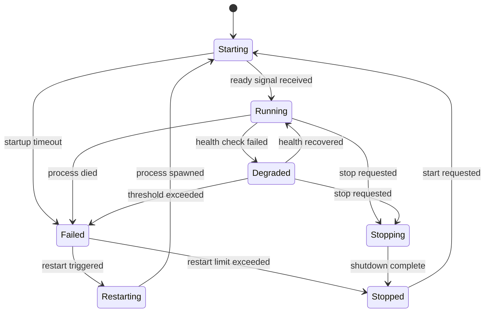

# Supervisor Specification

**Version:** 1.0  
**Status:** Specification  
**Component:** Layer 1 - Bootstrap

---

## 1. Overview

The Supervisor is the **runtime management phase** of the first user-space process (PID 1). After Init completes the boot sequence, the Supervisor takes over to monitor service health, manage restarts, and coordinate shutdown.

### 1.1 Position in Architecture

| Layer | Component | Description |
|-------|-----------|-------------|
| Layer 1 | Init | Bootstraps services, then transitions to Supervisor |
| **Layer 1** | **Supervisor** | **Runtime service management** |
| Layer 2+ | Services | Monitored and managed by Supervisor |

### 1.2 Responsibilities

| Responsibility | Description |
|----------------|-------------|
| **Health Monitoring** | Continuously check service health |
| **Restart Management** | Restart failed services with backoff |
| **Shutdown Coordination** | Gracefully stop all services |
| **Service Discovery** | Help services find each other |
| **Event Logging** | Record service lifecycle events |

---

## 2. Supervisor Interface

### 2.1 Service Management

```rust
/// Supervisor service interface
pub trait SupervisorService {
    /// Start a service by name (post-boot)
    fn start_service(&mut self, name: &str, auth: AuthToken) 
        -> Result<ServiceId, SupervisorError>;
    
    /// Stop a service gracefully
    fn stop_service(&mut self, id: ServiceId, auth: AuthToken) 
        -> Result<(), SupervisorError>;
    
    /// Restart a service
    fn restart_service(&mut self, id: ServiceId, auth: AuthToken) 
        -> Result<(), SupervisorError>;
    
    /// Get service status
    fn get_status(&self, id: ServiceId) -> Result<ServiceStatus, SupervisorError>;
    
    /// List all services
    fn list_services(&self) -> Vec<ServiceInfo>;
    
    /// Lookup service endpoint
    fn lookup_service(&self, name: &str) -> Result<EndpointId, SupervisorError>;
    
    /// Subscribe to service events
    fn subscribe(&mut self, filter: EventFilter) -> EventSubscription;
}
```

### 2.2 Service Status

```rust
#[derive(Clone, Debug, Serialize, Deserialize)]
pub struct ServiceStatus {
    /// Service identifier
    pub id: ServiceId,
    
    /// Service name
    pub name: String,
    
    /// Current state
    pub state: ServiceState,
    
    /// Process ID (if running)
    pub pid: Option<ProcessId>,
    
    /// Uptime (if running)
    pub uptime: Option<Duration>,
    
    /// Restart count (since last clean start)
    pub restarts: u32,
    
    /// Last error (if failed)
    pub last_error: Option<String>,
    
    /// Health check status
    pub health: HealthStatus,
}

#[derive(Clone, Copy, Debug, PartialEq, Eq, Serialize, Deserialize)]
pub enum ServiceState {
    /// Service is starting up
    Starting,
    
    /// Service is running and healthy
    Running,
    
    /// Service is degraded but functional
    Degraded,
    
    /// Service is stopping
    Stopping,
    
    /// Service has stopped cleanly
    Stopped,
    
    /// Service has failed
    Failed,
    
    /// Service is being restarted
    Restarting,
}

#[derive(Clone, Debug, Serialize, Deserialize)]
pub struct HealthStatus {
    /// Is service healthy?
    pub healthy: bool,
    
    /// Consecutive successful checks
    pub success_count: u32,
    
    /// Consecutive failed checks
    pub failure_count: u32,
    
    /// Last check time
    pub last_check: Option<Timestamp>,
}
```

---

## 3. Health Monitoring

### 3.1 Health Check Protocol

```rust
/// Health check configuration per service
#[derive(Clone, Debug, Serialize, Deserialize)]
pub struct HealthConfig {
    /// Interval between health checks
    pub check_interval: Duration,
    
    /// Timeout for health check response
    pub check_timeout: Duration,
    
    /// Consecutive failures before marking unhealthy
    pub failure_threshold: u32,
    
    /// Consecutive successes to recover from degraded
    pub success_threshold: u32,
}

/// Health check response from service
#[derive(Clone, Debug, Serialize, Deserialize)]
pub struct HealthResponse {
    /// Overall health status
    pub healthy: bool,
    
    /// Component health details
    pub components: Vec<ComponentHealth>,
    
    /// Last error (if any)
    pub last_error: Option<String>,
    
    /// Service uptime
    pub uptime: Duration,
}

#[derive(Clone, Debug, Serialize, Deserialize)]
pub struct ComponentHealth {
    /// Component name
    pub name: String,
    
    /// Is component healthy?
    pub healthy: bool,
    
    /// Details
    pub message: Option<String>,
}
```

### 3.2 Health Check Loop

```rust
impl Supervisor {
    fn health_check_loop(&mut self) {
        loop {
            for service in self.services.values_mut() {
                if service.state != ServiceState::Running {
                    continue;
                }
                
                // Check if it's time for a health check
                if !service.is_check_due() {
                    continue;
                }
                
                // Perform health check
                match self.check_health(service) {
                    Ok(response) if response.healthy => {
                        service.health.success_count += 1;
                        service.health.failure_count = 0;
                        
                        // Recover from degraded if enough successes
                        if service.state == ServiceState::Degraded 
                           && service.health.success_count >= service.config.success_threshold {
                            service.state = ServiceState::Running;
                            self.emit_event(ServiceEvent::Recovered(service.id));
                        }
                    }
                    Ok(response) => {
                        self.handle_unhealthy(service, response.last_error);
                    }
                    Err(e) => {
                        self.handle_unhealthy(service, Some(e.to_string()));
                    }
                }
            }
            
            // Sleep until next check
            self.sleep(self.config.min_check_interval);
        }
    }
    
    fn handle_unhealthy(&mut self, service: &mut Service, error: Option<String>) {
        service.health.failure_count += 1;
        service.health.success_count = 0;
        service.last_error = error;
        
        if service.health.failure_count >= service.config.failure_threshold {
            service.state = ServiceState::Failed;
            self.emit_event(ServiceEvent::Failed(service.id));
            self.maybe_restart(service);
        } else if service.state == ServiceState::Running {
            service.state = ServiceState::Degraded;
            self.emit_event(ServiceEvent::Degraded(service.id));
        }
    }
}
```

### 3.3 Health State Machine



---

## 4. Restart Policy

### 4.1 Restart Configuration

```rust
/// Service restart policy
#[derive(Clone, Debug, Serialize, Deserialize)]
pub struct RestartPolicy {
    /// Maximum restart attempts within window
    pub max_restarts: u32,
    
    /// Time window for counting restarts
    pub window: Duration,
    
    /// Initial delay between restarts
    pub initial_delay: Duration,
    
    /// Maximum delay (after backoff)
    pub max_delay: Duration,
    
    /// Backoff multiplier
    pub backoff_factor: f32,
    
    /// What to do if restarts exhausted
    pub on_exhausted: ExhaustedAction,
}

#[derive(Clone, Copy, Debug, Serialize, Deserialize)]
pub enum ExhaustedAction {
    /// Leave service stopped
    Stop,
    
    /// Panic the system (for critical services)
    Panic,
    
    /// Keep retrying forever with max_delay
    RetryForever,
}
```

### 4.2 Restart Logic

```rust
impl Supervisor {
    fn maybe_restart(&mut self, service: &mut Service) {
        // Count restarts within window
        let recent_restarts = service.restart_times
            .iter()
            .filter(|t| t.elapsed() < service.policy.window)
            .count();
        
        if recent_restarts >= service.policy.max_restarts as usize {
            match service.policy.on_exhausted {
                ExhaustedAction::Stop => {
                    service.state = ServiceState::Stopped;
                    self.emit_event(ServiceEvent::RestartLimitReached(service.id));
                }
                ExhaustedAction::Panic => {
                    self.panic(&format!(
                        "Critical service {} exceeded restart limit", 
                        service.name
                    ));
                }
                ExhaustedAction::RetryForever => {
                    self.schedule_restart(service, service.policy.max_delay);
                }
            }
            return;
        }
        
        // Calculate backoff delay
        let delay = self.calculate_backoff_delay(service);
        self.schedule_restart(service, delay);
    }
    
    fn calculate_backoff_delay(&self, service: &Service) -> Duration {
        let attempts = service.restarts;
        let delay = service.policy.initial_delay.as_millis() as f32
            * service.policy.backoff_factor.powi(attempts as i32);
        let delay_ms = delay.min(service.policy.max_delay.as_millis() as f32);
        Duration::from_millis(delay_ms as u64)
    }
}
```

### 4.3 Default Policies by Service Type

| Service Type | Max Restarts | Window | Backoff | On Exhausted |
|--------------|--------------|--------|---------|--------------|
| Core (axiom, policy) | 3 | 60s | 2x | Panic |
| System (fs, network) | 5 | 120s | 1.5x | Stop |
| User (terminal) | 10 | 300s | 1.5x | Stop |
| Driver | 5 | 60s | 2x | Stop |

---

## 5. Shutdown Sequence

### 5.1 Graceful Shutdown

```rust
impl Supervisor {
    pub fn shutdown(&mut self) -> Result<(), ShutdownError> {
        self.state = SupervisorState::ShuttingDown;
        
        // Stop services in reverse layer order
        
        // Layer 7: User-facing services
        self.stop_layer(&["terminal", "update_manager"])?;
        
        // Layer 5: Network & device services
        self.stop_layer(&["network", "driver_manager"])?;
        
        // Layer 4: Storage services
        self.stop_layer(&["filesystem", "block_storage"])?;
        
        // Layer 3: Process & capability services
        self.stop_layer(&["process_manager", "capability_service"])?;
        
        // Layer 2: Core authority services (last)
        self.stop_layer(&["identity", "keys", "policy", "axiom"])?;
        
        Ok(())
    }
    
    fn stop_layer(&mut self, services: &[&str]) -> Result<(), ShutdownError> {
        for name in services {
            if let Err(e) = self.stop_service_graceful(name) {
                // Log but continue - best effort
                self.log_warning(&format!("Failed to stop {}: {:?}", name, e));
            }
        }
        Ok(())
    }
    
    fn stop_service_graceful(&mut self, name: &str) -> Result<(), ShutdownError> {
        let service = self.get_service_mut(name)?;
        
        // Send PrepareStop
        service.state = ServiceState::Stopping;
        self.send_lifecycle_message(name, LifecycleMessage::PrepareStop)?;
        
        // Wait for ReadyToStop (with timeout)
        self.wait_for_ready_to_stop(name, SHUTDOWN_TIMEOUT)?;
        
        // Send Stop
        self.send_lifecycle_message(name, LifecycleMessage::Stop)?;
        
        // Wait for process exit
        self.wait_for_exit(name, STOP_TIMEOUT)?;
        
        service.state = ServiceState::Stopped;
        Ok(())
    }
}
```

### 5.2 Lifecycle Messages

```rust
#[derive(Clone, Debug, Serialize, Deserialize)]
pub enum LifecycleMessage {
    /// Prepare to stop (flush state, finish work)
    PrepareStop,
    
    /// Stop now
    Stop,
    
    /// Service is ready to stop
    ReadyToStop,
    
    /// Service has stopped
    Stopped { exit_code: i32 },
}
```

---

## 6. Service Manifest

### 6.1 Manifest Format

```rust
/// Service manifest (loaded from filesystem)
#[derive(Clone, Debug, Deserialize)]
pub struct ServiceManifest {
    /// Manifest version
    pub version: u32,
    
    /// Service identification
    pub service: ServiceInfo,
    
    /// Required capabilities
    pub capabilities: CapabilityRequirements,
    
    /// Dependencies
    pub dependencies: Vec<Dependency>,
    
    /// Resource requirements
    pub resources: ResourceRequirements,
    
    /// Health check config
    pub health: HealthConfig,
    
    /// Restart policy
    pub restart: RestartPolicy,
}

#[derive(Clone, Debug, Deserialize)]
pub struct Dependency {
    /// Service name
    pub name: String,
    
    /// Required or optional?
    pub required: bool,
}
```

### 6.2 Example Manifest (TOML)

```toml
version = 1

[service]
name = "filesystem"
version = "1.0.0"
service_type = "System"
binary = "blake3:abc123..."
description = "Filesystem service"

[capabilities]
required = [
    { type = "BlockDevice", permissions = ["read", "write"] },
    { type = "Axiom", permissions = ["read", "write"] },
]

[[dependencies]]
name = "axiom"
required = true

[[dependencies]]
name = "policy"
required = true

[[dependencies]]
name = "block_storage"
required = true

[resources]
memory_mb = 128
cpu_shares = 100
priority = "Normal"

[health]
check_interval_ms = 5000
check_timeout_ms = 1000
failure_threshold = 3
success_threshold = 2

[restart]
max_restarts = 5
window_secs = 120
initial_delay_ms = 500
max_delay_ms = 30000
backoff_factor = 1.5
on_exhausted = "Stop"
```

---

## 7. Service Discovery

Services find each other through the Supervisor:

```rust
impl Supervisor {
    /// Lookup a service endpoint by name
    pub fn lookup_service(&self, name: &str) -> Result<EndpointId, LookupError> {
        let service = self.services.get(name)
            .ok_or(LookupError::NotFound(name.to_string()))?;
        
        if service.state != ServiceState::Running {
            return Err(LookupError::NotRunning(name.to_string()));
        }
        
        service.endpoint.ok_or(LookupError::NoEndpoint(name.to_string()))
    }
}

// Client usage
let fs_endpoint = supervisor.lookup_service("filesystem")?;
let fs_client = FilesystemClient::connect(fs_endpoint)?;
```

---

## 8. Implementation Notes

### 8.1 Supervisor is Unprivileged

Despite being PID 1, the Supervisor is a normal user-space process:

- Runs in its own address space
- Communicates via IPC
- Has no special kernel privileges
- Its authority comes from capabilities granted by kernel

### 8.2 Critical Service Failure

If a Layer 2 (Core Authority) service fails and cannot be restarted:

1. Supervisor logs the failure to Axiom (if available)
2. Supervisor initiates system panic
3. System performs emergency shutdown
4. On next boot, recovery mode may be entered

### 8.3 Supervisor Cannot Die

The Supervisor (PID 1) never exits:
- If it crashes, the kernel panics
- It must handle all signals gracefully
- It never calls `exit()`

---

*[← Init](01-init.md) | [Axiom →](../02-authority/01-axiom.md)*
