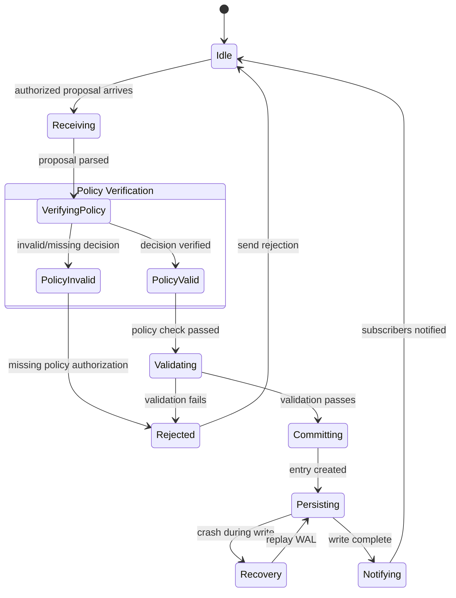

# Axiom Specification

**Version:** 1.0  
**Status:** Specification  
**Component:** Core Infrastructure

---

## 1. Overview

The Axiom is the authoritative, append-only, hash-chained record of all meaningful state transitions in Orbital OS. It is the single source of truth for system behavior.

### 1.1 Properties

| Property | Description |
|----------|-------------|
| **Append-only** | Entries can only be added, never modified or removed |
| **Totally ordered** | Every entry has a unique sequence number |
| **Hash-chained** | Each entry references the hash of the previous entry |
| **Crash-consistent** | Partial writes cannot corrupt the chain |
| **Single-writer (v0)** | One sequencer process writes to the Axiom |

### 1.2 Guarantees

1. **Integrity**: Any tampering is cryptographically detectable
2. **Completeness**: All authoritative state transitions are recorded
3. **Determinism**: Same Axiom → same control state (always)
4. **Durability**: Committed entries survive crashes

---

## 2. Entry Format

### 2.1 Entry Structure

```rust
/// A single entry in the Axiom
#[derive(Clone, Debug, Serialize, Deserialize)]
pub struct AxiomEntry {
    /// Entry header (fixed-size, always present)
    pub header: EntryHeader,
    
    /// Entry payload (variable-size, type-dependent)
    pub payload: EntryPayload,
    
    /// Cryptographic signature (optional in v0, required in multi-node)
    pub signature: Option<Signature>,
}

/// Fixed-size entry header
#[derive(Clone, Debug, Serialize, Deserialize)]
pub struct EntryHeader {
    /// Monotonically increasing sequence number
    pub sequence: u64,
    
    /// Hash of the previous entry (genesis has zero hash)
    pub prev_hash: Hash,
    
    /// Hash of this entry's payload
    pub payload_hash: Hash,
    
    /// Timestamp (wall-clock, advisory only — NOT used for ordering)
    pub timestamp: Timestamp,
    
    /// Entry type discriminant
    pub entry_type: EntryType,
    
    /// Payload size in bytes
    pub payload_size: u32,
}

/// Content hash (BLAKE3, 256-bit)
#[derive(Clone, Copy, Debug, PartialEq, Eq, Hash, Serialize, Deserialize)]
pub struct Hash([u8; 32]);

/// Wall-clock timestamp (nanoseconds since Unix epoch)
#[derive(Clone, Copy, Debug, Serialize, Deserialize)]
pub struct Timestamp(u64);
```

### 2.2 Entry Hash Computation

The hash of an entry is computed as:

```rust
impl AxiomEntry {
    pub fn compute_hash(&self) -> Hash {
        let mut hasher = blake3::Hasher::new();
        
        // Hash header fields (excluding signature)
        hasher.update(&self.header.sequence.to_le_bytes());
        hasher.update(self.header.prev_hash.as_bytes());
        hasher.update(self.header.payload_hash.as_bytes());
        hasher.update(&self.header.timestamp.0.to_le_bytes());
        hasher.update(&(self.header.entry_type as u32).to_le_bytes());
        hasher.update(&self.header.payload_size.to_le_bytes());
        
        // Hash payload
        hasher.update(&self.payload.to_bytes());
        
        Hash(hasher.finalize().into())
    }
}
```

### 2.3 Chain Validation

```rust
impl Axiom {
    /// Validate the entire chain from genesis
    pub fn validate_chain(&self) -> Result<(), ValidationError> {
        let mut expected_seq = 0u64;
        let mut prev_hash = Hash::zero(); // Genesis parent
        
        for entry in self.entries() {
            // Check sequence is monotonic
            if entry.header.sequence != expected_seq {
                return Err(ValidationError::SequenceGap {
                    expected: expected_seq,
                    found: entry.header.sequence,
                });
            }
            
            // Check hash chain
            if entry.header.prev_hash != prev_hash {
                return Err(ValidationError::BrokenChain {
                    sequence: entry.header.sequence,
                });
            }
            
            // Check payload hash
            let computed_payload_hash = Hash::of(&entry.payload.to_bytes());
            if entry.header.payload_hash != computed_payload_hash {
                return Err(ValidationError::PayloadMismatch {
                    sequence: entry.header.sequence,
                });
            }
            
            prev_hash = entry.compute_hash();
            expected_seq += 1;
        }
        
        Ok(())
    }
}
```

---

## 3. Entry Types

### 3.1 Entry Type Enumeration

```rust
#[derive(Clone, Copy, Debug, PartialEq, Eq, Serialize, Deserialize)]
#[repr(u32)]
pub enum EntryType {
    // System lifecycle
    Genesis = 0,
    Shutdown = 1,
    
    // Capability and policy
    CapabilityGrant = 10,
    CapabilityRevoke = 11,
    PolicyUpdate = 12,
    
    // Service lifecycle
    ServiceRegister = 20,
    ServiceStart = 21,
    ServiceStop = 22,
    ServiceFailed = 23,
    
    // Process lifecycle
    ProcessCreate = 30,
    ProcessExit = 31,
    ProcessKill = 32,
    
    // Filesystem
    FileCreate = 40,
    FileDelete = 41,
    FileMetadataUpdate = 42,
    DirectoryCreate = 43,
    DirectoryDelete = 44,
    
    // Storage
    BlockAllocation = 50,
    BlockDeallocation = 51,
    SnapshotCreate = 52,
    SnapshotRestore = 53,
    
    // Network
    ConnectionAuthorize = 60,
    ConnectionRevoke = 61,
    
    // Jobs
    JobSubmit = 70,
    JobStart = 71,
    JobComplete = 72,
    JobFailed = 73,
    
    // Verification
    Receipt = 80,
    
    // Policy and authorization
    PolicyDecision = 85,
    PolicyRuleAdded = 86,
    PolicyRuleRemoved = 87,
    
    // Identity and key management
    IdentityCreated = 88,
    IdentityUpdated = 89,
    CredentialAdded = 90,
    CredentialRevoked = 91,
    KeyUsage = 92,
    
    // System updates
    ImageStage = 100,
    ImageActivate = 101,
    ImageRollback = 102,
}
```

### 3.2 Payload Schemas

#### Genesis Entry

```rust
#[derive(Clone, Debug, Serialize, Deserialize)]
pub struct GenesisPayload {
    /// System version
    pub version: Version,
    
    /// System image hash
    pub image_hash: Hash,
    
    /// Initial capability set
    pub initial_capabilities: Vec<CapabilityDefinition>,
    
    /// Genesis timestamp (informational)
    pub genesis_time: Timestamp,
}
```

#### Capability Grant

```rust
#[derive(Clone, Debug, Serialize, Deserialize)]
pub struct CapabilityGrantPayload {
    /// Unique capability ID
    pub capability_id: CapabilityId,
    
    /// Granting entity
    pub grantor: EntityId,
    
    /// Receiving entity
    pub grantee: EntityId,
    
    /// Resource this capability controls
    pub resource: ResourceId,
    
    /// Permissions granted
    pub permissions: Permissions,
    
    /// Optional restrictions
    pub restrictions: Option<Restrictions>,
    
    /// Parent capability (for delegation chain)
    pub parent: Option<CapabilityId>,
}
```

#### File Create

```rust
#[derive(Clone, Debug, Serialize, Deserialize)]
pub struct FileCreatePayload {
    /// Full path
    pub path: PathBuf,
    
    /// Content hash
    pub content_hash: Hash,
    
    /// File size in bytes
    pub size: u64,
    
    /// File type
    pub file_type: FileType,
    
    /// Initial permissions
    pub permissions: FilePermissions,
    
    /// Creating entity
    pub creator: EntityId,
}
```

#### Job Submit

```rust
#[derive(Clone, Debug, Serialize, Deserialize)]
pub struct JobSubmitPayload {
    /// Unique job ID
    pub job_id: JobId,
    
    /// Job manifest hash
    pub manifest_hash: Hash,
    
    /// Input content hashes
    pub inputs: Vec<Hash>,
    
    /// Execution environment hash
    pub environment_hash: Hash,
    
    /// Submitting entity
    pub submitter: EntityId,
    
    /// Resource requirements
    pub resources: ResourceRequirements,
}
```

#### Job Complete

```rust
#[derive(Clone, Debug, Serialize, Deserialize)]
pub struct JobCompletePayload {
    /// Job ID
    pub job_id: JobId,
    
    /// Output content hashes
    pub outputs: Vec<Hash>,
    
    /// Execution metrics
    pub metrics: ExecutionMetrics,
    
    /// Exit status
    pub exit_status: ExitStatus,
}
```

#### Receipt

```rust
#[derive(Clone, Debug, Serialize, Deserialize)]
pub struct ReceiptPayload {
    /// The Axiom entry this receipt corresponds to
    pub axiom_entry: u64,
    
    /// Binding of inputs
    pub inputs: Vec<Hash>,
    
    /// Binding of outputs
    pub outputs: Vec<Hash>,
    
    /// Environment identity
    pub environment: Hash,
    
    /// Effect completion status
    pub status: EffectStatus,
    
    /// Optional execution proof
    pub proof: Option<ExecutionProof>,
}
```

#### Policy Decision

```rust
#[derive(Clone, Debug, Serialize, Deserialize)]
pub struct PolicyDecisionPayload {
    /// Hash of the request that was evaluated
    pub request_hash: Hash,
    
    /// Requestor identity
    pub requestor: IdentityId,
    
    /// Action that was requested
    pub action: PolicyAction,
    
    /// Resource affected
    pub resource: ResourceRef,
    
    /// Policy state hash at time of evaluation
    pub policy_state_hash: Hash,
    
    /// Rules that matched the request
    pub matched_rules: Vec<RuleId>,
    
    /// The final decision
    pub decision: PolicyEffect,
    
    /// Rule that determined the decision
    pub deciding_rule: RuleId,
    
    /// Any conditions attached to the decision
    pub conditions: Vec<PolicyCondition>,
    
    /// Policy Engine signature over this decision
    pub signature: Signature,
}

#[derive(Clone, Debug, Serialize, Deserialize)]
pub enum PolicyEffect {
    Allow,
    Deny { reason: String },
    AllowWithConditions,
}
```

#### Identity Created

```rust
#[derive(Clone, Debug, Serialize, Deserialize)]
pub struct IdentityCreatedPayload {
    /// New identity ID (hash of public key)
    pub identity_id: IdentityId,
    
    /// Human-readable name
    pub name: String,
    
    /// Identity type
    pub identity_type: IdentityType,
    
    /// Parent identity
    pub parent: Option<IdentityId>,
    
    /// Public key
    pub public_key: PublicKey,
    
    /// Key derivation path
    pub key_path: KeyPath,
}
```

#### Key Usage

```rust
#[derive(Clone, Debug, Serialize, Deserialize)]
pub struct KeyUsagePayload {
    /// Identity using the key
    pub identity: IdentityId,
    
    /// Key derivation path
    pub key_path: KeyPath,
    
    /// Operation performed
    pub operation: KeyOperation,
    
    /// Hash of the message/data (for signing operations)
    pub message_hash: Option<Hash>,
    
    /// Policy decision that authorized this operation
    pub authorization: AxiomRef,
}

#[derive(Clone, Debug, Serialize, Deserialize)]
pub enum KeyOperation {
    Sign,
    Encrypt,
    Decrypt,
    DeriveChild,
}
```

---

## 4. Sequencer Protocol

### 4.1 Sequencer Responsibilities

The Axiom Sequencer:

1. **Receives proposals** from the Policy Engine (NOT directly from services)
2. **Verifies policy decisions** — rejects proposals without valid policy authorization
3. **Validates proposals** against current state
4. **Assigns sequence numbers** (total ordering)
5. **Commits entries** atomically
6. **Notifies subscribers** of new entries

**Critical Invariant:** The Axiom Sequencer only accepts proposals that include a valid, signed policy decision from the Policy Engine. Direct submission from services is prohibited.

### 4.2 Proposal Submission

```rust
/// A proposal for an Axiom entry
/// NOTE: Proposals MUST be submitted through the Policy Engine
#[derive(Clone, Debug, Serialize, Deserialize)]
pub struct Proposal {
    /// Proposed entry type
    pub entry_type: EntryType,
    
    /// Proposed payload
    pub payload: EntryPayload,
    
    /// Submitting service identity
    pub submitter: IdentityId,
    
    /// Nonce for deduplication
    pub nonce: u64,
}

/// Policy-approved proposal (required for sequencer submission)
#[derive(Clone, Debug, Serialize, Deserialize)]
pub struct AuthorizedProposal {
    /// The original proposal
    pub proposal: Proposal,
    
    /// Policy Engine decision (REQUIRED)
    pub policy_decision: PolicyDecision,
    
    /// Reference to the policy decision Axiom entry
    pub decision_ref: AxiomRef,
}

/// Sequencer response
#[derive(Clone, Debug, Serialize, Deserialize)]
pub enum ProposalResult {
    /// Proposal accepted and committed
    Accepted {
        sequence: u64,
        entry_hash: Hash,
    },
    
    /// Proposal rejected
    Rejected {
        reason: RejectionReason,
    },
}

#[derive(Clone, Debug, Serialize, Deserialize)]
pub enum RejectionReason {
    /// Invalid payload format
    InvalidPayload,
    
    /// Missing or invalid policy decision
    MissingPolicyDecision,
    
    /// Policy decision doesn't authorize this proposal
    PolicyMismatch,
    
    /// Policy decision has expired
    PolicyDecisionExpired,
    
    /// Policy decision signature invalid
    InvalidPolicySignature,
    
    /// Referenced resource doesn't exist
    ResourceNotFound,
    
    /// Duplicate nonce
    DuplicateNonce,
    
    /// Sequencer overloaded
    Backpressure,
}
```

### 4.3 Sequencer State Machine (Policy-Gated)



**Note:** The sequencer MUST verify that every incoming proposal includes a valid, unexpired policy decision from the Policy Engine before processing.

### 4.4 Batching

The sequencer MAY batch multiple proposals:

```rust
impl Sequencer {
    /// Commit a batch of proposals atomically
    pub fn commit_batch(&mut self, proposals: Vec<Proposal>) -> Vec<ProposalResult> {
        let mut results = Vec::with_capacity(proposals.len());
        let mut entries = Vec::new();
        
        // Validate all proposals
        for proposal in proposals {
            match self.validate(&proposal) {
                Ok(entry) => entries.push((proposal, entry)),
                Err(reason) => results.push(ProposalResult::Rejected { reason }),
            }
        }
        
        // Commit all valid entries atomically
        let committed = self.storage.append_batch(&entries)?;
        
        // Notify subscribers
        for (seq, entry) in &committed {
            self.notify_subscribers(*seq, entry);
        }
        
        results
    }
}
```

---

## 5. Storage Protocol

### 5.1 On-Disk Format

```
┌─────────────────────────────────────────────────────────────┐
│                     CODEX FILE LAYOUT                        │
├─────────────────────────────────────────────────────────────┤
│  Offset 0x0000: File Header (512 bytes)                     │
│    - Magic: "HALCYON_CODEX\0" (14 bytes)                    │
│    - Version: u32                                           │
│    - Flags: u32                                             │
│    - Entry count: u64                                       │
│    - Last sequence: u64                                     │
│    - Last hash: Hash (32 bytes)                             │
│    - Reserved: (padding to 512 bytes)                       │
├─────────────────────────────────────────────────────────────┤
│  Offset 0x0200: Entry Index (variable)                      │
│    - Entry 0 offset: u64                                    │
│    - Entry 1 offset: u64                                    │
│    - ...                                                    │
├─────────────────────────────────────────────────────────────┤
│  Offset varies: Entry Data (variable)                       │
│    - Entry 0: [header][payload]                             │
│    - Entry 1: [header][payload]                             │
│    - ...                                                    │
└─────────────────────────────────────────────────────────────┘
```

### 5.2 Write-Ahead Log

All writes go through a WAL for crash consistency:

```rust
/// WAL entry for crash recovery
#[derive(Clone, Debug, Serialize, Deserialize)]
pub struct WalEntry {
    /// Operation type
    pub op: WalOperation,
    
    /// Entry data (for append operations)
    pub data: Option<Vec<u8>>,
    
    /// Checksum
    pub checksum: u32,
}

#[derive(Clone, Copy, Debug, Serialize, Deserialize)]
pub enum WalOperation {
    /// Begin a new entry append
    BeginAppend { sequence: u64 },
    
    /// Entry data written
    DataWritten { offset: u64, len: u64 },
    
    /// Index updated
    IndexUpdated { sequence: u64 },
    
    /// Header updated
    HeaderUpdated,
    
    /// Append complete
    CommitAppend { sequence: u64 },
}
```

### 5.3 Crash Recovery

```rust
impl AxiomStorage {
    /// Recover from crash by replaying WAL
    pub fn recover(&mut self) -> Result<(), RecoveryError> {
        let wal = self.open_wal()?;
        
        for entry in wal.entries() {
            match entry.op {
                WalOperation::BeginAppend { sequence } => {
                    // Check if append was completed
                    if !self.has_commit_for(sequence) {
                        // Incomplete append — discard
                        self.truncate_to(sequence - 1)?;
                    }
                }
                WalOperation::CommitAppend { sequence } => {
                    // Append was completed — verify
                    self.verify_entry(sequence)?;
                }
                _ => {
                    // Intermediate states handled by above
                }
            }
        }
        
        // Clear WAL after successful recovery
        wal.clear()?;
        
        Ok(())
    }
}
```

---

## 6. Reducer Specification

### 6.1 Reducer Interface

```rust
/// The pure function that derives control state from Axiom
pub trait Reducer {
    /// The control state type
    type State;
    
    /// Initial state (before any entries)
    fn initial_state() -> Self::State;
    
    /// Apply a single entry to produce new state
    fn apply(state: &Self::State, entry: &AxiomEntry) -> Self::State;
    
    /// Reduce entire Axiom to final state
    fn reduce(axiom: &Axiom) -> Self::State {
        axiom.entries().fold(Self::initial_state(), |state, entry| {
            Self::apply(&state, entry)
        })
    }
}
```

### 6.2 Reducer Requirements

The reducer function MUST be:

| Requirement | Description |
|-------------|-------------|
| **Pure** | No side effects, no I/O |
| **Deterministic** | Same input → same output |
| **Total** | Defined for all valid entries |
| **Incremental** | Can process entries one-by-one |

### 6.3 Control State Structure

```rust
/// System control state derived from Axiom
#[derive(Clone, Debug)]
pub struct ControlState {
    /// Active capabilities
    pub capabilities: BTreeMap<CapabilityId, Capability>,
    
    /// Registered services
    pub services: BTreeMap<ServiceId, ServiceState>,
    
    /// Active processes
    pub processes: BTreeMap<ProcessId, ProcessState>,
    
    /// Filesystem namespace
    pub namespace: NamespaceState,
    
    /// Active jobs
    pub jobs: BTreeMap<JobId, JobState>,
    
    /// Current system image
    pub system_image: Hash,
    
    /// Policy configuration
    pub policy: PolicyState,
}
```

---

## 7. Subscription Protocol

### 7.1 Subscription Interface

```rust
/// Subscribe to Axiom updates
pub trait AxiomSubscriber {
    /// Called when a new entry is committed
    fn on_entry(&mut self, sequence: u64, entry: &AxiomEntry);
    
    /// Called when the sequencer is catching up (replay)
    fn on_replay(&mut self, from: u64, to: u64);
}
```

### 7.2 Subscription Guarantees

| Guarantee | Description |
|-----------|-------------|
| **Ordered delivery** | Entries delivered in sequence order |
| **At-least-once** | Entries may be re-delivered after crash |
| **Idempotent handling** | Subscribers must handle re-delivery |

---

## 8. Multi-Node Extensions (Future)

### 8.1 Replication Protocol

For future multi-node support:

```rust
/// Replicated Axiom entry with consensus metadata
pub struct ReplicatedEntry {
    /// The Axiom entry
    pub entry: AxiomEntry,
    
    /// Consensus term
    pub term: u64,
    
    /// Leader ID
    pub leader: NodeId,
    
    /// Signatures from quorum
    pub signatures: Vec<(NodeId, Signature)>,
}
```

### 8.2 Consensus Integration

- v0: Single-writer, no consensus
- Future: Raft-based consensus for multi-node
- Consensus is orthogonal to Axiom semantics

---

## 9. Implementation Notes

### 9.1 Performance Considerations

| Aspect | Target |
|--------|--------|
| Append latency | < 1ms (SSD) |
| Read latency | < 100μs (indexed) |
| Throughput | > 10K entries/second |
| Memory footprint | O(index size) |

### 9.2 Hash Algorithm

- **Algorithm**: BLAKE3
- **Output size**: 256 bits
- **Rationale**: Fast, secure, parallelizable

### 9.3 Serialization

- **Format**: bincode (Rust native, compact)
- **Alternatives**: MessagePack, CBOR for interop

---

## 10. Security Considerations

### 10.1 Integrity

- Hash chain ensures tampering is detectable
- WAL prevents corruption from crashes
- Optional signatures for multi-node

### 10.2 Confidentiality

- Axiom is not encrypted (v0)
- Future: per-entry encryption with key management
- Payload may reference encrypted content

### 10.3 Availability

- Single-writer means single point of failure (v0)
- Future: replicated Axiom with failover

---

*[← Supervisor](../01-boot/02-supervisor.md) | [Policy Engine →](02-policy.md)*
