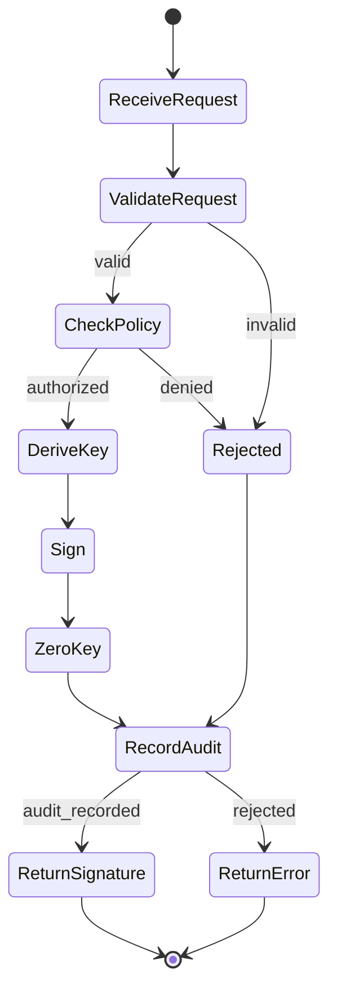

# Key Derivation Service Specification

**Version:** 1.0  
**Status:** Specification  
**Component:** Layer 2 - Core Authority

---

## 1. Overview

The Key Derivation Service (KDS) manages all **cryptographic key operations** in Orbital OS. Keys are derived deterministically from a root seed — never stored. All operations occur within a secure boundary and require policy authorization.

### 1.1 Position in Architecture

| Layer | Component | Relationship |
|-------|-----------|--------------|
| Layer 2 | Axiom | Records all key operations |
| Layer 2 | Policy Engine | Authorizes key operations |
| Layer 2 | Identity Service | Requests key operations for identities |
| **Layer 2** | **Key Derivation Service** | **Derives keys, performs crypto operations** |

### 1.2 Design Principles

| Principle | Description |
|-----------|-------------|
| **Keys are derived, not stored** | Private keys are deterministically derived on-demand, never persisted |
| **Policy controls all operations** | Every key operation requires Policy Engine approval |
| **Everything is audited** | All operations are recorded in the Axiom |
| **Minimal TCB** | Key operations occur within a minimal secure boundary |
| **Hierarchical derivation** | Child keys derive from parent paths |

---

## 2. Threat Model

**Trusted:**
- Key Derivation Service (within secure boundary)
- Policy Engine (for authorization decisions)
- Axiom (for audit trail)

**Untrusted:**
- All other services
- Network
- Storage (except for root seed)
- User input

---

## 3. Key Path Structure

### 3.1 Hierarchical Paths

```rust
/// Hierarchical key derivation path
#[derive(Clone, Debug, PartialEq, Eq, Hash, Serialize, Deserialize)]
pub struct KeyPath {
    /// Path segments
    pub segments: Vec<String>,
}

impl KeyPath {
    /// System key paths
    pub const SYSTEM_ROOT: &'static str = "/orbital";
    pub const SERVICES: &'static str = "/orbital/services";
    pub const NODES: &'static str = "/orbital/nodes";
    pub const ORGS: &'static str = "/orbital/orgs";
    
    /// Parse from string
    pub fn parse(path: &str) -> Result<Self, ParseError> {
        if !path.starts_with('/') {
            return Err(ParseError::MustStartWithSlash);
        }
        
        let segments: Vec<String> = path
            .split('/')
            .filter(|s| !s.is_empty())
            .map(|s| s.to_string())
            .collect();
        
        if segments.is_empty() {
            return Err(ParseError::EmptyPath);
        }
        
        Ok(Self { segments })
    }
    
    /// Check if this path is a descendant of another
    pub fn is_descendant_of(&self, ancestor: &KeyPath) -> bool {
        if self.segments.len() <= ancestor.segments.len() {
            return false;
        }
        
        self.segments.iter()
            .zip(ancestor.segments.iter())
            .all(|(a, b)| a == b)
    }
    
    /// Get parent path
    pub fn parent(&self) -> Option<KeyPath> {
        if self.segments.len() <= 1 {
            return None;
        }
        
        Some(KeyPath {
            segments: self.segments[..self.segments.len() - 1].to_vec(),
        })
    }
    
    /// Append a segment
    pub fn child(&self, segment: &str) -> KeyPath {
        let mut segments = self.segments.clone();
        segments.push(segment.to_string());
        KeyPath { segments }
    }
}

/// Example paths:
/// /orbital                              - System root
/// /orbital/services/axiom               - Axiom service
/// /orbital/orgs/example.org             - Organization
/// /orbital/orgs/example.org/users/alice - User
/// /orbital/orgs/example.org/users/alice/credentials/passkey-1 - Credential
```

---

## 4. Key Derivation Algorithm

### 4.1 Root Seed

```rust
/// Root seed (protected, never exposed)
pub struct RootSeed {
    /// 256-bit seed
    seed: [u8; 32],
}

impl RootSeed {
    /// Derive master key from seed
    fn master_key(&self) -> [u8; 32] {
        hkdf_sha256(
            &self.seed,
            b"",
            b"orbital-master-key-v1"
        )
    }
}
```

### 4.2 Hierarchical Derivation

```rust
/// Key derivation engine
pub struct KeyDeriver {
    master_key: [u8; 32],
}

impl KeyDeriver {
    /// Derive a key from path
    pub fn derive(&self, path: &KeyPath) -> DerivedKeyPair {
        let mut current = self.master_key;
        
        // Derive through each path segment
        for segment in &path.segments {
            current = hkdf_sha256(
                &current,
                segment.as_bytes(),
                b"orbital-key-derivation-v1"
            );
        }
        
        // Generate Ed25519 keypair from derived bytes
        let secret_key = ed25519_dalek::SecretKey::from_bytes(&current)
            .expect("valid key bytes");
        let public_key = ed25519_dalek::PublicKey::from(&secret_key);
        
        DerivedKeyPair {
            path: path.clone(),
            secret_key,
            public_key,
        }
    }
}

/// HKDF-SHA256 implementation
fn hkdf_sha256(ikm: &[u8], salt: &[u8], info: &[u8]) -> [u8; 32] {
    use hkdf::Hkdf;
    use sha2::Sha256;
    
    let hk = Hkdf::<Sha256>::new(Some(salt), ikm);
    let mut okm = [0u8; 32];
    hk.expand(info, &mut okm).expect("valid length");
    okm
}
```

### 4.3 Key Properties

| Property | Guarantee |
|----------|-----------|
| **Deterministic** | Same path + same root → same key, always |
| **Hierarchical** | Knowing parent key doesn't reveal child keys |
| **One-way** | Cannot derive parent key from child key |
| **Collision-resistant** | Different paths → different keys (cryptographically) |

---

## 5. Key Derivation Service Interface

```rust
/// Key Derivation Service interface
pub trait KeyDerivationService {
    /// Get public key for a path
    fn get_public_key(
        &self,
        path: &KeyPath,
        auth: AuthToken,
    ) -> Result<PublicKey, KeyError>;
    
    /// Sign a message
    fn sign(
        &self,
        path: &KeyPath,
        message: &[u8],
        auth: AuthToken,
    ) -> Result<Signature, KeyError>;
    
    /// Verify a signature
    fn verify(
        &self,
        public_key: &PublicKey,
        message: &[u8],
        signature: &Signature,
    ) -> Result<bool, KeyError>;
    
    /// Encrypt data (asymmetric)
    fn encrypt(
        &self,
        recipient_path: &KeyPath,
        plaintext: &[u8],
        auth: AuthToken,
    ) -> Result<Vec<u8>, KeyError>;
    
    /// Decrypt data (asymmetric)
    fn decrypt(
        &self,
        path: &KeyPath,
        ciphertext: &[u8],
        auth: AuthToken,
    ) -> Result<Vec<u8>, KeyError>;
    
    /// Derive a shared secret (ECDH)
    fn derive_shared_secret(
        &self,
        local_path: &KeyPath,
        remote_public_key: &PublicKey,
        auth: AuthToken,
    ) -> Result<SharedSecret, KeyError>;
}
```

---

## 6. Secure Boundary

### 6.1 Architecture

```
┌─────────────────────────────────────────────────────────────────────┐
│                        SECURE BOUNDARY                              │
│                                                                     │
│  ┌───────────────────────────────────────────────────────────────┐ │
│  │                    ISOLATED ADDRESS SPACE                      │ │
│  │                                                                │ │
│  │  ┌─────────────┐  ┌─────────────┐  ┌─────────────┐            │ │
│  │  │  Root Seed  │  │    Key      │  │   Crypto    │            │ │
│  │  │  (mlock'd)  │  │   Deriver   │  │  Operations │            │ │
│  │  └─────────────┘  └─────────────┘  └─────────────┘            │ │
│  │                                                                │ │
│  │  Memory properties:                                           │ │
│  │  • mlocked (cannot swap to disk)                              │ │
│  │  • guard pages (detect overflow)                              │ │
│  │  • zeroed on free                                             │ │
│  │                                                                │ │
│  └───────────────────────────────────────────────────────────────┘ │
│                              │                                      │
│                              ▼                                      │
│  ┌───────────────────────────────────────────────────────────────┐ │
│  │                     IPC GATEWAY                                │ │
│  │                                                                │ │
│  │  • Validates all incoming requests                            │ │
│  │  • Checks Policy Engine authorization                         │ │
│  │  • Logs all operations to Axiom                               │ │
│  │  • Returns only public data (signatures, public keys)         │ │
│  │                                                                │ │
│  └───────────────────────────────────────────────────────────────┘ │
│                                                                     │
└─────────────────────────────────────────────────────────────────────┘
```

### 6.2 Security Properties

| Property | Implementation |
|----------|----------------|
| **Memory isolation** | Separate address space, no shared memory |
| **No persistence** | Keys derived on-demand, never stored |
| **Memory protection** | mlock(), guard pages, zeroing |
| **Capability-gated** | Only authorized services can call |
| **Audit logging** | All operations recorded in Axiom |
| **Policy enforcement** | Every operation checked against policy |

---

## 7. Policy Integration

### 7.1 Key Operation Policies

```rust
/// Policy rules for key operations
pub enum KeyPolicyRule {
    /// Who can derive keys (get public key)
    DerivePublicKey {
        path_pattern: KeyPathPattern,
        allowed_by: IdentityPattern,
    },
    
    /// Who can sign with a key
    Sign {
        path_pattern: KeyPathPattern,
        allowed_by: IdentityPattern,
        requires_approval: bool,
        approval_quorum: Option<u32>,
    },
    
    /// Who can encrypt
    Encrypt {
        path_pattern: KeyPathPattern,
        allowed_by: IdentityPattern,
    },
    
    /// Who can decrypt
    Decrypt {
        path_pattern: KeyPathPattern,
        allowed_by: IdentityPattern,
    },
}
```

### 7.2 Default Policies

```rust
/// Default key policies
pub fn default_key_policies() -> Vec<PolicyRule> {
    vec![
        // Users can sign with their own keys
        PolicyRule::key(KeyPolicyRule::Sign {
            path_pattern: KeyPathPattern::SelfAndDescendants,
            allowed_by: IdentityPattern::Self_,
            requires_approval: false,
            approval_quorum: None,
        }),
        
        // Anyone can get public keys
        PolicyRule::key(KeyPolicyRule::DerivePublicKey {
            path_pattern: KeyPathPattern::Any,
            allowed_by: IdentityPattern::Any,
        }),
        
        // Users can decrypt for themselves
        PolicyRule::key(KeyPolicyRule::Decrypt {
            path_pattern: KeyPathPattern::SelfAndDescendants,
            allowed_by: IdentityPattern::Self_,
        }),
    ]
}
```

---

## 8. Axiom Integration

### 8.1 Key Events

```rust
/// Axiom entry types for key operations
#[derive(Clone, Debug, Serialize, Deserialize)]
pub enum KeyAxiomEntry {
    /// Signing operation
    SigningOperation {
        key_path: KeyPath,
        message_hash: Hash,
        signature_hash: Hash,
        requested_by: IdentityId,
        authorized_by: PolicyDecision,
    },
    
    /// Encryption operation
    EncryptionOperation {
        key_path: KeyPath,
        plaintext_hash: Hash,
        ciphertext_hash: Hash,
        requested_by: IdentityId,
        authorized_by: PolicyDecision,
    },
    
    /// Decryption operation
    DecryptionOperation {
        key_path: KeyPath,
        ciphertext_hash: Hash,
        requested_by: IdentityId,
        authorized_by: PolicyDecision,
    },
    
    /// Key rotation (new derivation path)
    KeyRotation {
        old_path: KeyPath,
        new_path: KeyPath,
        rotated_by: IdentityId,
        reason: String,
    },
}
```

---

## 9. State Machine: Signing Flow



---

## 10. Hardware Security Module Support

### 10.1 Optional Hardware Enhancement

```rust
/// Hardware security module interface
pub trait HsmInterface {
    /// Seal data to hardware
    fn seal(&self, data: &[u8]) -> Result<Vec<u8>, HsmError>;
    
    /// Unseal data from hardware
    fn unseal(&self, sealed: &[u8]) -> Result<Vec<u8>, HsmError>;
    
    /// Get attestation
    fn attest(&self, challenge: &[u8]) -> Result<Attestation, HsmError>;
}

/// Platform-specific HSM implementations
pub enum HsmProvider {
    /// No hardware - software only
    Software,
    
    /// TPM 2.0
    Tpm2 { device_path: String },
    
    /// Intel SGX
    Sgx { enclave_path: String },
    
    /// ARM TrustZone
    TrustZone,
}
```

---

## 11. Implementation Notes

### 11.1 Cryptographic Algorithms

| Purpose | Algorithm |
|---------|-----------|
| Key derivation | HKDF-SHA256 |
| Signing | Ed25519 |
| Hashing | BLAKE3 |
| Encryption | XChaCha20-Poly1305 |
| Key exchange | X25519 |

### 11.2 Dependencies

```toml
[dependencies]
ed25519-dalek = "2"
x25519-dalek = "2"
hkdf = "0.12"
sha2 = "0.10"
blake3 = "1"
chacha20poly1305 = "0.10"
zeroize = { version = "1", features = ["derive"] }
```

### 11.3 Security Considerations

1. **Zeroization**: All key material must be zeroized after use
2. **Timing attacks**: Use constant-time comparison for secrets
3. **Side channels**: Avoid branching on secret data
4. **Memory safety**: Use Rust's memory safety guarantees

---

*[← Policy Engine](02-policy.md) | [Identity Service →](04-identity.md)*
