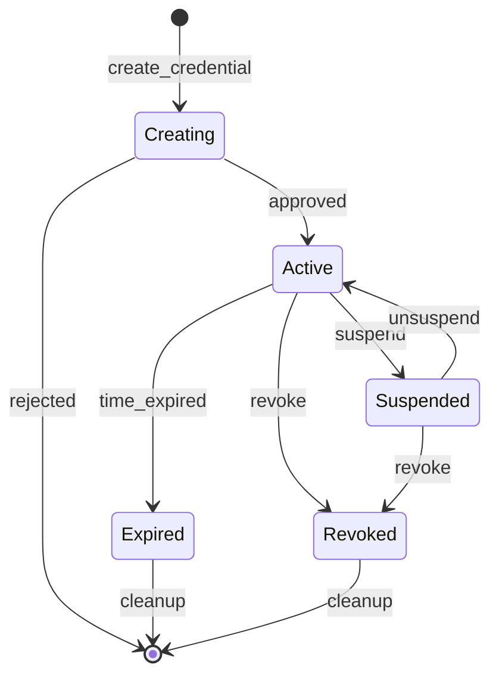
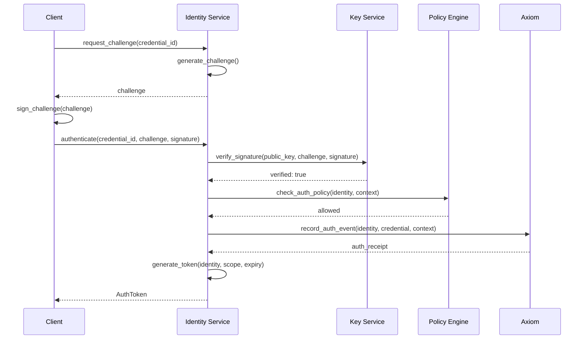
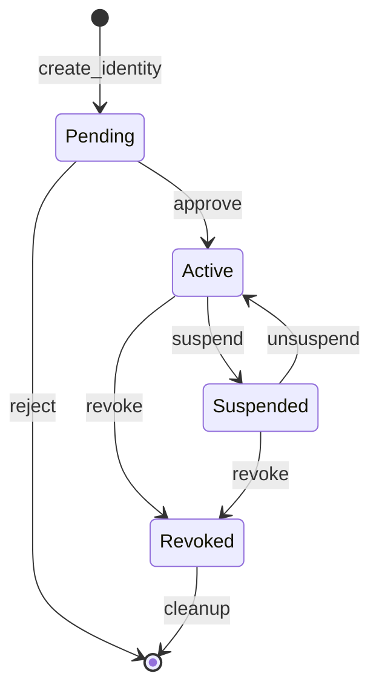
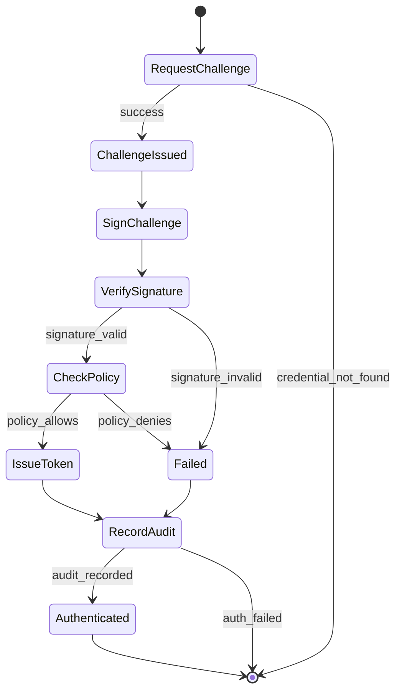

# Identity Service Specification

**Version:** 1.0  
**Status:** Specification  
**Component:** Layer 2 - Core Authority

---

## 1. Overview

The Identity Service manages **cryptographic identities** for all principals in Orbital OS — users, services, nodes, and organizations. Every entity that can act in the system has an identity with associated credentials.

### 1.1 Position in Architecture

| Layer | Component | Relationship |
|-------|-----------|--------------|
| Layer 2 | Axiom | Records all identity events |
| Layer 2 | Policy Engine | Authorizes identity operations |
| **Layer 2** | **Identity Service** | **Manages principals and credentials** |
| Layer 2 | Key Derivation Service | Derives keys for identities |

### 1.2 Responsibilities

| Responsibility | Description |
|----------------|-------------|
| **Identity Management** | Create, suspend, revoke identities |
| **Credential Management** | Add, revoke, validate credentials |
| **Authentication** | Challenge-response authentication flow |
| **Token Issuance** | Issue and validate authentication tokens |
| **Hierarchy Enforcement** | Maintain parent-child identity relationships |

---

## 2. Identity Model

### 2.1 Identity Hierarchy

```
┌─────────────────────────────────────────────────────────────────────┐
│                       IDENTITY HIERARCHY                            │
│                                                                     │
│  Root Identity (System)                                             │
│  ├── System Services                                                │
│  │   ├── orbital.services.axiom                                    │
│  │   ├── orbital.services.policy                                   │
│  │   ├── orbital.services.keys                                     │
│  │   ├── orbital.services.identity                                 │
│  │   ├── orbital.services.filesystem                               │
│  │   └── orbital.services.network                                  │
│  │                                                                 │
│  ├── Nodes                                                          │
│  │   ├── orbital.nodes.node-01                                     │
│  │   └── orbital.nodes.node-02                                     │
│  │                                                                 │
│  └── Organizations                                                  │
│      └── example.org                                               │
│          ├── Users                                                 │
│          │   ├── alice@example.org                                 │
│          │   │   ├── credential: passkey-1                         │
│          │   │   ├── credential: passkey-2 (backup)                │
│          │   │   └── credential: recovery-key                      │
│          │   └── bob@example.org                                   │
│          │       └── credential: passkey-1                         │
│          │                                                         │
│          └── Services                                              │
│              └── api-service@example.org                           │
│                  └── credential: service-key                       │
│                                                                     │
└─────────────────────────────────────────────────────────────────────┘
```

### 2.2 Identity Structure

```rust
/// Unique identity identifier
#[derive(Clone, Debug, PartialEq, Eq, Hash, Serialize, Deserialize)]
pub struct IdentityId(pub [u8; 32]);

impl IdentityId {
    /// Derive from public key
    pub fn from_public_key(public_key: &PublicKey) -> Self {
        Self(blake3::hash(public_key.as_bytes()).into())
    }
}

/// An identity in the system
#[derive(Clone, Debug, Serialize, Deserialize)]
pub struct Identity {
    /// Unique identifier
    pub id: IdentityId,
    
    /// Human-readable name
    pub name: String,
    
    /// Fully qualified name (e.g., "alice@example.org")
    pub fqn: String,
    
    /// Identity type
    pub identity_type: IdentityType,
    
    /// Parent identity
    pub parent: Option<IdentityId>,
    
    /// Key derivation path
    pub key_path: KeyPath,
    
    /// Public key
    pub public_key: PublicKey,
    
    /// Creation record
    pub created_at: AxiomRef,
    
    /// Current status
    pub status: IdentityStatus,
    
    /// Metadata
    pub metadata: IdentityMetadata,
}

#[derive(Clone, Copy, Debug, PartialEq, Eq, Serialize, Deserialize)]
pub enum IdentityType {
    /// System root (only one)
    Root,
    
    /// System service
    SystemService,
    
    /// Physical/virtual node
    Node,
    
    /// Organization (tenant)
    Organization,
    
    /// Human user
    User,
    
    /// Automated service/API
    Service,
    
    /// Device
    Device,
}

#[derive(Clone, Copy, Debug, PartialEq, Eq, Serialize, Deserialize)]
pub enum IdentityStatus {
    /// Active and can authenticate
    Active,
    
    /// Temporarily suspended
    Suspended,
    
    /// Permanently revoked
    Revoked,
    
    /// Pending activation
    Pending,
}

#[derive(Clone, Debug, Serialize, Deserialize)]
pub struct IdentityMetadata {
    /// Display name
    pub display_name: Option<String>,
    
    /// Description
    pub description: Option<String>,
    
    /// Tags for grouping
    pub tags: Vec<String>,
    
    /// Custom attributes
    pub attributes: BTreeMap<String, String>,
}
```

---

## 3. Identity Service Interface

```rust
/// Identity Service interface
pub trait IdentityService {
    /// Create a new identity
    fn create_identity(
        &mut self,
        request: CreateIdentityRequest,
        auth: AuthToken,
    ) -> Result<Identity, IdentityError>;
    
    /// Get identity by ID
    fn get_identity(
        &self,
        id: IdentityId,
    ) -> Result<Identity, IdentityError>;
    
    /// Get identity by fully qualified name
    fn get_identity_by_fqn(
        &self,
        fqn: &str,
    ) -> Result<Identity, IdentityError>;
    
    /// Update identity status
    fn update_status(
        &mut self,
        id: IdentityId,
        new_status: IdentityStatus,
        reason: String,
        auth: AuthToken,
    ) -> Result<(), IdentityError>;
    
    /// List child identities
    fn list_children(
        &self,
        parent_id: IdentityId,
        filter: IdentityFilter,
    ) -> Result<Vec<Identity>, IdentityError>;
    
    /// Add a credential to an identity
    fn add_credential(
        &mut self,
        identity_id: IdentityId,
        credential: CredentialRequest,
        auth: AuthToken,
    ) -> Result<Credential, IdentityError>;
    
    /// Revoke a credential
    fn revoke_credential(
        &mut self,
        credential_id: CredentialId,
        reason: String,
        auth: AuthToken,
    ) -> Result<(), IdentityError>;
    
    /// Authenticate with a credential
    fn authenticate(
        &mut self,
        request: AuthRequest,
    ) -> Result<AuthToken, IdentityError>;
    
    /// Validate an auth token
    fn validate_token(
        &self,
        token: &AuthToken,
    ) -> Result<TokenValidation, IdentityError>;
}
```

---

## 4. Credentials

### 4.1 Credential Types

```rust
/// A credential for authentication
#[derive(Clone, Debug, Serialize, Deserialize)]
pub struct Credential {
    /// Unique credential ID
    pub id: CredentialId,
    
    /// Which identity this belongs to
    pub identity_id: IdentityId,
    
    /// Credential type and data
    pub credential_type: CredentialType,
    
    /// Human-readable name
    pub name: String,
    
    /// When created
    pub created_at: AxiomRef,
    
    /// Last used (updated periodically)
    pub last_used: Option<AxiomRef>,
    
    /// Status
    pub status: CredentialStatus,
}

#[derive(Clone, Debug, Serialize, Deserialize)]
pub enum CredentialType {
    /// WebAuthn/FIDO2 passkey
    Passkey(PasskeyCredential),
    
    /// Recovery key (for account recovery)
    RecoveryKey(RecoveryKeyCredential),
    
    /// API key (for service authentication)
    ApiKey(ApiKeyCredential),
    
    /// Derived key (for services)
    DerivedKey(DerivedKeyCredential),
    
    /// Certificate (X.509)
    Certificate(CertificateCredential),
}

#[derive(Clone, Debug, Serialize, Deserialize)]
pub struct PasskeyCredential {
    /// AAGUID (Authenticator Attestation GUID)
    pub aaguid: [u8; 16],
    
    /// Credential public key
    pub public_key: PublicKey,
    
    /// Signature counter (for clone detection)
    pub sign_count: u32,
    
    /// Transports (usb, nfc, ble, internal)
    pub transports: Vec<String>,
    
    /// User verification required
    pub user_verification: bool,
}

#[derive(Clone, Debug, Serialize, Deserialize)]
pub struct RecoveryKeyCredential {
    /// Hash of the recovery key
    pub key_hash: Hash,
    
    /// Has this been used?
    pub used: bool,
    
    /// Expires after first use?
    pub single_use: bool,
}

#[derive(Clone, Debug, Serialize, Deserialize)]
pub struct ApiKeyCredential {
    /// Hash of the API key
    pub key_hash: Hash,
    
    /// Permissions (scopes)
    pub permissions: Vec<String>,
    
    /// Expiration
    pub expires_at: Option<AxiomTime>,
    
    /// Rate limit
    pub rate_limit: Option<RateLimit>,
}

#[derive(Clone, Debug, Serialize, Deserialize)]
pub struct DerivedKeyCredential {
    /// Key derivation path
    pub key_path: KeyPath,
    
    /// Public key (derived from path)
    pub public_key: PublicKey,
}

#[derive(Clone, Debug, Serialize, Deserialize)]
pub struct CertificateCredential {
    /// X.509 certificate (DER encoded)
    pub certificate: Vec<u8>,
    
    /// Subject
    pub subject: String,
    
    /// Issuer
    pub issuer: String,
    
    /// Validity
    pub not_before: AxiomTime,
    pub not_after: AxiomTime,
}

#[derive(Clone, Copy, Debug, PartialEq, Eq, Serialize, Deserialize)]
pub enum CredentialStatus {
    Active,
    Suspended,
    Revoked,
    Expired,
}
```

### 4.2 Credential Lifecycle



---

## 5. Authentication

### 5.1 Authentication Flow



### 5.2 Challenge-Response Protocol

```rust
/// Authentication challenge
#[derive(Clone, Debug, Serialize, Deserialize)]
pub struct Challenge {
    /// Challenge ID
    pub id: ChallengeId,
    
    /// Random bytes to sign
    pub nonce: [u8; 32],
    
    /// When created
    pub created_at: Timestamp,
    
    /// When expires
    pub expires_at: Timestamp,
    
    /// Credential this is for
    pub credential_id: CredentialId,
    
    /// Origin (for WebAuthn)
    pub origin: Option<String>,
}

/// Authentication request
#[derive(Clone, Debug, Serialize, Deserialize)]
pub struct AuthRequest {
    /// Challenge being responded to
    pub challenge_id: ChallengeId,
    
    /// Credential used
    pub credential_id: CredentialId,
    
    /// Proof of possession
    pub proof: AuthProof,
    
    /// Client metadata
    pub client_data: ClientData,
}

#[derive(Clone, Debug, Serialize, Deserialize)]
pub enum AuthProof {
    /// Ed25519 signature over challenge
    Ed25519Signature(Signature),
    
    /// WebAuthn assertion
    WebAuthn {
        authenticator_data: Vec<u8>,
        client_data_json: Vec<u8>,
        signature: Vec<u8>,
    },
    
    /// HMAC for API keys
    HmacSha256(Hash),
}
```

### 5.3 Authentication Token

```rust
/// Authentication token
#[derive(Clone, Debug, Serialize, Deserialize)]
pub struct AuthToken {
    /// Token ID
    pub id: TokenId,
    
    /// Authenticated identity
    pub identity_id: IdentityId,
    
    /// Credential used
    pub credential_id: CredentialId,
    
    /// When issued
    pub issued_at: AxiomTime,
    
    /// When expires
    pub expires_at: AxiomTime,
    
    /// Scope (what this token allows)
    pub scope: TokenScope,
    
    /// Axiom reference for auth event
    pub auth_ref: AxiomRef,
    
    /// Token signature (by Identity Service)
    pub signature: Signature,
}

#[derive(Clone, Debug, Serialize, Deserialize)]
pub struct TokenScope {
    /// Allowed actions
    pub actions: Vec<String>,
    
    /// Allowed resources (patterns)
    pub resources: Vec<String>,
    
    /// Additional restrictions
    pub restrictions: Vec<TokenRestriction>,
}

#[derive(Clone, Debug, Serialize, Deserialize)]
pub enum TokenRestriction {
    /// Only valid from these IP addresses
    IpAllowList(Vec<String>),
    
    /// Rate limit
    RateLimit(RateLimit),
    
    /// Only valid for specific operations
    OperationList(Vec<String>),
}
```

---

## 6. Policy Integration

### 6.1 Identity-Related Policies

```rust
/// Policy rules for identity operations
pub enum IdentityPolicyRule {
    /// Who can create identities
    CreateIdentity {
        parent_pattern: IdentityPattern,
        child_type: IdentityType,
        allowed_by: IdentityPattern,
    },
    
    /// Who can add credentials
    AddCredential {
        identity_pattern: IdentityPattern,
        credential_type: CredentialType,
        allowed_by: IdentityPattern,
    },
    
    /// Who can revoke credentials
    RevokeCredential {
        identity_pattern: IdentityPattern,
        allowed_by: IdentityPattern,
    },
    
    /// Who can suspend/unsuspend
    ModifyStatus {
        identity_pattern: IdentityPattern,
        allowed_by: IdentityPattern,
    },
}
```

### 6.2 Default Policies

```rust
/// Default identity policies
pub fn default_identity_policies() -> Vec<PolicyRule> {
    vec![
        // System can create any identity
        PolicyRule::identity(IdentityPolicyRule::CreateIdentity {
            parent_pattern: IdentityPattern::Any,
            child_type: IdentityType::Any,
            allowed_by: IdentityPattern::System,
        }),
        
        // Organization admins can create users
        PolicyRule::identity(IdentityPolicyRule::CreateIdentity {
            parent_pattern: IdentityPattern::Type(IdentityType::Organization),
            child_type: IdentityType::User,
            allowed_by: IdentityPattern::OrgAdmin,
        }),
        
        // Users can add their own credentials
        PolicyRule::identity(IdentityPolicyRule::AddCredential {
            identity_pattern: IdentityPattern::Self_,
            credential_type: CredentialType::Any,
            allowed_by: IdentityPattern::Self_,
        }),
    ]
}
```

---

## 7. Axiom Integration

### 7.1 Identity Events

```rust
/// Axiom entry types for identity operations
#[derive(Clone, Debug, Serialize, Deserialize)]
pub enum IdentityAxiomEntry {
    /// Identity created
    IdentityCreated {
        identity: Identity,
        created_by: IdentityId,
    },
    
    /// Identity status changed
    IdentityStatusChanged {
        identity_id: IdentityId,
        old_status: IdentityStatus,
        new_status: IdentityStatus,
        changed_by: IdentityId,
        reason: String,
    },
    
    /// Credential added
    CredentialAdded {
        identity_id: IdentityId,
        credential: Credential,
        added_by: IdentityId,
    },
    
    /// Credential revoked
    CredentialRevoked {
        identity_id: IdentityId,
        credential_id: CredentialId,
        revoked_by: IdentityId,
        reason: String,
    },
    
    /// Authentication occurred
    AuthenticationEvent {
        identity_id: IdentityId,
        credential_id: CredentialId,
        success: bool,
        client_info: ClientInfo,
    },
}
```

---

## 8. State Machine Diagrams

### 8.1 Identity Lifecycle



### 8.2 Authentication Flow



---

*[← Key Derivation Service](03-keys.md) | [Capability Service →](../03-capability/01-capabilities.md)*
