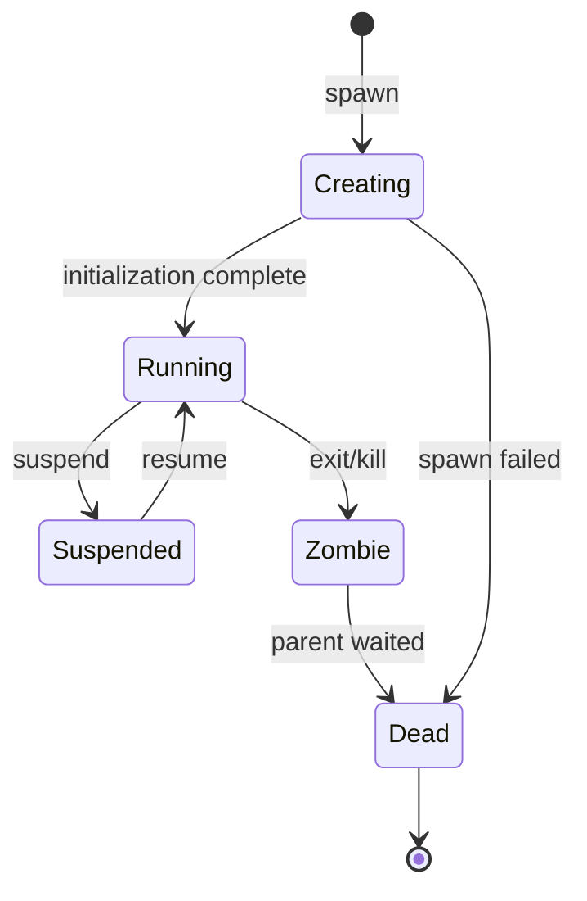
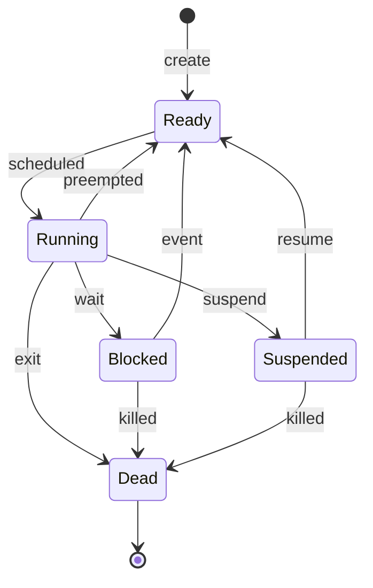

# Processes and Scheduling Specification

**Version:** 1.0  
**Status:** Specification  
**Component:** Kernel

---

## 1. Overview

This specification defines the process model, thread model, and scheduling behavior for Orbital OS. The scheduler is explicitly nondeterministic — scheduling order does not affect system correctness.

---

## 2. Process Model

### 2.1 Process Definition

A process is an isolated execution context consisting of:

| Component | Description |
|-----------|-------------|
| Address space | Virtual memory mapping |
| Capability space | Held capabilities |
| Threads | One or more execution threads |
| Resource limits | CPU, memory, I/O constraints |

### 2.2 Process Structure

```rust
/// Complete process descriptor
pub struct Process {
    /// Unique process identifier
    pub pid: ProcessId,
    
    /// Human-readable name (debugging)
    pub name: String,
    
    /// Parent process (None for init)
    pub parent: Option<ProcessId>,
    
    /// Address space
    pub address_space: AddressSpaceId,
    
    /// Capability space
    pub cap_space: CapabilitySpaceId,
    
    /// Threads owned by this process
    pub threads: Vec<ThreadId>,
    
    /// Process state
    pub state: ProcessState,
    
    /// Resource limits
    pub limits: ResourceLimits,
    
    /// Accumulated resource usage
    pub usage: ResourceUsage,
    
    /// Exit status (when zombie)
    pub exit_status: Option<ExitStatus>,
    
    /// Creation timestamp
    pub created_at: Timestamp,
}

/// Process identifier
#[derive(Clone, Copy, Debug, PartialEq, Eq, Hash)]
pub struct ProcessId(pub u64);

/// Process lifecycle state
#[derive(Clone, Copy, Debug, PartialEq, Eq)]
pub enum ProcessState {
    /// Process is being created
    Creating,
    
    /// Process is active (has runnable threads)
    Running,
    
    /// All threads suspended
    Suspended,
    
    /// Process has exited, awaiting cleanup
    Zombie,
    
    /// Process fully cleaned up
    Dead,
}
```

### 2.3 Process Lifecycle



### 2.4 Process Creation

```rust
/// Process creation parameters
pub struct ProcessCreateParams {
    /// Executable image hash
    pub image: Hash,
    
    /// Initial capabilities to grant
    pub capabilities: Vec<CapabilityGrant>,
    
    /// Resource limits
    pub limits: ResourceLimits,
    
    /// Command-line arguments
    pub args: Vec<String>,
    
    /// Environment variables
    pub env: Vec<(String, String)>,
    
    /// Initial working directory
    pub cwd: PathBuf,
}

impl ProcessManager {
    /// Create a new process
    pub fn spawn(
        &mut self,
        parent: ProcessId,
        params: ProcessCreateParams,
    ) -> Result<ProcessId, SpawnError> {
        // Validate parent can spawn
        self.check_spawn_capability(parent)?;
        
        // Check resource limits
        self.check_resource_availability(&params.limits)?;
        
        // Create address space
        let address_space = self.create_address_space()?;
        
        // Load executable
        self.load_executable(address_space, &params.image)?;
        
        // Create capability space with initial caps
        let cap_space = self.create_cap_space(&params.capabilities)?;
        
        // Create process
        let pid = self.next_pid();
        let process = Process {
            pid,
            name: params.image.short_name(),
            parent: Some(parent),
            address_space,
            cap_space,
            threads: vec![],
            state: ProcessState::Creating,
            limits: params.limits,
            usage: ResourceUsage::default(),
            exit_status: None,
            created_at: Timestamp::now(),
        };
        
        self.processes.insert(pid, process);
        
        // Create main thread
        let tid = self.create_thread(pid, ThreadCreateParams::main())?;
        
        // Mark as running
        self.processes.get_mut(&pid).unwrap().state = ProcessState::Running;
        
        Ok(pid)
    }
}
```

---

## 3. Thread Model

### 3.1 Thread Definition

A thread is a single execution context within a process:

| Component | Description |
|-----------|-------------|
| Thread ID | Unique identifier |
| CPU state | Registers, flags |
| Stack | Per-thread stack |
| TLS | Thread-local storage |
| Priority | Scheduling priority |

### 3.2 Thread Structure

```rust
/// Complete thread descriptor
pub struct Thread {
    /// Unique thread identifier
    pub tid: ThreadId,
    
    /// Owning process
    pub process: ProcessId,
    
    /// Thread state
    pub state: ThreadState,
    
    /// Saved CPU context
    pub context: CpuContext,
    
    /// Kernel stack (for syscalls)
    pub kernel_stack: VirtualAddress,
    
    /// User stack
    pub user_stack: VirtualAddress,
    
    /// Thread-local storage base
    pub tls_base: VirtualAddress,
    
    /// Current priority
    pub priority: Priority,
    
    /// Base priority (reverts to this after boost)
    pub base_priority: Priority,
    
    /// CPU affinity mask
    pub affinity: CpuMask,
    
    /// Time slice remaining (nanoseconds)
    pub time_remaining: u64,
    
    /// Total CPU time used
    pub cpu_time: u64,
    
    /// Creation timestamp
    pub created_at: Timestamp,
}

/// Thread identifier
#[derive(Clone, Copy, Debug, PartialEq, Eq, Hash)]
pub struct ThreadId(pub u64);

/// Thread lifecycle state
#[derive(Clone, Copy, Debug, PartialEq, Eq)]
pub enum ThreadState {
    /// Ready to run, in run queue
    Ready,
    
    /// Currently executing on a CPU
    Running { cpu: CpuId },
    
    /// Blocked, waiting for event
    Blocked { reason: BlockReason },
    
    /// Suspended by explicit request
    Suspended,
    
    /// Thread has exited
    Dead,
}

/// Why a thread is blocked
#[derive(Clone, Copy, Debug, PartialEq, Eq)]
pub enum BlockReason {
    /// Waiting to receive IPC
    IpcReceive { endpoint: EndpointId },
    
    /// Waiting for IPC reply
    IpcReply { from: ThreadId },
    
    /// Waiting for notification
    Notification { mask: u64 },
    
    /// Waiting for mutex
    Mutex { mutex: MutexId },
    
    /// Sleeping for duration
    Sleep { until: Timestamp },
    
    /// Waiting for page fault resolution
    PageFault { address: VirtualAddress },
}

/// CPU context (x86_64)
#[repr(C)]
#[derive(Clone, Debug, Default)]
pub struct CpuContext {
    // General purpose registers
    pub rax: u64,
    pub rbx: u64,
    pub rcx: u64,
    pub rdx: u64,
    pub rsi: u64,
    pub rdi: u64,
    pub rbp: u64,
    pub rsp: u64,
    pub r8: u64,
    pub r9: u64,
    pub r10: u64,
    pub r11: u64,
    pub r12: u64,
    pub r13: u64,
    pub r14: u64,
    pub r15: u64,
    
    // Instruction pointer and flags
    pub rip: u64,
    pub rflags: u64,
    
    // Segment selectors
    pub cs: u64,
    pub ss: u64,
    
    // FPU/SSE state (stored separately for efficiency)
    pub fpu_state: Option<Box<FpuState>>,
}
```

### 3.3 Thread Lifecycle



---

## 4. Priority Model

### 4.1 Priority Levels

```rust
/// Thread priority (0 = highest, 31 = lowest)
#[derive(Clone, Copy, Debug, PartialEq, Eq, PartialOrd, Ord)]
pub struct Priority(pub u8);

impl Priority {
    /// Highest priority (kernel threads, drivers)
    pub const CRITICAL: Priority = Priority(0);
    
    /// High priority (system services)
    pub const HIGH: Priority = Priority(8);
    
    /// Normal priority (user applications)
    pub const NORMAL: Priority = Priority(16);
    
    /// Low priority (background tasks)
    pub const LOW: Priority = Priority(24);
    
    /// Lowest priority (idle work)
    pub const IDLE: Priority = Priority(31);
}
```

### 4.2 Priority Rules

| Rule | Description |
|------|-------------|
| Static base | Each thread has a base priority |
| Temporary boost | Priority can be boosted temporarily |
| No inversion | Priority inheritance for mutex holders |
| Decay | Boost decays over time |

---

## 5. Scheduler Specification

### 5.1 Scheduler Properties

| Property | Value |
|----------|-------|
| Algorithm | Multi-level feedback queue |
| Time slice | 10ms (default) |
| Priority levels | 32 |
| Load balancing | Work stealing |
| Preemption | Always enabled |

### 5.2 Per-CPU State

```rust
/// Per-CPU scheduler state
pub struct CpuScheduler {
    /// CPU identifier
    pub cpu_id: CpuId,
    
    /// Run queues (one per priority level)
    pub run_queues: [RunQueue; 32],
    
    /// Currently running thread
    pub current: Option<ThreadId>,
    
    /// Idle thread for this CPU
    pub idle_thread: ThreadId,
    
    /// Scheduler lock
    pub lock: SpinLock,
    
    /// Statistics
    pub stats: SchedulerStats,
}

/// A single priority run queue
pub struct RunQueue {
    /// Threads ready to run
    pub threads: VecDeque<ThreadId>,
    
    /// Time slice for this priority
    pub time_slice: u64,
}
```

### 5.3 Scheduling Algorithm

```rust
impl CpuScheduler {
    /// Select next thread to run
    pub fn pick_next(&mut self) -> ThreadId {
        let _guard = self.lock.lock();
        
        // Scan from highest to lowest priority
        for priority in 0..32 {
            if let Some(thread) = self.run_queues[priority].threads.pop_front() {
                return thread;
            }
        }
        
        // No runnable threads — return idle
        self.idle_thread
    }
    
    /// Add thread to run queue
    pub fn enqueue(&mut self, tid: ThreadId, priority: Priority) {
        let _guard = self.lock.lock();
        self.run_queues[priority.0 as usize].threads.push_back(tid);
    }
    
    /// Timer tick handler
    pub fn tick(&mut self, kernel: &mut Kernel) {
        if let Some(current) = self.current {
            let thread = kernel.threads.get_mut(&current).unwrap();
            
            // Decrement time slice
            thread.time_remaining = thread.time_remaining.saturating_sub(TICK_NS);
            
            if thread.time_remaining == 0 {
                // Time slice expired — preempt
                self.preempt(kernel);
            }
        }
    }
    
    /// Preempt current thread
    pub fn preempt(&mut self, kernel: &mut Kernel) {
        if let Some(current) = self.current.take() {
            let thread = kernel.threads.get_mut(&current).unwrap();
            
            // Reset time slice
            thread.time_remaining = self.run_queues[thread.priority.0 as usize].time_slice;
            
            // Re-enqueue
            thread.state = ThreadState::Ready;
            self.enqueue(current, thread.priority);
            
            // Pick next
            let next = self.pick_next();
            self.switch_to(next, kernel);
        }
    }
}
```

### 5.4 Context Switch

```rust
impl CpuScheduler {
    /// Switch to a different thread
    pub fn switch_to(&mut self, next: ThreadId, kernel: &mut Kernel) {
        if Some(next) == self.current {
            return; // Already running
        }
        
        let prev = self.current.take();
        self.current = Some(next);
        
        // Save previous context
        if let Some(prev_tid) = prev {
            let prev_thread = kernel.threads.get_mut(&prev_tid).unwrap();
            prev_thread.context = self.save_context();
        }
        
        // Load next context
        let next_thread = kernel.threads.get_mut(&next).unwrap();
        next_thread.state = ThreadState::Running { cpu: self.cpu_id };
        
        // Switch address space if different process
        if let Some(prev_tid) = prev {
            let prev_process = kernel.threads.get(&prev_tid).unwrap().process;
            let next_process = next_thread.process;
            
            if prev_process != next_process {
                let address_space = kernel.processes.get(&next_process)
                    .unwrap().address_space;
                self.switch_address_space(address_space, kernel);
            }
        }
        
        // Restore context
        self.restore_context(&next_thread.context);
    }
}
```

### 5.5 Load Balancing

```rust
impl Scheduler {
    /// Balance load across CPUs (called periodically)
    pub fn balance_load(&mut self) {
        let cpu_count = self.cpus.len();
        
        // Calculate load per CPU
        let loads: Vec<usize> = self.cpus.iter()
            .map(|cpu| cpu.total_threads())
            .collect();
        
        let avg_load = loads.iter().sum::<usize>() / cpu_count;
        
        // Find overloaded and underloaded CPUs
        for i in 0..cpu_count {
            if loads[i] > avg_load + BALANCE_THRESHOLD {
                // This CPU is overloaded — steal threads
                for j in 0..cpu_count {
                    if i != j && loads[j] < avg_load - BALANCE_THRESHOLD {
                        self.migrate_thread(i, j);
                    }
                }
            }
        }
    }
    
    /// Migrate a thread from one CPU to another
    fn migrate_thread(&mut self, from: usize, to: usize) {
        let from_cpu = &mut self.cpus[from];
        
        // Find a thread to migrate (prefer lower priority)
        for priority in (0..32).rev() {
            if let Some(tid) = from_cpu.run_queues[priority].threads.pop_back() {
                // Migrate
                let to_cpu = &mut self.cpus[to];
                to_cpu.run_queues[priority].threads.push_back(tid);
                return;
            }
        }
    }
}
```

---

## 6. Resource Limits

### 6.1 Limit Types

```rust
/// Resource limits for a process
#[derive(Clone, Debug)]
pub struct ResourceLimits {
    /// Maximum CPU time (nanoseconds, 0 = unlimited)
    pub cpu_time: u64,
    
    /// Maximum memory (bytes)
    pub memory: usize,
    
    /// Maximum threads
    pub threads: u32,
    
    /// Maximum open capabilities
    pub capabilities: u32,
    
    /// Maximum file descriptors
    pub files: u32,
    
    /// I/O bandwidth limit (bytes/second, 0 = unlimited)
    pub io_bandwidth: u64,
}

/// Resource usage tracking
#[derive(Clone, Debug, Default)]
pub struct ResourceUsage {
    /// Total CPU time used
    pub cpu_time: u64,
    
    /// Current memory usage
    pub memory: usize,
    
    /// Peak memory usage
    pub peak_memory: usize,
    
    /// Current thread count
    pub threads: u32,
    
    /// Total I/O bytes
    pub io_bytes: u64,
}
```

### 6.2 Limit Enforcement

```rust
impl ProcessManager {
    /// Check if operation would exceed limits
    pub fn check_limit(
        &self,
        pid: ProcessId,
        resource: ResourceType,
        amount: u64,
    ) -> Result<(), LimitError> {
        let process = self.processes.get(&pid)
            .ok_or(LimitError::InvalidProcess)?;
        
        match resource {
            ResourceType::Memory => {
                let new_usage = process.usage.memory as u64 + amount;
                if new_usage > process.limits.memory as u64 {
                    return Err(LimitError::MemoryExceeded);
                }
            }
            ResourceType::Threads => {
                if process.usage.threads as u64 + amount > process.limits.threads as u64 {
                    return Err(LimitError::ThreadsExceeded);
                }
            }
            ResourceType::CpuTime => {
                if process.limits.cpu_time > 0 &&
                   process.usage.cpu_time + amount > process.limits.cpu_time {
                    return Err(LimitError::CpuTimeExceeded);
                }
            }
            _ => {}
        }
        
        Ok(())
    }
}
```

---

## 7. Nondeterminism Statement

The scheduler is explicitly **nondeterministic**:

| Aspect | Nondeterministic? | Rationale |
|--------|-------------------|-----------|
| Thread execution order | Yes | Performance |
| Time slice boundaries | Yes | Hardware timing |
| CPU assignment | Yes | Load balancing |
| Interrupt timing | Yes | Hardware |
| Cache behavior | Yes | Hardware |

This nondeterminism is **acceptable** because:
1. Authority is determined by the Axiom, not execution order
2. Applications produce proposals, which are ordered by the sequencer
3. Verification uses committed inputs, not execution traces

---

## 8. Implementation Notes

### 8.1 Stack Sizes

| Stack Type | Size |
|------------|------|
| User stack | 1 MB (default) |
| Kernel stack | 16 KB |
| Guard pages | 4 KB |

### 8.2 Thread Limits

| Limit | Value |
|-------|-------|
| Max threads per process | 1024 (default) |
| Max total threads | 65536 |
| Thread ID range | 1 to 2^63 |

---

*[← Kernel Specification](01-kernel.md) | [Userland Services →](03-userland-services.md)*
