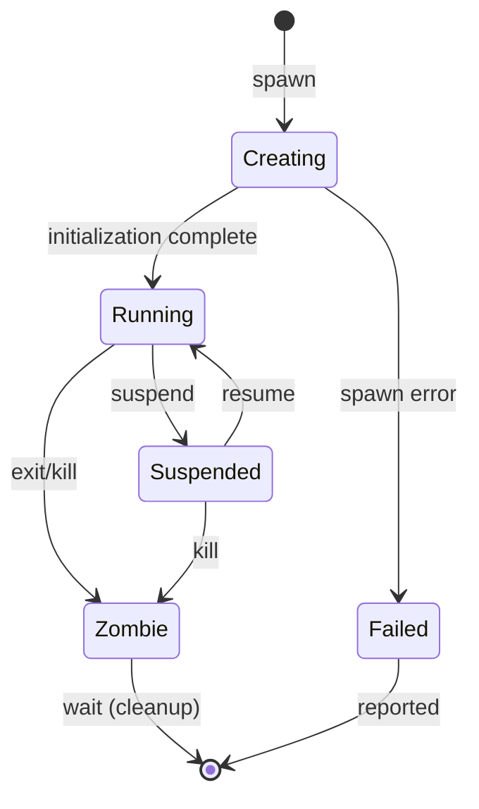

# Process Manager Specification

**Version:** 1.0  
**Status:** Specification  
**Component:** Layer 3 - Process & Capability

---

## 1. Overview

The Process Manager handles **process lifecycle** — spawning, monitoring, suspending, resuming, and terminating processes. All operations require policy authorization and are recorded in the Axiom.

### 1.1 Position in Architecture

| Layer | Component | Relationship |
|-------|-----------|--------------|
| Layer 0 | Kernel | Provides low-level process primitives |
| Layer 2 | Policy Engine | Authorizes process operations |
| Layer 2 | Axiom | Records all process events |
| Layer 3 | Capability Service | Grants capabilities to new processes |
| **Layer 3** | **Process Manager** | **Creates/manages processes** |

### 1.2 Responsibilities

| Responsibility | Description |
|----------------|-------------|
| **Process Creation** | Spawn new processes with specified image and capabilities |
| **Resource Management** | Enforce resource limits (memory, CPU, I/O) |
| **Lifecycle Management** | Suspend, resume, terminate processes |
| **Event Recording** | Record all process events in Axiom |

---

## 2. Process Manager Interface

```rust
/// Process Manager interface
pub trait ProcessManagerService {
    /// Spawn a new process
    fn spawn(
        &mut self,
        request: SpawnRequest,
        auth: AuthToken,
    ) -> Result<SpawnResponse, SpawnError>;
    
    /// Kill a process
    fn kill(
        &mut self,
        pid: ProcessId,
        signal: Signal,
        auth: AuthToken,
    ) -> Result<(), KillError>;
    
    /// Get process info
    fn get_info(&self, pid: ProcessId) -> Result<ProcessInfo, ProcessError>;
    
    /// List processes
    fn list(&self, filter: ProcessFilter) -> Vec<ProcessInfo>;
    
    /// Wait for process exit
    fn wait(&mut self, pid: ProcessId) -> Result<ExitStatus, WaitError>;
    
    /// Suspend a process
    fn suspend(&mut self, pid: ProcessId, auth: AuthToken) -> Result<(), ProcessError>;
    
    /// Resume a suspended process
    fn resume(&mut self, pid: ProcessId, auth: AuthToken) -> Result<(), ProcessError>;
}
```

---

## 3. Spawn Request

```rust
#[derive(Clone, Debug, Serialize, Deserialize)]
pub struct SpawnRequest {
    /// Image to run (content-addressed)
    pub image: ContentHash,
    
    /// Command-line arguments
    pub args: Vec<String>,
    
    /// Environment variables
    pub env: Vec<(String, String)>,
    
    /// Capabilities to grant to process
    pub capabilities: Vec<CapabilityGrant>,
    
    /// Resource limits
    pub resource_limits: ResourceLimits,
    
    /// Identity to run as
    pub identity: IdentityId,
    
    /// Working directory
    pub cwd: Option<PathBuf>,
    
    /// Priority
    pub priority: Priority,
}

#[derive(Clone, Debug, Serialize, Deserialize)]
pub struct SpawnResponse {
    /// Process ID
    pub pid: ProcessId,
    
    /// Main thread ID
    pub tid: ThreadId,
    
    /// Axiom entry for process creation
    pub axiom_ref: AxiomRef,
}

#[derive(Clone, Debug, Serialize, Deserialize)]
pub struct CapabilityGrant {
    /// Capability ID
    pub id: CapabilityId,
    
    /// Resource being granted
    pub resource: ResourceId,
    
    /// Permissions
    pub permissions: Permissions,
    
    /// Restrictions
    pub restrictions: Option<Restrictions>,
}
```

---

## 4. Process Creation Flow

```rust
impl ProcessManager {
    fn spawn(
        &mut self,
        request: SpawnRequest,
        auth: AuthToken,
    ) -> Result<SpawnResponse, SpawnError> {
        // 1. Request policy authorization
        let decision = self.policy_engine.evaluate(PolicyRequest {
            requestor: auth.identity,
            action: PolicyAction::CreateProcess {
                image: request.image,
            },
            ..Default::default()
        })?;
        
        if !decision.is_allowed() {
            return Err(SpawnError::PolicyDenied(decision));
        }
        
        // 2. Verify image exists and is valid
        let image = self.content_store.get(&request.image)?;
        self.verify_executable(&image)?;
        
        // 3. Check resource availability
        self.check_resources(&request.resource_limits)?;
        
        // 4. Create process via kernel
        let pid = self.kernel.create_process(
            &image,
            &request.args,
            &request.env,
            &request.resource_limits,
        )?;
        
        // 5. Grant capabilities to new process
        for cap_grant in &request.capabilities {
            self.capability_service.grant(CapabilityGrantRequest {
                resource: cap_grant.resource,
                permissions: cap_grant.permissions,
                grantee: request.identity,
                restrictions: cap_grant.restrictions.clone(),
                expires_at: None,
            }, auth.clone())?;
        }
        
        // 6. Record in Axiom
        let axiom_ref = self.axiom.submit(AxiomEntry::ProcessCreate {
            pid,
            image: request.image,
            identity: request.identity,
            capabilities: request.capabilities.iter().map(|c| c.id).collect(),
        })?;
        
        // 7. Start process
        self.kernel.start_process(pid)?;
        
        Ok(SpawnResponse {
            pid,
            tid: self.kernel.main_thread(pid)?,
            axiom_ref,
        })
    }
}
```

---

## 5. Process Lifecycle



---

## 6. Resource Limits

```rust
/// Resource limits for a process
#[derive(Clone, Debug, Serialize, Deserialize)]
pub struct ResourceLimits {
    /// Maximum CPU time (nanoseconds, 0 = unlimited)
    pub cpu_time: u64,
    
    /// Maximum memory (bytes)
    pub memory: usize,
    
    /// Maximum threads
    pub threads: u32,
    
    /// Maximum open capabilities
    pub capabilities: u32,
    
    /// Maximum file descriptors
    pub files: u32,
    
    /// I/O bandwidth limit (bytes/second, 0 = unlimited)
    pub io_bandwidth: u64,
    
    /// Network bandwidth limit
    pub net_bandwidth: u64,
}

impl Default for ResourceLimits {
    fn default() -> Self {
        Self {
            cpu_time: 0,              // Unlimited
            memory: 256 * 1024 * 1024, // 256 MB
            threads: 64,
            capabilities: 256,
            files: 256,
            io_bandwidth: 0,          // Unlimited
            net_bandwidth: 0,         // Unlimited
        }
    }
}
```

---

## 7. Kill/Signal

```rust
impl ProcessManager {
    fn kill(
        &mut self,
        pid: ProcessId,
        signal: Signal,
        auth: AuthToken,
    ) -> Result<(), KillError> {
        // 1. Get process info
        let process = self.get_info(pid)?;
        
        // 2. Check authorization
        let decision = self.policy_engine.evaluate(PolicyRequest {
            requestor: auth.identity,
            action: PolicyAction::TerminateProcess { pid },
            ..Default::default()
        })?;
        
        if !decision.is_allowed() {
            return Err(KillError::PolicyDenied(decision));
        }
        
        // 3. Send signal via kernel
        self.kernel.signal(pid, signal)?;
        
        // 4. Record in Axiom
        self.axiom.submit(AxiomEntry::ProcessKill {
            pid,
            signal,
            by: auth.identity,
            reason: "User request".to_string(),
        })?;
        
        Ok(())
    }
}

#[derive(Clone, Copy, Debug, PartialEq, Eq, Serialize, Deserialize)]
pub enum Signal {
    /// Terminate gracefully
    Term,
    
    /// Terminate immediately
    Kill,
    
    /// Stop (suspend)
    Stop,
    
    /// Continue (resume)
    Cont,
    
    /// User-defined
    User1,
    User2,
}
```

---

## 8. Process Information

```rust
#[derive(Clone, Debug, Serialize, Deserialize)]
pub struct ProcessInfo {
    /// Process ID
    pub pid: ProcessId,
    
    /// Parent process ID
    pub parent_pid: Option<ProcessId>,
    
    /// Identity running as
    pub identity: IdentityId,
    
    /// Current state
    pub state: ProcessState,
    
    /// Image hash
    pub image: ContentHash,
    
    /// Creation time (Axiom reference)
    pub created_at: AxiomRef,
    
    /// Resource usage
    pub resource_usage: ResourceUsage,
    
    /// Thread count
    pub thread_count: u32,
}

#[derive(Clone, Copy, Debug, PartialEq, Eq, Serialize, Deserialize)]
pub enum ProcessState {
    Creating,
    Running,
    Suspended,
    Zombie,
}

#[derive(Clone, Debug, Serialize, Deserialize)]
pub struct ResourceUsage {
    /// CPU time used (nanoseconds)
    pub cpu_time: u64,
    
    /// Current memory usage (bytes)
    pub memory: usize,
    
    /// Peak memory usage
    pub memory_peak: usize,
    
    /// I/O bytes read
    pub io_read: u64,
    
    /// I/O bytes written
    pub io_write: u64,
}
```

---

## 9. Axiom Integration

### 9.1 Process Events

```rust
/// Axiom entry types for process operations
#[derive(Clone, Debug, Serialize, Deserialize)]
pub enum ProcessAxiomEntry {
    /// Process created
    ProcessCreate {
        pid: ProcessId,
        image: ContentHash,
        identity: IdentityId,
        capabilities: Vec<CapabilityId>,
        resource_limits: ResourceLimits,
        created_by: IdentityId,
    },
    
    /// Process state changed
    ProcessStateChange {
        pid: ProcessId,
        old_state: ProcessState,
        new_state: ProcessState,
        changed_by: Option<IdentityId>,
        reason: String,
    },
    
    /// Process killed
    ProcessKill {
        pid: ProcessId,
        signal: Signal,
        by: IdentityId,
        reason: String,
    },
    
    /// Process exited
    ProcessExit {
        pid: ProcessId,
        exit_code: i32,
        resource_usage: ResourceUsage,
    },
}
```

---

## 10. Implementation Notes

### 10.1 Kernel Integration

The Process Manager is a user-space service that uses kernel syscalls:

| Kernel Syscall | Process Manager Use |
|----------------|---------------------|
| `sys_process_create` | Create new process |
| `sys_process_start` | Start process execution |
| `sys_process_signal` | Send signal to process |
| `sys_process_wait` | Wait for process exit |
| `sys_process_info` | Get process information |

### 10.2 Performance Targets

| Operation | Target Latency |
|-----------|----------------|
| Process spawn | < 10ms (includes image load) |
| Process kill | < 1ms |
| Process info | < 100μs |

### 10.3 Security Properties

| Property | Guarantee |
|----------|-----------|
| **Policy-gated** | All spawn/kill requires policy authorization |
| **Capability-bound** | Processes only hold granted capabilities |
| **Resource-limited** | Processes cannot exceed resource limits |
| **Auditable** | All process events recorded in Axiom |

---

*[← Capability Service](01-capabilities.md) | [Filesystem →](../04-storage/01-filesystem.md)*
