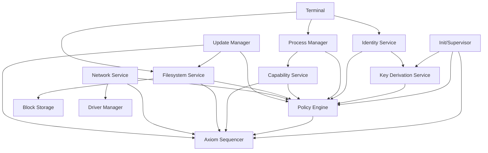
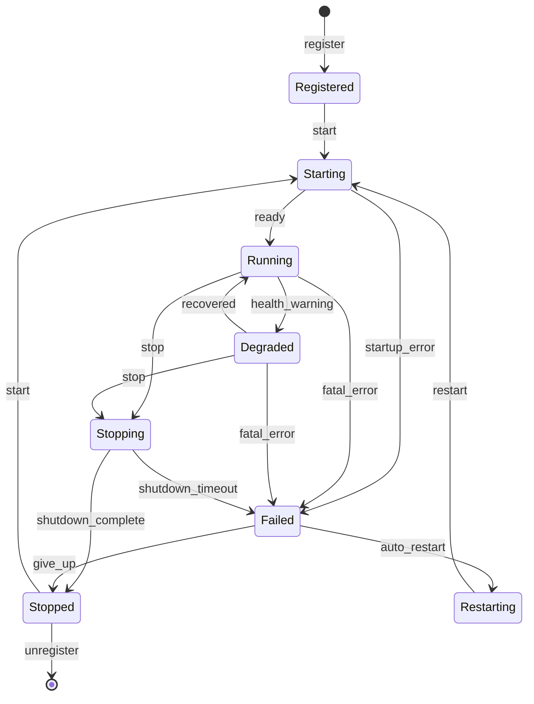

# Userland Services Specification

**Version:** 1.0  
**Status:** Specification  
**Component:** OS Services Layer

---

## 1. Overview

Orbital OS is composed of userland services communicating via IPC. Each service runs as a separate process with isolated address space and explicit capabilities.

---

## 2. Required Services

### 2.1 Service Catalog

| Service | Responsibility | Priority |
|---------|----------------|----------|
| **Init** | Boot other services, monitor health, restart failed services | Critical |
| **Axiom Sequencer** | Order and commit Axiom entries | Critical |
| **Policy Engine** | Evaluate all authorization requests | Critical |
| **Key Derivation Service** | Derive keys, perform cryptographic operations | Critical |
| **Identity Service** | Manage user/service/node identities | Critical |
| **Process Manager** | Create/destroy processes, enforce limits | Critical |
| **Capability Service** | Manage capability delegation and revocation | Critical |
| **Filesystem Service** | Namespace, metadata, content addressing | High |
| **Block Storage** | Block device abstraction, I/O scheduling | High |
| **Network Service** | TCP/IP stack, socket management | High |
| **Driver Manager** | Load and manage device drivers | High |
| **Update Manager** | System image updates, rollback | Normal |
| **Terminal Service** | User interaction, command execution | Normal |

### 2.2 Service Dependency Graph



---

## 3. Core Authority Services

### 3.1 Policy Engine Service

The Policy Engine is the central authorization service. All consequential operations must pass through policy evaluation.

#### 3.1.1 Interface

```rust
/// Policy Engine service interface
pub trait PolicyEngineService {
    /// Evaluate an authorization request
    fn evaluate(
        &self,
        request: PolicyRequest,
    ) -> Result<PolicyDecision, PolicyError>;
    
    /// Get current policy state
    fn get_policy_state(&self) -> Result<PolicyStateSnapshot, PolicyError>;
    
    /// Add a policy rule (requires appropriate capability)
    fn add_rule(
        &mut self,
        rule: PolicyRule,
        authorization: AuthToken,
    ) -> Result<RuleId, PolicyError>;
    
    /// Remove a policy rule
    fn remove_rule(
        &mut self,
        rule_id: RuleId,
        authorization: AuthToken,
    ) -> Result<(), PolicyError>;
    
    /// List policy rules
    fn list_rules(&self, filter: RuleFilter) -> Result<Vec<PolicyRule>, PolicyError>;
}
```

#### 3.1.2 Policy Request

```rust
/// Request to the Policy Engine
#[derive(Clone, Debug, Serialize, Deserialize)]
pub struct PolicyRequest {
    /// Who is making the request
    pub requestor: Identity,
    
    /// What action is being requested
    pub action: PolicyAction,
    
    /// On what resource
    pub resource: ResourceRef,
    
    /// Additional context
    pub context: PolicyContext,
    
    /// Request signature (for verification)
    pub signature: Option<Signature>,
}

#[derive(Clone, Debug, Serialize, Deserialize)]
pub enum PolicyAction {
    // Process operations
    CreateProcess { image: ContentHash },
    TerminateProcess { pid: ProcessId },
    
    // Filesystem operations
    CreateFile { path: PathBuf, file_type: FileType },
    ReadFile { path: PathBuf },
    WriteFile { path: PathBuf },
    DeleteFile { path: PathBuf },
    
    // Network operations
    Connect { address: SocketAddr },
    Listen { address: SocketAddr },
    
    // Key operations
    Sign { key_path: KeyPath, message_hash: Hash },
    Encrypt { key_path: KeyPath },
    Decrypt { key_path: KeyPath },
    
    // Identity operations
    CreateIdentity { parent: IdentityId, name: String },
    AddCredential { identity: IdentityId },
    RevokeCredential { identity: IdentityId, credential: CredentialId },
    
    // Capability operations
    DelegateCapability { capability: CapabilityId, to: IdentityId },
    RevokeCapability { capability: CapabilityId },
    
    // System operations
    UpgradeSystem { image: ContentHash },
    ModifyPolicy { rule: PolicyRule },
}
```

#### 3.1.3 Policy Decision

```rust
/// Result of policy evaluation
#[derive(Clone, Debug, Serialize, Deserialize)]
pub struct PolicyDecision {
    /// The decision
    pub effect: PolicyEffect,
    
    /// Which rules matched
    pub matched_rules: Vec<RuleId>,
    
    /// Final rule that determined the decision
    pub deciding_rule: RuleId,
    
    /// Any conditions attached to an Allow
    pub conditions: Vec<PolicyCondition>,
    
    /// Decision timestamp (Axiom time)
    pub timestamp: AxiomTime,
    
    /// Policy Engine signature
    pub signature: Signature,
    
    /// Reference to Axiom entry recording this decision
    pub axiom_ref: Option<AxiomRef>,
}

#[derive(Clone, Copy, Debug, Serialize, Deserialize)]
pub enum PolicyEffect {
    Allow,
    Deny,
    AllowWithConditions,
}
```

#### 3.1.4 Policy Rule

```rust
/// A policy rule
#[derive(Clone, Debug, Serialize, Deserialize)]
pub struct PolicyRule {
    /// Unique rule identifier
    pub id: RuleId,
    
    /// Human-readable name
    pub name: String,
    
    /// Description
    pub description: String,
    
    /// Priority (higher = evaluated first)
    pub priority: u32,
    
    /// When this rule applies
    pub condition: PolicyCondition,
    
    /// What effect this rule has
    pub effect: PolicyEffect,
    
    /// Any restrictions to apply
    pub restrictions: Vec<Restriction>,
    
    /// When this rule was created
    pub created_at: AxiomRef,
    
    /// Who created this rule
    pub created_by: IdentityId,
}

#[derive(Clone, Debug, Serialize, Deserialize)]
pub enum PolicyCondition {
    /// Always matches
    Always,
    
    /// Never matches
    Never,
    
    /// Match specific identity or group
    Identity(IdentityMatcher),
    
    /// Match specific resource pattern
    Resource(ResourceMatcher),
    
    /// Match specific action type
    Action(ActionMatcher),
    
    /// Combine conditions
    And(Vec<PolicyCondition>),
    Or(Vec<PolicyCondition>),
    Not(Box<PolicyCondition>),
    
    /// Time-based (deterministic: Axiom time, not wall clock)
    Before(AxiomTime),
    After(AxiomTime),
    
    /// Rate limiting (count within window)
    RateLimit { count: u32, window: Duration },
}
```

---

### 3.2 Key Derivation Service

The Key Derivation Service (KDS) manages all cryptographic key operations within a secure boundary.

#### 3.2.1 Interface

```rust
/// Key Derivation Service interface
pub trait KeyDerivationService {
    /// Derive a public key from path (safe to call without authorization)
    fn derive_public_key(
        &self,
        path: &KeyPath,
    ) -> Result<PublicKey, KeyError>;
    
    /// Sign a message (requires authorization)
    fn sign(
        &self,
        request: SignRequest,
    ) -> Result<SignResponse, KeyError>;
    
    /// Verify a signature (no authorization needed)
    fn verify(
        &self,
        public_key: &PublicKey,
        message: &[u8],
        signature: &Signature,
    ) -> Result<bool, KeyError>;
    
    /// Encrypt data (requires authorization)
    fn encrypt(
        &self,
        request: EncryptRequest,
    ) -> Result<EncryptResponse, KeyError>;
    
    /// Decrypt data (requires authorization)
    fn decrypt(
        &self,
        request: DecryptRequest,
    ) -> Result<DecryptResponse, KeyError>;
    
    /// Get key info (public information only)
    fn get_key_info(
        &self,
        path: &KeyPath,
    ) -> Result<KeyInfo, KeyError>;
}
```

#### 3.2.2 Key Path

```rust
/// Hierarchical key derivation path
#[derive(Clone, Debug, Serialize, Deserialize, PartialEq, Eq, Hash)]
pub struct KeyPath {
    /// Path segments
    pub segments: Vec<PathSegment>,
}

impl KeyPath {
    /// Parse from string (e.g., "/orbital/users/alice/signing")
    pub fn parse(s: &str) -> Result<Self, ParseError> {
        let segments = s
            .split('/')
            .filter(|s| !s.is_empty())
            .map(|s| PathSegment(s.to_string()))
            .collect();
        Ok(Self { segments })
    }
    
    /// Check if this path is a child of another
    pub fn is_child_of(&self, parent: &KeyPath) -> bool {
        if self.segments.len() <= parent.segments.len() {
            return false;
        }
        self.segments.iter()
            .zip(parent.segments.iter())
            .all(|(a, b)| a == b)
    }
}

/// Common key path prefixes
pub mod key_paths {
    pub const SYSTEM: &str = "/orbital/system";
    pub const SERVICES: &str = "/orbital/services";
    pub const USERS: &str = "/orbital/users";
    pub const NODES: &str = "/orbital/nodes";
}
```

#### 3.2.3 Sign Request/Response

```rust
/// Request to sign data
#[derive(Clone, Debug, Serialize, Deserialize)]
pub struct SignRequest {
    /// Key derivation path
    pub key_path: KeyPath,
    
    /// Message to sign (typically a hash)
    pub message: Hash,
    
    /// Who is requesting
    pub requestor: Identity,
    
    /// Authorization token (from Policy Engine)
    pub authorization: PolicyDecision,
}

#[derive(Clone, Debug, Serialize, Deserialize)]
pub struct SignResponse {
    /// The signature
    pub signature: Signature,
    
    /// Public key that can verify this signature
    pub public_key: PublicKey,
    
    /// Receipt from Axiom
    pub receipt: AxiomRef,
}
```

#### 3.2.4 Secure Boundary

```rust
/// Secure boundary for key operations
/// This runs in an isolated address space with no shared memory
pub struct SecureBoundary {
    /// Root seed (never leaves this boundary)
    root_seed: RootSeed,
}

impl SecureBoundary {
    /// Derive a key (internal only)
    fn derive_key(&self, path: &KeyPath) -> DerivedKey {
        let mut current = self.root_seed.master_key();
        
        for segment in &path.segments {
            // HKDF-based derivation
            current = hkdf_sha256(
                current.as_bytes(),
                segment.as_bytes(),
                b"orbital-key-derivation-v1"
            );
        }
        
        DerivedKey::from_bytes(current)
    }
    
    /// Sign with derived key (internal only)
    fn sign_internal(&self, path: &KeyPath, message: &Hash) -> Signature {
        let key = self.derive_key(path);
        let signature = ed25519_sign(&key, message.as_bytes());
        
        // Zero key material immediately
        key.zeroize();
        
        signature
    }
}
```

---

### 3.3 Identity Service

The Identity Service manages all principal identities in the system.

#### 3.3.1 Interface

```rust
/// Identity Service interface
pub trait IdentityService {
    /// Create a new identity
    fn create_identity(
        &mut self,
        request: CreateIdentityRequest,
    ) -> Result<Identity, IdentityError>;
    
    /// Get identity by ID
    fn get_identity(
        &self,
        id: &IdentityId,
    ) -> Result<Identity, IdentityError>;
    
    /// Find identity by name
    fn find_identity(
        &self,
        name: &str,
    ) -> Result<Option<Identity>, IdentityError>;
    
    /// Add a credential to an identity
    fn add_credential(
        &mut self,
        identity: &IdentityId,
        credential: CreateCredentialRequest,
        authorization: AuthToken,
    ) -> Result<Credential, IdentityError>;
    
    /// Revoke a credential
    fn revoke_credential(
        &mut self,
        identity: &IdentityId,
        credential_id: &CredentialId,
        authorization: AuthToken,
    ) -> Result<(), IdentityError>;
    
    /// Authenticate with a credential
    fn authenticate(
        &self,
        request: AuthenticateRequest,
    ) -> Result<AuthToken, IdentityError>;
    
    /// Verify an auth token
    fn verify_token(
        &self,
        token: &AuthToken,
    ) -> Result<Identity, IdentityError>;
    
    /// List identities
    fn list_identities(
        &self,
        filter: IdentityFilter,
    ) -> Result<Vec<Identity>, IdentityError>;
}
```

#### 3.3.2 Identity Structure

```rust
/// An identity in the system
#[derive(Clone, Debug, Serialize, Deserialize)]
pub struct Identity {
    /// Unique identifier (hash of public key)
    pub id: IdentityId,
    
    /// Human-readable name
    pub name: String,
    
    /// Identity type
    pub identity_type: IdentityType,
    
    /// Parent identity (for hierarchy)
    pub parent: Option<IdentityId>,
    
    /// Public key
    pub public_key: PublicKey,
    
    /// Key derivation path
    pub key_path: KeyPath,
    
    /// When created
    pub created_at: AxiomRef,
    
    /// Current status
    pub status: IdentityStatus,
    
    /// Credentials
    pub credentials: Vec<CredentialRef>,
}

#[derive(Clone, Copy, Debug, Serialize, Deserialize, PartialEq, Eq)]
pub enum IdentityType {
    /// System-level identity (kernel, core services)
    System,
    
    /// Organization
    Organization,
    
    /// Human user
    User,
    
    /// Automated service
    Service,
    
    /// Physical node
    Node,
}

#[derive(Clone, Copy, Debug, Serialize, Deserialize, PartialEq, Eq)]
pub enum IdentityStatus {
    Active,
    Suspended,
    Revoked,
}
```

#### 3.3.3 Credentials

```rust
/// A credential for authentication
#[derive(Clone, Debug, Serialize, Deserialize)]
pub enum Credential {
    /// WebAuthn/FIDO2 passkey
    Passkey {
        id: CredentialId,
        public_key: PublicKey,
        aaguid: [u8; 16],
        sign_count: u32,
        created_at: AxiomRef,
    },
    
    /// Recovery key
    RecoveryKey {
        id: CredentialId,
        key_hash: Hash,
        used: bool,
        created_at: AxiomRef,
    },
    
    /// API key
    ApiKey {
        id: CredentialId,
        key_hash: Hash,
        permissions: Vec<Permission>,
        expires_at: Option<AxiomTime>,
        created_at: AxiomRef,
    },
    
    /// Derived key (for services)
    DerivedKey {
        id: CredentialId,
        key_path: KeyPath,
        created_at: AxiomRef,
    },
}
```

#### 3.3.4 Authentication

```rust
/// Request to authenticate
#[derive(Clone, Debug, Serialize, Deserialize)]
pub struct AuthenticateRequest {
    /// Credential identifier
    pub credential_id: CredentialId,
    
    /// Challenge from server
    pub challenge: Challenge,
    
    /// Signature or proof
    pub proof: AuthProof,
}

#[derive(Clone, Debug, Serialize, Deserialize)]
pub enum AuthProof {
    /// Signature over challenge
    Signature(Signature),
    
    /// WebAuthn assertion
    WebAuthnAssertion {
        client_data: Vec<u8>,
        authenticator_data: Vec<u8>,
        signature: Vec<u8>,
    },
    
    /// API key (hashed)
    ApiKeyHash(Hash),
}

/// Authentication token
#[derive(Clone, Debug, Serialize, Deserialize)]
pub struct AuthToken {
    /// Token ID
    pub id: TokenId,
    
    /// Authenticated identity
    pub identity: IdentityId,
    
    /// When issued
    pub issued_at: AxiomTime,
    
    /// When expires
    pub expires_at: AxiomTime,
    
    /// Scope (what this token allows)
    pub scope: TokenScope,
    
    /// Signature by Identity Service
    pub signature: Signature,
}
```

---

## 4. Service Manifest Format

### 4.1 Manifest Schema

```rust
/// Service manifest (TOML format on disk)
#[derive(Clone, Debug, Serialize, Deserialize)]
pub struct ServiceManifest {
    /// Manifest version
    pub version: u32,
    
    /// Service identification
    pub service: ServiceInfo,
    
    /// Required capabilities
    pub capabilities: CapabilityRequirements,
    
    /// Resource requirements
    pub resources: ResourceRequirements,
    
    /// Dependencies
    pub dependencies: Vec<Dependency>,
    
    /// Endpoints provided
    pub endpoints: Vec<EndpointDefinition>,
    
    /// Health check configuration
    pub health: HealthConfig,
    
    /// Identity configuration
    pub identity: ServiceIdentityConfig,
}

#[derive(Clone, Debug, Serialize, Deserialize)]
pub struct ServiceInfo {
    /// Service name (unique)
    pub name: String,
    
    /// Service version
    pub version: Version,
    
    /// Service type
    pub service_type: ServiceType,
    
    /// Binary hash
    pub binary: Hash,
    
    /// Description
    pub description: String,
}

#[derive(Clone, Debug, Serialize, Deserialize)]
pub struct ServiceIdentityConfig {
    /// Key derivation path for this service
    pub key_path: KeyPath,
    
    /// Required permissions
    pub permissions: Vec<Permission>,
}

#[derive(Clone, Copy, Debug, Serialize, Deserialize)]
pub enum ServiceType {
    /// Core system service (cannot be stopped)
    Core,
    
    /// System service (can be restarted)
    System,
    
    /// User service
    User,
    
    /// Driver service
    Driver,
}
```

### 4.2 Example Manifest

```toml
version = 1

[service]
name = "filesystem"
version = "1.0.0"
service_type = "Core"
binary = "blake3:abc123..."
description = "Filesystem namespace and metadata service"

[identity]
key_path = "/orbital/services/filesystem"
permissions = ["fs.read", "fs.write", "fs.admin"]

[capabilities]
required = [
    { type = "Axiom", permissions = ["read", "write"] },
    { type = "BlockStorage", permissions = ["read", "write"] },
    { type = "Policy", permissions = ["query"] },
]
optional = [
    { type = "Network", permissions = ["read"] },
]

[resources]
memory_mb = 64
cpu_shares = 100
priority = "High"

[[dependencies]]
name = "axiom"
version = ">=1.0.0"
required = true

[[dependencies]]
name = "policy"
version = ">=1.0.0"
required = true

[[dependencies]]
name = "block_storage"
version = ">=1.0.0"
required = true

[[endpoints]]
name = "fs.namespace"
protocol = "FsNamespace/1.0"

[[endpoints]]
name = "fs.content"
protocol = "FsContent/1.0"

[health]
startup_timeout_ms = 5000
check_interval_ms = 1000
check_endpoint = "fs.health"
```

---

## 5. Service Lifecycle

### 5.1 Lifecycle States

```rust
/// Service lifecycle state
#[derive(Clone, Copy, Debug, PartialEq, Eq)]
pub enum ServiceState {
    /// Service is registered but not started
    Registered,
    
    /// Service is starting up
    Starting,
    
    /// Service is running and healthy
    Running,
    
    /// Service is degraded but functional
    Degraded,
    
    /// Service is stopping
    Stopping,
    
    /// Service has stopped cleanly
    Stopped,
    
    /// Service has failed
    Failed { error: ServiceError },
    
    /// Service is being restarted
    Restarting,
}
```

### 5.2 State Machine



### 5.3 Lifecycle Protocol

```rust
/// Service lifecycle messages
#[derive(Clone, Debug, Serialize, Deserialize)]
pub enum LifecycleMessage {
    /// Initialize service
    Init {
        config: ServiceConfig,
        capabilities: Vec<Capability>,
        identity: ServiceIdentity,
    },
    
    /// Start accepting requests
    Start,
    
    /// Prepare to stop (finish current work)
    PrepareStop,
    
    /// Stop immediately
    Stop,
    
    /// Health check request
    HealthCheck,
    
    /// Report status
    StatusRequest,
}

#[derive(Clone, Debug, Serialize, Deserialize)]
pub enum LifecycleResponse {
    /// Initialization complete
    InitComplete,
    
    /// Ready to serve
    Started,
    
    /// Prepared to stop
    ReadyToStop,
    
    /// Stopped
    Stopped,
    
    /// Health status
    Health(HealthStatus),
    
    /// Service status
    Status(ServiceStatus),
}
```

---

## 6. Service Specifications

### 6.1 Init/Supervisor Service

**Responsibility**: Boot other services and maintain system health.

```rust
/// Supervisor service interface
pub trait Supervisor {
    /// Start a service
    fn start_service(&mut self, name: &str) -> Result<ServiceId, SupervisorError>;
    
    /// Stop a service
    fn stop_service(&mut self, id: ServiceId) -> Result<(), SupervisorError>;
    
    /// Get service status
    fn get_status(&self, id: ServiceId) -> Result<ServiceStatus, SupervisorError>;
    
    /// List all services
    fn list_services(&self) -> Vec<ServiceInfo>;
    
    /// Subscribe to service events
    fn subscribe(&mut self, filter: EventFilter) -> EventSubscription;
}

/// Boot sequence
impl Supervisor {
    pub fn boot(&mut self) -> Result<(), BootError> {
        // Phase 1: Start core authority services
        self.start_service("axiom")?;
        self.start_service("policy")?;
        self.start_service("keys")?;
        self.start_service("identity")?;
        
        // Phase 2: Start process/capability services
        self.start_service("process_manager")?;
        self.start_service("capability_service")?;
        
        // Phase 3: Start storage services
        self.start_service("block_storage")?;
        self.start_service("filesystem")?;
        
        // Phase 4: Start network services
        self.start_service("driver_manager")?;
        self.start_service("network")?;
        
        // Phase 5: Start user-facing services
        self.start_service("terminal")?;
        self.start_service("update_manager")?;
        
        Ok(())
    }
}
```

### 6.2 Axiom Sequencer Service

**Responsibility**: Order and commit Axiom entries.

See [Axiom Specification](00-axiom.md) for details.

### 6.3 Process Manager Service

**Responsibility**: Create and manage processes.

```rust
/// Process manager interface
pub trait ProcessManagerService {
    /// Spawn a new process
    fn spawn(
        &mut self,
        request: SpawnRequest,
        authorization: AuthToken,
    ) -> Result<SpawnResponse, SpawnError>;
    
    /// Kill a process
    fn kill(
        &mut self,
        pid: ProcessId,
        signal: Signal,
        authorization: AuthToken,
    ) -> Result<(), KillError>;
    
    /// Get process info
    fn get_info(&self, pid: ProcessId) -> Result<ProcessInfo, ProcessError>;
    
    /// List processes
    fn list(&self, filter: ProcessFilter) -> Vec<ProcessInfo>;
    
    /// Wait for process exit
    fn wait(&mut self, pid: ProcessId) -> Result<ExitStatus, WaitError>;
}

#[derive(Clone, Debug, Serialize, Deserialize)]
pub struct SpawnRequest {
    /// Image to run
    pub image: ContentHash,
    
    /// Arguments
    pub args: Vec<String>,
    
    /// Capabilities to grant
    pub capabilities: Vec<Capability>,
    
    /// Resource limits
    pub resource_limits: ResourceLimits,
    
    /// Identity to run as
    pub identity: IdentityId,
}
```

### 6.4 Filesystem Service

**Responsibility**: Manage namespace and file metadata.

```rust
/// Filesystem service interface
pub trait FilesystemService {
    /// Lookup path
    fn lookup(&self, path: &Path, auth: &AuthToken) -> Result<DirEntry, FsError>;
    
    /// Create file/directory
    fn create(
        &mut self,
        path: &Path,
        file_type: FileType,
        permissions: FilePermissions,
        auth: &AuthToken,
    ) -> Result<DirEntry, FsError>;
    
    /// Delete file/directory
    fn delete(&mut self, path: &Path, auth: &AuthToken) -> Result<(), FsError>;
    
    /// Rename
    fn rename(&mut self, from: &Path, to: &Path, auth: &AuthToken) -> Result<(), FsError>;
    
    /// List directory
    fn list(&self, path: &Path, auth: &AuthToken) -> Result<Vec<DirEntry>, FsError>;
    
    /// Read file content
    fn read(&self, path: &Path, offset: u64, len: usize, auth: &AuthToken) -> Result<Vec<u8>, FsError>;
    
    /// Write file content
    fn write(&mut self, path: &Path, offset: u64, data: &[u8], auth: &AuthToken) -> Result<usize, FsError>;
    
    /// Get file stats
    fn stat(&self, path: &Path, auth: &AuthToken) -> Result<FileStat, FsError>;
}
```

### 6.5 Network Service

**Responsibility**: TCP/IP stack and connection management.

```rust
/// Network service interface
pub trait NetworkService {
    /// Create socket
    fn socket(&mut self, domain: Domain, socket_type: SocketType, auth: &AuthToken) -> Result<SocketId, NetError>;
    
    /// Bind socket
    fn bind(&mut self, socket: SocketId, addr: SocketAddr, auth: &AuthToken) -> Result<(), NetError>;
    
    /// Listen for connections
    fn listen(&mut self, socket: SocketId, backlog: u32, auth: &AuthToken) -> Result<(), NetError>;
    
    /// Accept connection
    fn accept(&mut self, socket: SocketId, auth: &AuthToken) -> Result<(SocketId, SocketAddr), NetError>;
    
    /// Connect (requires Axiom authorization)
    fn connect(&mut self, socket: SocketId, addr: SocketAddr, auth: &AuthToken) -> Result<(), NetError>;
    
    /// Send data
    fn send(&mut self, socket: SocketId, data: &[u8], auth: &AuthToken) -> Result<usize, NetError>;
    
    /// Receive data
    fn recv(&mut self, socket: SocketId, buf: &mut [u8], auth: &AuthToken) -> Result<usize, NetError>;
    
    /// Close socket
    fn close(&mut self, socket: SocketId, auth: &AuthToken) -> Result<(), NetError>;
}
```

### 6.6 Terminal Service

**Responsibility**: User interaction and command execution.

See [Terminal Specification](08-terminal.md) for details.

---

## 7. Failure Handling

### 7.1 Failure Isolation

Each service runs in isolation:

| Failure Type | Containment |
|--------------|-------------|
| Crash | Process dies, kernel unaffected |
| Memory corruption | Address space isolated |
| Hang | Watchdog detects, supervisor restarts |
| Capability abuse | Logged in Axiom, capability revoked |

### 7.2 Restart Policy

```rust
/// Service restart policy
#[derive(Clone, Debug, Serialize, Deserialize)]
pub struct RestartPolicy {
    /// Maximum restart attempts
    pub max_restarts: u32,
    
    /// Window for counting restarts
    pub window: Duration,
    
    /// Delay between restarts
    pub delay: Duration,
    
    /// Backoff multiplier
    pub backoff: f32,
    
    /// Maximum delay
    pub max_delay: Duration,
    
    /// What to do if restarts exhausted
    pub on_exhausted: ExhaustedAction,
}

#[derive(Clone, Copy, Debug, Serialize, Deserialize)]
pub enum ExhaustedAction {
    /// Give up, leave service stopped
    Stop,
    
    /// Panic the system
    Panic,
    
    /// Keep trying forever
    RetryForever,
}
```

### 7.3 Health Checking

```rust
/// Health check configuration
#[derive(Clone, Debug, Serialize, Deserialize)]
pub struct HealthConfig {
    /// Time to wait for service to start
    pub startup_timeout: Duration,
    
    /// Interval between health checks
    pub check_interval: Duration,
    
    /// Timeout for health check response
    pub check_timeout: Duration,
    
    /// Consecutive failures before marking unhealthy
    pub failure_threshold: u32,
    
    /// Endpoint to call for health check
    pub check_endpoint: String,
}

/// Health status response
#[derive(Clone, Debug, Serialize, Deserialize)]
pub struct HealthStatus {
    /// Overall health
    pub healthy: bool,
    
    /// Health components
    pub components: Vec<ComponentHealth>,
    
    /// Last error (if any)
    pub last_error: Option<String>,
    
    /// Uptime
    pub uptime: Duration,
}
```

---

## 8. Implementation Notes

### 8.1 Service Binary Format

- **Format**: ELF64 (x86_64)
- **Linking**: Static (no dynamic linking)
- **Runtime**: Rust std or custom no_std

### 8.2 Service Discovery

Services are discovered via the supervisor:

```rust
// Find a service
let endpoint = supervisor.lookup_service("filesystem")?;

// Connect
let client = Client::connect(endpoint)?;
```

### 8.3 Versioning

Services use semantic versioning for protocol compatibility.

---

*[← Processes and Scheduling](02-processes-and-scheduling.md) | [Application Model →](04-application-model.md)*
