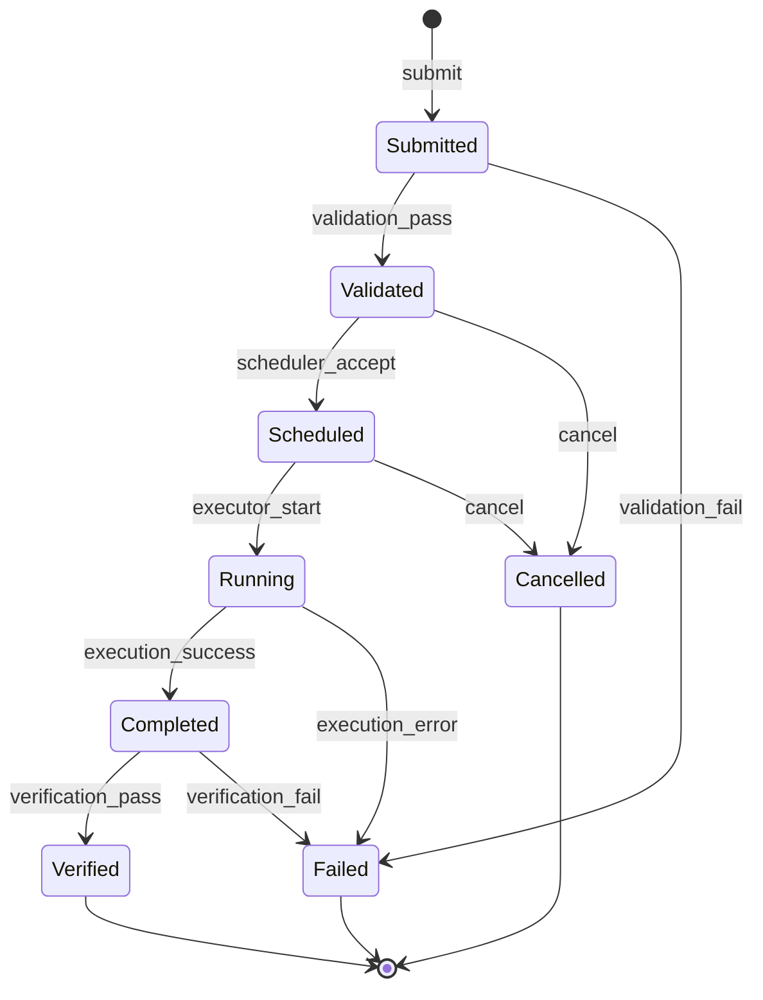
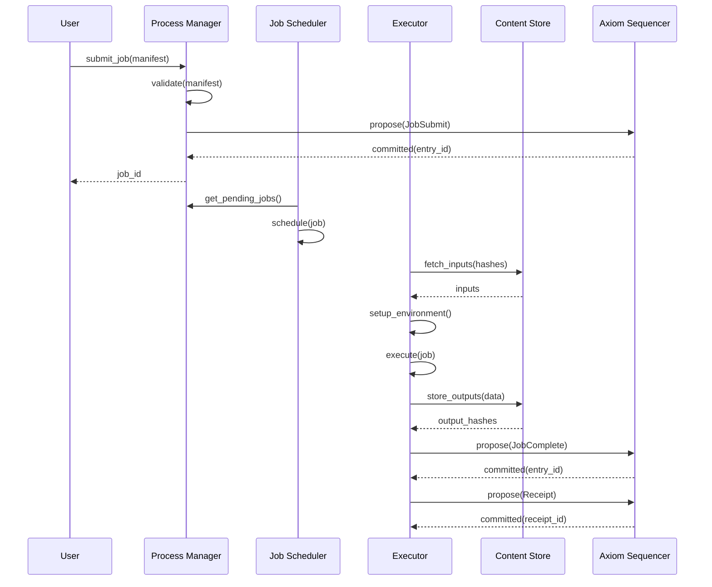

# Application Model Specification

**Version:** 1.0  
**Status:** Specification  
**Component:** Application Layer

---

## 1. Overview

In v0, Orbital OS supports **only deterministic applications**. These applications execute as discrete **jobs** with explicit inputs and outputs, enabling replay-based verification.

Interactive, nondeterministic, and long-running applications are reserved for future versions.

---

## 2. Deterministic Application Contract

### 2.1 Requirements

A deterministic application MUST:

| Requirement | Description |
|-------------|-------------|
| Execute as a job | Discrete unit of work with start and end |
| Declare all inputs | No implicit inputs |
| Use content-addressed inputs | Inputs identified by hash |
| Produce content-addressed outputs | Outputs identified by hash |
| Run in pinned environment | Known, reproducible execution context |
| Use no hidden nondeterminism | See prohibited operations |

### 2.2 Prohibited Operations

Deterministic applications MUST NOT:

| Operation | Reason |
|-----------|--------|
| Read wall-clock time | Nondeterministic |
| Generate random numbers | Nondeterministic (unless seeded from input) |
| Observe scheduling order | Nondeterministic |
| Use uncontrolled concurrency | Race conditions |
| Make network requests | External nondeterminism |
| Read environment variables | Implicit input |
| Access filesystem directly | Must use content-addressed inputs |

### 2.3 Allowed Operations

Deterministic applications MAY:

| Operation | Condition |
|-----------|-----------|
| Read time from input | Explicit time value passed as input |
| Use randomness from input | Explicit seed passed as input |
| Use controlled parallelism | Fork-join with deterministic merge |
| Perform computation | Pure computation |
| Write outputs | To content-addressed store |
| Log messages | Logs are not authoritative |

---

## 3. Job Model

### 3.1 Job Definition

```rust
/// A deterministic job
#[derive(Clone, Debug, Serialize, Deserialize)]
pub struct Job {
    /// Unique job identifier
    pub id: JobId,
    
    /// Job manifest
    pub manifest: JobManifest,
    
    /// Current state
    pub state: JobState,
    
    /// Execution record
    pub execution: Option<ExecutionRecord>,
}

/// Job identifier
#[derive(Clone, Copy, Debug, PartialEq, Eq, Hash, Serialize, Deserialize)]
pub struct JobId(pub u128);

/// Job lifecycle state
#[derive(Clone, Debug, PartialEq, Eq, Serialize, Deserialize)]
pub enum JobState {
    /// Job submitted, awaiting validation
    Submitted,
    
    /// Job validated, awaiting scheduling
    Validated,
    
    /// Job scheduled, awaiting execution
    Scheduled,
    
    /// Job executing
    Running { started_at: Timestamp },
    
    /// Job completed, outputs produced
    Completed {
        completed_at: Timestamp,
        outputs: Vec<Hash>,
    },
    
    /// Job failed
    Failed {
        failed_at: Timestamp,
        error: JobError,
    },
    
    /// Job verified
    Verified {
        receipt: ReceiptId,
    },
    
    /// Job cancelled
    Cancelled,
}
```

### 3.2 Job Lifecycle



---

## 4. Job Manifest

### 4.1 Manifest Schema

```rust
/// Job manifest (submitted by user)
#[derive(Clone, Debug, Serialize, Deserialize)]
pub struct JobManifest {
    /// Manifest version
    pub version: u32,
    
    /// Human-readable name
    pub name: String,
    
    /// Executable specification
    pub executable: ExecutableSpec,
    
    /// Input declarations
    pub inputs: Vec<InputDeclaration>,
    
    /// Output declarations
    pub outputs: Vec<OutputDeclaration>,
    
    /// Environment specification
    pub environment: EnvironmentSpec,
    
    /// Resource requirements
    pub resources: ResourceRequirements,
    
    /// Determinism declaration
    pub determinism: DeterminismDeclaration,
}
```

### 4.2 Executable Specification

```rust
/// Specification of what to execute
#[derive(Clone, Debug, Serialize, Deserialize)]
pub struct ExecutableSpec {
    /// Executable type
    pub exec_type: ExecutableType,
    
    /// Content hash of executable
    pub hash: Hash,
    
    /// Entry point (if applicable)
    pub entry_point: Option<String>,
    
    /// Arguments
    pub args: Vec<String>,
}

#[derive(Clone, Debug, Serialize, Deserialize)]
pub enum ExecutableType {
    /// Native Rust binary
    NativeBinary,
    
    /// WebAssembly module
    Wasm,
    
    /// Container image
    Container,
}
```

### 4.3 Input Declaration

```rust
/// Declaration of a job input
#[derive(Clone, Debug, Serialize, Deserialize)]
pub struct InputDeclaration {
    /// Input name (for binding)
    pub name: String,
    
    /// Content hash
    pub hash: Hash,
    
    /// Input type
    pub input_type: InputType,
    
    /// Size in bytes
    pub size: u64,
    
    /// Mount point (where input appears in job environment)
    pub mount: PathBuf,
}

#[derive(Clone, Debug, Serialize, Deserialize)]
pub enum InputType {
    /// Raw bytes
    Blob,
    
    /// Directory tree
    Directory,
    
    /// Structured data (JSON, etc.)
    Structured { schema: Hash },
}
```

### 4.4 Output Declaration

```rust
/// Declaration of expected output
#[derive(Clone, Debug, Serialize, Deserialize)]
pub struct OutputDeclaration {
    /// Output name
    pub name: String,
    
    /// Output type
    pub output_type: OutputType,
    
    /// Path where output is written
    pub path: PathBuf,
    
    /// Whether this output is required
    pub required: bool,
}

#[derive(Clone, Debug, Serialize, Deserialize)]
pub enum OutputType {
    /// Single file
    File,
    
    /// Directory tree
    Directory,
    
    /// Structured data
    Structured { schema: Hash },
}
```

### 4.5 Environment Specification

```rust
/// Execution environment specification
#[derive(Clone, Debug, Serialize, Deserialize)]
pub struct EnvironmentSpec {
    /// Environment type
    pub env_type: EnvironmentType,
    
    /// Environment image hash
    pub image: Hash,
    
    /// Environment version
    pub version: Version,
    
    /// Environment configuration
    pub config: EnvironmentConfig,
}

#[derive(Clone, Debug, Serialize, Deserialize)]
pub enum EnvironmentType {
    /// Minimal Orbital environment
    Minimal,
    
    /// Standard Rust environment
    Rust { toolchain: String },
    
    /// WebAssembly runtime
    Wasm { runtime: String },
    
    /// Custom environment
    Custom,
}

#[derive(Clone, Debug, Serialize, Deserialize)]
pub struct EnvironmentConfig {
    /// Memory limit
    pub memory_limit: usize,
    
    /// CPU time limit
    pub cpu_limit: Duration,
    
    /// Stack size
    pub stack_size: usize,
    
    /// File descriptor limit
    pub fd_limit: u32,
}
```

### 4.6 Determinism Declaration

```rust
/// Explicit declaration of determinism properties
#[derive(Clone, Debug, Serialize, Deserialize)]
pub struct DeterminismDeclaration {
    /// Declares this job is deterministic
    pub is_deterministic: bool,
    
    /// Concurrency model (if any)
    pub concurrency: ConcurrencyModel,
    
    /// Floating point behavior
    pub floating_point: FloatingPointMode,
    
    /// Additional constraints
    pub constraints: Vec<DeterminismConstraint>,
}

#[derive(Clone, Debug, Serialize, Deserialize)]
pub enum ConcurrencyModel {
    /// Single-threaded execution
    Sequential,
    
    /// Fork-join with deterministic merge
    ForkJoin { max_threads: u32 },
    
    /// Data-parallel (SIMD-like)
    DataParallel,
}

#[derive(Clone, Debug, Serialize, Deserialize)]
pub enum FloatingPointMode {
    /// IEEE 754 strict
    Strict,
    
    /// Allow fast-math (may affect reproducibility)
    FastMath,
    
    /// Fixed-point only
    NoFloatingPoint,
}
```

### 4.7 Example Manifest (TOML)

```toml
version = 1
name = "compile-project"

[executable]
exec_type = "NativeBinary"
hash = "blake3:abc123def456..."
entry_point = "main"
args = ["--release", "--target", "x86_64"]

[[inputs]]
name = "source"
hash = "blake3:111222333..."
input_type = "Directory"
size = 1048576
mount = "/src"

[[inputs]]
name = "dependencies"
hash = "blake3:444555666..."
input_type = "Directory"
size = 52428800
mount = "/deps"

[[outputs]]
name = "binary"
output_type = "File"
path = "/out/binary"
required = true

[[outputs]]
name = "debug_info"
output_type = "File"
path = "/out/binary.debug"
required = false

[environment]
env_type = "Rust"
image = "blake3:rust-1.75.0..."
version = "1.75.0"

[environment.config]
memory_limit = 4294967296  # 4GB
cpu_limit = { secs = 3600, nanos = 0 }  # 1 hour
stack_size = 8388608  # 8MB
fd_limit = 256

[resources]
cpu_cores = 4
memory_mb = 4096
disk_mb = 10240
priority = "Normal"

[determinism]
is_deterministic = true
concurrency = { type = "ForkJoin", max_threads = 4 }
floating_point = "Strict"
constraints = []
```

---

## 5. Job Execution

### 5.1 Execution Flow



### 5.2 Execution Environment

```rust
/// Isolated execution environment for a job
pub struct ExecutionEnvironment {
    /// Environment identity (for verification)
    pub identity: Hash,
    
    /// Process running the job
    pub process: ProcessId,
    
    /// Mounted inputs (read-only)
    pub inputs: BTreeMap<PathBuf, MountedInput>,
    
    /// Output directory (write-only)
    pub output_dir: PathBuf,
    
    /// Resource limits
    pub limits: ResourceLimits,
    
    /// Intercepted syscalls
    pub syscall_filter: SyscallFilter,
}

impl ExecutionEnvironment {
    /// Execute a job in this environment
    pub fn execute(&self, executable: &ExecutableSpec) -> Result<ExecutionResult, ExecError> {
        // Set up isolated process
        let process = self.create_isolated_process()?;
        
        // Mount inputs
        for (path, input) in &self.inputs {
            process.mount_readonly(path, input)?;
        }
        
        // Set up output directory
        process.mount_writable(&self.output_dir)?;
        
        // Apply syscall filter
        process.set_syscall_filter(&self.syscall_filter)?;
        
        // Execute
        let result = process.run(executable)?;
        
        // Collect outputs
        let outputs = self.collect_outputs()?;
        
        Ok(ExecutionResult {
            exit_code: result.exit_code,
            outputs,
            metrics: result.metrics,
        })
    }
}
```

### 5.3 Syscall Filtering

```rust
/// Syscall filter for deterministic execution
pub struct SyscallFilter {
    /// Allowed syscalls
    pub allowed: HashSet<Syscall>,
    
    /// Action for disallowed syscalls
    pub default_action: FilterAction,
}

impl SyscallFilter {
    /// Create filter for deterministic jobs
    pub fn deterministic() -> Self {
        let mut allowed = HashSet::new();
        
        // Memory management
        allowed.insert(Syscall::Mmap);
        allowed.insert(Syscall::Munmap);
        allowed.insert(Syscall::Mprotect);
        
        // File I/O (on mounted paths only)
        allowed.insert(Syscall::Read);
        allowed.insert(Syscall::Write);
        allowed.insert(Syscall::Open);
        allowed.insert(Syscall::Close);
        
        // Process control
        allowed.insert(Syscall::Exit);
        allowed.insert(Syscall::ExitGroup);
        
        // Thread control (for ForkJoin)
        allowed.insert(Syscall::Clone);
        allowed.insert(Syscall::Futex);
        
        // Explicitly BLOCKED:
        // - GetTimeOfDay (use input time)
        // - GetRandom (use input seed)
        // - Socket (no networking)
        // - Exec (no spawning)
        
        Self {
            allowed,
            default_action: FilterAction::Kill,
        }
    }
}
```

---

## 6. Content-Addressed Storage

### 6.1 Content Store Interface

```rust
/// Content-addressed storage for job inputs/outputs
pub trait ContentStore {
    /// Store content, return hash
    fn store(&mut self, data: &[u8]) -> Result<Hash, StoreError>;
    
    /// Store directory tree
    fn store_tree(&mut self, path: &Path) -> Result<Hash, StoreError>;
    
    /// Retrieve content by hash
    fn get(&self, hash: &Hash) -> Result<Vec<u8>, StoreError>;
    
    /// Retrieve directory tree
    fn get_tree(&self, hash: &Hash, dest: &Path) -> Result<(), StoreError>;
    
    /// Check if content exists
    fn exists(&self, hash: &Hash) -> bool;
    
    /// Get content size
    fn size(&self, hash: &Hash) -> Result<u64, StoreError>;
}
```

### 6.2 Hash Computation

```rust
impl ContentStore {
    /// Compute hash of content
    pub fn hash(data: &[u8]) -> Hash {
        Hash(blake3::hash(data).into())
    }
    
    /// Compute hash of directory tree
    pub fn hash_tree(path: &Path) -> Result<Hash, StoreError> {
        let mut hasher = blake3::Hasher::new();
        
        // Sort entries for determinism
        let mut entries: Vec<_> = fs::read_dir(path)?
            .filter_map(|e| e.ok())
            .collect();
        entries.sort_by_key(|e| e.file_name());
        
        for entry in entries {
            let name = entry.file_name();
            let metadata = entry.metadata()?;
            
            hasher.update(name.as_bytes());
            
            if metadata.is_file() {
                hasher.update(b"file");
                let content = fs::read(entry.path())?;
                hasher.update(&Self::hash(&content).0);
            } else if metadata.is_dir() {
                hasher.update(b"dir");
                let subtree_hash = Self::hash_tree(&entry.path())?;
                hasher.update(&subtree_hash.0);
            }
        }
        
        Ok(Hash(hasher.finalize().into()))
    }
}
```

---

## 7. Verification

### 7.1 Verification Protocol

```rust
/// Verify a job result
pub fn verify_job(
    manifest: &JobManifest,
    claimed_outputs: &[Hash],
    receipt: &Receipt,
) -> Result<VerificationResult, VerifyError> {
    // 1. Fetch inputs by hash
    let inputs = fetch_inputs(&manifest.inputs)?;
    
    // 2. Set up identical environment
    let env = setup_environment(&manifest.environment)?;
    
    // 3. Re-execute job
    let result = env.execute(&manifest.executable)?;
    
    // 4. Compare outputs
    let output_hashes: Vec<Hash> = result.outputs.iter()
        .map(|o| ContentStore::hash(o))
        .collect();
    
    if output_hashes != claimed_outputs {
        return Ok(VerificationResult::Mismatch {
            expected: claimed_outputs.to_vec(),
            actual: output_hashes,
        });
    }
    
    // 5. Verify receipt
    if !verify_receipt(receipt, &manifest, &output_hashes)? {
        return Ok(VerificationResult::InvalidReceipt);
    }
    
    Ok(VerificationResult::Verified)
}

#[derive(Clone, Debug)]
pub enum VerificationResult {
    /// Job verified successfully
    Verified,
    
    /// Outputs don't match
    Mismatch {
        expected: Vec<Hash>,
        actual: Vec<Hash>,
    },
    
    /// Receipt is invalid
    InvalidReceipt,
    
    /// Environment couldn't be reproduced
    EnvironmentMismatch,
}
```

---

## 8. Language Policy

### 8.1 Preferred Language

**Rust** is the preferred language for Orbital applications:

| Advantage | Description |
|-----------|-------------|
| Memory safety | No undefined behavior |
| No GC | Deterministic resource cleanup |
| Zero-cost abstractions | Performance without overhead |
| Strong typing | Catches errors at compile time |
| Ecosystem | Cargo, crates.io |

### 8.2 Other Languages

Other languages MAY be supported under strict conditions:

| Language | Condition |
|----------|-----------|
| WebAssembly | Deterministic runtime, no host calls |
| C/C++ | Must use deterministic libc |
| Others | Requires deterministic interpreter/runtime |

### 8.3 Deterministic Runtimes

```rust
/// Requirements for deterministic language runtimes
pub trait DeterministicRuntime {
    /// No access to system time
    fn blocks_time_access(&self) -> bool;
    
    /// No access to random number generator
    fn blocks_random_access(&self) -> bool;
    
    /// Deterministic memory allocation
    fn deterministic_allocation(&self) -> bool;
    
    /// Deterministic floating point
    fn deterministic_floating_point(&self) -> bool;
    
    /// Sandboxed I/O
    fn sandboxed_io(&self) -> bool;
}
```

---

## 9. Error Handling

### 9.1 Job Errors

```rust
/// Errors that can occur during job execution
#[derive(Clone, Debug, Serialize, Deserialize)]
pub enum JobError {
    /// Manifest validation failed
    ValidationError(ValidationError),
    
    /// Input not found
    InputNotFound { hash: Hash },
    
    /// Environment setup failed
    EnvironmentError(String),
    
    /// Execution failed
    ExecutionError {
        exit_code: i32,
        stderr: String,
    },
    
    /// Resource limit exceeded
    ResourceExceeded(ResourceType),
    
    /// Timeout
    Timeout,
    
    /// Determinism violation detected
    DeterminismViolation(String),
    
    /// Verification failed
    VerificationFailed(VerificationResult),
}
```

---

## 10. Future Extensions

### 10.1 Interactive Applications (Future)

Future versions may support interactive applications with:
- Session-based execution
- Event-driven input
- Streaming output
- UI integration

### 10.2 Nondeterministic Applications (Future)

Future versions may support nondeterministic applications with:
- Explicit nondeterminism boundaries
- Attestation instead of verification
- Trusted execution environments

---

*[← Userland Services](03-userland-services.md) | [Three-Phase Action Model →](05-three-phase-action-model.md)*
