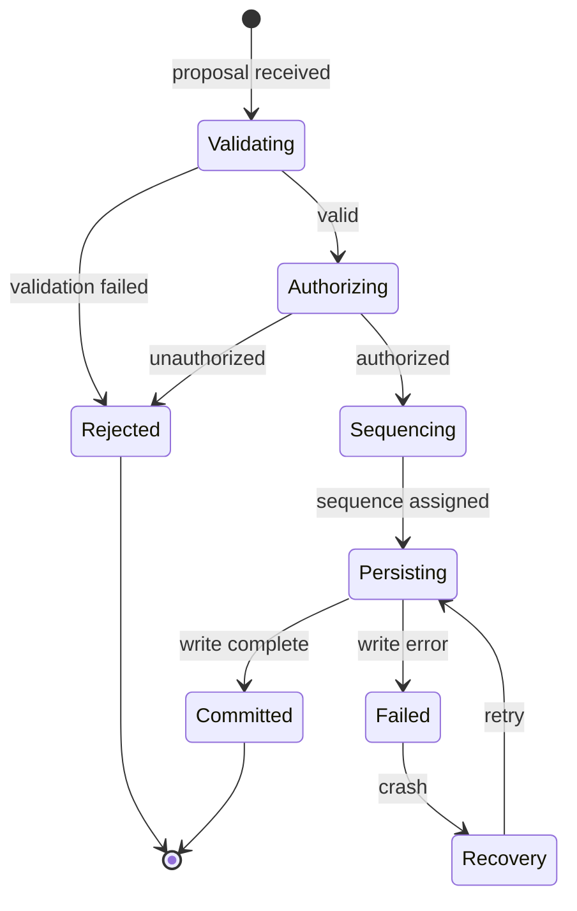
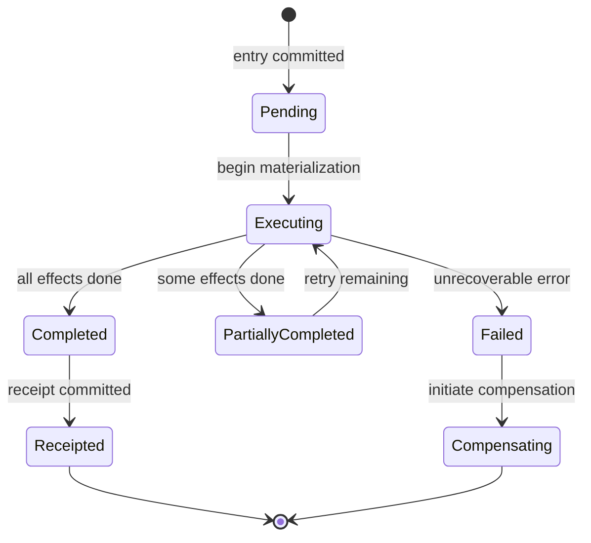

# Three-Phase Action Model Specification

**Version:** 1.0  
**Status:** Specification  
**Component:** Core Architecture

---

## 1. Overview

The Three-Phase Action Model is the fundamental pattern for all meaningful system operations in Orbital OS. It ensures crash safety, auditability, and deterministic authority.

---

## 2. The Three Phases

### 2.1 Phase Summary

| Phase | Name | Description |
|-------|------|-------------|
| **Phase 1** | Pre-Commit (Proposal) | Tentative work, no visible effects |
| **Phase 2** | Commit | Axiom sequencer accepts or rejects |
| **Phase 3** | Effect Materialization | Authorized effects are executed |

### 2.2 Phase Diagram

```mermaid
flowchart LR
    subgraph phase1 [Phase 1: Pre-Commit]
        work[Execute Work]
        prepare[Prepare Effects]
        proposal[Create Proposal]
    end
    
    subgraph phase2 [Phase 2: Commit]
        submit[Submit to Sequencer]
        validate[Validate]
        order[Assign Sequence]
        persist[Persist Entry]
    end
    
    subgraph phase3 [Phase 3: Effect]
        materialize[Materialize Effects]
        verify[Verify Completion]
        receipt[Emit Receipt]
    end
    
    work --> prepare
    prepare --> proposal
    proposal --> submit
    submit --> validate
    validate --> order
    order --> persist
    persist --> materialize
    materialize --> verify
    verify --> receipt
```



---

## 3. Phase 1: Pre-Commit (Proposal)

### 3.1 Properties

| Property | Description |
|----------|-------------|
| **Tentative** | All work may be discarded |
| **No visible effects** | No externally observable changes |
| **Parallel execution** | Multiple proposals can be prepared concurrently |
| **Crash-discardable** | Crash during this phase loses only proposal |

### 3.2 Proposal Generation

```rust
/// A proposal for a system action
#[derive(Clone, Debug, Serialize, Deserialize)]
pub struct Proposal {
    /// Unique proposal ID (for correlation)
    pub id: ProposalId,
    
    /// Proposed Axiom entry type
    pub entry_type: EntryType,
    
    /// Proposed payload
    pub payload: EntryPayload,
    
    /// Prepared effects (to be materialized after commit)
    pub effects: Vec<PreparedEffect>,
    
    /// Submitting entity
    pub submitter: EntityId,
    
    /// Idempotency key
    pub idempotency_key: IdempotencyKey,
    
    /// Timestamp (informational)
    pub created_at: Timestamp,
}

/// An effect prepared but not yet executed
#[derive(Clone, Debug, Serialize, Deserialize)]
pub struct PreparedEffect {
    /// Effect type
    pub effect_type: EffectType,
    
    /// Effect parameters
    pub params: EffectParams,
    
    /// Idempotency token
    pub idempotency_token: IdempotencyToken,
}
```

### 3.3 Effect Types

```rust
/// Types of effects that can be materialized
#[derive(Clone, Debug, Serialize, Deserialize)]
pub enum EffectType {
    /// Write to block storage
    BlockWrite {
        device: DeviceId,
        offset: u64,
        data_hash: Hash,
    },
    
    /// Send network packet
    NetworkSend {
        connection: ConnectionId,
        data_hash: Hash,
    },
    
    /// Create process
    ProcessCreate {
        params: ProcessCreateParams,
    },
    
    /// Signal process
    ProcessSignal {
        pid: ProcessId,
        signal: Signal,
    },
    
    /// Device command
    DeviceCommand {
        device: DeviceId,
        command: DeviceCommand,
    },
}
```

### 3.4 Proposal Validation

Before submitting, the proposer should validate:

```rust
impl Proposal {
    /// Validate proposal before submission
    pub fn validate(&self) -> Result<(), ValidationError> {
        // Check payload is well-formed
        self.payload.validate()?;
        
        // Check effects are valid
        for effect in &self.effects {
            effect.validate()?;
        }
        
        // Check idempotency key is unique (local check)
        if self.idempotency_key.is_empty() {
            return Err(ValidationError::MissingIdempotencyKey);
        }
        
        Ok(())
    }
}
```

---

## 4. Phase 2: Commit

### 4.1 Properties

| Property | Description |
|----------|-------------|
| **Atomic** | Proposal is fully committed or not at all |
| **Ordered** | Sequencer assigns total order |
| **Persistent** | Committed entries survive crashes |
| **Deterministic** | Same proposals in same order → same result |

### 4.2 Sequencer Protocol

```rust
/// Submit proposal to sequencer
impl AxiomSequencer {
    pub fn submit(&mut self, proposal: Proposal) -> Result<CommitResult, SubmitError> {
        // 1. Validate proposal
        self.validate_proposal(&proposal)?;
        
        // 2. Check authorization
        self.check_authorization(&proposal)?;
        
        // 3. Check idempotency
        if let Some(existing) = self.check_idempotency(&proposal.idempotency_key) {
            return Ok(CommitResult::Duplicate { entry_id: existing });
        }
        
        // 4. Assign sequence number
        let sequence = self.next_sequence();
        
        // 5. Create Axiom entry
        let entry = self.create_entry(sequence, &proposal);
        
        // 6. Persist entry (atomic)
        self.persist_entry(&entry)?;
        
        // 7. Record idempotency key
        self.record_idempotency(&proposal.idempotency_key, entry.sequence);
        
        // 8. Notify subscribers
        self.notify_subscribers(&entry);
        
        Ok(CommitResult::Committed {
            sequence,
            entry_hash: entry.compute_hash(),
        })
    }
}

#[derive(Clone, Debug)]
pub enum CommitResult {
    /// Proposal committed successfully
    Committed {
        sequence: u64,
        entry_hash: Hash,
    },
    
    /// Duplicate proposal (idempotency)
    Duplicate {
        entry_id: u64,
    },
    
    /// Proposal rejected
    Rejected {
        reason: RejectionReason,
    },
}
```

### 4.3 Commit State Machine



### 4.4 Crash During Commit

If the system crashes during commit:

```rust
impl AxiomSequencer {
    /// Recover from crash during commit
    pub fn recover(&mut self) -> Result<(), RecoveryError> {
        // Read WAL to find incomplete commits
        let wal = self.open_wal()?;
        
        for entry in wal.pending_entries() {
            match entry.state {
                WalState::BeginCommit => {
                    // Entry was not persisted — discard
                    wal.discard(entry)?;
                }
                WalState::Persisted => {
                    // Entry persisted but not acknowledged — complete
                    self.complete_commit(entry)?;
                }
                WalState::Committed => {
                    // Already complete — no action
                }
            }
        }
        
        wal.clear()?;
        Ok(())
    }
}
```

---

## 5. Phase 3: Effect Materialization

### 5.1 Properties

| Property | Description |
|----------|-------------|
| **Authorized** | Only committed entries authorize effects |
| **Idempotent** | Effects safe to retry |
| **Ordered** | Effects executed in Axiom order |
| **Receipted** | Completion emits receipt |

### 5.2 Effect Execution

```rust
/// Execute authorized effects
impl EffectMaterializer {
    pub fn materialize(
        &mut self,
        entry: &AxiomEntry,
        effects: &[PreparedEffect],
    ) -> Result<Receipt, MaterializeError> {
        let mut completed_effects = Vec::new();
        
        for effect in effects {
            // Check if already completed (idempotency)
            if self.is_completed(&effect.idempotency_token) {
                continue;
            }
            
            // Execute effect
            let result = self.execute_effect(effect)?;
            
            // Record completion
            self.record_completion(&effect.idempotency_token, &result);
            
            completed_effects.push(EffectResult {
                effect: effect.clone(),
                result,
            });
        }
        
        // Generate receipt
        let receipt = Receipt {
            axiom_entry: entry.header.sequence,
            effects: completed_effects,
            completed_at: Timestamp::now(),
        };
        
        Ok(receipt)
    }
    
    fn execute_effect(&mut self, effect: &PreparedEffect) -> Result<EffectOutput, EffectError> {
        match &effect.effect_type {
            EffectType::BlockWrite { device, offset, data_hash } => {
                // Retrieve data from content store
                let data = self.content_store.get(data_hash)?;
                
                // Write to block device
                self.block_service.write(*device, *offset, &data)?;
                
                Ok(EffectOutput::BlockWritten { bytes: data.len() })
            }
            
            EffectType::NetworkSend { connection, data_hash } => {
                let data = self.content_store.get(data_hash)?;
                self.network_service.send(*connection, &data)?;
                Ok(EffectOutput::NetworkSent { bytes: data.len() })
            }
            
            EffectType::ProcessCreate { params } => {
                let pid = self.process_manager.spawn(params)?;
                Ok(EffectOutput::ProcessCreated { pid })
            }
            
            EffectType::ProcessSignal { pid, signal } => {
                self.process_manager.signal(*pid, *signal)?;
                Ok(EffectOutput::ProcessSignaled)
            }
            
            EffectType::DeviceCommand { device, command } => {
                self.device_manager.command(*device, command)?;
                Ok(EffectOutput::DeviceCommanded)
            }
        }
    }
}
```

### 5.3 Idempotency Implementation

```rust
/// Idempotency tracking for effects
pub struct IdempotencyTracker {
    /// Completed effects by token
    completed: HashMap<IdempotencyToken, EffectOutput>,
    
    /// Persistence for crash recovery
    store: IdempotencyStore,
}

impl IdempotencyTracker {
    /// Check if effect was already completed
    pub fn is_completed(&self, token: &IdempotencyToken) -> bool {
        self.completed.contains_key(token)
    }
    
    /// Record effect completion
    pub fn record(&mut self, token: IdempotencyToken, output: EffectOutput) {
        // Persist first
        self.store.persist(&token, &output).unwrap();
        
        // Then update in-memory
        self.completed.insert(token, output);
    }
    
    /// Get result of completed effect
    pub fn get_result(&self, token: &IdempotencyToken) -> Option<&EffectOutput> {
        self.completed.get(token)
    }
}
```

### 5.4 Effect State Machine



---

## 6. Crash Safety Analysis

### 6.1 Crash Points and Recovery

| Crash Point | State Preserved | Recovery Action |
|-------------|-----------------|-----------------|
| During Phase 1 | Nothing | Proposal lost, re-submit |
| During Phase 2 (before persist) | Nothing | Proposal lost, re-submit |
| During Phase 2 (after persist) | Entry | Complete commit notification |
| During Phase 3 | Entry + partial effects | Retry remaining effects |
| After Phase 3 | Entry + effects + receipt | Complete |

### 6.2 Recovery Protocol

```rust
impl System {
    /// Recover from crash
    pub fn recover(&mut self) -> Result<(), RecoveryError> {
        // 1. Recover Axiom sequencer
        self.axiom.recover()?;
        
        // 2. Replay uncommitted effects
        let last_receipt = self.find_last_receipt()?;
        let pending_entries = self.axiom.entries_after(last_receipt);
        
        for entry in pending_entries {
            // Load prepared effects
            let effects = self.load_prepared_effects(&entry)?;
            
            // Materialize (idempotent)
            let receipt = self.materializer.materialize(&entry, &effects)?;
            
            // Commit receipt
            self.commit_receipt(receipt)?;
        }
        
        Ok(())
    }
}
```

### 6.3 Invariant Preservation

| Invariant | How Preserved |
|-----------|---------------|
| No uncommitted effects | Phase 3 only runs after Phase 2 commits |
| No lost commits | WAL ensures committed entries survive |
| No duplicate effects | Idempotency tokens prevent re-execution |
| Consistent state | Deterministic reduction from Axiom |

---

## 7. Concurrency Considerations

### 7.1 Multiple Concurrent Proposals

Multiple services may prepare proposals concurrently:

```
Service A: [Prepare A1] → [Submit A1] → [Wait]
Service B: [Prepare B1] → [Submit B1] → [Wait]
Service C: [Prepare C1] → [Submit C1] → [Wait]

Sequencer orders: A1, C1, B1 (example)

Effects materialize in that order.
```

### 7.2 Conflict Resolution

The sequencer handles conflicts:

```rust
impl AxiomSequencer {
    fn validate_proposal(&self, proposal: &Proposal) -> Result<(), ValidationError> {
        // Check proposal is consistent with current state
        let current_state = self.reduce_to_current();
        
        match &proposal.entry_type {
            EntryType::FileCreate => {
                let path = proposal.payload.as_file_create()?.path;
                if current_state.namespace.exists(&path) {
                    return Err(ValidationError::AlreadyExists);
                }
            }
            // ... other conflict checks
            _ => {}
        }
        
        Ok(())
    }
}
```

### 7.3 Proposal Dependencies

Some proposals depend on previous proposals:

```rust
/// Proposal with dependencies
pub struct ProposalWithDeps {
    pub proposal: Proposal,
    
    /// Must commit after these entries
    pub depends_on: Vec<u64>,
    
    /// Must commit before these proposals
    pub blocks: Vec<ProposalId>,
}
```

---

## 8. Example Workflows

### 8.1 File Write

```rust
// Phase 1: Prepare
let content_hash = content_store.store(&data)?;
let proposal = Proposal {
    entry_type: EntryType::FileMetadataUpdate,
    payload: FileUpdatePayload {
        path: "/data/file.txt".into(),
        content_hash,
        size: data.len() as u64,
    }.into(),
    effects: vec![
        PreparedEffect {
            effect_type: EffectType::BlockWrite {
                device: block_device,
                offset: allocated_offset,
                data_hash: content_hash,
            },
            idempotency_token: IdempotencyToken::new(),
        }
    ],
    ..Default::default()
};

// Phase 2: Commit
let result = sequencer.submit(proposal)?;
let entry_id = match result {
    CommitResult::Committed { sequence, .. } => sequence,
    CommitResult::Rejected { reason } => return Err(reason.into()),
    CommitResult::Duplicate { entry_id } => entry_id,
};

// Phase 3: Materialize (handled by materializer service)
// ... effects are executed, receipt is committed
```

### 8.2 Network Connection Authorization

```rust
// Phase 1: Prepare authorization
let proposal = Proposal {
    entry_type: EntryType::ConnectionAuthorize,
    payload: ConnectionAuthPayload {
        local_addr: "0.0.0.0:8080".parse()?,
        remote_addr: "192.168.1.100:443".parse()?,
        protocol: Protocol::Tcp,
        direction: Direction::Outbound,
    }.into(),
    effects: vec![], // Network send is separate proposal
    ..Default::default()
};

// Phase 2: Commit
let result = sequencer.submit(proposal)?;

// Phase 3: No effects for authorization itself
// Subsequent network operations reference this authorization
```

### 8.3 Job Submission

```rust
// Phase 1: Prepare job
let manifest_hash = content_store.store(&manifest.to_bytes())?;
let proposal = Proposal {
    entry_type: EntryType::JobSubmit,
    payload: JobSubmitPayload {
        job_id: JobId::new(),
        manifest_hash,
        inputs: manifest.inputs.iter().map(|i| i.hash).collect(),
        environment_hash: manifest.environment.image,
        submitter: current_entity(),
    }.into(),
    effects: vec![
        PreparedEffect {
            effect_type: EffectType::ProcessCreate {
                params: job_process_params(&manifest),
            },
            idempotency_token: IdempotencyToken::new(),
        }
    ],
    ..Default::default()
};

// Phase 2: Commit
let result = sequencer.submit(proposal)?;

// Phase 3: Job process is created
```

---

## 9. Performance Considerations

### 9.1 Latency Targets

| Phase | Target Latency |
|-------|----------------|
| Phase 1 (proposal preparation) | Application-dependent |
| Phase 2 (commit) | < 1ms (SSD) |
| Phase 3 (materialization) | Effect-dependent |

### 9.2 Batching

The sequencer can batch multiple proposals:

```rust
impl AxiomSequencer {
    /// Commit batch of proposals atomically
    pub fn submit_batch(&mut self, proposals: Vec<Proposal>) -> Vec<CommitResult> {
        // Validate all
        let validated: Vec<_> = proposals.iter()
            .map(|p| self.validate_proposal(p))
            .collect();
        
        // Commit valid ones in single transaction
        let mut results = Vec::new();
        self.begin_transaction();
        
        for (proposal, valid) in proposals.iter().zip(validated) {
            if valid.is_ok() {
                let sequence = self.next_sequence();
                let entry = self.create_entry(sequence, proposal);
                self.persist_entry_batch(&entry);
                results.push(CommitResult::Committed { 
                    sequence, 
                    entry_hash: entry.compute_hash() 
                });
            } else {
                results.push(CommitResult::Rejected { 
                    reason: valid.unwrap_err().into() 
                });
            }
        }
        
        self.commit_transaction();
        results
    }
}
```

### 9.3 Pipelining

Phases can be pipelined:

```
Proposal 1: [P1-Prepare] [P1-Commit] [P1-Effect]
Proposal 2:              [P2-Prepare] [P2-Commit] [P2-Effect]
Proposal 3:                           [P3-Prepare] [P3-Commit] [P3-Effect]
```

---

## 10. Summary

The Three-Phase Action Model provides:

| Guarantee | Mechanism |
|-----------|-----------|
| **Crash safety** | Pre-commit discardable, post-commit idempotent |
| **Auditability** | Every effect authorized by Axiom entry |
| **Determinism** | Authority from Axiom reduction |
| **Concurrency** | Parallel preparation, sequential commit |
| **Verification** | Receipts bind inputs to outputs |

---

*[← Application Model](04-application-model.md) | [Filesystem and Storage →](06-filesystem-and-storage.md)*
