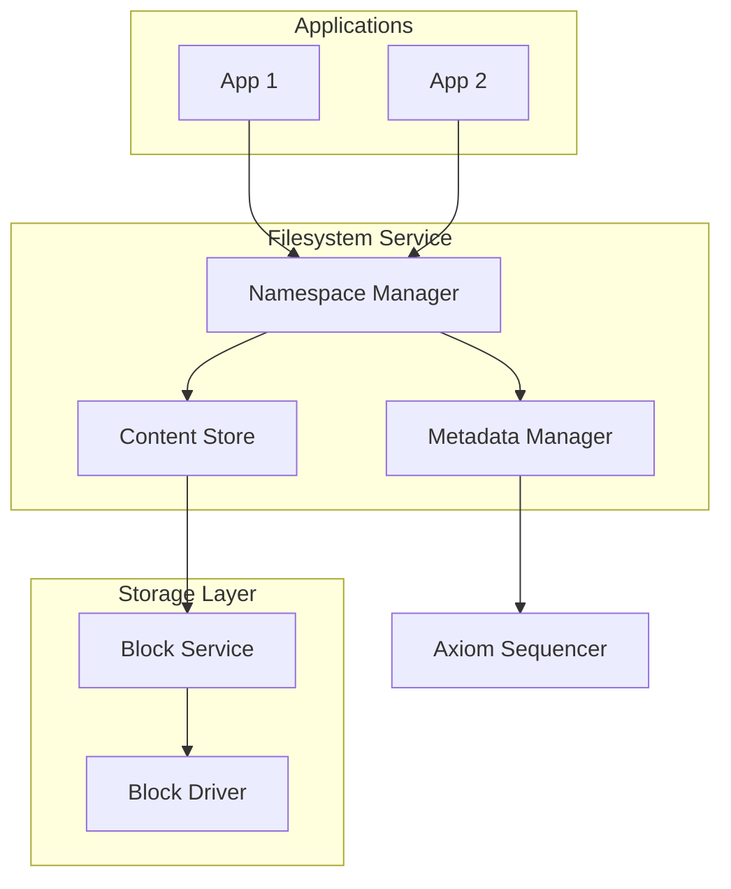
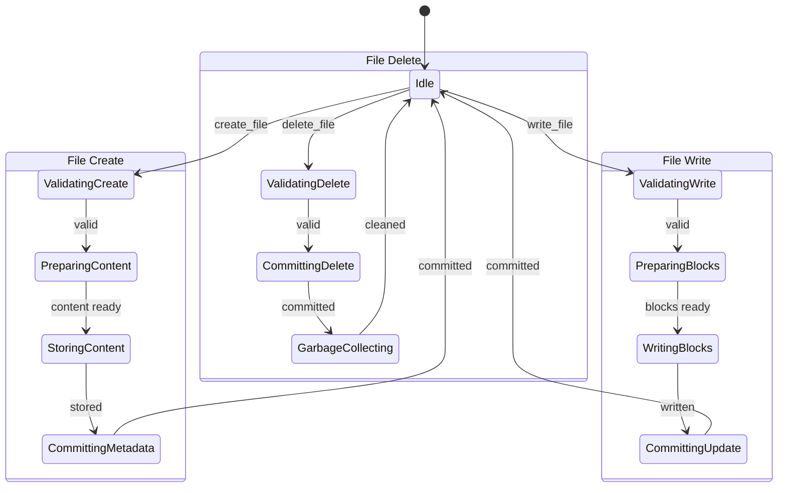

# Filesystem and Storage Specification

**Version:** 1.0  
**Status:** Specification  
**Component:** Storage Layer

---

## 1. Overview

The Orbital filesystem is a user-space service that provides namespace management, content-addressed storage, and transactional metadata operations backed by the Axiom.

---

## 2. Architecture

### 2.1 Component Diagram



### 2.2 Separation of Concerns

| Component | Responsibility |
|-----------|----------------|
| Namespace Manager | Path resolution, directory structure |
| Metadata Manager | File attributes, permissions, Axiom integration |
| Content Store | Content-addressed blob storage |
| Block Service | Block device abstraction |

---

## 3. Namespace Model

### 3.1 Path Structure

```rust
/// Absolute path in the filesystem
#[derive(Clone, Debug, PartialEq, Eq, Hash, Serialize, Deserialize)]
pub struct Path {
    components: Vec<PathComponent>,
}

/// A single path component
#[derive(Clone, Debug, PartialEq, Eq, Hash, Serialize, Deserialize)]
pub struct PathComponent(String);

impl Path {
    /// Root path
    pub const ROOT: Path = Path { components: vec![] };
    
    /// Parse path from string
    pub fn parse(s: &str) -> Result<Path, PathError> {
        if !s.starts_with('/') {
            return Err(PathError::NotAbsolute);
        }
        
        let components: Vec<PathComponent> = s
            .split('/')
            .filter(|c| !c.is_empty())
            .map(|c| {
                if c == "." || c == ".." {
                    Err(PathError::InvalidComponent)
                } else {
                    Ok(PathComponent(c.to_string()))
                }
            })
            .collect::<Result<_, _>>()?;
        
        Ok(Path { components })
    }
    
    /// Join with another path component
    pub fn join(&self, component: &str) -> Result<Path, PathError> {
        let mut new = self.clone();
        new.components.push(PathComponent(component.to_string()));
        Ok(new)
    }
    
    /// Get parent path
    pub fn parent(&self) -> Option<Path> {
        if self.components.is_empty() {
            None
        } else {
            Some(Path {
                components: self.components[..self.components.len() - 1].to_vec(),
            })
        }
    }
}
```

### 3.2 Directory Entry

```rust
/// A directory entry
#[derive(Clone, Debug, Serialize, Deserialize)]
pub struct DirEntry {
    /// Entry name
    pub name: String,
    
    /// Entry type
    pub entry_type: EntryType,
    
    /// Inode number (internal)
    pub inode: InodeId,
    
    /// Content hash (for files)
    pub content_hash: Option<Hash>,
    
    /// Metadata
    pub metadata: FileMetadata,
}

#[derive(Clone, Copy, Debug, PartialEq, Eq, Serialize, Deserialize)]
pub enum EntryType {
    /// Regular file
    File,
    
    /// Directory
    Directory,
    
    /// Symbolic link
    Symlink,
    
    /// Special device
    Device { device_type: DeviceType },
}

#[derive(Clone, Debug, Serialize, Deserialize)]
pub struct FileMetadata {
    /// Size in bytes
    pub size: u64,
    
    /// Creation time
    pub created_at: Timestamp,
    
    /// Last modification time
    pub modified_at: Timestamp,
    
    /// Permissions
    pub permissions: Permissions,
    
    /// Owner
    pub owner: EntityId,
    
    /// Custom attributes
    pub attributes: BTreeMap<String, Vec<u8>>,
}
```

### 3.3 Namespace Operations

```rust
/// Namespace service interface
pub trait NamespaceService {
    /// Lookup path
    fn lookup(&self, path: &Path) -> Result<DirEntry, FsError>;
    
    /// Create file
    fn create_file(
        &mut self,
        path: &Path,
        content: &[u8],
        permissions: Permissions,
    ) -> Result<DirEntry, FsError>;
    
    /// Create directory
    fn create_directory(
        &mut self,
        path: &Path,
        permissions: Permissions,
    ) -> Result<DirEntry, FsError>;
    
    /// Delete entry
    fn delete(&mut self, path: &Path) -> Result<(), FsError>;
    
    /// Rename/move entry
    fn rename(&mut self, from: &Path, to: &Path) -> Result<(), FsError>;
    
    /// List directory
    fn list(&self, path: &Path) -> Result<Vec<DirEntry>, FsError>;
    
    /// Read file content
    fn read(&self, path: &Path) -> Result<Vec<u8>, FsError>;
    
    /// Write file content
    fn write(&mut self, path: &Path, content: &[u8]) -> Result<(), FsError>;
    
    /// Get metadata
    fn stat(&self, path: &Path) -> Result<FileMetadata, FsError>;
    
    /// Set metadata
    fn set_metadata(&mut self, path: &Path, meta: FileMetadata) -> Result<(), FsError>;
}
```

---

## 4. Content-Addressed Storage

### 4.1 Content Store

```rust
/// Content-addressed storage
pub struct ContentStore {
    /// Block storage backend
    block_storage: BlockStorage,
    
    /// Content index (hash → block locations)
    index: ContentIndex,
    
    /// Deduplication cache
    dedup_cache: LruCache<Hash, BlockList>,
}

impl ContentStore {
    /// Store content, return hash
    pub fn store(&mut self, data: &[u8]) -> Result<Hash, StoreError> {
        // Compute hash
        let hash = Hash::of(data);
        
        // Check if already exists (deduplication)
        if self.exists(&hash) {
            return Ok(hash);
        }
        
        // Split into blocks
        let blocks = self.split_into_blocks(data);
        
        // Store blocks
        let block_list = self.store_blocks(&blocks)?;
        
        // Update index
        self.index.insert(hash, block_list.clone());
        
        // Update dedup cache
        self.dedup_cache.put(hash, block_list);
        
        Ok(hash)
    }
    
    /// Retrieve content by hash
    pub fn get(&self, hash: &Hash) -> Result<Vec<u8>, StoreError> {
        // Lookup block locations
        let block_list = self.index.get(hash)
            .ok_or(StoreError::NotFound)?;
        
        // Read blocks
        let blocks = self.read_blocks(&block_list)?;
        
        // Reassemble content
        let data = self.reassemble_blocks(&blocks);
        
        // Verify hash
        if Hash::of(&data) != *hash {
            return Err(StoreError::CorruptContent);
        }
        
        Ok(data)
    }
    
    /// Check if content exists
    pub fn exists(&self, hash: &Hash) -> bool {
        self.index.contains(hash)
    }
    
    /// Split data into fixed-size blocks
    fn split_into_blocks(&self, data: &[u8]) -> Vec<Block> {
        data.chunks(BLOCK_SIZE)
            .map(|chunk| Block::new(chunk))
            .collect()
    }
}

/// Block size (4KB matches page size)
const BLOCK_SIZE: usize = 4096;
```

### 4.2 Content-Addressed Trees

For directories, content is a merkle tree:

```rust
/// A content-addressed directory tree
#[derive(Clone, Debug, Serialize, Deserialize)]
pub struct ContentTree {
    /// Tree root hash
    pub root: Hash,
    
    /// Tree entries
    pub entries: Vec<TreeEntry>,
}

#[derive(Clone, Debug, Serialize, Deserialize)]
pub struct TreeEntry {
    /// Entry name
    pub name: String,
    
    /// Entry type
    pub entry_type: TreeEntryType,
    
    /// Content hash
    pub hash: Hash,
    
    /// Size
    pub size: u64,
}

#[derive(Clone, Copy, Debug, Serialize, Deserialize)]
pub enum TreeEntryType {
    /// Regular file
    Blob,
    
    /// Subdirectory (another tree)
    Tree,
    
    /// Symbolic link
    Link,
}

impl ContentTree {
    /// Compute tree hash
    pub fn compute_hash(&self) -> Hash {
        let mut hasher = blake3::Hasher::new();
        
        // Sort entries for determinism
        let mut sorted: Vec<_> = self.entries.iter().collect();
        sorted.sort_by(|a, b| a.name.cmp(&b.name));
        
        for entry in sorted {
            hasher.update(entry.name.as_bytes());
            hasher.update(&[entry.entry_type as u8]);
            hasher.update(&entry.hash.0);
            hasher.update(&entry.size.to_le_bytes());
        }
        
        Hash(hasher.finalize().into())
    }
}
```

---

## 5. Metadata Transactions

### 5.1 Transaction Protocol

All metadata changes go through the Axiom:

```rust
impl MetadataManager {
    /// Create file (transactional)
    pub fn create_file(
        &mut self,
        path: &Path,
        content_hash: Hash,
        metadata: FileMetadata,
    ) -> Result<DirEntry, FsError> {
        // Phase 1: Prepare
        let parent = path.parent().ok_or(FsError::InvalidPath)?;
        let name = path.file_name().ok_or(FsError::InvalidPath)?;
        
        // Check parent exists and is directory
        let parent_entry = self.lookup(&parent)?;
        if parent_entry.entry_type != EntryType::Directory {
            return Err(FsError::NotDirectory);
        }
        
        // Check name doesn't exist
        if self.lookup(path).is_ok() {
            return Err(FsError::AlreadyExists);
        }
        
        // Create proposal
        let proposal = Proposal {
            entry_type: AxiomEntryType::FileCreate,
            payload: FileCreatePayload {
                path: path.clone(),
                content_hash,
                size: metadata.size,
                permissions: metadata.permissions,
                owner: metadata.owner,
            }.into(),
            effects: vec![], // Blocks already written to content store
            ..Default::default()
        };
        
        // Phase 2: Commit
        let result = self.axiom.submit(proposal)?;
        let entry_id = match result {
            CommitResult::Committed { sequence, .. } => sequence,
            CommitResult::Rejected { reason } => return Err(reason.into()),
            _ => return Err(FsError::Internal),
        };
        
        // Phase 3: Update local state
        let inode = self.allocate_inode();
        let entry = DirEntry {
            name: name.to_string(),
            entry_type: EntryType::File,
            inode,
            content_hash: Some(content_hash),
            metadata,
        };
        
        self.insert_entry(&parent, &entry)?;
        
        Ok(entry)
    }
}
```

### 5.2 Axiom Entry Types for Filesystem

```rust
/// Filesystem-related Axiom entries
pub enum FsAxiomEntry {
    /// Create file
    FileCreate {
        path: Path,
        content_hash: Hash,
        size: u64,
        permissions: Permissions,
        owner: EntityId,
    },
    
    /// Delete file
    FileDelete {
        path: Path,
    },
    
    /// Update file content
    FileUpdate {
        path: Path,
        old_content_hash: Hash,
        new_content_hash: Hash,
        new_size: u64,
    },
    
    /// Update file metadata
    MetadataUpdate {
        path: Path,
        old_metadata: FileMetadata,
        new_metadata: FileMetadata,
    },
    
    /// Create directory
    DirectoryCreate {
        path: Path,
        permissions: Permissions,
        owner: EntityId,
    },
    
    /// Delete directory
    DirectoryDelete {
        path: Path,
    },
    
    /// Rename/move
    Rename {
        old_path: Path,
        new_path: Path,
    },
}
```

---

## 6. Block Storage

### 6.1 Block Service Interface

```rust
/// Block storage service interface
pub trait BlockService {
    /// Read blocks
    fn read(&self, device: DeviceId, offset: u64, len: usize) -> Result<Vec<u8>, BlockError>;
    
    /// Write blocks
    fn write(&mut self, device: DeviceId, offset: u64, data: &[u8]) -> Result<(), BlockError>;
    
    /// Sync (flush to disk)
    fn sync(&mut self, device: DeviceId) -> Result<(), BlockError>;
    
    /// Get device info
    fn info(&self, device: DeviceId) -> Result<DeviceInfo, BlockError>;
    
    /// Allocate blocks
    fn allocate(&mut self, device: DeviceId, count: u64) -> Result<BlockRange, BlockError>;
    
    /// Free blocks
    fn free(&mut self, device: DeviceId, range: BlockRange) -> Result<(), BlockError>;
}

#[derive(Clone, Debug)]
pub struct DeviceInfo {
    /// Device size in bytes
    pub size: u64,
    
    /// Block size
    pub block_size: u32,
    
    /// Device type
    pub device_type: DeviceType,
    
    /// Read-only flag
    pub read_only: bool,
}

#[derive(Clone, Copy, Debug)]
pub struct BlockRange {
    pub start: u64,
    pub count: u64,
}
```

### 6.2 Block Allocation

```rust
/// Block allocator
pub struct BlockAllocator {
    /// Free block bitmap
    bitmap: BitVec,
    
    /// Device info
    device: DeviceInfo,
    
    /// Next hint for allocation
    next_hint: u64,
}

impl BlockAllocator {
    /// Allocate contiguous blocks
    pub fn allocate(&mut self, count: u64) -> Option<BlockRange> {
        let mut start = self.next_hint;
        let mut found = 0;
        
        for i in 0..self.bitmap.len() as u64 {
            let idx = (start + i) % self.bitmap.len() as u64;
            
            if !self.bitmap[idx as usize] {
                if found == 0 {
                    start = idx;
                }
                found += 1;
                
                if found == count {
                    // Found contiguous range
                    for j in start..start + count {
                        self.bitmap.set(j as usize, true);
                    }
                    self.next_hint = start + count;
                    return Some(BlockRange { start, count });
                }
            } else {
                found = 0;
            }
        }
        
        None
    }
    
    /// Free blocks
    pub fn free(&mut self, range: BlockRange) {
        for i in range.start..range.start + range.count {
            self.bitmap.set(i as usize, false);
        }
    }
}
```

---

## 7. Snapshots and Rollback

### 7.1 Snapshot Model

```rust
/// A filesystem snapshot
#[derive(Clone, Debug, Serialize, Deserialize)]
pub struct Snapshot {
    /// Snapshot ID
    pub id: SnapshotId,
    
    /// Axiom entry at snapshot time
    pub axiom_entry: u64,
    
    /// Root tree hash
    pub root_hash: Hash,
    
    /// Creation time
    pub created_at: Timestamp,
    
    /// Description
    pub description: String,
    
    /// Whether snapshot is mutable
    pub mutable: bool,
}

/// Snapshot service interface
pub trait SnapshotService {
    /// Create snapshot of current state
    fn create(&mut self, description: &str) -> Result<Snapshot, SnapshotError>;
    
    /// List snapshots
    fn list(&self) -> Vec<Snapshot>;
    
    /// Get snapshot by ID
    fn get(&self, id: SnapshotId) -> Result<Snapshot, SnapshotError>;
    
    /// Rollback to snapshot
    fn rollback(&mut self, id: SnapshotId) -> Result<(), SnapshotError>;
    
    /// Delete snapshot
    fn delete(&mut self, id: SnapshotId) -> Result<(), SnapshotError>;
    
    /// Compare two snapshots
    fn diff(&self, from: SnapshotId, to: SnapshotId) -> Result<SnapshotDiff, SnapshotError>;
}
```

### 7.2 Rollback Protocol

```rust
impl SnapshotService for FilesystemService {
    fn rollback(&mut self, id: SnapshotId) -> Result<(), SnapshotError> {
        let snapshot = self.get(id)?;
        
        // Create rollback proposal
        let proposal = Proposal {
            entry_type: AxiomEntryType::SnapshotRestore,
            payload: SnapshotRestorePayload {
                snapshot_id: id,
                axiom_entry: snapshot.axiom_entry,
                root_hash: snapshot.root_hash,
            }.into(),
            effects: vec![], // Rollback is metadata-only
            ..Default::default()
        };
        
        // Commit to Axiom
        let result = self.axiom.submit(proposal)?;
        
        // Update namespace to snapshot state
        self.namespace.restore(&snapshot.root_hash)?;
        
        Ok(())
    }
}
```

---

## 8. Filesystem Operations State Machine



---

## 9. Caching

### 9.1 Cache Layers

| Layer | What's Cached | Eviction |
|-------|---------------|----------|
| Metadata cache | Directory entries, inodes | LRU |
| Content cache | Recently accessed blocks | LRU |
| Path cache | Path → inode mappings | LRU |

### 9.2 Cache Implementation

```rust
/// Filesystem cache
pub struct FsCache {
    /// Metadata cache
    metadata: LruCache<InodeId, DirEntry>,
    
    /// Path resolution cache
    paths: LruCache<Path, InodeId>,
    
    /// Content block cache
    blocks: LruCache<BlockId, Block>,
    
    /// Cache statistics
    stats: CacheStats,
}

impl FsCache {
    /// Lookup with caching
    pub fn lookup(&mut self, path: &Path) -> Option<InodeId> {
        if let Some(&inode) = self.paths.get(path) {
            self.stats.path_hits += 1;
            return Some(inode);
        }
        self.stats.path_misses += 1;
        None
    }
    
    /// Invalidate path cache
    pub fn invalidate_path(&mut self, path: &Path) {
        self.paths.pop(path);
        
        // Also invalidate children
        let prefix = path.to_string();
        self.paths.retain(|p, _| !p.to_string().starts_with(&prefix));
    }
}
```

---

## 10. Error Handling

```rust
/// Filesystem errors
#[derive(Clone, Debug, Serialize, Deserialize)]
pub enum FsError {
    /// Path not found
    NotFound,
    
    /// Already exists
    AlreadyExists,
    
    /// Not a directory
    NotDirectory,
    
    /// Not a file
    NotFile,
    
    /// Permission denied
    PermissionDenied,
    
    /// Directory not empty
    DirectoryNotEmpty,
    
    /// Invalid path
    InvalidPath,
    
    /// Out of space
    NoSpace,
    
    /// I/O error
    IoError(String),
    
    /// Axiom error
    AxiomError(String),
    
    /// Content corrupted
    Corrupted,
}
```

---

*[← Three-Phase Action Model](05-three-phase-action-model.md) | [Networking →](07-networking.md)*
