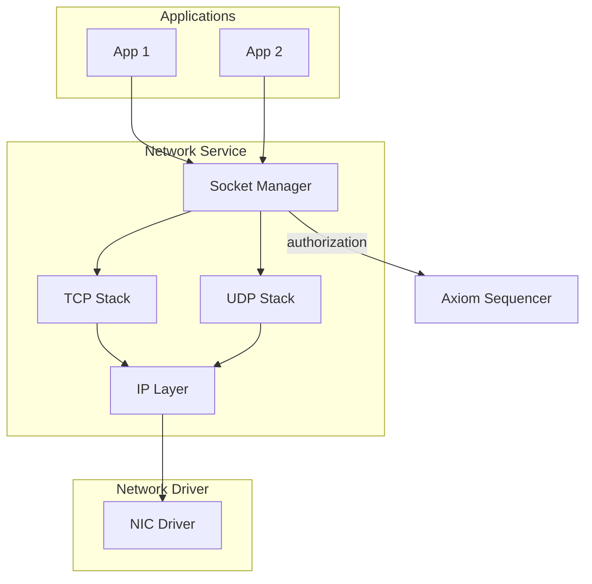
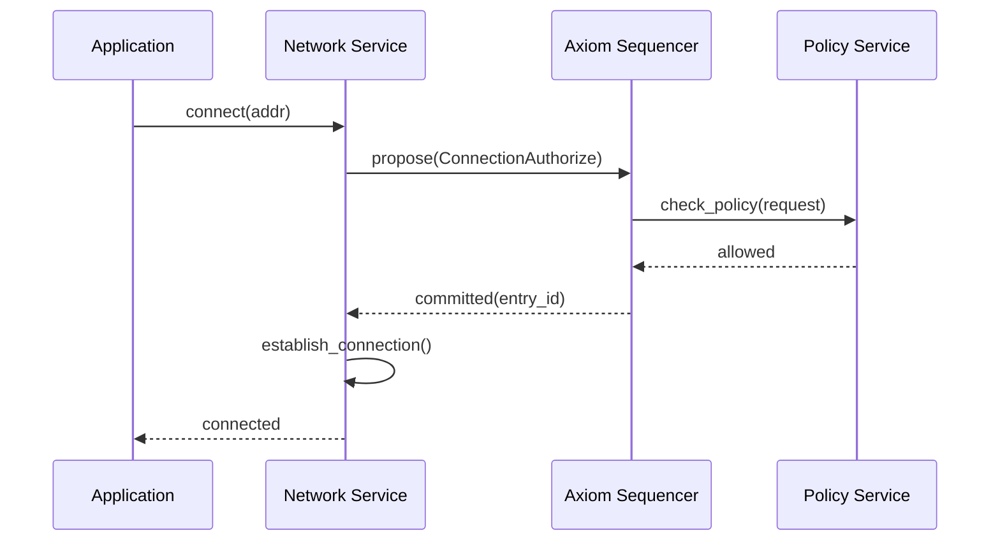
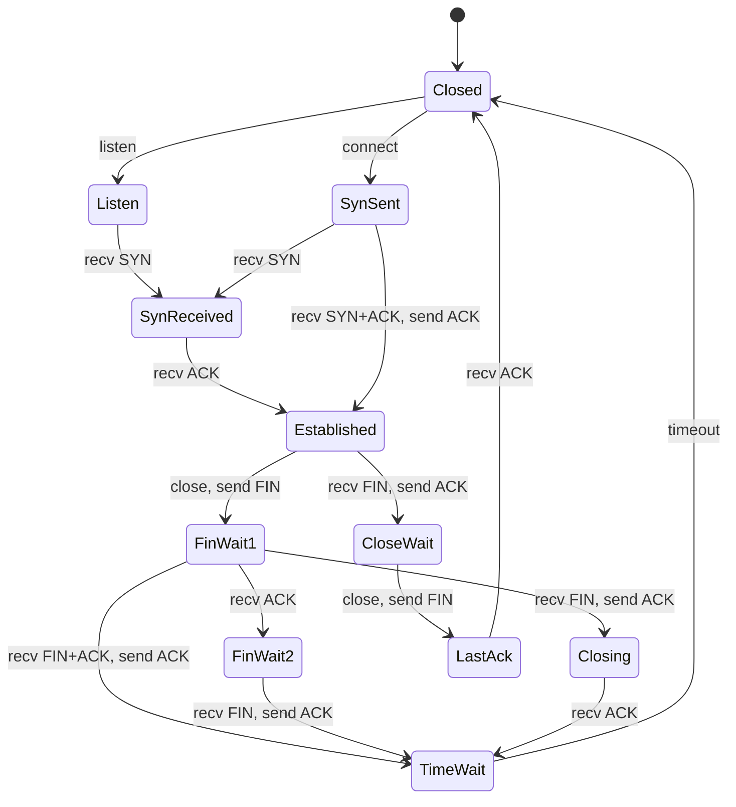

# Networking Specification

**Version:** 1.0  
**Status:** Specification  
**Component:** Network Layer

---

## 1. Overview

The Orbital network stack runs entirely in user space. Network authorization is committed to the Axiom (control-plane), while data-plane traffic is not logged.

---

## 2. Architecture

### 2.1 Network Stack Layers



### 2.2 Control-Plane vs Data-Plane

| Plane | What | Axiom? |
|-------|------|--------|
| Control-plane | Connection authorization, policy changes | Yes |
| Data-plane | Packet transmission/reception | No |

---

## 3. Socket Interface

### 3.1 Socket Types

```rust
/// Socket type
#[derive(Clone, Copy, Debug, PartialEq, Eq)]
pub enum SocketType {
    /// Stream socket (TCP)
    Stream,
    
    /// Datagram socket (UDP)
    Datagram,
    
    /// Raw socket
    Raw,
}

/// Address family
#[derive(Clone, Copy, Debug, PartialEq, Eq)]
pub enum AddressFamily {
    /// IPv4
    Inet,
    
    /// IPv6
    Inet6,
}

/// Socket address
#[derive(Clone, Debug, PartialEq, Eq, Hash, Serialize, Deserialize)]
pub enum SocketAddr {
    V4(SocketAddrV4),
    V6(SocketAddrV6),
}

#[derive(Clone, Debug, PartialEq, Eq, Hash, Serialize, Deserialize)]
pub struct SocketAddrV4 {
    pub ip: [u8; 4],
    pub port: u16,
}

#[derive(Clone, Debug, PartialEq, Eq, Hash, Serialize, Deserialize)]
pub struct SocketAddrV6 {
    pub ip: [u8; 16],
    pub port: u16,
    pub flowinfo: u32,
    pub scope_id: u32,
}
```

### 3.2 Socket Descriptor

```rust
/// Socket state
#[derive(Clone, Debug)]
pub struct Socket {
    /// Socket identifier
    pub id: SocketId,
    
    /// Socket type
    pub socket_type: SocketType,
    
    /// Address family
    pub family: AddressFamily,
    
    /// Local address (if bound)
    pub local_addr: Option<SocketAddr>,
    
    /// Remote address (if connected)
    pub remote_addr: Option<SocketAddr>,
    
    /// Socket state
    pub state: SocketState,
    
    /// Owning process
    pub owner: ProcessId,
    
    /// Socket options
    pub options: SocketOptions,
    
    /// Authorization entry (Axiom reference)
    pub authorization: Option<u64>,
}

#[derive(Clone, Copy, Debug, PartialEq, Eq)]
pub enum SocketState {
    /// Newly created
    Created,
    
    /// Bound to local address
    Bound,
    
    /// Listening for connections
    Listening,
    
    /// Connection in progress
    Connecting,
    
    /// Connected
    Connected,
    
    /// Closing
    Closing,
    
    /// Closed
    Closed,
}
```

### 3.3 Socket Operations

```rust
/// Network service interface
pub trait NetworkService {
    /// Create socket
    fn socket(
        &mut self,
        family: AddressFamily,
        socket_type: SocketType,
    ) -> Result<SocketId, NetError>;
    
    /// Bind to local address
    fn bind(&mut self, socket: SocketId, addr: &SocketAddr) -> Result<(), NetError>;
    
    /// Listen for connections
    fn listen(&mut self, socket: SocketId, backlog: u32) -> Result<(), NetError>;
    
    /// Accept incoming connection
    fn accept(&mut self, socket: SocketId) -> Result<(SocketId, SocketAddr), NetError>;
    
    /// Connect to remote address
    fn connect(&mut self, socket: SocketId, addr: &SocketAddr) -> Result<(), NetError>;
    
    /// Send data
    fn send(&mut self, socket: SocketId, data: &[u8], flags: SendFlags) -> Result<usize, NetError>;
    
    /// Receive data
    fn recv(&mut self, socket: SocketId, buf: &mut [u8], flags: RecvFlags) -> Result<usize, NetError>;
    
    /// Send to specific address (UDP)
    fn sendto(
        &mut self,
        socket: SocketId,
        data: &[u8],
        addr: &SocketAddr,
    ) -> Result<usize, NetError>;
    
    /// Receive with source address (UDP)
    fn recvfrom(
        &mut self,
        socket: SocketId,
        buf: &mut [u8],
    ) -> Result<(usize, SocketAddr), NetError>;
    
    /// Close socket
    fn close(&mut self, socket: SocketId) -> Result<(), NetError>;
    
    /// Get socket option
    fn getsockopt(&self, socket: SocketId, option: SocketOption) -> Result<OptionValue, NetError>;
    
    /// Set socket option
    fn setsockopt(
        &mut self,
        socket: SocketId,
        option: SocketOption,
        value: OptionValue,
    ) -> Result<(), NetError>;
}
```

---

## 4. Connection Authorization

### 4.1 Authorization Model

Every network connection requires Axiom authorization:

```rust
/// Connection authorization request
#[derive(Clone, Debug, Serialize, Deserialize)]
pub struct ConnectionAuthRequest {
    /// Local address
    pub local_addr: SocketAddr,
    
    /// Remote address (for outbound)
    pub remote_addr: Option<SocketAddr>,
    
    /// Protocol
    pub protocol: Protocol,
    
    /// Direction
    pub direction: Direction,
    
    /// Requesting process
    pub process: ProcessId,
    
    /// Requested capabilities
    pub capabilities: ConnectionCapabilities,
}

#[derive(Clone, Copy, Debug, Serialize, Deserialize)]
pub enum Protocol {
    Tcp,
    Udp,
    Icmp,
    Raw { protocol: u8 },
}

#[derive(Clone, Copy, Debug, Serialize, Deserialize)]
pub enum Direction {
    /// Outbound connection
    Outbound,
    
    /// Inbound (listening)
    Inbound,
    
    /// Bidirectional
    Bidirectional,
}

#[derive(Clone, Debug, Serialize, Deserialize)]
pub struct ConnectionCapabilities {
    /// Can send data
    pub send: bool,
    
    /// Can receive data
    pub recv: bool,
    
    /// Bandwidth limit (bytes/sec, 0 = unlimited)
    pub bandwidth_limit: u64,
    
    /// Duration limit (0 = unlimited)
    pub duration_limit: Duration,
}
```

### 4.2 Authorization Flow



### 4.3 Axiom Entries

```rust
/// Network-related Axiom entries
pub enum NetworkAxiomEntry {
    /// Authorize new connection
    ConnectionAuthorize {
        connection_id: ConnectionId,
        local_addr: SocketAddr,
        remote_addr: Option<SocketAddr>,
        protocol: Protocol,
        direction: Direction,
        process: ProcessId,
        capabilities: ConnectionCapabilities,
    },
    
    /// Revoke connection authorization
    ConnectionRevoke {
        connection_id: ConnectionId,
        reason: RevokeReason,
    },
    
    /// Update connection capabilities
    ConnectionUpdate {
        connection_id: ConnectionId,
        old_capabilities: ConnectionCapabilities,
        new_capabilities: ConnectionCapabilities,
    },
    
    /// Network interface configuration
    InterfaceConfig {
        interface: InterfaceId,
        config: InterfaceConfiguration,
    },
    
    /// Routing table update
    RouteUpdate {
        route: Route,
        action: RouteAction,
    },
    
    /// Firewall rule update
    FirewallRule {
        rule: FirewallRule,
        action: RuleAction,
    },
}
```

---

## 5. TCP Implementation

### 5.1 TCP State Machine



### 5.2 TCP Connection Block

```rust
/// TCP connection state
pub struct TcpConnection {
    /// Connection identifier
    pub id: ConnectionId,
    
    /// TCP state
    pub state: TcpState,
    
    /// Local endpoint
    pub local: SocketAddr,
    
    /// Remote endpoint
    pub remote: SocketAddr,
    
    /// Send sequence state
    pub send: TcpSendState,
    
    /// Receive sequence state
    pub recv: TcpRecvState,
    
    /// Retransmission timer
    pub rto: Duration,
    
    /// Congestion window
    pub cwnd: u32,
    
    /// Slow start threshold
    pub ssthresh: u32,
    
    /// Send buffer
    pub send_buffer: RingBuffer,
    
    /// Receive buffer
    pub recv_buffer: RingBuffer,
}

#[derive(Clone, Debug)]
pub struct TcpSendState {
    /// Initial sequence number
    pub iss: u32,
    
    /// Unacknowledged sequence number
    pub una: u32,
    
    /// Next sequence number
    pub nxt: u32,
    
    /// Send window
    pub wnd: u16,
}

#[derive(Clone, Debug)]
pub struct TcpRecvState {
    /// Initial receive sequence number
    pub irs: u32,
    
    /// Next expected sequence number
    pub nxt: u32,
    
    /// Receive window
    pub wnd: u16,
}
```

---

## 6. UDP Implementation

### 6.1 UDP Socket

```rust
/// UDP socket state
pub struct UdpSocket {
    /// Socket identifier
    pub id: SocketId,
    
    /// Local address
    pub local: SocketAddr,
    
    /// Connected remote (optional)
    pub connected: Option<SocketAddr>,
    
    /// Receive queue
    pub recv_queue: VecDeque<UdpDatagram>,
    
    /// Maximum receive queue size
    pub recv_queue_limit: usize,
}

#[derive(Clone, Debug)]
pub struct UdpDatagram {
    /// Source address
    pub src: SocketAddr,
    
    /// Destination address
    pub dst: SocketAddr,
    
    /// Payload
    pub data: Vec<u8>,
}
```

---

## 7. IP Layer

### 7.1 IP Packet Processing

```rust
/// IP layer
pub struct IpLayer {
    /// Routing table
    routes: RoutingTable,
    
    /// Interface table
    interfaces: Vec<NetworkInterface>,
    
    /// ARP cache
    arp_cache: ArpCache,
    
    /// Fragment reassembly
    fragments: FragmentTable,
}

impl IpLayer {
    /// Send IP packet
    pub fn send(&mut self, packet: IpPacket, dest: IpAddr) -> Result<(), IpError> {
        // Find route
        let route = self.routes.lookup(&dest)
            .ok_or(IpError::NoRoute)?;
        
        // Get next hop
        let next_hop = route.gateway.unwrap_or(dest);
        
        // Get interface
        let iface = &self.interfaces[route.interface];
        
        // Resolve MAC address
        let mac = self.arp_cache.resolve(&next_hop)
            .ok_or(IpError::ArpPending)?;
        
        // Create Ethernet frame and send
        let frame = EthernetFrame {
            dst: mac,
            src: iface.mac,
            ethertype: EtherType::Ipv4,
            payload: packet.to_bytes(),
        };
        
        iface.send(frame)?;
        
        Ok(())
    }
    
    /// Receive IP packet
    pub fn receive(&mut self, frame: EthernetFrame) -> Result<IpPacket, IpError> {
        // Parse IP header
        let packet = IpPacket::parse(&frame.payload)?;
        
        // Check if destined for us
        if !self.is_local(&packet.dst) {
            return Err(IpError::NotForUs);
        }
        
        // Handle fragmentation
        if packet.is_fragment() {
            return self.reassemble(packet);
        }
        
        Ok(packet)
    }
}
```

### 7.2 Routing Table

```rust
/// Routing table entry
#[derive(Clone, Debug)]
pub struct Route {
    /// Destination network
    pub destination: IpNetwork,
    
    /// Gateway (None = direct)
    pub gateway: Option<IpAddr>,
    
    /// Interface index
    pub interface: usize,
    
    /// Metric (lower = preferred)
    pub metric: u32,
}

/// Routing table
pub struct RoutingTable {
    routes: Vec<Route>,
}

impl RoutingTable {
    /// Lookup route for destination
    pub fn lookup(&self, dest: &IpAddr) -> Option<&Route> {
        self.routes
            .iter()
            .filter(|r| r.destination.contains(dest))
            .min_by_key(|r| r.metric)
    }
}
```

---

## 8. Network Interface

### 8.1 Interface Structure

```rust
/// Network interface
pub struct NetworkInterface {
    /// Interface identifier
    pub id: InterfaceId,
    
    /// Interface name
    pub name: String,
    
    /// MAC address
    pub mac: MacAddress,
    
    /// IP addresses
    pub addresses: Vec<InterfaceAddress>,
    
    /// MTU
    pub mtu: u32,
    
    /// Interface flags
    pub flags: InterfaceFlags,
    
    /// Driver endpoint
    pub driver: EndpointId,
    
    /// Statistics
    pub stats: InterfaceStats,
}

#[derive(Clone, Debug)]
pub struct InterfaceAddress {
    pub addr: IpAddr,
    pub prefix_len: u8,
}

#[derive(Clone, Copy, Debug)]
pub struct InterfaceFlags {
    pub up: bool,
    pub broadcast: bool,
    pub multicast: bool,
    pub loopback: bool,
}
```

---

## 9. Idempotent Network Operations

### 9.1 Idempotency Requirements

Network effects must be idempotent or compensatable:

| Operation | Idempotent? | Strategy |
|-----------|-------------|----------|
| TCP connect | No | Use connection ID |
| TCP send | No | Use sequence numbers |
| UDP send | Yes | Can retry safely |
| Connection close | Yes | Idempotent |

### 9.2 Compensation Protocol

For non-idempotent operations:

```rust
/// Network effect with compensation
#[derive(Clone, Debug)]
pub struct NetworkEffect {
    /// Effect type
    pub effect: NetworkEffectType,
    
    /// Compensation action (if needed)
    pub compensation: Option<CompensationAction>,
    
    /// Idempotency token
    pub token: IdempotencyToken,
}

#[derive(Clone, Debug)]
pub enum CompensationAction {
    /// Close connection
    CloseConnection { connection_id: ConnectionId },
    
    /// Send reset
    SendReset { connection_id: ConnectionId },
    
    /// Log failure (no compensation possible)
    LogFailure { description: String },
}
```

---

## 10. Security

### 10.1 Network Policy

```rust
/// Network policy rule
#[derive(Clone, Debug, Serialize, Deserialize)]
pub struct NetworkPolicy {
    /// Rule identifier
    pub id: PolicyId,
    
    /// Match criteria
    pub match_criteria: MatchCriteria,
    
    /// Action
    pub action: PolicyAction,
    
    /// Priority
    pub priority: u32,
}

#[derive(Clone, Debug, Serialize, Deserialize)]
pub struct MatchCriteria {
    /// Source address filter
    pub src_addr: Option<IpNetwork>,
    
    /// Destination address filter
    pub dst_addr: Option<IpNetwork>,
    
    /// Source port filter
    pub src_port: Option<PortRange>,
    
    /// Destination port filter
    pub dst_port: Option<PortRange>,
    
    /// Protocol filter
    pub protocol: Option<Protocol>,
    
    /// Process filter
    pub process: Option<ProcessId>,
}

#[derive(Clone, Copy, Debug, Serialize, Deserialize)]
pub enum PolicyAction {
    /// Allow connection
    Allow,
    
    /// Deny connection
    Deny,
    
    /// Require additional authorization
    RequireAuth,
    
    /// Log and allow
    LogAllow,
    
    /// Log and deny
    LogDeny,
}
```

---

## 11. Error Handling

```rust
/// Network errors
#[derive(Clone, Debug, Serialize, Deserialize)]
pub enum NetError {
    /// Socket not found
    SocketNotFound,
    
    /// Address in use
    AddressInUse,
    
    /// Connection refused
    ConnectionRefused,
    
    /// Connection reset
    ConnectionReset,
    
    /// Connection timeout
    Timeout,
    
    /// Network unreachable
    NetworkUnreachable,
    
    /// Host unreachable
    HostUnreachable,
    
    /// Permission denied
    PermissionDenied,
    
    /// Authorization required
    AuthorizationRequired,
    
    /// Would block
    WouldBlock,
    
    /// Invalid argument
    InvalidArgument,
    
    /// Buffer too small
    BufferTooSmall,
}
```

---

*[← Filesystem and Storage](06-filesystem-and-storage.md) | [Terminal →](08-terminal.md)*
