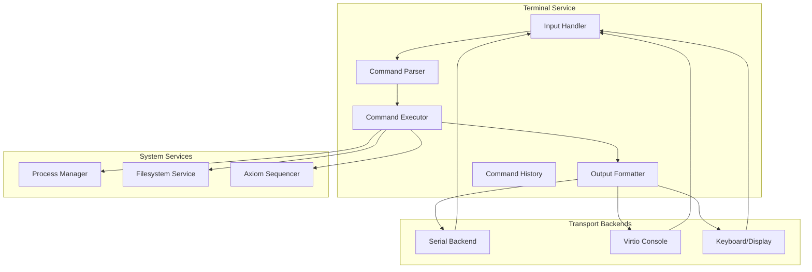
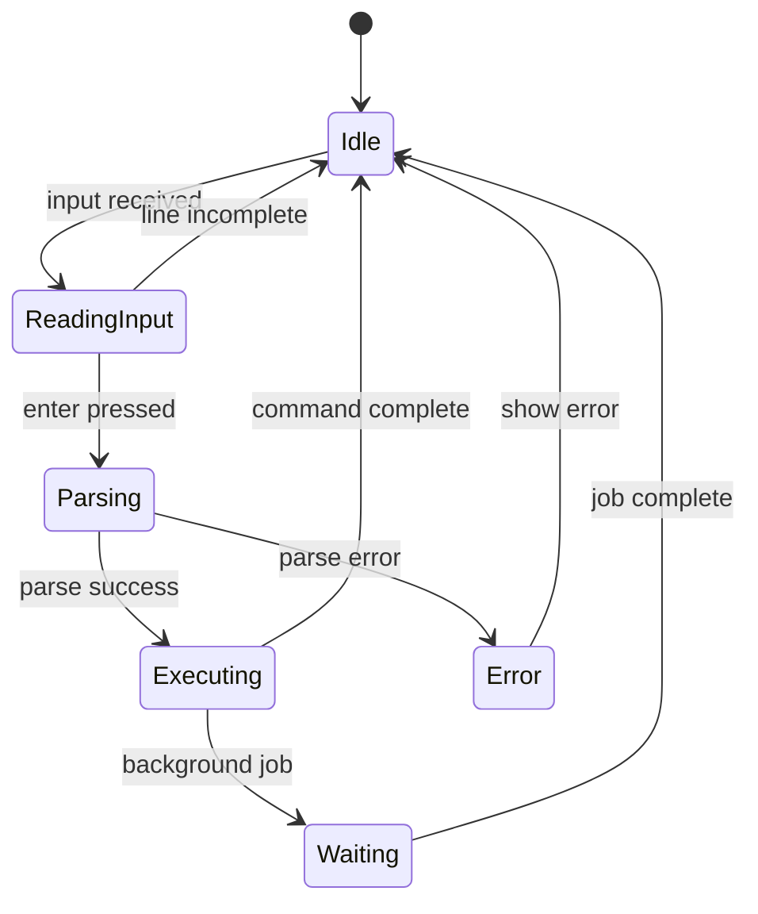

# Terminal Specification

**Version:** 1.0  
**Status:** Specification  
**Component:** User Interface

---

## 1. Overview

The Terminal Service is a mandatory component providing user interaction from the earliest boot stage. It supports command input, output display, Axiom inspection, and job execution across all environments (hosted, QEMU, bare metal).

---

## 2. Requirements

### 2.1 Mandatory Features

| Feature | Description |
|---------|-------------|
| Command input | Accept text commands from user |
| Output display | Show stdout/stderr from commands |
| Axiom inspection | Browse and query Axiom entries |
| Job execution | Submit and monitor jobs |
| Multi-environment | Work in hosted, QEMU, bare metal |

### 2.2 Environment Support

| Environment | Transport | Features |
|-------------|-----------|----------|
| Hosted | stdin/stdout | Full terminal emulation |
| QEMU | Serial / virtio-console | Basic terminal |
| Bare metal | Serial / keyboard+display | Basic terminal |

---

## 3. Terminal Architecture

### 3.1 Component Diagram



### 3.2 Terminal State

```rust
/// Terminal service state
pub struct Terminal {
    /// Transport backend
    backend: Box<dyn TerminalBackend>,
    
    /// Current line buffer
    line_buffer: String,
    
    /// Cursor position
    cursor_pos: usize,
    
    /// Command history
    history: CommandHistory,
    
    /// Current working directory
    cwd: Path,
    
    /// Environment variables
    env: HashMap<String, String>,
    
    /// Running jobs
    jobs: HashMap<JobId, JobHandle>,
    
    /// Prompt configuration
    prompt: PromptConfig,
}

/// Terminal backend trait
pub trait TerminalBackend: Send {
    /// Read input (non-blocking)
    fn read(&mut self) -> Result<Option<TerminalInput>, TerminalError>;
    
    /// Write output
    fn write(&mut self, data: &[u8]) -> Result<(), TerminalError>;
    
    /// Get terminal size
    fn size(&self) -> (u16, u16);
    
    /// Check if backend supports ANSI
    fn supports_ansi(&self) -> bool;
}

/// Terminal input event
pub enum TerminalInput {
    /// Regular character
    Char(char),
    
    /// Special key
    Key(SpecialKey),
    
    /// Paste data
    Paste(String),
}

#[derive(Clone, Copy, Debug)]
pub enum SpecialKey {
    Enter,
    Backspace,
    Delete,
    Tab,
    Up,
    Down,
    Left,
    Right,
    Home,
    End,
    CtrlC,
    CtrlD,
    CtrlL,
}
```

---

## 4. Command Interface

### 4.1 Built-in Commands

| Command | Description |
|---------|-------------|
| `help` | Display help information |
| `cd` | Change current directory |
| `ls` | List directory contents |
| `cat` | Display file contents |
| `echo` | Print arguments |
| `env` | Display/set environment |
| `pwd` | Print working directory |
| `clear` | Clear screen |
| `exit` | Exit terminal |

### 4.2 Axiom Commands

| Command | Description |
|---------|-------------|
| `axiom status` | Show Axiom status |
| `axiom tail [n]` | Show last n entries |
| `axiom show <id>` | Show specific entry |
| `axiom search <query>` | Search entries |
| `axiom verify <range>` | Verify entry range |

### 4.3 Job Commands

| Command | Description |
|---------|-------------|
| `job submit <manifest>` | Submit job |
| `job status <id>` | Show job status |
| `job list` | List jobs |
| `job cancel <id>` | Cancel job |
| `job output <id>` | Show job output |

### 4.4 Service Commands

| Command | Description |
|---------|-------------|
| `service list` | List services |
| `service status <name>` | Show service status |
| `service start <name>` | Start service |
| `service stop <name>` | Stop service |
| `service restart <name>` | Restart service |

### 4.5 System Commands

| Command | Description |
|---------|-------------|
| `ps` | List processes |
| `kill <pid>` | Kill process |
| `shutdown` | Shutdown system |
| `reboot` | Reboot system |
| `version` | Show system version |
| `uptime` | Show system uptime |

---

## 5. Command Parsing

### 5.1 Command Grammar

```
command     := command_name args*
command_name := word
args        := arg*
arg         := word | quoted_string | variable
word        := [a-zA-Z0-9_\-./]+
quoted_string := '"' [^"]* '"' | "'" [^']* "'"
variable    := '$' word | '${' word '}'
```

### 5.2 Command Parser

```rust
/// Parsed command
#[derive(Clone, Debug)]
pub struct ParsedCommand {
    /// Command name
    pub name: String,
    
    /// Arguments
    pub args: Vec<String>,
    
    /// Environment overrides
    pub env: HashMap<String, String>,
    
    /// Input redirection
    pub stdin: Option<Redirection>,
    
    /// Output redirection
    pub stdout: Option<Redirection>,
    
    /// Error redirection
    pub stderr: Option<Redirection>,
    
    /// Run in background
    pub background: bool,
}

#[derive(Clone, Debug)]
pub enum Redirection {
    /// Redirect to file
    File { path: Path, append: bool },
    
    /// Redirect to/from pipe
    Pipe { job_id: JobId },
}

impl CommandParser {
    /// Parse command line
    pub fn parse(&self, line: &str, env: &HashMap<String, String>) -> Result<ParsedCommand, ParseError> {
        let tokens = self.tokenize(line)?;
        let expanded = self.expand_variables(&tokens, env)?;
        let parsed = self.parse_tokens(&expanded)?;
        Ok(parsed)
    }
    
    fn tokenize(&self, line: &str) -> Result<Vec<Token>, ParseError> {
        let mut tokens = Vec::new();
        let mut chars = line.chars().peekable();
        
        while let Some(&c) = chars.peek() {
            match c {
                ' ' | '\t' => { chars.next(); }
                '"' => tokens.push(self.parse_double_quoted(&mut chars)?),
                '\'' => tokens.push(self.parse_single_quoted(&mut chars)?),
                '$' => tokens.push(self.parse_variable(&mut chars)?),
                '|' => { chars.next(); tokens.push(Token::Pipe); }
                '>' => tokens.push(self.parse_redirect(&mut chars)?),
                '<' => { chars.next(); tokens.push(Token::RedirectIn); }
                '&' => { chars.next(); tokens.push(Token::Background); }
                _ => tokens.push(self.parse_word(&mut chars)?),
            }
        }
        
        Ok(tokens)
    }
}
```

---

## 6. Command Execution

### 6.1 Executor

```rust
/// Command executor
pub struct CommandExecutor {
    /// Process manager client
    process_manager: ProcessManagerClient,
    
    /// Filesystem client
    filesystem: FilesystemClient,
    
    /// Axiom client
    axiom: AxiomClient,
    
    /// Service supervisor client
    supervisor: SupervisorClient,
}

impl CommandExecutor {
    /// Execute a parsed command
    pub fn execute(
        &mut self,
        cmd: &ParsedCommand,
        terminal: &mut Terminal,
    ) -> Result<ExitStatus, ExecError> {
        // Check for built-in command
        if let Some(builtin) = self.get_builtin(&cmd.name) {
            return builtin(cmd, terminal);
        }
        
        // External command - spawn process
        let params = ProcessCreateParams {
            image: self.resolve_command(&cmd.name)?,
            args: cmd.args.clone(),
            env: cmd.env.clone(),
            cwd: terminal.cwd.clone(),
            stdin: cmd.stdin.clone(),
            stdout: cmd.stdout.clone(),
            stderr: cmd.stderr.clone(),
        };
        
        let pid = self.process_manager.spawn(params)?;
        
        if cmd.background {
            terminal.jobs.insert(JobId::new(), JobHandle { pid, status: None });
            return Ok(ExitStatus::Success);
        }
        
        // Wait for completion
        let status = self.process_manager.wait(pid)?;
        Ok(status)
    }
    
    /// Get built-in command handler
    fn get_builtin(&self, name: &str) -> Option<BuiltinFn> {
        match name {
            "cd" => Some(builtin_cd),
            "pwd" => Some(builtin_pwd),
            "echo" => Some(builtin_echo),
            "exit" => Some(builtin_exit),
            "help" => Some(builtin_help),
            "clear" => Some(builtin_clear),
            "env" => Some(builtin_env),
            "axiom" => Some(builtin_axiom),
            "job" => Some(builtin_job),
            "service" => Some(builtin_service),
            _ => None,
        }
    }
}
```

### 6.2 Built-in Command Examples

```rust
/// Change directory
fn builtin_cd(cmd: &ParsedCommand, terminal: &mut Terminal) -> Result<ExitStatus, ExecError> {
    let path = cmd.args.get(0)
        .map(|s| Path::parse(s))
        .transpose()?
        .unwrap_or_else(|| Path::parse("/").unwrap());
    
    let resolved = if path.is_absolute() {
        path
    } else {
        terminal.cwd.join(&path.to_string())?
    };
    
    // Check directory exists
    let entry = terminal.filesystem.lookup(&resolved)?;
    if entry.entry_type != EntryType::Directory {
        return Err(ExecError::NotDirectory);
    }
    
    terminal.cwd = resolved;
    Ok(ExitStatus::Success)
}

/// Show Axiom entries
fn builtin_axiom(cmd: &ParsedCommand, terminal: &mut Terminal) -> Result<ExitStatus, ExecError> {
    let subcmd = cmd.args.get(0).map(|s| s.as_str()).unwrap_or("status");
    
    match subcmd {
        "status" => {
            let status = terminal.axiom.status()?;
            terminal.println(&format!("Axiom entries: {}", status.entry_count));
            terminal.println(&format!("Last entry: {}", status.last_sequence));
            terminal.println(&format!("Last hash: {}", status.last_hash));
        }
        "tail" => {
            let count: u64 = cmd.args.get(1)
                .and_then(|s| s.parse().ok())
                .unwrap_or(10);
            
            let entries = terminal.axiom.tail(count)?;
            for entry in entries {
                terminal.println(&format_axiom_entry(&entry));
            }
        }
        "show" => {
            let id: u64 = cmd.args.get(1)
                .ok_or(ExecError::MissingArgument)?
                .parse()
                .map_err(|_| ExecError::InvalidArgument)?;
            
            let entry = terminal.axiom.get(id)?;
            terminal.println(&format_axiom_entry_detail(&entry));
        }
        _ => {
            terminal.println(&format!("Unknown axiom command: {}", subcmd));
            return Ok(ExitStatus::Failure(1));
        }
    }
    
    Ok(ExitStatus::Success)
}
```

---

## 7. Output Formatting

### 7.1 Output Interface

```rust
/// Terminal output
impl Terminal {
    /// Print line
    pub fn println(&mut self, s: &str) {
        self.print(s);
        self.print("\n");
    }
    
    /// Print string
    pub fn print(&mut self, s: &str) {
        let bytes = if self.backend.supports_ansi() {
            s.as_bytes().to_vec()
        } else {
            self.strip_ansi(s)
        };
        
        self.backend.write(&bytes).ok();
    }
    
    /// Print with color (if supported)
    pub fn print_colored(&mut self, s: &str, color: Color) {
        if self.backend.supports_ansi() {
            let ansi = color.to_ansi();
            self.print(&format!("{}{}\x1b[0m", ansi, s));
        } else {
            self.print(s);
        }
    }
    
    /// Print error
    pub fn print_error(&mut self, s: &str) {
        self.print_colored(s, Color::Red);
        self.print("\n");
    }
    
    /// Clear screen
    pub fn clear(&mut self) {
        if self.backend.supports_ansi() {
            self.print("\x1b[2J\x1b[H");
        }
    }
}

#[derive(Clone, Copy, Debug)]
pub enum Color {
    Black,
    Red,
    Green,
    Yellow,
    Blue,
    Magenta,
    Cyan,
    White,
}

impl Color {
    fn to_ansi(&self) -> &'static str {
        match self {
            Color::Black => "\x1b[30m",
            Color::Red => "\x1b[31m",
            Color::Green => "\x1b[32m",
            Color::Yellow => "\x1b[33m",
            Color::Blue => "\x1b[34m",
            Color::Magenta => "\x1b[35m",
            Color::Cyan => "\x1b[36m",
            Color::White => "\x1b[37m",
        }
    }
}
```

### 7.2 Formatting Helpers

```rust
/// Format Axiom entry for display
fn format_axiom_entry(entry: &AxiomEntry) -> String {
    format!(
        "{:>8} {} {} {}",
        entry.header.sequence,
        format_timestamp(entry.header.timestamp),
        entry.header.entry_type,
        entry.header.payload_hash.short(),
    )
}

/// Format file listing
fn format_file_entry(entry: &DirEntry) -> String {
    let type_char = match entry.entry_type {
        EntryType::File => '-',
        EntryType::Directory => 'd',
        EntryType::Symlink => 'l',
        EntryType::Device { .. } => 'c',
    };
    
    format!(
        "{}{} {:>8} {} {}",
        type_char,
        format_permissions(&entry.metadata.permissions),
        entry.metadata.size,
        format_timestamp(entry.metadata.modified_at),
        entry.name,
    )
}

/// Format job status
fn format_job_status(job: &Job) -> String {
    let status = match &job.state {
        JobState::Submitted => "SUBMITTED",
        JobState::Validated => "VALIDATED",
        JobState::Scheduled => "SCHEDULED",
        JobState::Running { .. } => "RUNNING",
        JobState::Completed { .. } => "COMPLETED",
        JobState::Failed { .. } => "FAILED",
        JobState::Verified { .. } => "VERIFIED",
        JobState::Cancelled => "CANCELLED",
    };
    
    format!("{:>12} {:>10} {}", job.id, status, job.manifest.name)
}
```

---

## 8. Command History

### 8.1 History Management

```rust
/// Command history
pub struct CommandHistory {
    /// History entries
    entries: VecDeque<String>,
    
    /// Maximum history size
    max_size: usize,
    
    /// Current position (for navigation)
    position: Option<usize>,
}

impl CommandHistory {
    /// Add entry to history
    pub fn add(&mut self, command: String) {
        // Don't add duplicates of last entry
        if self.entries.back() == Some(&command) {
            return;
        }
        
        // Don't add empty commands
        if command.trim().is_empty() {
            return;
        }
        
        self.entries.push_back(command);
        
        // Trim to max size
        while self.entries.len() > self.max_size {
            self.entries.pop_front();
        }
        
        self.position = None;
    }
    
    /// Navigate up in history
    pub fn up(&mut self) -> Option<&str> {
        let len = self.entries.len();
        if len == 0 {
            return None;
        }
        
        self.position = Some(match self.position {
            None => len - 1,
            Some(0) => 0,
            Some(n) => n - 1,
        });
        
        self.entries.get(self.position.unwrap()).map(|s| s.as_str())
    }
    
    /// Navigate down in history
    pub fn down(&mut self) -> Option<&str> {
        let len = self.entries.len();
        
        self.position = match self.position {
            None => return None,
            Some(n) if n >= len - 1 => {
                self.position = None;
                return None;
            }
            Some(n) => Some(n + 1),
        };
        
        self.entries.get(self.position.unwrap()).map(|s| s.as_str())
    }
    
    /// Search history
    pub fn search(&self, prefix: &str) -> Option<&str> {
        self.entries.iter()
            .rev()
            .find(|s| s.starts_with(prefix))
            .map(|s| s.as_str())
    }
}
```

---

## 9. Transport Backends

### 9.1 Serial Backend

```rust
/// Serial port terminal backend
pub struct SerialBackend {
    /// Serial port
    port: SerialPort,
    
    /// Input buffer
    input_buffer: VecDeque<u8>,
    
    /// Baud rate
    baud_rate: u32,
}

impl TerminalBackend for SerialBackend {
    fn read(&mut self) -> Result<Option<TerminalInput>, TerminalError> {
        // Read available bytes
        let mut buf = [0u8; 64];
        match self.port.read(&mut buf) {
            Ok(0) => Ok(None),
            Ok(n) => {
                self.input_buffer.extend(&buf[..n]);
                self.parse_input()
            }
            Err(e) if e.kind() == io::ErrorKind::WouldBlock => Ok(None),
            Err(e) => Err(TerminalError::Io(e)),
        }
    }
    
    fn write(&mut self, data: &[u8]) -> Result<(), TerminalError> {
        self.port.write_all(data)?;
        Ok(())
    }
    
    fn size(&self) -> (u16, u16) {
        (80, 25) // Default VT100 size
    }
    
    fn supports_ansi(&self) -> bool {
        true // Most serial terminals support ANSI
    }
}
```

### 9.2 Virtio Console Backend

```rust
/// Virtio console backend
pub struct VirtioConsoleBackend {
    /// Virtio device
    device: VirtioConsole,
    
    /// Input queue
    input_queue: VecDeque<u8>,
}

impl TerminalBackend for VirtioConsoleBackend {
    fn read(&mut self) -> Result<Option<TerminalInput>, TerminalError> {
        if let Some(data) = self.device.receive()? {
            self.input_queue.extend(data);
        }
        self.parse_input()
    }
    
    fn write(&mut self, data: &[u8]) -> Result<(), TerminalError> {
        self.device.send(data)?;
        Ok(())
    }
    
    fn size(&self) -> (u16, u16) {
        self.device.get_size().unwrap_or((80, 25))
    }
    
    fn supports_ansi(&self) -> bool {
        true
    }
}
```

---

## 10. Terminal State Machine



---

## 11. Error Handling

```rust
/// Terminal errors
#[derive(Clone, Debug)]
pub enum TerminalError {
    /// I/O error
    Io(String),
    
    /// Parse error
    Parse(ParseError),
    
    /// Execution error
    Exec(ExecError),
    
    /// Backend not available
    BackendUnavailable,
}

#[derive(Clone, Debug)]
pub enum ExecError {
    /// Command not found
    CommandNotFound(String),
    
    /// Missing argument
    MissingArgument,
    
    /// Invalid argument
    InvalidArgument,
    
    /// Permission denied
    PermissionDenied,
    
    /// Not a directory
    NotDirectory,
    
    /// File not found
    FileNotFound,
    
    /// Service error
    ServiceError(String),
}
```

---

*[← Verification and Receipts](../06-execution/02-verification.md) | [Update Manager →](02-update-manager.md)*
