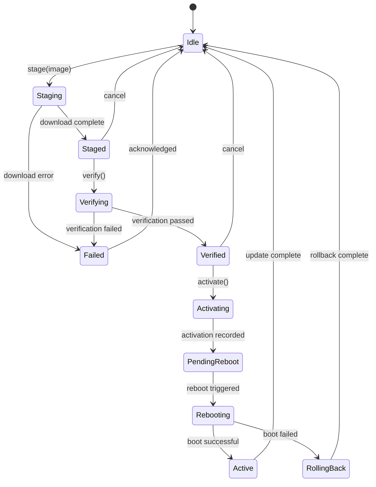
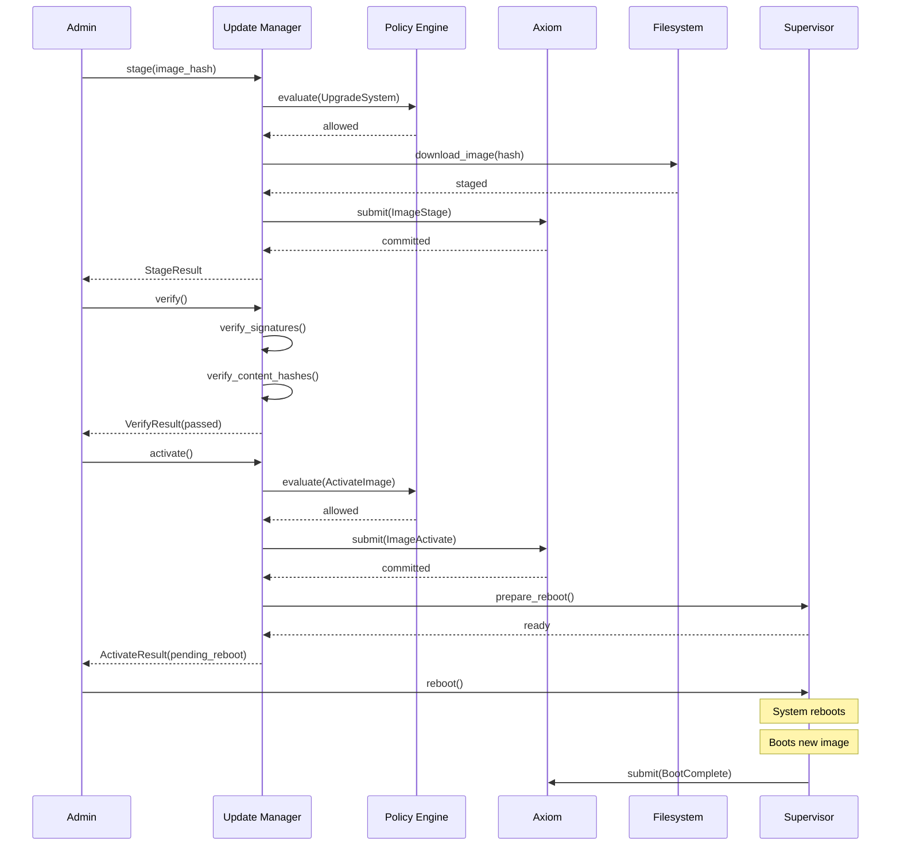

# Update Manager Specification

**Version:** 1.0  
**Status:** Specification  
**Component:** Layer 7 - User-Facing Services

---

## 1. Overview

The Update Manager handles **atomic system image updates** with rollback capability. All updates are recorded in the Axiom and require policy authorization.

### 1.1 Position in Architecture

| Layer | Component | Relationship |
|-------|-----------|--------------|
| Layer 2 | Policy Engine | Authorizes update operations |
| Layer 2 | Axiom | Records update transactions |
| Layer 4 | Filesystem | Stores system images |
| **Layer 7** | **Update Manager** | **Orchestrates updates** |

---

## 2. Update Model

### 2.1 Immutable System Images

System software is delivered as immutable, content-addressed images:

```rust
/// System image structure
#[derive(Clone, Debug, Serialize, Deserialize)]
pub struct SystemImage {
    /// Content hash of the entire image
    pub hash: ContentHash,
    
    /// Image version
    pub version: Version,
    
    /// Image manifest
    pub manifest: ImageManifest,
    
    /// Cryptographic signature
    pub signature: Signature,
    
    /// Signing identity
    pub signer: IdentityId,
}

#[derive(Clone, Debug, Serialize, Deserialize)]
pub struct ImageManifest {
    /// Kernel binary hash
    pub kernel: ContentHash,
    
    /// Init binary hash
    pub init: ContentHash,
    
    /// Service binaries
    pub services: BTreeMap<String, ContentHash>,
    
    /// Driver binaries
    pub drivers: BTreeMap<String, ContentHash>,
    
    /// Configuration
    pub config: ContentHash,
    
    /// Build timestamp
    pub built_at: Timestamp,
    
    /// Build reproducibility hash
    pub build_hash: ContentHash,
}
```

### 2.2 Image Storage

```
/system/
├── images/
│   ├── current → v1.2.3/        # Symlink to active image
│   ├── v1.2.3/                  # Previous image (for rollback)
│   │   ├── manifest.toml
│   │   ├── kernel
│   │   ├── init
│   │   └── services/
│   └── v1.2.4/                  # New image (staged)
│       ├── manifest.toml
│       ├── kernel
│       ├── init
│       └── services/
└── state/                       # Mutable state (preserved across updates)
    ├── axiom/
    ├── config/
    └── data/
```

---

## 3. Update Manager Interface

```rust
/// Update Manager interface
pub trait UpdateManager {
    /// Stage a new system image
    fn stage(
        &mut self,
        image: ContentHash,
        auth: AuthToken,
    ) -> Result<StageResult, UpdateError>;
    
    /// Verify a staged image
    fn verify(
        &self,
        image: ContentHash,
    ) -> Result<VerifyResult, UpdateError>;
    
    /// Activate a staged image (requires reboot)
    fn activate(
        &mut self,
        image: ContentHash,
        auth: AuthToken,
    ) -> Result<ActivateResult, UpdateError>;
    
    /// Rollback to previous image
    fn rollback(
        &mut self,
        auth: AuthToken,
    ) -> Result<RollbackResult, UpdateError>;
    
    /// Get current image info
    fn current(&self) -> Result<SystemImage, UpdateError>;
    
    /// List available images
    fn list(&self) -> Result<Vec<SystemImage>, UpdateError>;
    
    /// Garbage collect old images
    fn gc(
        &mut self,
        keep: u32,  // Number of images to keep
        auth: AuthToken,
    ) -> Result<GcResult, UpdateError>;
}
```

---

## 4. Update Lifecycle

### 4.1 State Machine



### 4.2 Update Flow



---

## 5. Staging

### 5.1 Stage Request

```rust
#[derive(Clone, Debug, Serialize, Deserialize)]
pub struct StageRequest {
    /// Image content hash
    pub image: ContentHash,
    
    /// Source (where to download from)
    pub source: ImageSource,
    
    /// Verification options
    pub verify_options: VerifyOptions,
}

#[derive(Clone, Debug, Serialize, Deserialize)]
pub enum ImageSource {
    /// Local content store
    Local,
    
    /// Remote URL
    Remote { url: String },
    
    /// Peer node
    Peer { node: NodeId },
}
```

### 5.2 Stage Process

```rust
impl UpdateManager {
    fn stage(
        &mut self,
        request: StageRequest,
        auth: AuthToken,
    ) -> Result<StageResult, UpdateError> {
        // 1. Request policy authorization
        let decision = self.policy_engine.evaluate(PolicyRequest {
            requestor: auth.identity,
            action: PolicyAction::UpgradeSystem {
                image: request.image,
            },
            ..Default::default()
        })?;
        
        if !decision.is_allowed() {
            return Err(UpdateError::PolicyDenied(decision));
        }
        
        // 2. Download/copy image to staging area
        let image_path = self.download_image(&request)?;
        
        // 3. Verify manifest signature
        let manifest = self.load_manifest(&image_path)?;
        self.verify_manifest_signature(&manifest)?;
        
        // 4. Record staging in Axiom
        let axiom_ref = self.axiom.submit(AxiomEntry::ImageStage {
            image: request.image,
            version: manifest.version,
            staged_by: auth.identity,
        })?;
        
        Ok(StageResult {
            image: request.image,
            version: manifest.version,
            axiom_ref,
        })
    }
}
```

---

## 6. Verification

### 6.1 Verification Checks

```rust
impl UpdateManager {
    fn verify(&self, image: ContentHash) -> Result<VerifyResult, UpdateError> {
        let image_path = self.staged_path(&image);
        let manifest = self.load_manifest(&image_path)?;
        
        let mut checks = Vec::new();
        
        // 1. Verify manifest signature
        checks.push(self.check_manifest_signature(&manifest)?);
        
        // 2. Verify all component hashes
        checks.push(self.check_kernel_hash(&image_path, &manifest)?);
        checks.push(self.check_init_hash(&image_path, &manifest)?);
        
        for (name, hash) in &manifest.services {
            checks.push(self.check_service_hash(&image_path, name, hash)?);
        }
        
        // 3. Verify signing identity is authorized
        checks.push(self.check_signer_authorized(&manifest)?);
        
        // 4. Verify version is newer (optional)
        if let Some(check) = self.check_version_newer(&manifest)? {
            checks.push(check);
        }
        
        // 5. Verify compatibility
        checks.push(self.check_compatibility(&manifest)?);
        
        let passed = checks.iter().all(|c| c.passed);
        
        Ok(VerifyResult {
            image,
            passed,
            checks,
        })
    }
}

#[derive(Clone, Debug)]
pub struct VerifyCheck {
    pub name: String,
    pub passed: bool,
    pub message: Option<String>,
}
```

---

## 7. Activation

### 7.1 Atomic Activation

```rust
impl UpdateManager {
    fn activate(
        &mut self,
        image: ContentHash,
        auth: AuthToken,
    ) -> Result<ActivateResult, UpdateError> {
        // 1. Verify image is staged and verified
        let staged = self.get_staged(&image)?;
        if !staged.verified {
            return Err(UpdateError::NotVerified);
        }
        
        // 2. Request policy authorization
        let decision = self.policy_engine.evaluate(PolicyRequest {
            requestor: auth.identity,
            action: PolicyAction::ActivateImage { image },
            ..Default::default()
        })?;
        
        if !decision.is_allowed() {
            return Err(UpdateError::PolicyDenied(decision));
        }
        
        // 3. Record activation in Axiom
        let axiom_ref = self.axiom.submit(AxiomEntry::ImageActivate {
            image,
            previous: self.current_image()?,
            activated_by: auth.identity,
        })?;
        
        // 4. Update boot configuration
        self.update_boot_config(&image)?;
        
        // 5. Mark as pending reboot
        self.set_pending_reboot(image, axiom_ref)?;
        
        Ok(ActivateResult {
            image,
            axiom_ref,
            status: ActivateStatus::PendingReboot,
        })
    }
}
```

### 7.2 Boot Configuration

```rust
/// Boot configuration (written to stable storage)
#[derive(Clone, Debug, Serialize, Deserialize)]
pub struct BootConfig {
    /// Next image to boot
    pub next: ContentHash,
    
    /// Current image (for rollback)
    pub current: ContentHash,
    
    /// Boot count (for detecting boot loops)
    pub boot_count: u32,
    
    /// Maximum boot attempts before rollback
    pub max_attempts: u32,
    
    /// Axiom sequence at activation
    pub activation_sequence: u64,
}
```

---

## 8. Rollback

### 8.1 Automatic Rollback

The system automatically rolls back if:
1. Boot fails (kernel panic, init failure)
2. Core services fail to start
3. Boot count exceeds threshold

```rust
impl Supervisor {
    fn check_boot_health(&mut self) -> Result<(), BootError> {
        let boot_config = self.load_boot_config()?;
        
        // Increment boot count
        boot_config.boot_count += 1;
        self.save_boot_config(&boot_config)?;
        
        if boot_config.boot_count > boot_config.max_attempts {
            // Too many failed attempts — rollback
            self.rollback_to(&boot_config.current)?;
            return Err(BootError::RolledBack);
        }
        
        // Try to boot normally...
        // On success, reset boot_count to 0
        
        Ok(())
    }
}
```

### 8.2 Manual Rollback

```rust
impl UpdateManager {
    fn rollback(
        &mut self,
        auth: AuthToken,
    ) -> Result<RollbackResult, UpdateError> {
        // 1. Get current and previous images
        let current = self.current_image()?;
        let previous = self.previous_image()?;
        
        // 2. Request policy authorization
        let decision = self.policy_engine.evaluate(PolicyRequest {
            requestor: auth.identity,
            action: PolicyAction::RollbackImage {
                from: current,
                to: previous,
            },
            ..Default::default()
        })?;
        
        if !decision.is_allowed() {
            return Err(UpdateError::PolicyDenied(decision));
        }
        
        // 3. Record rollback in Axiom
        let axiom_ref = self.axiom.submit(AxiomEntry::ImageRollback {
            from: current,
            to: previous,
            reason: "Manual rollback".to_string(),
            initiated_by: auth.identity,
        })?;
        
        // 4. Update boot configuration
        self.update_boot_config(&previous)?;
        
        Ok(RollbackResult {
            from: current,
            to: previous,
            axiom_ref,
            status: RollbackStatus::PendingReboot,
        })
    }
}
```

---

## 9. Garbage Collection

### 9.1 Image Retention

```rust
impl UpdateManager {
    fn gc(
        &mut self,
        keep: u32,
        auth: AuthToken,
    ) -> Result<GcResult, UpdateError> {
        // 1. List all images
        let images = self.list_images()?;
        
        // 2. Sort by version (newest first)
        let sorted = images.into_iter()
            .sorted_by_key(|i| Reverse(i.version))
            .collect::<Vec<_>>();
        
        // 3. Keep the first N
        let to_delete: Vec<_> = sorted
            .into_iter()
            .skip(keep as usize)
            .collect();
        
        // 4. Delete old images
        let mut deleted = Vec::new();
        for image in to_delete {
            // Don't delete current or pending
            if image.hash == self.current_image()? {
                continue;
            }
            if self.is_pending(&image.hash) {
                continue;
            }
            
            self.delete_image(&image.hash)?;
            deleted.push(image.hash);
        }
        
        Ok(GcResult { deleted })
    }
}
```

---

## 10. Security Considerations

### 10.1 Image Signing

All images must be signed by an authorized identity:

```rust
impl UpdateManager {
    fn verify_image_signature(&self, image: &SystemImage) -> Result<bool, VerifyError> {
        // 1. Get the signer's public key
        let public_key = self.identity_service.get_public_key(&image.signer)?;
        
        // 2. Verify the signature
        let message = self.compute_image_message(image)?;
        let valid = self.key_service.verify(&public_key, &message, &image.signature)?;
        
        // 3. Check signer is authorized for updates
        if valid {
            let authorized = self.is_authorized_signer(&image.signer)?;
            Ok(authorized)
        } else {
            Ok(false)
        }
    }
}
```

### 10.2 Authorized Signers

Only specific identities can sign system images:

```rust
/// Check if identity is authorized to sign images
fn is_authorized_signer(&self, signer: &IdentityId) -> Result<bool, UpdateError> {
    let decision = self.policy_engine.evaluate(PolicyRequest {
        requestor: *signer,
        action: PolicyAction::SignSystemImage,
        ..Default::default()
    })?;
    
    Ok(decision.is_allowed())
}
```

---

## 11. Implementation Notes

### 11.1 Atomic Operations

Updates use atomic operations:
- Boot config update is atomic (single write)
- Image installation is copy-then-link
- Rollback is always possible (previous image preserved)

### 11.2 State Preservation

Mutable state is preserved across updates:
- Axiom data
- User data
- Configuration

Only system binaries are replaced.

---

*[← Terminal](01-terminal.md) | [Application Model →](../08-applications/01-application-model.md)*
