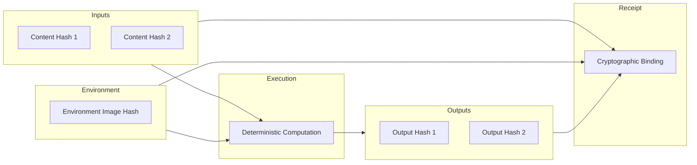
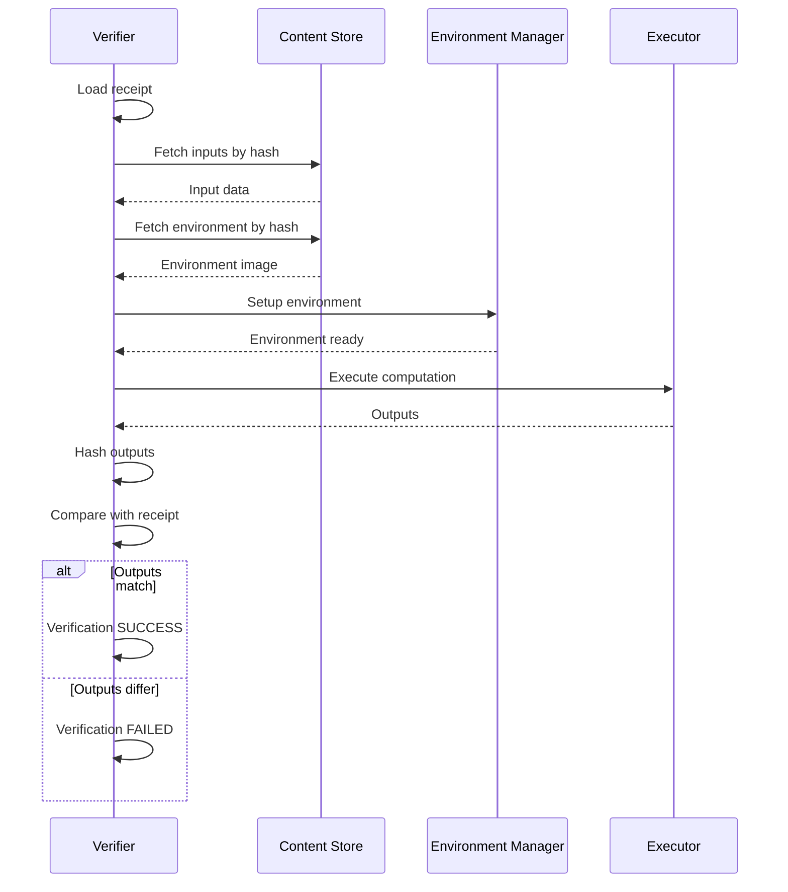

# Verification and Receipts Specification

**Version:** 1.0  
**Status:** Specification  
**Component:** Verification Layer

---

## 1. Overview

Verification is a core guarantee of Orbital OS. Any computation whose result becomes authoritative MUST be verifiable through replay using content-addressed inputs and pinned execution environments.

---

## 2. Verification Model

### 2.1 Verification Guarantee

| Property | Guarantee |
|----------|-----------|
| **Reproducibility** | Same inputs + same environment → same outputs |
| **Independence** | Any party can verify without trusting the executor |
| **Completeness** | All authoritative results have receipts |
| **Integrity** | Receipts are cryptographically bound |

### 2.2 Verification Components



---

## 3. Receipt Specification

### 3.1 Receipt Structure

```rust
/// A verification receipt
#[derive(Clone, Debug, Serialize, Deserialize)]
pub struct Receipt {
    /// Receipt header
    pub header: ReceiptHeader,
    
    /// Receipt body
    pub body: ReceiptBody,
    
    /// Cryptographic signature
    pub signature: Signature,
}

#[derive(Clone, Debug, Serialize, Deserialize)]
pub struct ReceiptHeader {
    /// Receipt version
    pub version: u32,
    
    /// Receipt type
    pub receipt_type: ReceiptType,
    
    /// Creation timestamp
    pub created_at: Timestamp,
    
    /// Issuing node
    pub issuer: NodeId,
    
    /// Receipt hash
    pub receipt_hash: Hash,
}

#[derive(Clone, Copy, Debug, Serialize, Deserialize)]
pub enum ReceiptType {
    /// Job completion receipt
    JobCompletion,
    
    /// Effect materialization receipt
    EffectMaterialization,
    
    /// Verification result receipt
    VerificationResult,
    
    /// Aggregate receipt
    Aggregate,
}
```

### 3.2 Receipt Body

```rust
#[derive(Clone, Debug, Serialize, Deserialize)]
pub struct ReceiptBody {
    /// Axiom entry this receipt corresponds to
    pub axiom_entry: u64,
    
    /// Job or action identifier
    pub action_id: ActionId,
    
    /// Input bindings
    pub inputs: Vec<InputBinding>,
    
    /// Output bindings
    pub outputs: Vec<OutputBinding>,
    
    /// Environment binding
    pub environment: EnvironmentBinding,
    
    /// Execution metrics
    pub metrics: ExecutionMetrics,
    
    /// Status
    pub status: ReceiptStatus,
    
    /// Optional execution proof
    pub proof: Option<ExecutionProof>,
}

#[derive(Clone, Debug, Serialize, Deserialize)]
pub struct InputBinding {
    /// Input name
    pub name: String,
    
    /// Content hash
    pub hash: Hash,
    
    /// Size in bytes
    pub size: u64,
}

#[derive(Clone, Debug, Serialize, Deserialize)]
pub struct OutputBinding {
    /// Output name
    pub name: String,
    
    /// Content hash
    pub hash: Hash,
    
    /// Size in bytes
    pub size: u64,
}

#[derive(Clone, Debug, Serialize, Deserialize)]
pub struct EnvironmentBinding {
    /// Environment image hash
    pub image_hash: Hash,
    
    /// Environment version
    pub version: Version,
    
    /// Configuration hash
    pub config_hash: Hash,
}

#[derive(Clone, Debug, Serialize, Deserialize)]
pub struct ExecutionMetrics {
    /// Wall-clock duration
    pub duration: Duration,
    
    /// CPU time used
    pub cpu_time: Duration,
    
    /// Peak memory usage
    pub peak_memory: u64,
    
    /// I/O operations
    pub io_ops: u64,
}

#[derive(Clone, Copy, Debug, Serialize, Deserialize)]
pub enum ReceiptStatus {
    /// Execution completed successfully
    Success,
    
    /// Execution failed
    Failed { exit_code: i32 },
    
    /// Execution timed out
    Timeout,
    
    /// Execution was cancelled
    Cancelled,
}
```

### 3.3 Receipt Hash Computation

```rust
impl Receipt {
    /// Compute receipt hash
    pub fn compute_hash(&self) -> Hash {
        let mut hasher = blake3::Hasher::new();
        
        // Hash body components
        hasher.update(&self.body.axiom_entry.to_le_bytes());
        hasher.update(self.body.action_id.as_bytes());
        
        // Hash inputs
        for input in &self.body.inputs {
            hasher.update(input.name.as_bytes());
            hasher.update(&input.hash.0);
            hasher.update(&input.size.to_le_bytes());
        }
        
        // Hash outputs
        for output in &self.body.outputs {
            hasher.update(output.name.as_bytes());
            hasher.update(&output.hash.0);
            hasher.update(&output.size.to_le_bytes());
        }
        
        // Hash environment
        hasher.update(&self.body.environment.image_hash.0);
        hasher.update(&self.body.environment.config_hash.0);
        
        // Hash status
        hasher.update(&[self.body.status.as_u8()]);
        
        Hash(hasher.finalize().into())
    }
    
    /// Verify receipt signature
    pub fn verify_signature(&self, public_key: &PublicKey) -> bool {
        let hash = self.compute_hash();
        public_key.verify(&hash.0, &self.signature)
    }
}
```

---

## 4. Verification Protocol

### 4.1 Verification Flow



### 4.2 Verification Interface

```rust
/// Verification service interface
pub trait VerificationService {
    /// Verify a receipt
    fn verify(&self, receipt: &Receipt) -> Result<VerificationResult, VerifyError>;
    
    /// Verify a range of Axiom entries
    fn verify_range(&self, from: u64, to: u64) -> Result<Vec<VerificationResult>, VerifyError>;
    
    /// Verify job result
    fn verify_job(&self, job_id: &JobId) -> Result<VerificationResult, VerifyError>;
    
    /// Generate verification proof
    fn generate_proof(&self, receipt: &Receipt) -> Result<VerificationProof, VerifyError>;
}

#[derive(Clone, Debug)]
pub enum VerificationResult {
    /// Verification passed
    Verified {
        receipt_hash: Hash,
        verified_at: Timestamp,
    },
    
    /// Output mismatch
    OutputMismatch {
        expected: Vec<Hash>,
        actual: Vec<Hash>,
    },
    
    /// Input not found
    InputNotFound {
        missing: Vec<Hash>,
    },
    
    /// Environment mismatch
    EnvironmentMismatch {
        expected: Hash,
        actual: Hash,
    },
    
    /// Signature invalid
    InvalidSignature,
    
    /// Execution failed during verification
    ExecutionFailed {
        error: String,
    },
}
```

### 4.3 Verification Implementation

```rust
impl VerificationService for Verifier {
    fn verify(&self, receipt: &Receipt) -> Result<VerificationResult, VerifyError> {
        // 1. Verify signature
        if !receipt.verify_signature(&self.trusted_key) {
            return Ok(VerificationResult::InvalidSignature);
        }
        
        // 2. Fetch inputs
        let mut inputs = Vec::new();
        for binding in &receipt.body.inputs {
            match self.content_store.get(&binding.hash) {
                Ok(data) => {
                    // Verify hash
                    if Hash::of(&data) != binding.hash {
                        return Err(VerifyError::ContentCorrupted);
                    }
                    inputs.push((binding.name.clone(), data));
                }
                Err(_) => {
                    return Ok(VerificationResult::InputNotFound {
                        missing: vec![binding.hash],
                    });
                }
            }
        }
        
        // 3. Setup environment
        let env = self.setup_environment(&receipt.body.environment)?;
        
        // 4. Execute computation
        let execution_result = env.execute(&inputs)?;
        
        // 5. Compute output hashes
        let actual_outputs: Vec<Hash> = execution_result.outputs
            .iter()
            .map(|o| Hash::of(o))
            .collect();
        
        let expected_outputs: Vec<Hash> = receipt.body.outputs
            .iter()
            .map(|o| o.hash)
            .collect();
        
        // 6. Compare
        if actual_outputs != expected_outputs {
            return Ok(VerificationResult::OutputMismatch {
                expected: expected_outputs,
                actual: actual_outputs,
            });
        }
        
        Ok(VerificationResult::Verified {
            receipt_hash: receipt.compute_hash(),
            verified_at: Timestamp::now(),
        })
    }
}
```

---

## 5. Environment Identity

### 5.1 Environment Pinning

```rust
/// Execution environment specification
#[derive(Clone, Debug, Serialize, Deserialize)]
pub struct EnvironmentSpec {
    /// Environment type
    pub env_type: EnvironmentType,
    
    /// Base image hash
    pub image_hash: Hash,
    
    /// Version
    pub version: Version,
    
    /// Configuration
    pub config: EnvironmentConfig,
    
    /// Computed identity hash
    pub identity: Hash,
}

impl EnvironmentSpec {
    /// Compute environment identity
    pub fn compute_identity(&self) -> Hash {
        let mut hasher = blake3::Hasher::new();
        
        hasher.update(&(self.env_type as u32).to_le_bytes());
        hasher.update(&self.image_hash.0);
        hasher.update(self.version.to_string().as_bytes());
        hasher.update(&self.config.to_bytes());
        
        Hash(hasher.finalize().into())
    }
    
    /// Verify environment matches identity
    pub fn verify_identity(&self) -> bool {
        self.identity == self.compute_identity()
    }
}
```

### 5.2 Environment Types

```rust
#[derive(Clone, Debug, Serialize, Deserialize)]
pub enum EnvironmentType {
    /// Minimal Orbital runtime
    Minimal {
        /// Syscall whitelist
        syscalls: Vec<Syscall>,
    },
    
    /// Rust toolchain
    Rust {
        toolchain: String,
        target: String,
    },
    
    /// WebAssembly runtime
    Wasm {
        runtime: WasmRuntime,
        fuel_limit: Option<u64>,
    },
    
    /// Container
    Container {
        runtime: ContainerRuntime,
    },
}

#[derive(Clone, Copy, Debug, Serialize, Deserialize)]
pub enum WasmRuntime {
    Wasmtime,
    Wasmer,
    Wazero,
}
```

---

## 6. Execution Proofs

### 6.1 Proof Types

```rust
/// Execution proof (optional, for enhanced verification)
#[derive(Clone, Debug, Serialize, Deserialize)]
pub enum ExecutionProof {
    /// No proof (trust receipt issuer)
    None,
    
    /// Attestation from trusted execution environment
    TeeAttestation {
        attestation: Vec<u8>,
        platform: TeePlatform,
    },
    
    /// Zero-knowledge proof (future)
    ZkProof {
        proof: Vec<u8>,
        verification_key: Hash,
    },
    
    /// Multi-party verification
    MultiParty {
        verifiers: Vec<NodeId>,
        signatures: Vec<Signature>,
        threshold: u32,
    },
}

#[derive(Clone, Copy, Debug, Serialize, Deserialize)]
pub enum TeePlatform {
    IntelSgx,
    ArmTrustZone,
    AmdSev,
}
```

### 6.2 Proof Verification

```rust
impl ExecutionProof {
    /// Verify execution proof
    pub fn verify(&self, receipt: &Receipt) -> Result<bool, ProofError> {
        match self {
            ExecutionProof::None => {
                // No proof - must trust issuer
                Ok(true)
            }
            
            ExecutionProof::TeeAttestation { attestation, platform } => {
                // Verify TEE attestation
                let verifier = TeeVerifier::for_platform(*platform)?;
                verifier.verify(attestation, &receipt.compute_hash())
            }
            
            ExecutionProof::ZkProof { proof, verification_key } => {
                // Verify ZK proof (future)
                unimplemented!("ZK proof verification not yet implemented")
            }
            
            ExecutionProof::MultiParty { verifiers, signatures, threshold } => {
                // Verify multi-party signatures
                let receipt_hash = receipt.compute_hash();
                let valid_sigs = verifiers.iter()
                    .zip(signatures.iter())
                    .filter(|(verifier, sig)| {
                        self.verify_node_signature(verifier, sig, &receipt_hash)
                    })
                    .count();
                
                Ok(valid_sigs >= *threshold as usize)
            }
        }
    }
}
```

---

## 7. Audit Trail

### 7.1 Audit Trail Construction

```rust
/// Audit trail for a sequence of operations
pub struct AuditTrail {
    /// Start entry
    pub from: u64,
    
    /// End entry
    pub to: u64,
    
    /// Entries with receipts
    pub entries: Vec<AuditEntry>,
    
    /// Trail integrity hash
    pub integrity_hash: Hash,
}

#[derive(Clone, Debug)]
pub struct AuditEntry {
    /// Axiom entry
    pub axiom_entry: AxiomEntry,
    
    /// Associated receipt
    pub receipt: Receipt,
    
    /// Verification status
    pub verified: bool,
}

impl AuditTrail {
    /// Construct audit trail for range
    pub fn construct(
        axiom: &Axiom,
        receipts: &ReceiptStore,
        from: u64,
        to: u64,
    ) -> Result<AuditTrail, AuditError> {
        let mut entries = Vec::new();
        let mut hasher = blake3::Hasher::new();
        
        for seq in from..=to {
            let axiom_entry = axiom.get(seq)?;
            let receipt = receipts.get_for_entry(seq)?;
            
            // Add to hash chain
            hasher.update(&axiom_entry.compute_hash().0);
            hasher.update(&receipt.compute_hash().0);
            
            entries.push(AuditEntry {
                axiom_entry,
                receipt,
                verified: false,
            });
        }
        
        Ok(AuditTrail {
            from,
            to,
            entries,
            integrity_hash: Hash(hasher.finalize().into()),
        })
    }
    
    /// Verify entire audit trail
    pub fn verify_all(&mut self, verifier: &Verifier) -> AuditResult {
        let mut passed = 0;
        let mut failed = 0;
        let mut errors = Vec::new();
        
        for entry in &mut self.entries {
            match verifier.verify(&entry.receipt) {
                Ok(VerificationResult::Verified { .. }) => {
                    entry.verified = true;
                    passed += 1;
                }
                Ok(other) => {
                    failed += 1;
                    errors.push((entry.axiom_entry.header.sequence, other));
                }
                Err(e) => {
                    failed += 1;
                    errors.push((
                        entry.axiom_entry.header.sequence,
                        VerificationResult::ExecutionFailed { error: e.to_string() },
                    ));
                }
            }
        }
        
        AuditResult { passed, failed, errors }
    }
}
```

---

## 8. Receipt Storage

### 8.1 Receipt Store Interface

```rust
/// Receipt storage interface
pub trait ReceiptStore {
    /// Store receipt
    fn store(&mut self, receipt: Receipt) -> Result<ReceiptId, StoreError>;
    
    /// Get receipt by ID
    fn get(&self, id: ReceiptId) -> Result<Receipt, StoreError>;
    
    /// Get receipt for Axiom entry
    fn get_for_entry(&self, entry: u64) -> Result<Receipt, StoreError>;
    
    /// List receipts
    fn list(&self, filter: ReceiptFilter) -> Vec<ReceiptSummary>;
    
    /// Delete receipt
    fn delete(&mut self, id: ReceiptId) -> Result<(), StoreError>;
}

#[derive(Clone, Debug)]
pub struct ReceiptFilter {
    pub from_entry: Option<u64>,
    pub to_entry: Option<u64>,
    pub receipt_type: Option<ReceiptType>,
    pub status: Option<ReceiptStatus>,
    pub verified: Option<bool>,
}
```

---

## 9. Determinism Enforcement

### 9.1 Determinism Checks

```rust
/// Determinism enforcement for verification
pub struct DeterminismEnforcer {
    /// Blocked syscalls
    blocked_syscalls: HashSet<Syscall>,
    
    /// Allowed syscalls with deterministic wrappers
    wrapped_syscalls: HashMap<Syscall, SyscallWrapper>,
}

impl DeterminismEnforcer {
    /// Check if execution is deterministic
    pub fn is_deterministic(&self, trace: &ExecutionTrace) -> Result<bool, EnforceError> {
        for event in &trace.events {
            match event {
                TraceEvent::Syscall { syscall, args, .. } => {
                    if self.blocked_syscalls.contains(syscall) {
                        return Ok(false);
                    }
                    
                    if let Some(wrapper) = self.wrapped_syscalls.get(syscall) {
                        if !wrapper.is_deterministic(args) {
                            return Ok(false);
                        }
                    }
                }
                TraceEvent::FloatingPoint { operation, .. } => {
                    if !self.is_fp_deterministic(operation) {
                        return Ok(false);
                    }
                }
                _ => {}
            }
        }
        
        Ok(true)
    }
}
```

### 9.2 Nondeterminism Sources

| Source | Blocked/Wrapped | Strategy |
|--------|-----------------|----------|
| Wall clock | Blocked | Pass as input |
| Random | Blocked | Pass seed as input |
| Thread scheduling | Wrapped | Deterministic scheduling or fork-join |
| Floating point | Platform-dependent | Strict IEEE 754 mode |
| Memory allocation | Wrapped | Deterministic allocator |
| File timestamps | Blocked | Not accessible |

---

## 10. Error Handling

```rust
/// Verification errors
#[derive(Clone, Debug)]
pub enum VerifyError {
    /// Receipt not found
    ReceiptNotFound,
    
    /// Content not found
    ContentNotFound { hash: Hash },
    
    /// Environment not available
    EnvironmentUnavailable,
    
    /// Execution error
    ExecutionError(String),
    
    /// Proof verification failed
    ProofFailed(String),
    
    /// Timeout during verification
    Timeout,
    
    /// Resource limit exceeded
    ResourceExceeded,
}
```

---

*[← Terminal](08-terminal.md) | [Visual OS →](10-visual-os.md)*
