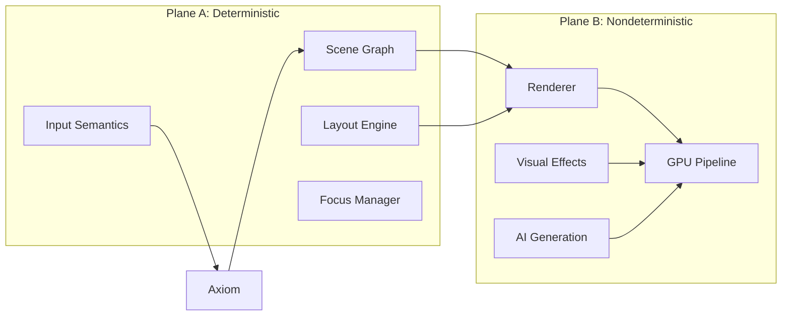
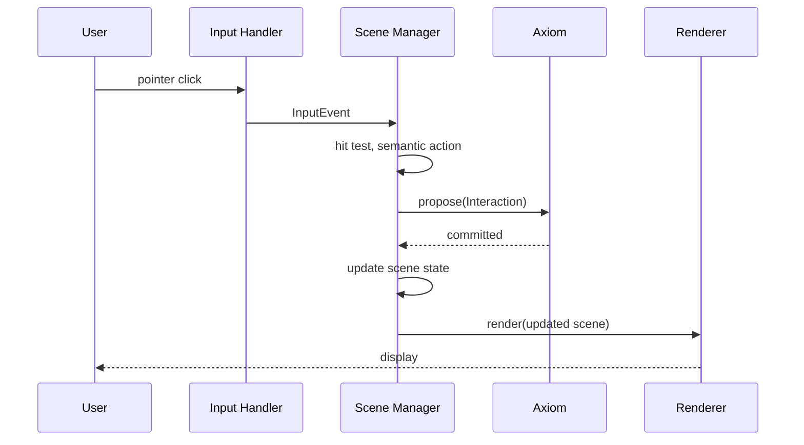

# Visual OS Specification

**Version:** 1.0  
**Status:** Specification (Future Work)  
**Component:** Visual Layer

---

## 1. Overview

The Visual OS is the last subsystem to be implemented. It provides a graphical user interface following the principle: **Meaning is deterministic; Appearance is nondeterministic.**

---

## 2. Design Principles

### 2.1 Two-Plane Architecture

| Plane | Name | Deterministic? | Purpose |
|-------|------|----------------|---------|
| **Plane A** | Scene State | Yes | Semantic structure, layout, interaction |
| **Plane B** | Virtual Renderer | No | Pixel generation, visual effects |

### 2.2 Separation of Concerns



---

## 3. Plane A: Deterministic Scene State

### 3.1 Scene Graph

```rust
/// Deterministic scene graph
#[derive(Clone, Debug, Serialize, Deserialize)]
pub struct SceneGraph {
    /// Root node
    pub root: NodeId,
    
    /// All nodes
    pub nodes: BTreeMap<NodeId, SceneNode>,
    
    /// Scene version (for diffing)
    pub version: u64,
    
    /// Scene hash (for verification)
    pub hash: Hash,
}

/// Scene node
#[derive(Clone, Debug, Serialize, Deserialize)]
pub struct SceneNode {
    /// Unique node ID (stable across updates)
    pub id: NodeId,
    
    /// Node type
    pub node_type: NodeType,
    
    /// Parent node
    pub parent: Option<NodeId>,
    
    /// Child nodes (ordered)
    pub children: Vec<NodeId>,
    
    /// Layout properties
    pub layout: LayoutProperties,
    
    /// Semantic properties
    pub semantics: SemanticProperties,
    
    /// Visual hints (non-authoritative)
    pub visual_hints: VisualHints,
}

#[derive(Clone, Debug, Serialize, Deserialize)]
pub enum NodeType {
    /// Container node
    Container,
    
    /// Text content
    Text { content: String },
    
    /// Image reference
    Image { source: Hash },
    
    /// Interactive element
    Interactive { interaction_type: InteractionType },
    
    /// Custom component
    Component { component_type: String, props: Properties },
}
```

### 3.2 Layout Properties

```rust
/// Layout properties (deterministic)
#[derive(Clone, Debug, Serialize, Deserialize)]
pub struct LayoutProperties {
    /// Position mode
    pub position: PositionMode,
    
    /// Size constraints
    pub width: SizeConstraint,
    pub height: SizeConstraint,
    
    /// Spacing
    pub margin: Edges,
    pub padding: Edges,
    
    /// Flex layout (if container)
    pub flex: Option<FlexLayout>,
    
    /// Computed bounds (after layout)
    pub bounds: Option<Rect>,
}

#[derive(Clone, Copy, Debug, Serialize, Deserialize)]
pub enum PositionMode {
    /// Flow layout
    Static,
    
    /// Relative to normal position
    Relative { offset: Point },
    
    /// Absolute within parent
    Absolute { position: Point },
    
    /// Fixed to viewport
    Fixed { position: Point },
}

#[derive(Clone, Copy, Debug, Serialize, Deserialize)]
pub enum SizeConstraint {
    /// Automatic sizing
    Auto,
    
    /// Fixed size
    Fixed(f32),
    
    /// Percentage of parent
    Percent(f32),
    
    /// Flexible grow/shrink
    Flex { grow: f32, shrink: f32, basis: f32 },
}

#[derive(Clone, Debug, Serialize, Deserialize)]
pub struct FlexLayout {
    /// Direction
    pub direction: FlexDirection,
    
    /// Wrap behavior
    pub wrap: FlexWrap,
    
    /// Main axis alignment
    pub justify: JustifyContent,
    
    /// Cross axis alignment
    pub align: AlignItems,
    
    /// Gap between items
    pub gap: f32,
}
```

### 3.3 Semantic Properties

```rust
/// Semantic properties (deterministic)
#[derive(Clone, Debug, Serialize, Deserialize)]
pub struct SemanticProperties {
    /// Accessibility role
    pub role: AccessibilityRole,
    
    /// Accessibility label
    pub label: Option<String>,
    
    /// Can receive focus
    pub focusable: bool,
    
    /// Tab index
    pub tab_index: Option<i32>,
    
    /// Enabled state
    pub enabled: bool,
    
    /// Visibility
    pub visible: bool,
    
    /// Custom semantic data
    pub data: BTreeMap<String, Value>,
}

#[derive(Clone, Copy, Debug, Serialize, Deserialize)]
pub enum AccessibilityRole {
    /// Generic container
    Generic,
    
    /// Button
    Button,
    
    /// Text input
    TextInput,
    
    /// Checkbox
    Checkbox,
    
    /// Radio button
    Radio,
    
    /// Slider
    Slider,
    
    /// Link
    Link,
    
    /// Heading
    Heading { level: u8 },
    
    /// List
    List,
    
    /// List item
    ListItem,
    
    /// Image
    Image,
    
    /// Custom role
    Custom(String),
}
```

### 3.4 Layout Engine

```rust
/// Deterministic layout engine
pub struct LayoutEngine {
    /// Layout algorithm
    algorithm: LayoutAlgorithm,
}

impl LayoutEngine {
    /// Compute layout for scene graph
    pub fn layout(&self, scene: &mut SceneGraph, viewport: Size) -> LayoutResult {
        // Start from root
        let root = scene.nodes.get_mut(&scene.root).unwrap();
        root.layout.bounds = Some(Rect {
            x: 0.0,
            y: 0.0,
            width: viewport.width,
            height: viewport.height,
        });
        
        // Layout children recursively
        self.layout_node(scene, scene.root);
        
        LayoutResult { success: true }
    }
    
    fn layout_node(&self, scene: &mut SceneGraph, node_id: NodeId) {
        let node = scene.nodes.get(&node_id).unwrap().clone();
        let parent_bounds = node.layout.bounds.unwrap();
        
        match &node.layout.flex {
            Some(flex) => {
                self.layout_flex(scene, &node, flex, parent_bounds);
            }
            None => {
                self.layout_block(scene, &node, parent_bounds);
            }
        }
        
        // Recurse to children
        for child_id in &node.children {
            self.layout_node(scene, *child_id);
        }
    }
}
```

---

## 4. Input Handling

### 4.1 Input Events

```rust
/// Input event (semantic, not raw)
#[derive(Clone, Debug, Serialize, Deserialize)]
pub enum InputEvent {
    /// Pointer events
    Pointer {
        event_type: PointerEventType,
        position: Point,
        button: Option<PointerButton>,
        target: Option<NodeId>,
    },
    
    /// Keyboard events
    Keyboard {
        event_type: KeyboardEventType,
        key: Key,
        modifiers: Modifiers,
        target: Option<NodeId>,
    },
    
    /// Focus events
    Focus {
        event_type: FocusEventType,
        target: NodeId,
    },
    
    /// Text input
    TextInput {
        text: String,
        target: NodeId,
    },
    
    /// Gestures
    Gesture {
        gesture_type: GestureType,
        target: NodeId,
    },
}

#[derive(Clone, Copy, Debug, Serialize, Deserialize)]
pub enum PointerEventType {
    Down,
    Up,
    Move,
    Enter,
    Leave,
}

#[derive(Clone, Copy, Debug, Serialize, Deserialize)]
pub enum KeyboardEventType {
    KeyDown,
    KeyUp,
}
```

### 4.2 Input Processing

```rust
/// Input processor (deterministic)
pub struct InputProcessor {
    /// Current focus
    focus: Option<NodeId>,
    
    /// Pointer capture
    pointer_capture: Option<NodeId>,
    
    /// Keyboard capture
    keyboard_capture: Option<NodeId>,
}

impl InputProcessor {
    /// Process input event
    pub fn process(
        &mut self,
        scene: &SceneGraph,
        event: InputEvent,
    ) -> Vec<SemanticAction> {
        match event {
            InputEvent::Pointer { event_type, position, button, .. } => {
                // Hit test
                let target = self.hit_test(scene, position);
                
                match event_type {
                    PointerEventType::Down => {
                        if let Some(target) = target {
                            // Focus the target if focusable
                            let node = scene.nodes.get(&target).unwrap();
                            if node.semantics.focusable {
                                self.focus = Some(target);
                            }
                            
                            // Generate action
                            return vec![SemanticAction::Activate { target }];
                        }
                    }
                    _ => {}
                }
            }
            
            InputEvent::Keyboard { event_type: KeyboardEventType::KeyDown, key, .. } => {
                if let Some(focus) = self.focus {
                    match key {
                        Key::Enter => {
                            return vec![SemanticAction::Submit { target: focus }];
                        }
                        Key::Tab => {
                            let next = self.find_next_focusable(scene, focus);
                            if let Some(next) = next {
                                self.focus = Some(next);
                                return vec![SemanticAction::Focus { target: next }];
                            }
                        }
                        _ => {}
                    }
                }
            }
            
            _ => {}
        }
        
        vec![]
    }
    
    /// Hit test against scene
    fn hit_test(&self, scene: &SceneGraph, point: Point) -> Option<NodeId> {
        self.hit_test_node(scene, scene.root, point)
    }
    
    fn hit_test_node(&self, scene: &SceneGraph, node_id: NodeId, point: Point) -> Option<NodeId> {
        let node = scene.nodes.get(&node_id)?;
        let bounds = node.layout.bounds?;
        
        if !bounds.contains(point) {
            return None;
        }
        
        // Check children (reverse order for proper z-ordering)
        for child_id in node.children.iter().rev() {
            if let Some(hit) = self.hit_test_node(scene, *child_id, point) {
                return Some(hit);
            }
        }
        
        // Check if this node is interactive
        if matches!(node.node_type, NodeType::Interactive { .. }) {
            return Some(node_id);
        }
        
        None
    }
}
```

### 4.3 Semantic Actions

```rust
/// Semantic action (flows to Axiom)
#[derive(Clone, Debug, Serialize, Deserialize)]
pub enum SemanticAction {
    /// Activate element (click, tap)
    Activate { target: NodeId },
    
    /// Submit form/input
    Submit { target: NodeId },
    
    /// Change focus
    Focus { target: NodeId },
    
    /// Text change
    TextChange { target: NodeId, text: String },
    
    /// Selection change
    SelectionChange { target: NodeId, selection: Selection },
    
    /// Value change
    ValueChange { target: NodeId, value: Value },
    
    /// Navigation
    Navigate { destination: NavigationTarget },
    
    /// Custom action
    Custom { action_type: String, target: NodeId, data: Value },
}
```

---

## 5. Plane B: Virtual Renderer

### 5.1 Renderer Interface

```rust
/// Renderer interface (nondeterministic implementation)
pub trait Renderer {
    /// Render scene to framebuffer
    fn render(&mut self, scene: &SceneGraph, target: &mut Framebuffer);
    
    /// Update for incremental render
    fn update(&mut self, diff: &SceneDiff, target: &mut Framebuffer);
    
    /// Get renderer capabilities
    fn capabilities(&self) -> RendererCapabilities;
}

#[derive(Clone, Debug)]
pub struct RendererCapabilities {
    /// Maximum texture size
    pub max_texture_size: u32,
    
    /// Supports GPU acceleration
    pub gpu_accelerated: bool,
    
    /// Supports shaders
    pub shader_support: ShaderSupport,
    
    /// Supports AI-generated effects
    pub ai_effects: bool,
}
```

### 5.2 Visual Hints

```rust
/// Visual hints (non-authoritative, for renderer)
#[derive(Clone, Debug, Serialize, Deserialize)]
pub struct VisualHints {
    /// Background
    pub background: Option<Background>,
    
    /// Border
    pub border: Option<Border>,
    
    /// Shadow
    pub shadow: Option<Shadow>,
    
    /// Opacity
    pub opacity: f32,
    
    /// Transform
    pub transform: Option<Transform>,
    
    /// Transition
    pub transition: Option<Transition>,
    
    /// Custom visual properties
    pub custom: BTreeMap<String, Value>,
}

#[derive(Clone, Debug, Serialize, Deserialize)]
pub enum Background {
    /// Solid color
    Color(Color),
    
    /// Gradient
    Gradient(Gradient),
    
    /// Image
    Image { source: Hash, fit: ImageFit },
    
    /// AI-generated (renderer chooses)
    AiGenerated { prompt: String, seed: Option<u64> },
}
```

### 5.3 GPU Pipeline

```rust
/// GPU rendering pipeline
pub struct GpuRenderer {
    /// GPU device
    device: wgpu::Device,
    
    /// Command queue
    queue: wgpu::Queue,
    
    /// Render pipeline
    pipeline: wgpu::RenderPipeline,
    
    /// Texture atlas
    atlas: TextureAtlas,
    
    /// Shader cache
    shaders: ShaderCache,
}

impl Renderer for GpuRenderer {
    fn render(&mut self, scene: &SceneGraph, target: &mut Framebuffer) {
        let mut encoder = self.device.create_command_encoder(&Default::default());
        
        // Build render commands
        let commands = self.build_commands(scene);
        
        // Execute render pass
        {
            let mut render_pass = encoder.begin_render_pass(&wgpu::RenderPassDescriptor {
                color_attachments: &[Some(wgpu::RenderPassColorAttachment {
                    view: &target.view,
                    resolve_target: None,
                    ops: wgpu::Operations {
                        load: wgpu::LoadOp::Clear(wgpu::Color::BLACK),
                        store: true,
                    },
                })],
                depth_stencil_attachment: None,
                ..Default::default()
            });
            
            render_pass.set_pipeline(&self.pipeline);
            
            for cmd in &commands {
                self.execute_command(&mut render_pass, cmd);
            }
        }
        
        self.queue.submit(std::iter::once(encoder.finish()));
    }
}
```

---

## 6. Incremental Updates

### 6.1 Scene Diffing

```rust
/// Scene diff for incremental updates
#[derive(Clone, Debug, Serialize, Deserialize)]
pub struct SceneDiff {
    /// Base version
    pub from_version: u64,
    
    /// Target version
    pub to_version: u64,
    
    /// Added nodes
    pub added: Vec<SceneNode>,
    
    /// Removed node IDs
    pub removed: Vec<NodeId>,
    
    /// Modified nodes
    pub modified: Vec<NodeModification>,
}

#[derive(Clone, Debug, Serialize, Deserialize)]
pub struct NodeModification {
    /// Node ID
    pub node_id: NodeId,
    
    /// Changed properties
    pub changes: Vec<PropertyChange>,
}

#[derive(Clone, Debug, Serialize, Deserialize)]
pub enum PropertyChange {
    /// Layout change
    Layout(LayoutProperties),
    
    /// Semantics change
    Semantics(SemanticProperties),
    
    /// Visual hints change
    VisualHints(VisualHints),
    
    /// Content change
    Content(NodeType),
    
    /// Children change
    Children(Vec<NodeId>),
}
```

### 6.2 Stable Entity IDs

```rust
/// Stable entity ID generator
pub struct EntityIdGenerator {
    /// Next ID
    next_id: u64,
    
    /// ID recycling pool
    recycled: Vec<NodeId>,
}

impl EntityIdGenerator {
    /// Generate new stable ID
    pub fn next(&mut self) -> NodeId {
        if let Some(id) = self.recycled.pop() {
            return id;
        }
        
        let id = NodeId(self.next_id);
        self.next_id += 1;
        id
    }
    
    /// Recycle ID for reuse
    pub fn recycle(&mut self, id: NodeId) {
        self.recycled.push(id);
    }
}
```

---

## 7. Performance Requirements

### 7.1 Targets

| Metric | Target |
|--------|--------|
| Input-to-photon latency | < 16ms (60 fps) |
| Layout computation | < 1ms |
| Scene diff | < 0.5ms |
| GPU render | < 8ms |

### 7.2 Optimization Strategies

| Strategy | Description |
|----------|-------------|
| Incremental layout | Only re-layout changed subtrees |
| Render layer caching | Cache rendered subtrees as textures |
| GPU batching | Batch draw calls by material |
| Lazy loading | Load off-screen content on demand |

---

## 8. AI-Driven Construction

### 8.1 Natural Language Interface

```rust
/// AI scene construction interface
pub trait AiSceneConstructor {
    /// Parse natural language to scene modification
    fn parse(&self, input: &str) -> Result<SceneModification, ParseError>;
    
    /// Generate component from description
    fn generate_component(&self, description: &str) -> Result<SceneNode, GenerateError>;
    
    /// Suggest completions
    fn suggest(&self, partial_input: &str, context: &SceneGraph) -> Vec<Suggestion>;
}

#[derive(Clone, Debug)]
pub enum SceneModification {
    /// Add element
    Add { parent: NodeId, node: SceneNode },
    
    /// Remove element
    Remove { node: NodeId },
    
    /// Modify element
    Modify { node: NodeId, changes: Vec<PropertyChange> },
    
    /// Complex modification
    Complex { description: String, modifications: Vec<SceneModification> },
}
```

### 8.2 Speculative Preview

```rust
/// Speculative preview for AI modifications
pub struct SpeculativePreview {
    /// Base scene
    base: SceneGraph,
    
    /// Proposed modifications
    proposed: Vec<SceneModification>,
    
    /// Preview scene (not committed)
    preview: SceneGraph,
    
    /// Status
    status: PreviewStatus,
}

#[derive(Clone, Copy, Debug)]
pub enum PreviewStatus {
    /// Preview is speculative
    Speculative,
    
    /// User confirmed, pending commit
    Confirmed,
    
    /// Committed to Axiom
    Committed,
    
    /// Cancelled
    Cancelled,
}

impl SpeculativePreview {
    /// Apply modifications to generate preview
    pub fn apply(&mut self) -> Result<(), ApplyError> {
        self.preview = self.base.clone();
        
        for modification in &self.proposed {
            self.apply_modification(&mut self.preview, modification)?;
        }
        
        self.preview.version = self.base.version + 1;
        self.preview.hash = self.preview.compute_hash();
        
        Ok(())
    }
    
    /// Commit preview to Axiom
    pub fn commit(&mut self, axiom: &mut Axiom) -> Result<u64, CommitError> {
        let proposal = Proposal {
            entry_type: AxiomEntryType::SceneUpdate,
            payload: SceneUpdatePayload {
                from_version: self.base.version,
                to_version: self.preview.version,
                modifications: self.proposed.clone(),
            }.into(),
            effects: vec![],
            ..Default::default()
        };
        
        let result = axiom.submit(proposal)?;
        
        self.status = PreviewStatus::Committed;
        
        match result {
            CommitResult::Committed { sequence, .. } => Ok(sequence),
            _ => Err(CommitError::Rejected),
        }
    }
}
```

---

## 9. Axiom Integration

### 9.1 Scene State in Axiom

```rust
/// Scene-related Axiom entries
pub enum SceneAxiomEntry {
    /// Create scene
    SceneCreate {
        scene_id: SceneId,
        root: SceneNode,
    },
    
    /// Update scene
    SceneUpdate {
        scene_id: SceneId,
        from_version: u64,
        to_version: u64,
        modifications: Vec<SceneModification>,
    },
    
    /// User interaction
    Interaction {
        scene_id: SceneId,
        action: SemanticAction,
        timestamp: Timestamp,
    },
    
    /// Delete scene
    SceneDelete {
        scene_id: SceneId,
    },
}
```

### 9.2 Action Flow



---

## 10. Implementation Notes

### 10.1 Renderer Sandboxing

The renderer runs in a sandboxed process:
- Cannot access Axiom directly
- Receives scene state via IPC
- Output is pixels only
- Can be replaced without affecting semantics

### 10.2 Platform Backends

| Platform | Renderer | Notes |
|----------|----------|-------|
| Hosted | wgpu (Vulkan/Metal/DX12) | Full GPU support |
| QEMU | virtio-gpu | Hardware acceleration |
| Bare metal | Direct GPU driver | Custom driver needed |
| Fallback | Software rasterizer | CPU-only |

---

*[← Verification and Receipts](09-verification-and-receipts.md) | [State Machine Diagrams →](../diagrams/state-machines.md)*
