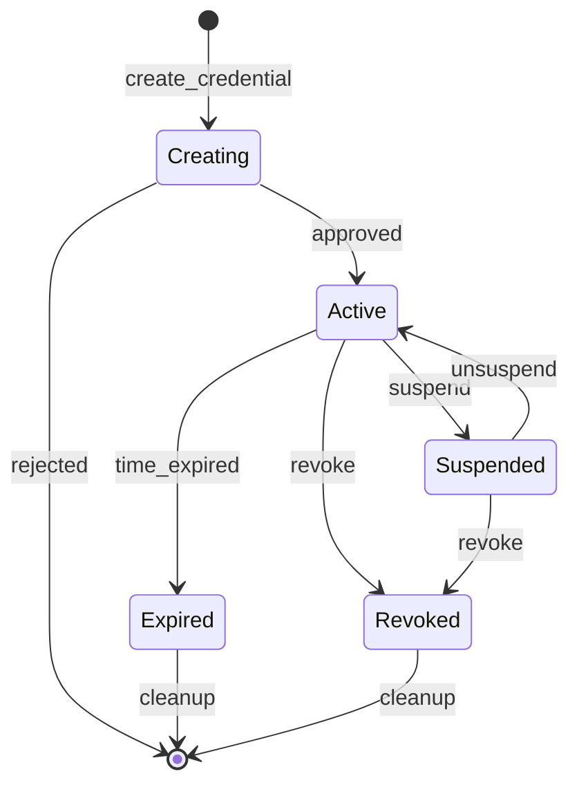
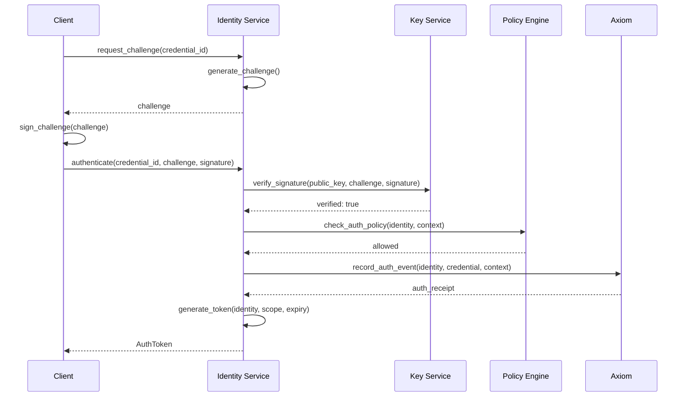
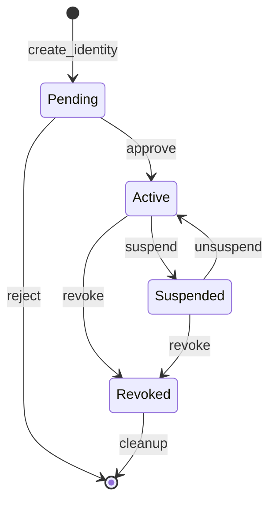
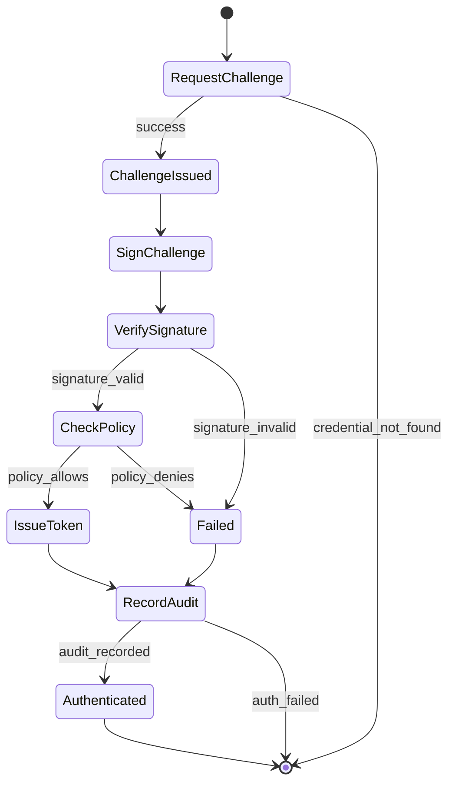
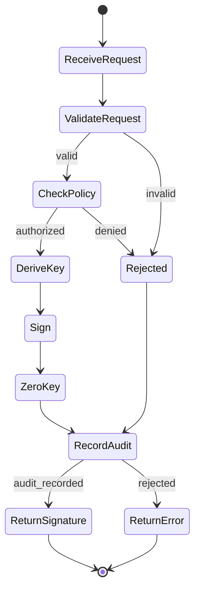

# Identity and Key Management Specification

**Version:** 1.0  
**Status:** Specification  
**Component:** Identity and Cryptography

---

## 1. Overview

Orbital OS provides first-class cryptographic identity for all principals (users, services, nodes). All key operations are policy-controlled and audited through the Axiom.

This specification defines:
- Identity model and hierarchy
- Key derivation and management
- Credential types and authentication
- Policy integration
- Secure boundary requirements

---

## 2. Design Principles

### 2.1 Guiding Principles

| Principle | Description |
|-----------|-------------|
| **Keys are derived, not stored** | Private keys are deterministically derived on-demand, never persisted |
| **Policy controls all operations** | Every key operation requires Policy Engine approval |
| **Everything is audited** | All operations are recorded in the Axiom |
| **Minimal TCB** | Key operations occur within a minimal secure boundary |
| **Hierarchical authority** | Child identities derive from parent identities |

### 2.2 Threat Model

**Trusted:**
- Key Derivation Service (within secure boundary)
- Policy Engine (for authorization decisions)
- Axiom (for audit trail)

**Untrusted:**
- All other services
- Network
- Storage (except for root seed)
- User input

---

## 3. Identity Model

### 3.1 Identity Hierarchy

```
┌─────────────────────────────────────────────────────────────────────┐
│                       IDENTITY HIERARCHY                            │
│                                                                     │
│  Root Identity (System)                                             │
│  ├── System Services                                                │
│  │   ├── orbital.services.axiom                                    │
│  │   ├── orbital.services.policy                                   │
│  │   ├── orbital.services.keys                                     │
│  │   ├── orbital.services.identity                                 │
│  │   ├── orbital.services.filesystem                               │
│  │   └── orbital.services.network                                  │
│  │                                                                 │
│  ├── Nodes                                                          │
│  │   ├── orbital.nodes.node-01                                     │
│  │   └── orbital.nodes.node-02                                     │
│  │                                                                 │
│  └── Organizations                                                  │
│      └── example.org                                               │
│          ├── Users                                                 │
│          │   ├── alice@example.org                                 │
│          │   │   ├── credential: passkey-1                         │
│          │   │   ├── credential: passkey-2 (backup)                │
│          │   │   └── credential: recovery-key                      │
│          │   └── bob@example.org                                   │
│          │       └── credential: passkey-1                         │
│          │                                                         │
│          └── Services                                              │
│              └── api-service@example.org                           │
│                  └── credential: service-key                       │
│                                                                     │
└─────────────────────────────────────────────────────────────────────┘
```

### 3.2 Identity Structure

```rust
/// Unique identity identifier
#[derive(Clone, Debug, PartialEq, Eq, Hash, Serialize, Deserialize)]
pub struct IdentityId(pub [u8; 32]);

impl IdentityId {
    /// Derive from public key
    pub fn from_public_key(public_key: &PublicKey) -> Self {
        Self(blake3::hash(public_key.as_bytes()).into())
    }
}

/// An identity in the system
#[derive(Clone, Debug, Serialize, Deserialize)]
pub struct Identity {
    /// Unique identifier
    pub id: IdentityId,
    
    /// Human-readable name
    pub name: String,
    
    /// Fully qualified name (e.g., "alice@example.org")
    pub fqn: String,
    
    /// Identity type
    pub identity_type: IdentityType,
    
    /// Parent identity
    pub parent: Option<IdentityId>,
    
    /// Key derivation path
    pub key_path: KeyPath,
    
    /// Public key
    pub public_key: PublicKey,
    
    /// Creation record
    pub created_at: AxiomRef,
    
    /// Current status
    pub status: IdentityStatus,
    
    /// Metadata
    pub metadata: IdentityMetadata,
}

#[derive(Clone, Copy, Debug, PartialEq, Eq, Serialize, Deserialize)]
pub enum IdentityType {
    /// System root (only one)
    Root,
    
    /// System service
    SystemService,
    
    /// Physical/virtual node
    Node,
    
    /// Organization (tenant)
    Organization,
    
    /// Human user
    User,
    
    /// Automated service/API
    Service,
    
    /// Device
    Device,
}

#[derive(Clone, Copy, Debug, PartialEq, Eq, Serialize, Deserialize)]
pub enum IdentityStatus {
    /// Active and can authenticate
    Active,
    
    /// Temporarily suspended
    Suspended,
    
    /// Permanently revoked
    Revoked,
    
    /// Pending activation
    Pending,
}

#[derive(Clone, Debug, Serialize, Deserialize)]
pub struct IdentityMetadata {
    /// Display name
    pub display_name: Option<String>,
    
    /// Description
    pub description: Option<String>,
    
    /// Tags for grouping
    pub tags: Vec<String>,
    
    /// Custom attributes
    pub attributes: BTreeMap<String, String>,
}
```

---

## 4. Key Derivation

### 4.1 Key Path Structure

```rust
/// Hierarchical key derivation path
#[derive(Clone, Debug, PartialEq, Eq, Hash, Serialize, Deserialize)]
pub struct KeyPath {
    /// Path segments
    pub segments: Vec<String>,
}

impl KeyPath {
    /// System key paths
    pub const SYSTEM_ROOT: &'static str = "/orbital";
    pub const SERVICES: &'static str = "/orbital/services";
    pub const NODES: &'static str = "/orbital/nodes";
    pub const ORGS: &'static str = "/orbital/orgs";
    
    /// Parse from string
    pub fn parse(path: &str) -> Result<Self, ParseError> {
        if !path.starts_with('/') {
            return Err(ParseError::MustStartWithSlash);
        }
        
        let segments: Vec<String> = path
            .split('/')
            .filter(|s| !s.is_empty())
            .map(|s| s.to_string())
            .collect();
        
        if segments.is_empty() {
            return Err(ParseError::EmptyPath);
        }
        
        Ok(Self { segments })
    }
    
    /// Check if this path is a descendant of another
    pub fn is_descendant_of(&self, ancestor: &KeyPath) -> bool {
        if self.segments.len() <= ancestor.segments.len() {
            return false;
        }
        
        self.segments.iter()
            .zip(ancestor.segments.iter())
            .all(|(a, b)| a == b)
    }
    
    /// Get parent path
    pub fn parent(&self) -> Option<KeyPath> {
        if self.segments.len() <= 1 {
            return None;
        }
        
        Some(KeyPath {
            segments: self.segments[..self.segments.len() - 1].to_vec(),
        })
    }
    
    /// Append a segment
    pub fn child(&self, segment: &str) -> KeyPath {
        let mut segments = self.segments.clone();
        segments.push(segment.to_string());
        KeyPath { segments }
    }
}

/// Example paths:
/// /orbital                              - System root
/// /orbital/services/axiom               - Axiom service
/// /orbital/orgs/example.org             - Organization
/// /orbital/orgs/example.org/users/alice - User
/// /orbital/orgs/example.org/users/alice/credentials/passkey-1 - Credential
```

### 4.2 Key Derivation Algorithm

```rust
/// Root seed (protected, never exposed)
pub struct RootSeed {
    /// 256-bit seed
    seed: [u8; 32],
}

impl RootSeed {
    /// Derive master key from seed
    fn master_key(&self) -> [u8; 32] {
        hkdf_sha256(
            &self.seed,
            b"",
            b"orbital-master-key-v1"
        )
    }
}

/// Key derivation engine
pub struct KeyDeriver {
    master_key: [u8; 32],
}

impl KeyDeriver {
    /// Derive a key from path
    pub fn derive(&self, path: &KeyPath) -> DerivedKeyPair {
        let mut current = self.master_key;
        
        // Derive through each path segment
        for segment in &path.segments {
            current = hkdf_sha256(
                &current,
                segment.as_bytes(),
                b"orbital-key-derivation-v1"
            );
        }
        
        // Generate Ed25519 keypair from derived bytes
        let secret_key = ed25519_dalek::SecretKey::from_bytes(&current)
            .expect("valid key bytes");
        let public_key = ed25519_dalek::PublicKey::from(&secret_key);
        
        DerivedKeyPair {
            path: path.clone(),
            secret_key,
            public_key,
        }
    }
}

/// HKDF-SHA256 implementation
fn hkdf_sha256(ikm: &[u8], salt: &[u8], info: &[u8]) -> [u8; 32] {
    use hkdf::Hkdf;
    use sha2::Sha256;
    
    let hk = Hkdf::<Sha256>::new(Some(salt), ikm);
    let mut okm = [0u8; 32];
    hk.expand(info, &mut okm).expect("valid length");
    okm
}
```

### 4.3 Key Properties

| Property | Guarantee |
|----------|-----------|
| **Deterministic** | Same path + same root → same key, always |
| **Hierarchical** | Knowing parent key doesn't reveal child keys |
| **One-way** | Cannot derive parent key from child key |
| **Collision-resistant** | Different paths → different keys (cryptographically) |

---

## 5. Credentials

### 5.1 Credential Types

```rust
/// A credential for authentication
#[derive(Clone, Debug, Serialize, Deserialize)]
pub struct Credential {
    /// Unique credential ID
    pub id: CredentialId,
    
    /// Which identity this belongs to
    pub identity_id: IdentityId,
    
    /// Credential type and data
    pub credential_type: CredentialType,
    
    /// Human-readable name
    pub name: String,
    
    /// When created
    pub created_at: AxiomRef,
    
    /// Last used (updated periodically)
    pub last_used: Option<AxiomRef>,
    
    /// Status
    pub status: CredentialStatus,
}

#[derive(Clone, Debug, Serialize, Deserialize)]
pub enum CredentialType {
    /// WebAuthn/FIDO2 passkey
    Passkey(PasskeyCredential),
    
    /// Recovery key (for account recovery)
    RecoveryKey(RecoveryKeyCredential),
    
    /// API key (for service authentication)
    ApiKey(ApiKeyCredential),
    
    /// Derived key (for services)
    DerivedKey(DerivedKeyCredential),
    
    /// Certificate (X.509)
    Certificate(CertificateCredential),
}

#[derive(Clone, Debug, Serialize, Deserialize)]
pub struct PasskeyCredential {
    /// AAGUID (Authenticator Attestation GUID)
    pub aaguid: [u8; 16],
    
    /// Credential public key
    pub public_key: PublicKey,
    
    /// Signature counter (for clone detection)
    pub sign_count: u32,
    
    /// Transports (usb, nfc, ble, internal)
    pub transports: Vec<String>,
    
    /// User verification required
    pub user_verification: bool,
}

#[derive(Clone, Debug, Serialize, Deserialize)]
pub struct RecoveryKeyCredential {
    /// Hash of the recovery key
    pub key_hash: Hash,
    
    /// Has this been used?
    pub used: bool,
    
    /// Expires after first use?
    pub single_use: bool,
}

#[derive(Clone, Debug, Serialize, Deserialize)]
pub struct ApiKeyCredential {
    /// Hash of the API key
    pub key_hash: Hash,
    
    /// Permissions (scopes)
    pub permissions: Vec<String>,
    
    /// Expiration
    pub expires_at: Option<AxiomTime>,
    
    /// Rate limit
    pub rate_limit: Option<RateLimit>,
}

#[derive(Clone, Debug, Serialize, Deserialize)]
pub struct DerivedKeyCredential {
    /// Key derivation path
    pub key_path: KeyPath,
    
    /// Public key (derived from path)
    pub public_key: PublicKey,
}

#[derive(Clone, Debug, Serialize, Deserialize)]
pub struct CertificateCredential {
    /// X.509 certificate (DER encoded)
    pub certificate: Vec<u8>,
    
    /// Subject
    pub subject: String,
    
    /// Issuer
    pub issuer: String,
    
    /// Validity
    pub not_before: AxiomTime,
    pub not_after: AxiomTime,
}

#[derive(Clone, Copy, Debug, PartialEq, Eq, Serialize, Deserialize)]
pub enum CredentialStatus {
    Active,
    Suspended,
    Revoked,
    Expired,
}
```

### 5.2 Credential Lifecycle



---

## 6. Authentication

### 6.1 Authentication Flow



### 6.2 Challenge-Response Protocol

```rust
/// Authentication challenge
#[derive(Clone, Debug, Serialize, Deserialize)]
pub struct Challenge {
    /// Challenge ID
    pub id: ChallengeId,
    
    /// Random bytes to sign
    pub nonce: [u8; 32],
    
    /// When created
    pub created_at: Timestamp,
    
    /// When expires
    pub expires_at: Timestamp,
    
    /// Credential this is for
    pub credential_id: CredentialId,
    
    /// Origin (for WebAuthn)
    pub origin: Option<String>,
}

/// Authentication request
#[derive(Clone, Debug, Serialize, Deserialize)]
pub struct AuthRequest {
    /// Challenge being responded to
    pub challenge_id: ChallengeId,
    
    /// Credential used
    pub credential_id: CredentialId,
    
    /// Proof of possession
    pub proof: AuthProof,
    
    /// Client metadata
    pub client_data: ClientData,
}

#[derive(Clone, Debug, Serialize, Deserialize)]
pub enum AuthProof {
    /// Ed25519 signature over challenge
    Ed25519Signature(Signature),
    
    /// WebAuthn assertion
    WebAuthn {
        authenticator_data: Vec<u8>,
        client_data_json: Vec<u8>,
        signature: Vec<u8>,
    },
    
    /// HMAC for API keys
    HmacSha256(Hash),
}
```

### 6.3 Authentication Token

```rust
/// Authentication token
#[derive(Clone, Debug, Serialize, Deserialize)]
pub struct AuthToken {
    /// Token ID
    pub id: TokenId,
    
    /// Authenticated identity
    pub identity_id: IdentityId,
    
    /// Credential used
    pub credential_id: CredentialId,
    
    /// When issued
    pub issued_at: AxiomTime,
    
    /// When expires
    pub expires_at: AxiomTime,
    
    /// Scope (what this token allows)
    pub scope: TokenScope,
    
    /// Axiom reference for auth event
    pub auth_ref: AxiomRef,
    
    /// Token signature (by Identity Service)
    pub signature: Signature,
}

#[derive(Clone, Debug, Serialize, Deserialize)]
pub struct TokenScope {
    /// Allowed actions
    pub actions: Vec<String>,
    
    /// Allowed resources (patterns)
    pub resources: Vec<String>,
    
    /// Additional restrictions
    pub restrictions: Vec<TokenRestriction>,
}

#[derive(Clone, Debug, Serialize, Deserialize)]
pub enum TokenRestriction {
    /// Only valid from these IP addresses
    IpAllowList(Vec<String>),
    
    /// Rate limit
    RateLimit(RateLimit),
    
    /// Only valid for specific operations
    OperationList(Vec<String>),
}
```

---

## 7. Policy Integration

### 7.1 Identity-Related Policies

```rust
/// Policy rules for identity operations
pub enum IdentityPolicyRule {
    /// Who can create identities
    CreateIdentity {
        parent_pattern: IdentityPattern,
        child_type: IdentityType,
        allowed_by: IdentityPattern,
    },
    
    /// Who can add credentials
    AddCredential {
        identity_pattern: IdentityPattern,
        credential_type: CredentialType,
        allowed_by: IdentityPattern,
    },
    
    /// Who can revoke credentials
    RevokeCredential {
        identity_pattern: IdentityPattern,
        allowed_by: IdentityPattern,
    },
    
    /// Who can suspend/unsuspend
    ModifyStatus {
        identity_pattern: IdentityPattern,
        allowed_by: IdentityPattern,
    },
}

/// Policy rules for key operations
pub enum KeyPolicyRule {
    /// Who can derive keys (get public key)
    DerivePublicKey {
        path_pattern: KeyPathPattern,
        allowed_by: IdentityPattern,
    },
    
    /// Who can sign with a key
    Sign {
        path_pattern: KeyPathPattern,
        allowed_by: IdentityPattern,
        requires_approval: bool,
        approval_quorum: Option<u32>,
    },
    
    /// Who can encrypt/decrypt
    Encrypt {
        path_pattern: KeyPathPattern,
        allowed_by: IdentityPattern,
    },
    
    Decrypt {
        path_pattern: KeyPathPattern,
        allowed_by: IdentityPattern,
    },
}
```

### 7.2 Default Policies

```rust
/// Default identity policies
pub fn default_identity_policies() -> Vec<PolicyRule> {
    vec![
        // System can create any identity
        PolicyRule::identity(IdentityPolicyRule::CreateIdentity {
            parent_pattern: IdentityPattern::Any,
            child_type: IdentityType::Any,
            allowed_by: IdentityPattern::System,
        }),
        
        // Organization admins can create users
        PolicyRule::identity(IdentityPolicyRule::CreateIdentity {
            parent_pattern: IdentityPattern::Type(IdentityType::Organization),
            child_type: IdentityType::User,
            allowed_by: IdentityPattern::OrgAdmin,
        }),
        
        // Users can add their own credentials
        PolicyRule::identity(IdentityPolicyRule::AddCredential {
            identity_pattern: IdentityPattern::Self_,
            credential_type: CredentialType::Any,
            allowed_by: IdentityPattern::Self_,
        }),
        
        // Users can sign with their own keys
        PolicyRule::key(KeyPolicyRule::Sign {
            path_pattern: KeyPathPattern::SelfAndDescendants,
            allowed_by: IdentityPattern::Self_,
            requires_approval: false,
            approval_quorum: None,
        }),
    ]
}
```

---

## 8. Secure Boundary

### 8.1 Architecture

```
┌─────────────────────────────────────────────────────────────────────┐
│                        SECURE BOUNDARY                              │
│                                                                     │
│  ┌───────────────────────────────────────────────────────────────┐ │
│  │                    ISOLATED ADDRESS SPACE                      │ │
│  │                                                                │ │
│  │  ┌─────────────┐  ┌─────────────┐  ┌─────────────┐            │ │
│  │  │  Root Seed  │  │    Key      │  │   Crypto    │            │ │
│  │  │  (mlock'd)  │  │   Deriver   │  │  Operations │            │ │
│  │  └─────────────┘  └─────────────┘  └─────────────┘            │ │
│  │                                                                │ │
│  │  Memory properties:                                           │ │
│  │  • mlocked (cannot swap to disk)                              │ │
│  │  • guard pages (detect overflow)                              │ │
│  │  • zeroed on free                                             │ │
│  │                                                                │ │
│  └───────────────────────────────────────────────────────────────┘ │
│                              │                                      │
│                              ▼                                      │
│  ┌───────────────────────────────────────────────────────────────┐ │
│  │                     IPC GATEWAY                                │ │
│  │                                                                │ │
│  │  • Validates all incoming requests                            │ │
│  │  • Checks Policy Engine authorization                         │ │
│  │  • Logs all operations to Axiom                               │ │
│  │  • Returns only public data (signatures, public keys)         │ │
│  │                                                                │ │
│  └───────────────────────────────────────────────────────────────┘ │
│                                                                     │
└─────────────────────────────────────────────────────────────────────┘
```

### 8.2 Security Properties

| Property | Implementation |
|----------|----------------|
| **Memory isolation** | Separate address space, no shared memory |
| **No persistence** | Keys derived on-demand, never stored |
| **Memory protection** | mlock(), guard pages, zeroing |
| **Capability-gated** | Only authorized services can call |
| **Audit logging** | All operations recorded in Axiom |
| **Policy enforcement** | Every operation checked against policy |

### 8.3 Optional Hardware Enhancement

```rust
/// Hardware security module interface
pub trait HsmInterface {
    /// Seal data to hardware
    fn seal(&self, data: &[u8]) -> Result<Vec<u8>, HsmError>;
    
    /// Unseal data from hardware
    fn unseal(&self, sealed: &[u8]) -> Result<Vec<u8>, HsmError>;
    
    /// Get attestation
    fn attest(&self, challenge: &[u8]) -> Result<Attestation, HsmError>;
}

/// Platform-specific HSM implementations
pub enum HsmProvider {
    /// No hardware - software only
    Software,
    
    /// TPM 2.0
    Tpm2 { device_path: String },
    
    /// Intel SGX
    Sgx { enclave_path: String },
    
    /// ARM TrustZone
    TrustZone,
}
```

---

## 9. Axiom Integration

### 9.1 Identity Events

```rust
/// Axiom entry types for identity operations
#[derive(Clone, Debug, Serialize, Deserialize)]
pub enum IdentityAxiomEntry {
    /// Identity created
    IdentityCreated {
        identity: Identity,
        created_by: IdentityId,
    },
    
    /// Identity status changed
    IdentityStatusChanged {
        identity_id: IdentityId,
        old_status: IdentityStatus,
        new_status: IdentityStatus,
        changed_by: IdentityId,
        reason: String,
    },
    
    /// Credential added
    CredentialAdded {
        identity_id: IdentityId,
        credential: Credential,
        added_by: IdentityId,
    },
    
    /// Credential revoked
    CredentialRevoked {
        identity_id: IdentityId,
        credential_id: CredentialId,
        revoked_by: IdentityId,
        reason: String,
    },
    
    /// Authentication occurred
    AuthenticationEvent {
        identity_id: IdentityId,
        credential_id: CredentialId,
        success: bool,
        client_info: ClientInfo,
    },
}
```

### 9.2 Key Events

```rust
/// Axiom entry types for key operations
#[derive(Clone, Debug, Serialize, Deserialize)]
pub enum KeyAxiomEntry {
    /// Signing operation
    SigningOperation {
        key_path: KeyPath,
        message_hash: Hash,
        signature_hash: Hash,
        requested_by: IdentityId,
        authorized_by: PolicyDecision,
    },
    
    /// Encryption operation
    EncryptionOperation {
        key_path: KeyPath,
        plaintext_hash: Hash,
        ciphertext_hash: Hash,
        requested_by: IdentityId,
        authorized_by: PolicyDecision,
    },
    
    /// Decryption operation
    DecryptionOperation {
        key_path: KeyPath,
        ciphertext_hash: Hash,
        requested_by: IdentityId,
        authorized_by: PolicyDecision,
    },
    
    /// Key rotation (new derivation path)
    KeyRotation {
        old_path: KeyPath,
        new_path: KeyPath,
        rotated_by: IdentityId,
        reason: String,
    },
}
```

---

## 10. State Machine Diagrams

### 10.1 Identity Lifecycle



### 10.2 Authentication Flow



### 10.3 Signing Flow



---

## 11. Implementation Notes

### 11.1 Cryptographic Algorithms

| Purpose | Algorithm |
|---------|-----------|
| Key derivation | HKDF-SHA256 |
| Signing | Ed25519 |
| Hashing | BLAKE3 |
| Encryption | XChaCha20-Poly1305 |
| Key exchange | X25519 |

### 11.2 Dependencies

```toml
[dependencies]
ed25519-dalek = "2"
x25519-dalek = "2"
hkdf = "0.12"
sha2 = "0.10"
blake3 = "1"
chacha20poly1305 = "0.10"
zeroize = { version = "1", features = ["derive"] }
```

### 11.3 Security Considerations

1. **Zeroization**: All key material must be zeroized after use
2. **Timing attacks**: Use constant-time comparison for secrets
3. **Side channels**: Avoid branching on secret data
4. **Memory safety**: Use Rust's memory safety guarantees

---

*[← Visual OS](10-visual-os.md) | [Back to Index](../implementation/00-roadmap.md)*
