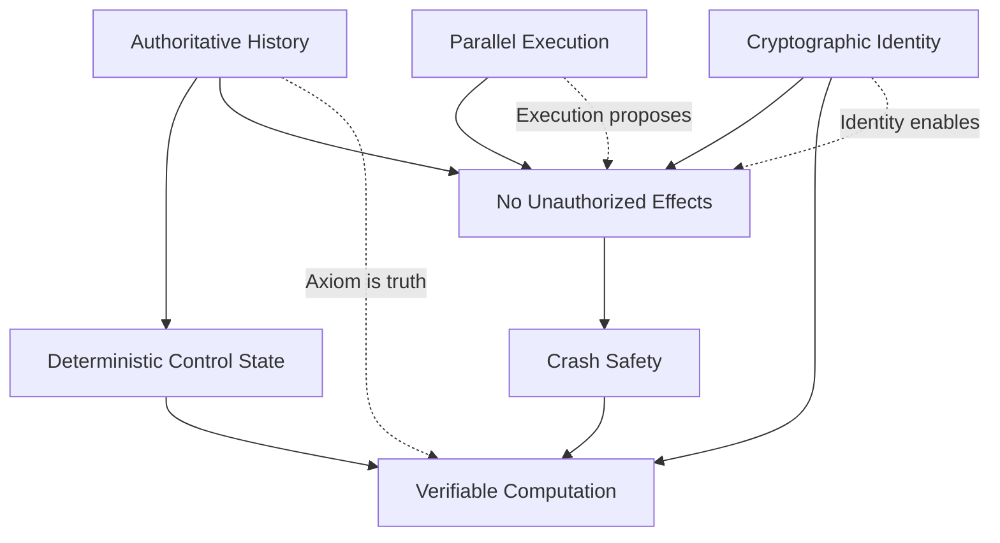

# Orbital OS — Core Principles

**Version:** 1.0  
**Status:** Whitepaper  
**Classification:** Public

---

## Overview

Orbital OS is built upon seven foundational invariants. These are not guidelines or best practices — they are **non-negotiable architectural constraints** that must hold at all times.

Violation of any invariant constitutes system failure.

---

## Principle 1: Authoritative History (The Axiom)

### Statement

> The system MUST maintain exactly **one authoritative, totally ordered history** of state transitions. This history is called the **Axiom**. Only events recorded in the Axiom are considered **real**.

### Rationale

Without a single source of truth, distributed components can disagree about system state. Logs become forensic artifacts rather than authoritative records. Audit becomes impossible.

### Implications

| Requirement | Consequence |
|-------------|-------------|
| Single Axiom | No competing histories, no forks, no reconciliation |
| Totally ordered | Every entry has a definite position relative to all others |
| Append-only | History cannot be rewritten or revised |
| Hash-chained | Integrity is cryptographically verifiable |
| Crash-consistent | Partial writes cannot corrupt the chain |

### What Enters the Axiom

**Included:**
- Policy and capability changes
- Service lifecycle transitions
- Filesystem metadata transactions
- Network authorization events
- Job acceptance and completion
- Upgrade transactions
- Identity and credential operations
- Key usage and signing events

**Excluded:**
- High-frequency runtime events (scheduling decisions, cache misses)
- Data-plane traffic (network packets, file block reads)
- Speculative execution artifacts

### Verification

Given a Axiom, any observer can:
1. Verify chain integrity (hash validation)
2. Replay history to derive current state
3. Audit any transition for authorization
4. Identify the exact sequence of events

---

## Principle 2: Deterministic Control State

### Statement

> Control-plane state MUST be a **pure deterministic reduction** of the Axiom. Given the same Axiom, replay MUST always yield identical control state. Control-plane derivation MUST NOT perform I/O or observe nondeterministic inputs.

### Rationale

If control state depends on anything other than the Axiom, different nodes (or the same node after restart) may derive different authority. This breaks verification and audit.

### What Is Control State?

Control state answers: *"Who can do what? What exists? What is authorized?"*

| Category | Examples |
|----------|----------|
| Capabilities | Which processes hold which capabilities |
| Policy | Access control rules, resource limits |
| Existence | What files exist, what services are registered |
| Authorization | Which operations are permitted |
| Identity | Which users exist, what credentials they hold |

### Derivation Requirements

The reduction function must be:

```
reduce : Axiom → ControlState

Properties:
  - Pure: No side effects
  - Deterministic: Same input → same output
  - Total: Defined for all valid Axiom instances
  - Incremental: Can be computed entry-by-entry
```

### Prohibited in Derivation

- Reading wall-clock time
- Generating random numbers
- Performing I/O operations
- Observing execution timing
- Accessing mutable external state

---

## Principle 3: Parallel Execution

### Statement

> Execution MAY be fully parallel and preemptive. Nondeterminism is permitted in execution. Nondeterminism is NEVER permitted in authority.

### Rationale

Requiring deterministic execution (like Urbit) sacrifices parallelism. Modern hardware has many cores. A practical OS must use them.

The key insight: **execution nondeterminism is acceptable as long as authority remains deterministic**.

### The Two Realms

```
┌─────────────────────────────────────────────────────────┐
│                   EXECUTION REALM                       │
│                                                         │
│  • Parallel, preemptive, nondeterministic              │
│  • Scheduling order varies                              │
│  • Interrupt timing varies                              │
│  • Cache behavior varies                                │
│  • All work is tentative (proposals)                   │
│                                                         │
└────────────────────────┬────────────────────────────────┘
                         │ Proposals
                         ▼
┌─────────────────────────────────────────────────────────┐
│                   AUTHORITY REALM                       │
│                                                         │
│  • Sequential, deterministic, auditable                │
│  • Axiom imposes total order                           │
│  • Same Axiom → same state (always)                    │
│  • This is what verification audits                    │
│                                                         │
└─────────────────────────────────────────────────────────┘
```

### Allowed Nondeterminism

- Thread scheduling order
- Interrupt delivery timing
- Speculative execution
- Cache and memory timing
- I/O completion order

### Prohibited Nondeterminism

- Control-plane state derivation
- Capability checking logic
- Verification computation
- Axiom ordering (must be deterministic given inputs)
- Identity verification
- Policy evaluation

---

## Principle 4: No Effect Without Authorization

### Statement

> No externally visible side effect MAY occur unless explicitly authorized by a committed Axiom entry. Unauthorized effects constitute system failure.

### Rationale

If effects can occur without Axiom authorization, the Axiom is not authoritative. Audit becomes incomplete. The system's integrity guarantee is void.

### What Is an Effect?

An effect is any action that:
- Modifies persistent state
- Communicates externally
- Is visible outside the originating process
- Uses cryptographic keys

| Effect Type | Examples |
|-------------|----------|
| Storage | Writing to disk, modifying files |
| Network | Sending packets, establishing connections |
| Device | Controlling hardware, producing output |
| IPC | Sending messages to other services |
| Signing | Using cryptographic keys to sign data |

### Authorization Flow

```
1. Process wants to perform effect E
2. Process submits proposal P describing E
3. Policy Engine evaluates P against current policy
4. If approved: Proposal P enters Axiom sequencer
5. Sequencer accepts P → becomes Axiom entry C
6. Entry C authorizes effect E
7. Effect E is materialized
8. Receipt R is committed to Axiom
```

### Failure Modes

| Situation | Response |
|-----------|----------|
| Effect attempted without proposal | Block/reject |
| Effect attempted before commit | Block/reject |
| Policy denies proposal | Reject with reason |
| Effect performed, no Axiom entry | System failure (should be impossible) |

---

## Principle 5: Crash Safety

### Statement

> Pre-commit work MUST be discardable. Post-commit effects MUST be retryable and idempotent. System crashes MUST NOT corrupt or reorder the Axiom.

### Rationale

Systems crash. Hardware fails. Power disappears. A system that requires "graceful shutdown" for consistency is not crash-safe.

### The Three-Phase Model

Every meaningful action follows:

```
Phase 1: Pre-Commit (Proposal)
├── Work is tentative
├── Effects are prepared but not executed
├── Crash here → work is lost (acceptable)
└── Produces proposal for Policy Engine

Phase 2: Commit
├── Policy Engine evaluates proposal
├── If approved: submitted to Axiom sequencer
├── Sequencer orders and accepts/rejects
├── Accepted proposals become Axiom entries
└── Crash here → entry either committed or not (atomic)

Phase 3: Effect Materialization
├── Axiom entry authorizes effects
├── Effects are executed
├── Effects MUST be idempotent (safe to retry)
├── Crash here → retry from last committed receipt
└── Completion produces receipt
```

### Idempotency Requirement

Post-commit effects must satisfy:

```
effect(state) = effect(effect(state))
```

Applying an effect multiple times must produce the same result as applying it once.

### Axiom Durability

The Axiom uses write-ahead logging with:
- Atomic entry append
- Crash-consistent storage
- No partial entries visible
- Recovery replays from last complete entry

---

## Principle 6: Verifiable Computation

### Statement

> Any computation whose result becomes authoritative MUST be verifiable. Verification MUST be possible using only: content-addressed canonical inputs, pinned execution environment identity, explicit determinism declaration, and committed receipts binding inputs → outputs.

### Rationale

If results cannot be verified, they cannot be trusted. Supply-chain attacks, compromised nodes, and Byzantine failures are only detectable through verification.

### Verification Components

| Component | Purpose |
|-----------|---------|
| **Content-addressed inputs** | Immutable, verifiable input identity |
| **Pinned environment** | Known, reproducible execution context |
| **Determinism declaration** | Explicit contract of reproducibility |
| **Receipt** | Binding commitment of inputs → outputs |

### Verification Protocol

```
Prover:
1. Declare inputs I (content-addressed)
2. Declare environment E (content-addressed)
3. Execute computation C in environment E with inputs I
4. Produce outputs O (content-addressed)
5. Commit receipt R = (I, E, O, signature)

Verifier:
1. Obtain receipt R
2. Retrieve inputs I by content address
3. Retrieve environment E by content address
4. Re-execute computation C in environment E with inputs I
5. Verify outputs match O
6. Accept or reject
```

### Determinism Requirements

For verification to work, computation must be deterministic:

**Allowed:**
- Pure functions
- Explicit randomness (passed as input)
- Explicit time (passed as input)
- Deterministic concurrency (e.g., fork-join with deterministic merge)

**Prohibited:**
- Wall-clock time observation
- Implicit randomness
- Nondeterministic system calls
- Uncontrolled concurrency (race conditions)

---

## Principle 7: Cryptographic Identity

### Statement

> All principals (users, services, nodes) MUST have cryptographic identities. Keys MUST be derived deterministically from protected root secrets. All signing operations MUST be policy-controlled and audited. Key material MUST never be exposed outside secure boundaries.

### Rationale

Identity is foundational to authorization. Without cryptographic identity:
- Authentication relies on mutable, forgeable credentials
- Authorization decisions cannot be cryptographically verified
- Signing authority is ambiguous
- Key compromise is undetectable

### Identity Hierarchy

```
┌─────────────────────────────────────────────────────────┐
│                    IDENTITY MODEL                       │
│                                                         │
│  Root Identity (System)                                 │
│  └── Organization Identity                              │
│      ├── User Identity                                  │
│      │   └── Credential (derived keys)                  │
│      │   └── Credential (derived keys)                  │
│      ├── Service Identity                               │
│      │   └── Service Keys (derived)                     │
│      └── Node Identity                                  │
│          └── Node Keys (derived)                        │
│                                                         │
│  Each identity has:                                     │
│  • Unique identifier (content-addressed from public key)│
│  • Derivation path from root                           │
│  • Policy governing key usage                           │
│  • Audit trail of operations                           │
│                                                         │
└─────────────────────────────────────────────────────────┘
```

### Key Derivation Model

Keys are derived deterministically using hierarchical derivation (inspired by BIP-32/BIP-44):

```rust
/// Key derivation path
struct KeyPath {
    /// Root identifier
    root: RootId,
    
    /// Hierarchical path segments
    segments: Vec<PathSegment>,
}

/// Example paths:
/// /orbital/users/alice/signing/0
/// /orbital/services/filesystem/encryption
/// /orbital/nodes/node-01/attestation
```

**Properties:**
- **Deterministic**: Same root + path → same key, always
- **Hierarchical**: Parent path doesn't reveal child keys
- **Never stored**: Keys derived on-demand, used, then discarded
- **Audit-friendly**: Derivation path recorded with every operation

### Policy-Controlled Signing

All signing operations require policy approval:

```
┌─────────────┐     ┌─────────────┐     ┌─────────────┐
│   Request   │────▶│   Policy    │────▶│     Key     │
│ (what, who, │     │   Engine    │     │  Derivation │
│   why)      │     │             │     │   Service   │
└─────────────┘     └─────────────┘     └─────────────┘
                           │                   │
                    ┌──────┴──────┐            │
                    │ Policy      │            │
                    │ Decision    │            ▼
                    │ (allow/deny)│     ┌─────────────┐
                    │ recorded in │     │   Secure    │
                    │ Axiom       │     │  Boundary   │
                    └─────────────┘     │  (signing)  │
                                        └─────────────┘
```

### Secure Boundary

The secure boundary protects key material:

| Property | Guarantee |
|----------|-----------|
| **Isolation** | Keys never leave secure boundary |
| **Policy-gated** | Every operation requires authorization |
| **Audited** | All operations recorded in Axiom |
| **Minimal TCB** | Smallest possible trusted computing base |

**Software boundary (always present):**
- Isolated address space
- Capability-gated IPC
- Memory zeroing after use
- No key persistence

**Hardware enhancement (optional):**
- TPM 2.0 for root seed protection
- Secure enclave (when available)

### Verifiable Policy Decisions

Every policy decision is verifiable:

1. **Request recorded**: What was requested, by whom
2. **Policy snapshot**: What rules were evaluated
3. **Decision recorded**: Allow/deny with reasoning
4. **Signature**: Policy Engine attests to the decision

This enables:
- Complete audit of all authorization decisions
- Verification that policy was correctly applied
- Detection of policy engine compromise

---

## Invariant Summary

| # | Invariant | One-Line Summary |
|---|-----------|------------------|
| 1 | Authoritative History | The Axiom is the single source of truth |
| 2 | Deterministic Control State | Authority is a pure function of history |
| 3 | Parallel Execution | Fast execution, deterministic authority |
| 4 | No Unauthorized Effects | No Axiom entry, no side effect |
| 5 | Crash Safety | Pre-commit discards, post-commit retries |
| 6 | Verifiable Computation | Results can be independently checked |
| 7 | Cryptographic Identity | All principals have audited, policy-controlled keys |

---

## Invariant Relationships



The invariants form a coherent system:
- **I1** (Axiom) enables **I2** (deterministic state) and **I4** (authorization)
- **I3** (parallelism) works because **I4** separates execution from authority
- **I5** (crash safety) ensures **I6** (verification) remains valid after failures
- **I7** (identity) provides cryptographic foundation for **I4** (authorization) and **I6** (verification)
- All invariants together enable the core guarantee: **verifiable system behavior**

---

## Design Corollaries

From these principles, several design decisions follow necessarily:

### Corollary 1: Minimal Kernel

The kernel cannot contain Axiom logic, filesystem code, or network stacks — these must be auditable user-space services.

### Corollary 2: Capability-Based Security

Ambient authority violates I4. All effects require explicit capability tokens.

### Corollary 3: Content-Addressed Storage

Verification (I6) requires content-addressed inputs. Therefore, the storage model must support content addressing.

### Corollary 4: Immutable System Images

Mutable system state cannot be verified. System software must be immutable, signed images.

### Corollary 5: Deterministic Applications (v0)

Verification requires determinism. v0 applications must be deterministic. Nondeterministic applications require additional infrastructure (normalization, attestation).

### Corollary 6: Policy Engine Required

Authorization (I4) and identity (I7) require a Policy Engine to evaluate every consequential request.

### Corollary 7: Key Derivation Service Required

Cryptographic identity (I7) requires a Key Derivation Service to derive and use keys within a secure boundary.

---

*← [Background](01-background.md) | [Architecture Overview](03-architecture-overview.md) →*
