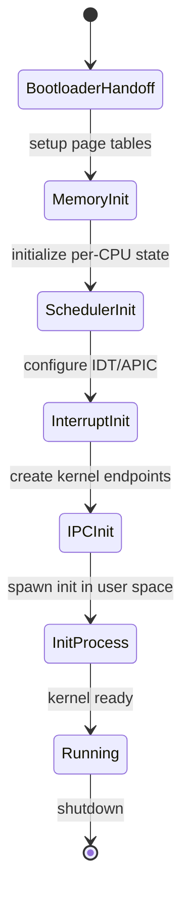
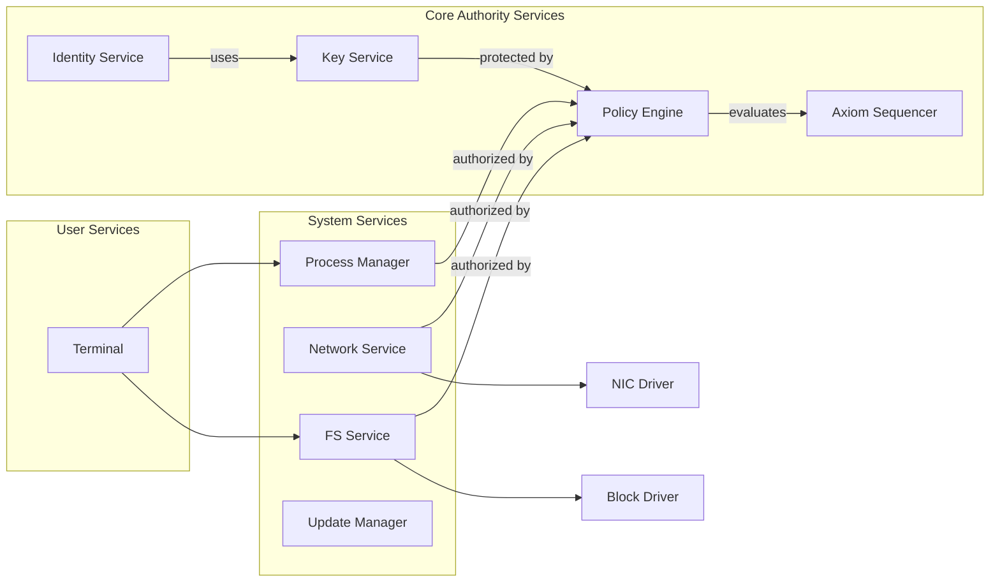
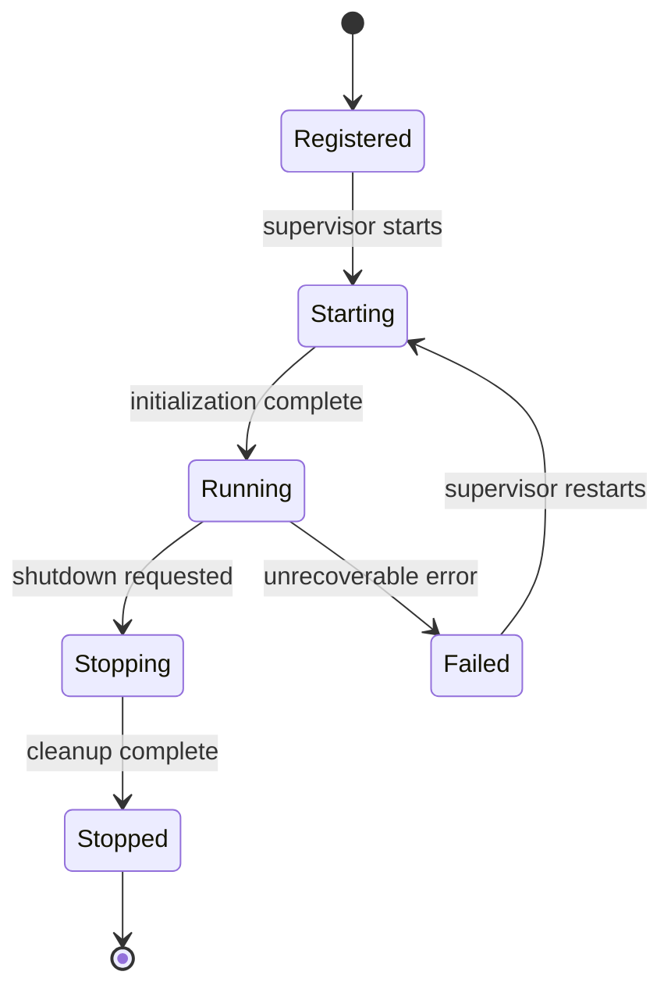
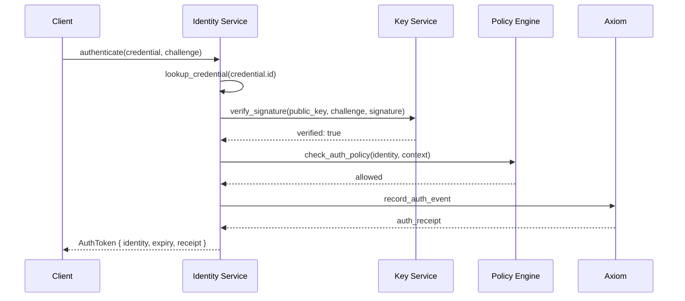
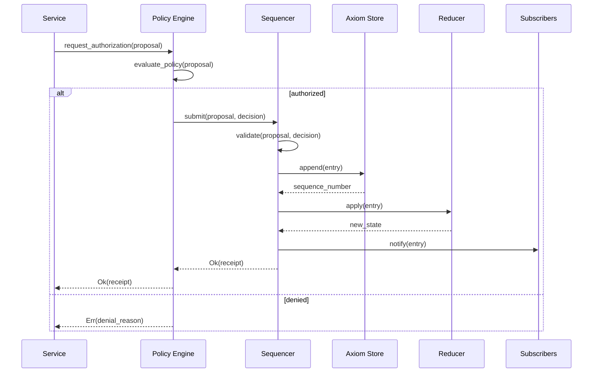
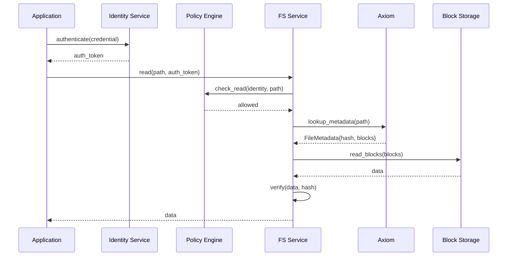
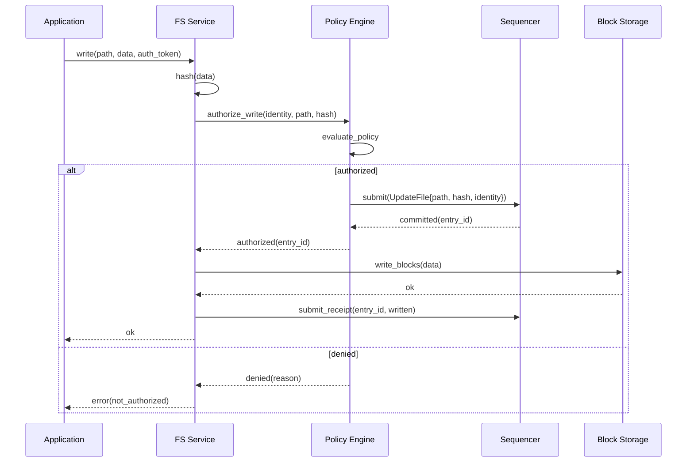
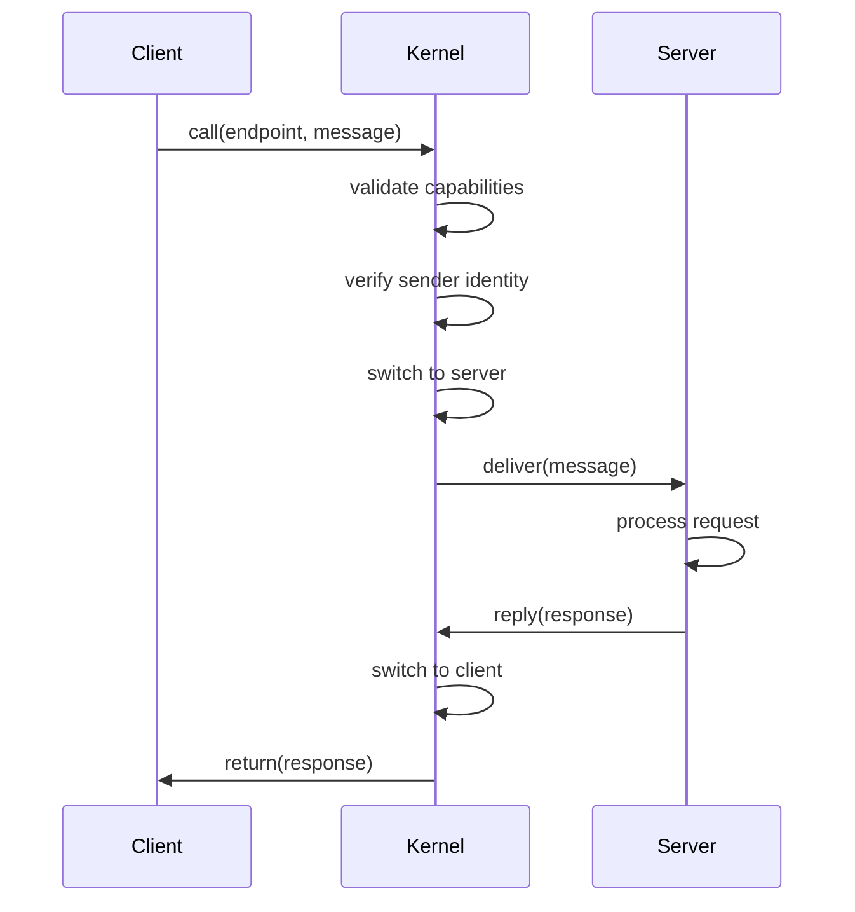

# Orbital OS — Architecture Overview

**Version:** 1.0  
**Status:** Whitepaper  
**Classification:** Public

---

## 1. System Layers

Orbital OS is structured in four distinct layers:

```
┌─────────────────────────────────────────────────────────────────────┐
│                         LAYER 4: APPLICATIONS                       │
│                                                                     │
│    ┌──────────┐  ┌──────────┐  ┌──────────┐  ┌──────────┐          │
│    │  Job A   │  │  Job B   │  │  Job C   │  │  Job D   │          │
│    │(det.)    │  │(det.)    │  │(det.)    │  │(det.)    │          │
│    └──────────┘  └──────────┘  └──────────┘  └──────────┘          │
│                                                                     │
├─────────────────────────────────────────────────────────────────────┤
│                       LAYER 3: OS SERVICES                          │
│                                                                     │
│  ┌─────────┐ ┌─────────┐ ┌─────────┐ ┌─────────┐ ┌─────────┐       │
│  │ Axiom   │ │ Policy  │ │  Key    │ │   FS    │ │ Network │       │
│  │Sequencer│ │ Engine  │ │ Service │ │ Service │ │ Service │       │
│  └────┬────┘ └────┬────┘ └────┬────┘ └────┬────┘ └────┬────┘       │
│       │          │          │          │          │                │
│       └──────────┴──────────┴──────────┴──────────┘                │
│                         IPC Bus                                     │
│  ┌─────────┐ ┌─────────┐ ┌─────────┐                               │
│  │ Process │ │Identity │ │Terminal │                               │
│  │ Manager │ │ Service │ │ Service │                               │
│  └─────────┘ └─────────┘ └─────────┘                               │
│                                                                     │
├─────────────────────────────────────────────────────────────────────┤
│                        LAYER 2: DRIVERS                             │
│                                                                     │
│  ┌─────────┐ ┌─────────┐ ┌─────────┐ ┌─────────┐ ┌─────────┐       │
│  │  Block  │ │   NIC   │ │  Timer  │ │ Console │ │   GPU   │       │
│  │ Driver  │ │ Driver  │ │ Driver  │ │ Driver  │ │ Driver  │       │
│  └─────────┘ └─────────┘ └─────────┘ └─────────┘ └─────────┘       │
│                     (all user-space)                                │
│                                                                     │
├─────────────────────────────────────────────────────────────────────┤
│                         LAYER 1: KERNEL                             │
│                                                                     │
│   ┌──────────────┐ ┌──────────────┐ ┌──────────────┐               │
│   │  Scheduler   │ │    Memory    │ │ Capabilities │               │
│   │   (SMP)      │ │   Manager    │ │   Enforcer   │               │
│   └──────────────┘ └──────────────┘ └──────────────┘               │
│   ┌──────────────┐ ┌──────────────┐                                │
│   │     IPC      │ │  Interrupt   │                                │
│   │  Primitives  │ │   Handler    │                                │
│   └──────────────┘ └──────────────┘                                │
│                                                                     │
└─────────────────────────────────────────────────────────────────────┘
                              │
                              ▼
                    ┌─────────────────┐
                    │    HARDWARE     │
                    │  (x86_64 first) │
                    └─────────────────┘
```

---

## 2. Layer 1: The Kernel

### 2.1 Kernel Responsibilities

The kernel provides exactly five services:

| Service | Description |
|---------|-------------|
| **Preemptive Scheduler** | SMP-aware, time-sliced, priority-based |
| **Memory Manager** | Virtual address spaces, page tables, isolation |
| **Capability Enforcer** | Token validation, unforgeable capabilities |
| **IPC Primitives** | Fast synchronous/asynchronous message passing |
| **Interrupt Handler** | Hardware interrupt routing, timer management |

### 2.2 Kernel Prohibitions

The kernel MUST NOT contain:

- Filesystem code
- Network stack
- Device-specific drivers (beyond bootstrap)
- Policy logic
- Axiom sequencer
- User authentication
- Identity management
- Key derivation
- Resource accounting (beyond enforcement)

### 2.3 Kernel State

The kernel maintains minimal state:

```rust
struct KernelState {
    // Process management
    processes: BTreeMap<ProcessId, Process>,
    threads: BTreeMap<ThreadId, Thread>,
    
    // Memory management
    address_spaces: BTreeMap<AddressSpaceId, AddressSpace>,
    
    // Capability tables
    capability_spaces: BTreeMap<ProcessId, CapabilitySpace>,
    
    // IPC endpoints
    endpoints: BTreeMap<EndpointId, Endpoint>,
    
    // Scheduler state
    run_queues: PerCpu<RunQueue>,
}
```

### 2.4 Kernel Boot Sequence



---

## 3. Layer 2: User-Space Drivers

### 3.1 Driver Model

All device drivers run in user space as isolated processes:

```
┌────────────────────────────────────────────────────────────┐
│                     DRIVER PROCESS                          │
│                                                            │
│  ┌──────────────┐  ┌──────────────┐  ┌──────────────┐     │
│  │   Driver     │  │   DMA        │  │  Interrupt   │     │
│  │   Logic      │  │   Buffer     │  │   Handler    │     │
│  └──────────────┘  └──────────────┘  └──────────────┘     │
│                                                            │
│  Capabilities: [IO_PORT, IRQ_N, DMA_REGION]               │
│                                                            │
└────────────────────────────────────────────────────────────┘
         │                    │                    │
         ▼                    ▼                    ▼
┌────────────────────────────────────────────────────────────┐
│                        KERNEL                               │
│  • Maps DMA region into driver address space               │
│  • Routes interrupt N to driver                            │
│  • Validates I/O port access via capability                │
└────────────────────────────────────────────────────────────┘
```

### 3.2 Driver Benefits

| Benefit | Description |
|---------|-------------|
| **Fault isolation** | Driver crash doesn't crash kernel |
| **Hot reload** | Drivers can be updated without reboot |
| **Reduced TCB** | Kernel attack surface minimized |
| **Auditable** | Driver behavior can be logged |

### 3.3 Essential Drivers (v0)

| Driver | Purpose |
|--------|---------|
| Block driver | Disk I/O (virtio-blk, AHCI) |
| Network driver | Network I/O (virtio-net) |
| Timer driver | System timer, RTC |
| Console driver | Serial, virtio-console |

---

## 4. Layer 3: OS Services

### 4.1 Service Architecture

OS services are long-running user-space processes that provide system functionality:



### 4.2 Required Services

| Service | Responsibility |
|---------|----------------|
| **Init/Supervisor** | Boots other services, monitors health |
| **Axiom Sequencer** | Orders and commits Axiom entries |
| **Policy Engine** | Evaluates all authorization requests |
| **Key Derivation Service** | Derives keys, performs signing |
| **Identity Service** | Manages user/service identities |
| **Process Manager** | Creates/destroys processes, resource limits |
| **Capability Service** | Manages capability delegation |
| **Filesystem Service** | Namespace, metadata, content addressing |
| **Block Storage Service** | Block device abstraction |
| **Network Service** | TCP/IP stack, connection management |
| **Update Manager** | System image management, atomic updates |
| **Terminal Service** | User interaction, command execution |

### 4.3 Service Communication

Services communicate via typed IPC:

```rust
// Example: Process creation request
struct CreateProcessRequest {
    image_hash: ContentHash,
    capabilities: Vec<Capability>,
    resource_limits: ResourceLimits,
    identity: IdentityRef,  // Who is creating this process
}

struct CreateProcessResponse {
    result: Result<ProcessId, CreateError>,
    receipt: Option<Receipt>,
}
```

### 4.4 Service Lifecycle



---

## 5. The Policy Engine

### 5.1 Central Role

The Policy Engine is the gatekeeper of all consequential operations. Every request that could modify system state must pass through policy evaluation.

```
┌─────────────────────────────────────────────────────────────────────┐
│                         POLICY ENGINE                               │
│                                                                     │
│  ┌───────────────────────────────────────────────────────────────┐ │
│  │                    REQUEST INTAKE                              │ │
│  │  • Parse and validate request                                  │ │
│  │  • Extract identity of requestor                               │ │
│  │  • Identify target resource                                    │ │
│  └───────────────────────────────────────────────────────────────┘ │
│                              │                                      │
│                              ▼                                      │
│  ┌───────────────────────────────────────────────────────────────┐ │
│  │                    AUTHENTICATION                              │ │
│  │  • Verify requestor identity                                   │ │
│  │  • Validate credentials/signatures                             │ │
│  │  • Check identity is not revoked                               │ │
│  └───────────────────────────────────────────────────────────────┘ │
│                              │                                      │
│                              ▼                                      │
│  ┌───────────────────────────────────────────────────────────────┐ │
│  │                    AUTHORIZATION                               │ │
│  │  • Evaluate policy rules against request                       │ │
│  │  • Check capabilities                                          │ │
│  │  • Apply resource limits                                       │ │
│  │  • Evaluate conditional rules                                  │ │
│  └───────────────────────────────────────────────────────────────┘ │
│                              │                                      │
│                              ▼                                      │
│  ┌───────────────────────────────────────────────────────────────┐ │
│  │                    DECISION                                    │ │
│  │  • Allow or Deny                                               │ │
│  │  • Attach conditions/restrictions                              │ │
│  │  • Record decision in Axiom                                    │ │
│  └───────────────────────────────────────────────────────────────┘ │
│                                                                     │
└─────────────────────────────────────────────────────────────────────┘
```

### 5.2 Policy Language

Policies are expressed in a simple, deterministic language:

```rust
/// Policy rule
struct PolicyRule {
    /// Rule identifier
    id: RuleId,
    
    /// When this rule applies
    condition: Condition,
    
    /// What effect this rule has
    effect: Effect,
    
    /// Priority (higher = evaluated first)
    priority: u32,
}

enum Condition {
    /// Always matches
    Always,
    
    /// Match specific identity
    Identity(IdentityMatcher),
    
    /// Match specific resource
    Resource(ResourceMatcher),
    
    /// Match specific action
    Action(ActionMatcher),
    
    /// Combine conditions
    And(Vec<Condition>),
    Or(Vec<Condition>),
    Not(Box<Condition>),
    
    /// Time-based (deterministic: Axiom time, not wall clock)
    Before(AxiomTime),
    After(AxiomTime),
}

enum Effect {
    Allow,
    Deny,
    AllowWithConditions(Vec<Restriction>),
}
```

### 5.3 Policy Evaluation

Policy evaluation is deterministic:
- Same policy state + same request → same decision
- Policy state is derived from Axiom (Principle 2)
- No external dependencies (no network, no randomness)

```rust
fn evaluate_policy(
    policy_state: &PolicyState,
    request: &PolicyRequest,
) -> PolicyDecision {
    // Find matching rules (deterministic order)
    let matching_rules: Vec<&PolicyRule> = policy_state
        .rules
        .iter()
        .filter(|r| r.condition.matches(request))
        .collect();
    
    // Apply in priority order
    for rule in matching_rules.iter().sorted_by_key(|r| Reverse(r.priority)) {
        match &rule.effect {
            Effect::Allow => return PolicyDecision::Allow,
            Effect::Deny => return PolicyDecision::Deny { rule: rule.id },
            Effect::AllowWithConditions(c) => {
                return PolicyDecision::AllowWith { conditions: c.clone() }
            }
        }
    }
    
    // Default deny
    PolicyDecision::Deny { rule: RuleId::DEFAULT_DENY }
}
```

### 5.4 Verifiable Policy Decisions

Every policy decision produces a verifiable record:

```rust
struct PolicyDecisionRecord {
    /// Request that was evaluated
    request_hash: Hash,
    
    /// Policy state at time of evaluation
    policy_state_hash: Hash,
    
    /// Rules that matched
    matched_rules: Vec<RuleId>,
    
    /// Final decision
    decision: PolicyDecision,
    
    /// Policy Engine signature
    signature: Signature,
    
    /// Axiom entry reference
    axiom_ref: AxiomRef,
}
```

This enables:
- Third-party verification that policy was correctly applied
- Audit of all authorization decisions
- Detection of policy engine compromise

---

## 6. Key Derivation Service

### 6.1 Architecture

The Key Derivation Service (KDS) manages all cryptographic key operations within a secure boundary:

```
┌─────────────────────────────────────────────────────────────────────┐
│                    KEY DERIVATION SERVICE                           │
│                                                                     │
│  ┌───────────────────────────────────────────────────────────────┐ │
│  │                    SECURE BOUNDARY                             │ │
│  │                                                                │ │
│  │  ┌─────────────┐  ┌─────────────┐  ┌─────────────┐            │ │
│  │  │  Root Seed  │  │   Derive    │  │   Signing   │            │ │
│  │  │  (protected)│  │   Engine    │  │   Engine    │            │ │
│  │  └─────────────┘  └─────────────┘  └─────────────┘            │ │
│  │         │                │                │                    │ │
│  │         └────────────────┴────────────────┘                    │ │
│  │                          │                                     │ │
│  │                    [memory zeroed                              │ │
│  │                     after each op]                             │ │
│  │                                                                │ │
│  └───────────────────────────────────────────────────────────────┘ │
│                              │                                      │
│                              ▼                                      │
│  ┌───────────────────────────────────────────────────────────────┐ │
│  │                    IPC INTERFACE                               │ │
│  │  • derive_public_key(path) → PublicKey                        │ │
│  │  • sign(path, message, authorization) → Signature             │ │
│  │  • verify(public_key, message, signature) → bool              │ │
│  │  • encrypt(path, plaintext, authorization) → Ciphertext       │ │
│  │  • decrypt(path, ciphertext, authorization) → Plaintext       │ │
│  └───────────────────────────────────────────────────────────────┘ │
│                                                                     │
│  Note: Private keys NEVER leave the secure boundary                │
│                                                                     │
└─────────────────────────────────────────────────────────────────────┘
```

### 6.2 Key Derivation

Keys are derived using hierarchical deterministic derivation:

```rust
/// Derive a key from path
fn derive_key(root_seed: &RootSeed, path: &KeyPath) -> DerivedKey {
    let mut current = root_seed.master_key();
    
    for segment in &path.segments {
        // HKDF-based derivation
        current = hkdf_derive(
            current,
            segment.as_bytes(),
            b"orbital-key-derivation-v1"
        );
    }
    
    DerivedKey::from_bytes(current)
}
```

### 6.3 Signing Protocol

All signing operations require policy authorization:

```rust
/// Signing request
struct SignRequest {
    /// Key derivation path
    key_path: KeyPath,
    
    /// Message to sign (hash of actual content)
    message: Hash,
    
    /// Who is requesting
    requestor: Identity,
    
    /// Authorization (Axiom entry that permits this)
    authorization: AxiomRef,
}

/// Signing flow
impl KeyDerivationService {
    async fn sign(&self, request: SignRequest) -> Result<SignResponse, SignError> {
        // 1. Verify authorization with Policy Engine
        let policy_decision = self.policy_engine
            .evaluate(PolicyRequest::Sign {
                requestor: request.requestor,
                key_path: request.key_path.clone(),
                message: request.message,
            })
            .await?;
        
        if !policy_decision.is_allowed() {
            return Err(SignError::NotAuthorized(policy_decision));
        }
        
        // 2. Derive key (within secure boundary)
        let key = self.secure_boundary.derive_key(&request.key_path);
        
        // 3. Sign message
        let signature = self.secure_boundary.sign(&key, &request.message);
        
        // 4. Record usage in Axiom
        let receipt = self.axiom.submit(AxiomEntry::KeyUsage {
            operation: KeyOperation::Sign,
            key_path: request.key_path,
            message_hash: request.message,
            authorization: request.authorization,
            signature_hash: signature.hash(),
        }).await?;
        
        // 5. Key material is automatically zeroed
        
        Ok(SignResponse {
            signature,
            receipt,
        })
    }
}
```

### 6.4 Root Seed Protection

The root seed is protected by the software secure boundary:

| Protection | Description |
|------------|-------------|
| **Isolated address space** | No other process can access KDS memory |
| **Capability-gated IPC** | Only authorized services can call KDS |
| **No persistence** | Root seed loaded from secure storage at boot only |
| **Memory zeroing** | All key material zeroed after use |

Optional hardware enhancement:
- TPM 2.0 sealed storage for root seed
- Secure enclave (Intel SGX, ARM TrustZone) when available

---

## 7. Identity Service

### 7.1 Identity Model

The Identity Service manages all principal identities:

```
┌─────────────────────────────────────────────────────────────────────┐
│                       IDENTITY SERVICE                              │
│                                                                     │
│  ┌───────────────────────────────────────────────────────────────┐ │
│  │                    IDENTITY REGISTRY                           │ │
│  │                                                                │ │
│  │  ┌─────────────────────────────────────────────────────────┐  │ │
│  │  │  System Identity (root)                                  │  │ │
│  │  │  ├── orbital.services.axiom                             │  │ │
│  │  │  ├── orbital.services.policy                            │  │ │
│  │  │  ├── orbital.services.keys                              │  │ │
│  │  │  ├── orbital.services.filesystem                        │  │ │
│  │  │  └── ...                                                │  │ │
│  │  │                                                         │  │ │
│  │  │  Organization: example.org                              │  │ │
│  │  │  ├── alice@example.org                                  │  │ │
│  │  │  │   ├── credential: passkey-1                          │  │ │
│  │  │  │   └── credential: recovery-key                       │  │ │
│  │  │  ├── bob@example.org                                    │  │ │
│  │  │  │   └── credential: passkey-1                          │  │ │
│  │  │  └── api-service@example.org                            │  │ │
│  │  │      └── credential: service-key                        │  │ │
│  │  └─────────────────────────────────────────────────────────┘  │ │
│  │                                                                │ │
│  └───────────────────────────────────────────────────────────────┘ │
│                                                                     │
│  Operations:                                                        │
│  • create_identity(parent, name, type) → Identity                  │
│  • add_credential(identity, credential_type) → Credential          │
│  • revoke_credential(identity, credential_id)                      │
│  • authenticate(credential, challenge) → AuthResult                │
│  • get_identity(id) → IdentityInfo                                 │
│                                                                     │
└─────────────────────────────────────────────────────────────────────┘
```

### 7.2 Identity Structure

```rust
/// Identity in the system
struct Identity {
    /// Unique identifier (content-addressed from public key)
    id: IdentityId,
    
    /// Human-readable name
    name: String,
    
    /// Identity type
    identity_type: IdentityType,
    
    /// Parent identity (for hierarchy)
    parent: Option<IdentityId>,
    
    /// When created (Axiom sequence)
    created_at: AxiomSequence,
    
    /// Current status
    status: IdentityStatus,
    
    /// Public key for this identity
    public_key: PublicKey,
    
    /// Key derivation path
    key_path: KeyPath,
}

enum IdentityType {
    /// System-level identity (services, nodes)
    System,
    
    /// Organization
    Organization,
    
    /// User (human)
    User,
    
    /// Service (API, automation)
    Service,
    
    /// Device/Node
    Node,
}
```

### 7.3 Credential Types

```rust
/// Credential for authentication
enum Credential {
    /// WebAuthn/FIDO2 passkey
    Passkey {
        id: CredentialId,
        public_key: PublicKey,
        aaguid: [u8; 16],
        sign_count: u32,
    },
    
    /// Recovery key (for account recovery)
    RecoveryKey {
        id: CredentialId,
        key_hash: Hash,
        used: bool,
    },
    
    /// API key (for service authentication)
    ApiKey {
        id: CredentialId,
        key_hash: Hash,
        permissions: Vec<Permission>,
        expires: Option<AxiomTime>,
    },
    
    /// Derived key (from parent identity)
    DerivedKey {
        id: CredentialId,
        derivation_path: KeyPath,
    },
}
```

### 7.4 Authentication Flow



---

## 8. The Axiom Subsystem

### 8.1 Axiom Architecture

The Axiom is the authoritative record of system state transitions:

```
┌─────────────────────────────────────────────────────────────────────┐
│                      CODEX SUBSYSTEM                                │
│                                                                     │
│  ┌─────────────────────────────────────────────────────────────┐   │
│  │                  CODEX SEQUENCER                             │   │
│  │                                                              │   │
│  │  • Receives proposals from Policy Engine                    │   │
│  │  • Validates proposals are policy-approved                  │   │
│  │  • Assigns sequence numbers                                 │   │
│  │  • Commits entries atomically                               │   │
│  │  • Notifies subscribers                                     │   │
│  └─────────────────────────────────────────────────────────────┘   │
│                           │                                         │
│                           ▼                                         │
│  ┌─────────────────────────────────────────────────────────────┐   │
│  │                   CODEX STORE                                │   │
│  │                                                              │   │
│  │  Entry 0: Genesis                                           │   │
│  │  Entry 1: ─────────────────────────────────────────────────▶│   │
│  │  Entry 2: ─────────────────────────────────────────────────▶│   │
│  │  Entry N: ─────────────────────────────────────────────────▶│   │
│  │           (hash-chained, append-only)                       │   │
│  └─────────────────────────────────────────────────────────────┘   │
│                           │                                         │
│                           ▼                                         │
│  ┌─────────────────────────────────────────────────────────────┐   │
│  │                   REDUCER                                    │   │
│  │                                                              │   │
│  │  reduce(axiom) → control_state                              │   │
│  │                                                              │   │
│  │  • Pure function                                            │   │
│  │  • Deterministic                                            │   │
│  │  • Incremental (processes entries one by one)              │   │
│  │  • Produces: policy_state, identity_state, capability_state │   │
│  └─────────────────────────────────────────────────────────────┘   │
│                                                                     │
└─────────────────────────────────────────────────────────────────────┘
```

### 8.2 Entry Flow



---

## 9. The Determinism Boundary

### 9.1 Visual Representation

```
┌─────────────────────────────────────────────────────────────────┐
│                    NONDETERMINISTIC ZONE                        │
│                                                                 │
│  ┌───────────────┐ ┌───────────────┐ ┌───────────────┐         │
│  │  Scheduling   │ │   Interrupts  │ │    Caching    │         │
│  │    Order      │ │    Timing     │ │   Behavior    │         │
│  └───────────────┘ └───────────────┘ └───────────────┘         │
│                                                                 │
│  ┌───────────────┐ ┌───────────────┐ ┌───────────────┐         │
│  │   Network     │ │     I/O       │ │   Rendering   │         │
│  │    Timing     │ │   Latency     │ │    Output     │         │
│  └───────────────┘ └───────────────┘ └───────────────┘         │
│                                                                 │
│         │                    │                    │             │
│         ▼                    ▼                    ▼             │
│     [Proposals]          [Proposals]         [Proposals]        │
│                                                                 │
└─────────────────────────────┬───────────────────────────────────┘
                              │
                              ▼
┌─────────────────────────────────────────────────────────────────┐
│                      DETERMINISM BOUNDARY                        │
│                                                                 │
│                    ┌─────────────────┐                          │
│                    │  POLICY ENGINE  │                          │
│                    └────────┬────────┘                          │
│                             │                                   │
│                    ┌────────┴────────┐                          │
│                    │ CODEX SEQUENCER │                          │
│                    └────────┬────────┘                          │
│                             │                                   │
│                             ▼                                   │
└─────────────────────────────────────────────────────────────────┘
                              │
                              ▼
┌─────────────────────────────────────────────────────────────────┐
│                     DETERMINISTIC ZONE                           │
│                                                                 │
│  ┌───────────────┐ ┌───────────────┐ ┌───────────────┐         │
│  │    Axiom      │ │   Control     │ │ Verification  │         │
│  │   Ordering    │ │    State      │ │    Inputs     │         │
│  └───────────────┘ └───────────────┘ └───────────────┘         │
│                                                                 │
│  ┌───────────────┐ ┌───────────────┐ ┌───────────────┐         │
│  │  Environment  │ │   Receipts    │ │   Identity    │         │
│  │   Identity    │ │               │ │    State      │         │
│  └───────────────┘ └───────────────┘ └───────────────┘         │
│                                                                 │
└─────────────────────────────────────────────────────────────────┘
```

### 9.2 Crossing the Boundary

When nondeterministic execution needs to affect deterministic state:

1. **Request**: Service formulates request
2. **Authenticate**: Identify who is requesting
3. **Authorize**: Policy Engine evaluates against policy
4. **Sequence**: Axiom Sequencer imposes deterministic order
5. **Commit**: Entry becomes part of authoritative history

Example: Two concurrent file writes

```
Thread A: write("file.txt", "A")  ──┐
                                    ├──▶ Policy ──▶ Sequencer orders: [A, B]
Thread B: write("file.txt", "B")  ──┘
                                           │
                                           ▼
                                    Axiom: Entry 1: write A (by alice)
                                           Entry 2: write B (by bob)
                                           
Result is deterministic: "B" wins (last writer)
Audit shows: who wrote, when, under what authority
```

---

## 10. Data Flow Architecture

### 10.1 Read Path (Authenticated)



### 10.2 Write Path (Authenticated + Authorized)



---

## 11. Capability Model

### 11.1 Capability Structure

```rust
struct Capability {
    // Unique identifier
    id: CapabilityId,
    
    // What resource this grants access to
    resource: ResourceId,
    
    // What operations are permitted
    permissions: Permissions,
    
    // Optional restrictions
    restrictions: Restrictions,
    
    // Who holds this capability
    holder: IdentityId,
    
    // Who granted this capability
    granter: IdentityId,
    
    // Cryptographic binding
    signature: Signature,
}
```

### 11.2 Capability Flow

```
┌──────────────────────────────────────────────────────────────┐
│                    CAPABILITY DELEGATION                      │
│                                                              │
│   ┌─────────┐         ┌─────────┐         ┌─────────┐       │
│   │ Parent  │ ──────▶ │  Child  │ ──────▶ │  Grand  │       │
│   │ Process │ grants  │ Process │ grants  │  Child  │       │
│   │(alice)  │         │(alice)  │(attenuated)       │       │
│   └─────────┘         └─────────┘         └─────────┘       │
│                                                              │
│   [RW, file.txt] ───▶ [R, file.txt] ───▶ [R, file.txt]     │
│   (holder: alice)     (reduced to        (cannot delegate   │
│                        read-only)         further)          │
│                                                              │
│   All delegations recorded in Axiom with identity chain     │
│                                                              │
└──────────────────────────────────────────────────────────────┘
```

---

## 12. Memory Architecture

### 12.1 Address Space Layout

```
┌─────────────────────────────────────────────────────────────┐
│ 0xFFFF_FFFF_FFFF_FFFF                                       │
│ ┌─────────────────────────────────────────────────────────┐ │
│ │                    KERNEL SPACE                          │ │
│ │                   (not accessible)                       │ │
│ └─────────────────────────────────────────────────────────┘ │
│ 0xFFFF_8000_0000_0000                                       │
│ ┌─────────────────────────────────────────────────────────┐ │
│ │                    KERNEL MAPPED                         │ │
│ │              (shared, read-only data)                    │ │
│ └─────────────────────────────────────────────────────────┘ │
│ 0x0000_7FFF_FFFF_FFFF                                       │
│ ┌─────────────────────────────────────────────────────────┐ │
│ │                       STACK                              │ │
│ │                    (grows down)                          │ │
│ └─────────────────────────────────────────────────────────┘ │
│                          ...                                │
│ ┌─────────────────────────────────────────────────────────┐ │
│ │                   MEMORY MAPPED                          │ │
│ │               (shared memory, files)                     │ │
│ └─────────────────────────────────────────────────────────┘ │
│                          ...                                │
│ ┌─────────────────────────────────────────────────────────┐ │
│ │                        HEAP                              │ │
│ │                     (grows up)                           │ │
│ └─────────────────────────────────────────────────────────┘ │
│ ┌─────────────────────────────────────────────────────────┐ │
│ │                        DATA                              │ │
│ └─────────────────────────────────────────────────────────┘ │
│ ┌─────────────────────────────────────────────────────────┐ │
│ │                        TEXT                              │ │
│ └─────────────────────────────────────────────────────────┘ │
│ 0x0000_0000_0040_0000                                       │
│ ┌─────────────────────────────────────────────────────────┐ │
│ │                       GUARD                              │ │
│ │                  (unmapped, trap)                        │ │
│ └─────────────────────────────────────────────────────────┘ │
│ 0x0000_0000_0000_0000                                       │
└─────────────────────────────────────────────────────────────┘
```

### 12.2 Isolation Guarantees

| Property | Guarantee |
|----------|-----------|
| Address space isolation | Processes cannot access each other's memory |
| Kernel protection | User code cannot access kernel memory |
| No shared mutable state | Sharing requires explicit capability |
| Guard pages | Stack overflow traps immediately |

---

## 13. IPC Architecture

### 13.1 IPC Primitives

| Primitive | Description |
|-----------|-------------|
| **Endpoint** | Named communication point |
| **Send** | Synchronous message delivery |
| **Call** | Send + wait for reply |
| **Receive** | Wait for incoming message |
| **Reply** | Respond to a call |

### 13.2 Message Format

```rust
struct Message {
    // Message metadata
    header: MessageHeader,
    
    // Sender identity
    sender: IdentityId,
    
    // Small inline data (register-sized)
    words: [usize; 4],
    
    // Capabilities to transfer
    capabilities: Vec<Capability>,
    
    // Large data (mapped, not copied)
    buffers: Vec<BufferDescriptor>,
}
```

### 13.3 IPC Flow



---

## 14. Content-Addressed Storage

### 14.1 Content Addressing Model

```
┌─────────────────────────────────────────────────────────────┐
│                  CONTENT-ADDRESSED STORE                    │
│                                                             │
│  ┌─────────────────────────────────────────────────────┐   │
│  │                    CONTENT                           │   │
│  │                                                      │   │
│  │  Hash: blake3("Hello, World!") = 0xabcd...          │   │
│  │  Data: "Hello, World!"                              │   │
│  │                                                      │   │
│  │  Hash: blake3(binary_data) = 0x1234...              │   │
│  │  Data: <binary_data>                                │   │
│  │                                                      │   │
│  └─────────────────────────────────────────────────────┘   │
│                                                             │
│  Properties:                                                │
│  • Same content → same hash (always)                       │
│  • Different content → different hash (cryptographically)  │
│  • Content is immutable (changing it changes the hash)     │
│  • Enables deduplication, caching, verification            │
│                                                             │
└─────────────────────────────────────────────────────────────┘
```

### 14.2 System Image Structure

```
System Image (hash: 0xabc123...)
├── kernel (hash: 0xdef456...)
├── init (hash: 0x789abc...)
├── services/
│   ├── axiom_sequencer (hash: 0x101...)
│   ├── policy_engine (hash: 0x102...)
│   ├── key_service (hash: 0x103...)
│   ├── identity_service (hash: 0x104...)
│   ├── fs_service (hash: 0x111...)
│   ├── net_service (hash: 0x222...)
│   └── ...
├── drivers/
│   ├── block_driver (hash: 0x333...)
│   └── ...
└── manifest.toml (hash: 0x444...)
    ├── version: "1.0.0"
    ├── signature: <cryptographic signature>
    └── components: [references by hash]
```

---

## 15. Summary

Orbital OS architecture is characterized by:

| Principle | Implementation |
|-----------|----------------|
| Minimal kernel | 5 responsibilities only |
| User-space everything | Drivers, services, policy |
| Axiom-centric | Single authoritative history |
| Policy-gated | All operations require authorization |
| Identity-aware | Cryptographic identity for all principals |
| Key-protected | Deterministic derivation, never stored |
| Capability-based | No ambient authority |
| Content-addressed | Immutable, verifiable artifacts |
| IPC-based composition | Services communicate via messages |

The architecture ensures that the seven foundational invariants can be maintained while providing a practical, high-performance operating system with complete auditability.

---

*← [Core Principles](02-core-principles.md) | [Comparative Analysis](04-comparative-analysis.md) →*
