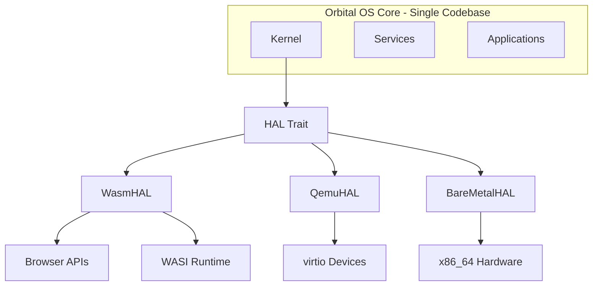
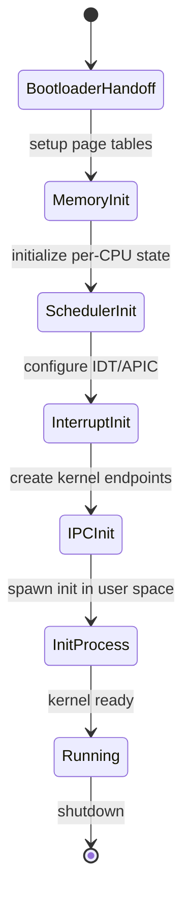
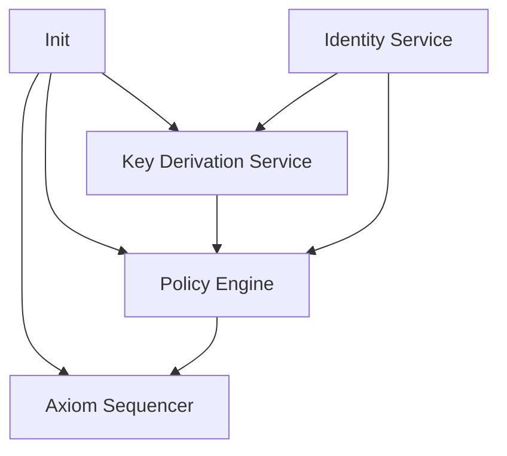

# Orbital OS - Architecture Overview

**Version:** 2.0  
**Status:** Whitepaper  
**Classification:** Public

---

## 1. System Layers (Most Fundamental First)

Orbital OS is structured in nine distinct layers, ordered from most fundamental (Layer 0) to least fundamental (Layer 8), all built on the Hardware Abstraction Layer (HAL):

```
LAYER 8: APPLICATIONS
  Deterministic Jobs, Visual OS

LAYER 7: USER-FACING SERVICES
  Terminal Service, Update Manager

LAYER 6: EXECUTION INFRASTRUCTURE
  Three-Phase Action Model, Verification and Receipts

LAYER 5: NETWORK and DEVICE
  Driver Manager, Network Service

LAYER 4: STORAGE
  Block Storage, Filesystem, Content-Addressed Store

LAYER 3: PROCESS and CAPABILITY
  Capability Service, Process Manager

LAYER 2: CORE AUTHORITY
  Axiom Sequencer, Policy Engine, Key Derivation Service, Identity Service

LAYER 1: BOOTSTRAP
  Init, Supervisor

LAYER 0: KERNEL
  Scheduler (SMP), Memory Manager, Capability Enforcer,
  IPC Primitives, Interrupt Handler

HARDWARE ABSTRACTION LAYER (HAL)
  Zero-cost platform abstraction trait

        │
        ├─────────────────┬─────────────────┐
        ▼                 ▼                 ▼
    ┌───────┐        ┌───────┐        ┌───────────┐
    │ WASM  │        │ QEMU  │        │ Bare Metal│
    │Browser│        │virtio │        │  x86_64   │
    └───────┘        └───────┘        └───────────┘
```

---

## 2. Hardware Abstraction Layer (HAL)

The HAL is the foundation that enables Orbital OS to run on multiple platforms from a **single codebase**. It provides a zero-cost compile-time abstraction over the execution substrate.

### 2.1 HAL Design Principles

| Principle | Description |
|-----------|-------------|
| **Zero-Cost Abstraction** | All HAL calls are monomorphized and inlined at compile time — no runtime overhead |
| **Minimal Interface** | Defines only the primitives that all platforms can provide |
| **Full Hardware Access** | Does not limit what native platforms can do (SMP, DMA, SIMD, etc.) |
| **Graceful Degradation** | WASM adapts to browser limitations while preserving core functionality |

### 2.2 HAL Trait

The HAL defines the interface between Orbital OS and its execution substrate:

```rust
pub trait HAL: Send + Sync + 'static {
    // Associated types for platform-specific handles
    type ThreadHandle: Clone + Send;
    type StorageHandle: StorageDevice;
    type NetworkHandle: NetworkDevice;
    
    // Execution primitives
    fn spawn_thread(&self, entry: fn()) -> Result<Self::ThreadHandle, HalError>;
    fn yield_now(&self);
    fn sleep(&self, duration: Duration);
    fn num_cpus(&self) -> usize;
    
    // Memory primitives
    fn allocate(&self, size: usize, align: usize) -> Result<*mut u8, HalError>;
    fn deallocate(&self, ptr: *mut u8, size: usize, align: usize);
    
    // Time and entropy
    fn now(&self) -> Instant;
    fn random_bytes(&self, buf: &mut [u8]) -> Result<(), HalError>;
    
    // I/O devices
    fn storage_devices(&self) -> Vec<Self::StorageHandle>;
    fn network_devices(&self) -> Vec<Self::NetworkHandle>;
    
    // Lifecycle
    fn shutdown(&self, code: i32) -> !;
}
```

### 2.3 Platform Implementations



### 2.4 Platform Capabilities

| Capability | WASM | QEMU | Bare Metal |
|------------|------|------|------------|
| **Threading** | Web Workers | Full SMP | Full SMP |
| **Preemption** | Cooperative | Timer interrupt | Timer interrupt |
| **Memory Protection** | WASM sandbox | Page tables | Page tables |
| **Storage** | IndexedDB/OPFS | virtio-blk | AHCI/NVMe |
| **Network** | WebSocket/Fetch | virtio-net | Real NIC |
| **SIMD** | WASM SIMD | AVX-512 | AVX-512 |
| **DMA** | N/A | virtio | Yes |

### 2.5 Build Targets

The same Orbital OS codebase compiles to all platforms:

```bash
# WASM build (browser or WASI)
cargo build --target wasm32-unknown-unknown --release

# QEMU/Bare metal build
cargo build --target x86_64-unknown-none --release
```

Both builds produce functionally equivalent systems — the Axiom, Policy Engine, and all services behave identically. Only the HAL implementation differs.

---

## 3. Layer 0: The Kernel

The kernel is built on the HAL and provides the **core system services** that all other layers depend on.

### 3.1 Kernel Responsibilities

The kernel provides exactly five services:

| Service | Description |
|---------|-------------|
| **Preemptive Scheduler** | SMP-aware, time-sliced, priority-based |
| **Memory Manager** | Virtual address spaces, page tables, isolation |
| **Capability Enforcer** | Token validation, unforgeable capabilities |
| **IPC Primitives** | Fast synchronous/asynchronous message passing |
| **Interrupt Handler** | Hardware interrupt routing, timer management |

### 3.2 Kernel Prohibitions

The kernel MUST NOT contain:

- Filesystem code
- Network stack
- Device-specific drivers (beyond bootstrap)
- Policy logic
- Axiom sequencer
- User authentication
- Identity management
- Key derivation
- Resource accounting (beyond enforcement)

### 3.3 Kernel State

The kernel is generic over the HAL and maintains minimal state:

```rust
struct Kernel<H: HAL> {
    // Reference to the HAL
    hal: H,
    
    // Process management
    processes: BTreeMap<ProcessId, Process>,
    threads: BTreeMap<ThreadId, Thread>,
    
    // Memory management
    address_spaces: BTreeMap<AddressSpaceId, AddressSpace>,
    
    // Capability tables
    capability_spaces: BTreeMap<ProcessId, CapabilitySpace>,
    
    // IPC endpoints
    endpoints: BTreeMap<EndpointId, Endpoint>,
    
    // Scheduler state
    scheduler: Scheduler<H>,
}
```

### 3.4 Kernel Boot Sequence



---

## 4. Layer 1: Bootstrap (Init and Supervisor)

The first user-space process (PID 1) operates in two phases:

### 4.1 Init Phase (Boot-Time)

**Init** is the boot-time phase that starts all system services:

| Responsibility | Description |
|----------------|-------------|
| **Kernel Handoff** | Receives capabilities and control from kernel |
| **Service Bootstrap** | Starts all system services in dependency order |
| **Capability Distribution** | Grants initial capabilities to services |
| **Boot Verification** | Ensures critical services are running before proceeding |
| **Transition** | Hands off to Supervisor once boot completes |

### 4.2 Supervisor Phase (Runtime)

**Supervisor** is the runtime phase that manages services:

| Responsibility | Description |
|----------------|-------------|
| **Health Monitoring** | Watches for service failures |
| **Restart Management** | Restarts failed services with backoff |
| **Shutdown Coordination** | Gracefully stops all services |
| **Service Discovery** | Helps services find each other |

### 4.3 Boot Sequence

Init boots services in layer order:

```rust
impl Init {
    pub fn boot(&mut self) -> Result<(), BootError> {
        // Layer 2: Core Authority Services (must be first)
        self.start_service("axiom")?;
        self.start_service("policy")?;
        self.start_service("keys")?;
        self.start_service("identity")?;
        
        // Layer 3: Process and Capability Services
        self.start_service("capability_service")?;
        self.start_service("process_manager")?;
        
        // Layer 4: Storage Services
        self.start_service("block_storage")?;
        self.start_service("filesystem")?;
        
        // Layer 5: Network and Device Services
        self.start_service("driver_manager")?;
        self.start_service("network")?;
        
        // Layer 7: User-Facing Services
        self.start_service("terminal")?;
        self.start_service("update_manager")?;
        
        Ok(())
    }
}
```

---

## 5. Layer 2: Core Authority Services

Layer 2 forms the **"authority spine"** of the system. These services must start first because all other services depend on them for authorization.

### 5.1 Service Dependency



### 5.2 Axiom Sequencer

The Axiom is the **single source of truth** for all system state.

```
AXIOM SUBSYSTEM

  AXIOM SEQUENCER
    - Receives proposals from Policy Engine
    - Validates proposals are policy-approved
    - Assigns sequence numbers
    - Commits entries atomically
    - Notifies subscribers
        |
        v
  AXIOM STORE
    Entry 0: Genesis
    Entry 1: ...
    Entry 2: ...
    Entry N: ...
    (hash-chained, append-only)
        |
        v
  REDUCER
    reduce(axiom) -> control_state
    - Pure function
    - Deterministic
    - Produces: policy_state, identity_state, capability_state
```

### 5.3 Policy Engine

The Policy Engine is the **gatekeeper** of all consequential operations.

```
POLICY ENGINE

  REQUEST INTAKE
    - Parse and validate request
    - Extract identity of requestor
    - Identify target resource
        |
        v
  AUTHENTICATION
    - Verify requestor identity
    - Validate credentials/signatures
    - Check identity is not revoked
        |
        v
  AUTHORIZATION
    - Evaluate policy rules against request
    - Check capabilities
    - Apply resource limits
        |
        v
  DECISION
    - Allow or Deny
    - Attach conditions/restrictions
    - Record decision in Axiom
```

### 5.4 Key Derivation Service

The Key Derivation Service (KDS) manages all cryptographic key operations:

```
KEY DERIVATION SERVICE

  SECURE BOUNDARY
    [Root Seed]   [Derive]    [Signing]
    (protected)    Engine      Engine
    
    [keys derived on-demand, zeroed after use]
        |
        v
  IPC INTERFACE
    - derive_public_key(path) -> PublicKey
    - sign(path, message, authorization) -> Signature
    - verify(public_key, message, signature) -> bool
    - encrypt(path, plaintext, authorization) -> Ciphertext
    - decrypt(path, ciphertext, authorization) -> Plaintext

Note: Private keys NEVER leave the secure boundary
```

### 5.5 Identity Service

The Identity Service manages all principal identities:

```
IDENTITY SERVICE

  IDENTITY REGISTRY
  
    System Identity (root)
      orbital.services.axiom
      orbital.services.policy
      orbital.services.keys
      orbital.services.filesystem
    
    Organization: example.org
      alice@example.org
        credential: passkey-1
        credential: recovery-key
      api-service@example.org
        credential: service-key
```

---

## 6. Layer 3: Process and Capability

### 6.1 Capability Service

Manages capability delegation and revocation:

```
CAPABILITY DELEGATION

  Parent      grants     Child       grants     Grand
  Process  ---------->  Process  ---------->   Child
  (alice)               (alice)    (attenuated)

  [RW, file.txt] ---> [R, file.txt] ---> [R, file.txt]
  (full access)       (reduced to        (cannot delegate
                       read-only)         further)

  All delegations recorded in Axiom with identity chain
```

### 6.2 Process Manager

Creates and manages processes, enforces resource limits:

```rust
pub trait ProcessManagerService {
    fn spawn(request: SpawnRequest, auth: AuthToken) -> Result<ProcessId, SpawnError>;
    fn kill(pid: ProcessId, signal: Signal, auth: AuthToken) -> Result<(), KillError>;
    fn get_info(pid: ProcessId) -> Result<ProcessInfo, ProcessError>;
    fn wait(pid: ProcessId) -> Result<ExitStatus, WaitError>;
}
```

---

## 7. Layer 4: Storage

### 7.1 Storage Architecture

```
STORAGE LAYER

  FILESYSTEM SERVICE
    - Namespace management (paths)
    - Metadata operations
    - Permission enforcement via Policy
        |
        v
  CONTENT-ADDRESSED STORE
    - Immutable blobs by BLAKE3 hash
    - Deduplication
    - Verification
        |
        v
  BLOCK STORAGE SERVICE
    - Block device abstraction
    - I/O scheduling
    - Allocation management
```

---

## 8. Layer 5: Network and Device

### 8.1 Driver Model

All device drivers run in user space as isolated processes:

```
DRIVER PROCESS
  [Driver Logic]  [DMA Buffer]  [Interrupt Handler]
  
  Capabilities: [IO_PORT, IRQ_N, DMA_REGION]
        |
        v
KERNEL
  - Maps DMA region into driver address space
  - Routes interrupt N to driver
  - Validates I/O port access via capability
```

### 8.2 Network Service

TCP/IP stack with policy-gated connections:

- All outbound connections require Axiom authorization
- Policy Engine evaluates connection requests
- Network activity recorded for audit

---

## 9. Layer 6: Execution Infrastructure

### 9.1 The Three-Phase Action Model

Every meaningful action follows this pattern:

```
Phase 1: Pre-Commit (Proposal)
  - Work is tentative
  - Effects are prepared but not executed
  - Crash here -> work is lost (acceptable)
  - Produces proposal for Policy Engine

Policy Gate (between Phase 1 and 2)
  - Authentication: verify requestor identity
  - Authorization: evaluate policy rules
  - Decision recorded in Axiom

Phase 2: Commit
  - Policy-approved proposals submitted to Axiom Sequencer
  - Sequencer orders and accepts/rejects
  - Accepted proposals become Axiom entries
  - Crash here -> entry either committed or not (atomic)

Phase 3: Effect Materialization
  - Axiom entry authorizes effects
  - Effects are executed
  - Effects MUST be idempotent (safe to retry)
  - Crash here -> retry from last committed receipt
  - Completion produces receipt
```

### 9.2 Verification and Receipts

Receipts bind inputs to outputs cryptographically:

```rust
struct Receipt {
    /// The Axiom entry this receipt corresponds to
    axiom_entry: AxiomSequence,
    
    /// Content hashes of inputs
    inputs: Vec<Hash>,
    
    /// Content hashes of outputs
    outputs: Vec<Hash>,
    
    /// Environment identity
    environment: Hash,
    
    /// Completion status
    status: EffectStatus,
}
```

---

## 10. Layer 7: User-Facing Services

### 10.1 Terminal Service

User interaction and command execution:

- Authentication via Identity Service
- Command authorization via Policy Engine
- Output and history management

### 10.2 Update Manager

Atomic system image updates:

- Images are content-addressed and signed
- Atomic swap (old image preserved for rollback)
- Update authorization via Policy Engine
- Recorded in Axiom

---

## 11. Layer 8: Applications

### 11.1 Deterministic Jobs (v0)

Applications execute as discrete jobs:

```rust
struct JobManifest {
    /// Executable specification
    executable: ExecutableSpec,
    
    /// Content-addressed inputs
    inputs: Vec<InputDeclaration>,
    
    /// Expected outputs
    outputs: Vec<OutputDeclaration>,
    
    /// Pinned environment
    environment: EnvironmentSpec,
    
    /// Determinism declaration
    determinism: DeterminismDeclaration,
}
```

### 11.2 Visual OS (Future)

Deterministic UI layer for interactive applications.

---

## 12. The Determinism Boundary

```
NONDETERMINISTIC ZONE
  [Scheduling Order]  [Interrupts Timing]  [Caching Behavior]
        |                   |                    |
        v                   v                    v
    [Proposals]         [Proposals]          [Proposals]
                            |
                            v
DETERMINISM BOUNDARY
                    [POLICY ENGINE]
                            |
                    [AXIOM SEQUENCER]
                            |
                            v
DETERMINISTIC ZONE
  [Axiom Ordering]  [Control State]  [Verification Inputs]
```

---

## 13. Summary

Orbital OS architecture is characterized by:

| Layer | Components | Role |
|-------|------------|------|
| **HAL** | WasmHAL, QemuHAL, BareMetalHAL | Platform abstraction - single codebase, multiple targets |
| **0** | Kernel | Process isolation, IPC, capabilities |
| **1** | Init, Supervisor | Bootstrap (Init), runtime management (Supervisor) |
| **2** | Axiom, Policy, Key Derivation Service, Identity Service | Authority spine - source of truth |
| **3** | Capability Service, Process Manager | Access control, process lifecycle |
| **4** | Block Storage, Filesystem | Persistent storage |
| **5** | Driver Manager, Network Service | Device and network access |
| **6** | Three-Phase Action Model, Verification & Receipts | Execution infrastructure |
| **7** | Terminal Service, Update Manager | User-facing services |
| **8** | Deterministic Jobs, Visual OS | Applications |

The layered architecture ensures:

- **Platform portability** - runs on WASM, QEMU, and bare metal from single codebase
- **Zero-cost abstraction** - HAL compiles away to direct platform calls
- **Clear dependencies** - each layer only depends on layers below
- **Isolation** - failures in higher layers do not crash lower layers
- **Auditability** - all significant operations flow through Layer 2's authority spine
- **Verifiability** - deterministic state derivation from Axiom

---

*[Core Principles](02-core-principles.md) | [Comparative Analysis](04-comparative-analysis.md)*
