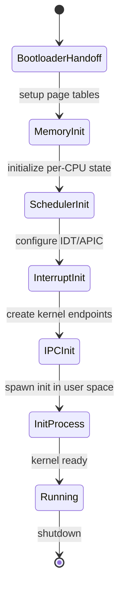
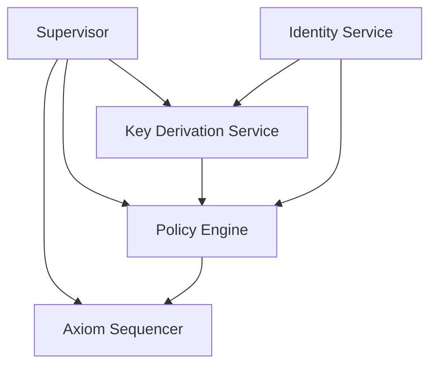

# Orbital OS — Architecture Overview

**Version:** 2.0  
**Status:** Whitepaper  
**Classification:** Public

---

## 1. System Layers (Most Fundamental First)

Orbital OS is structured in nine distinct layers, ordered from most fundamental (Layer 0) to least fundamental (Layer 8):

```
┌─────────────────────────────────────────────────────────────────────┐
│  LAYER 8: APPLICATIONS                                              │
│    Deterministic Jobs, Visual OS                                    │
├─────────────────────────────────────────────────────────────────────┤
│  LAYER 7: USER-FACING SERVICES                                      │
│    Terminal Service, Update Manager                                 │
├─────────────────────────────────────────────────────────────────────┤
│  LAYER 6: EXECUTION INFRASTRUCTURE                                  │
│    Three-Phase Action Model, Verification & Receipts                │
├─────────────────────────────────────────────────────────────────────┤
│  LAYER 5: NETWORK & DEVICE                                          │
│    Driver Manager, Network Service                                  │
├─────────────────────────────────────────────────────────────────────┤
│  LAYER 4: STORAGE                                                   │
│    Block Storage, Filesystem, Content-Addressed Store               │
├─────────────────────────────────────────────────────────────────────┤
│  LAYER 3: PROCESS & CAPABILITY                                      │
│    Capability Service, Process Manager                              │
├─────────────────────────────────────────────────────────────────────┤
│  LAYER 2: CORE AUTHORITY                                            │
│    Axiom Sequencer, Policy Engine, Key Service, Identity Service    │
├─────────────────────────────────────────────────────────────────────┤
│  LAYER 1: BOOTSTRAP                                                 │
│    Supervisor                                                       │
├─────────────────────────────────────────────────────────────────────┤
│  LAYER 0: KERNEL                                                    │
│    Scheduler (SMP), Memory Manager, Capability Enforcer,            │
│    IPC Primitives, Interrupt Handler                                │
└─────────────────────────────────────────────────────────────────────┘
                              │
                              ▼
                    ┌─────────────────┐
                    │    HARDWARE     │
                    │  (x86_64 first) │
                    └─────────────────┘
```

---

## 2. Layer 0: The Kernel

The kernel is the **most fundamental component** — everything else depends on it.

### 2.1 Kernel Responsibilities

The kernel provides exactly five services:

| Service | Description |
|---------|-------------|
| **Preemptive Scheduler** | SMP-aware, time-sliced, priority-based |
| **Memory Manager** | Virtual address spaces, page tables, isolation |
| **Capability Enforcer** | Token validation, unforgeable capabilities |
| **IPC Primitives** | Fast synchronous/asynchronous message passing |
| **Interrupt Handler** | Hardware interrupt routing, timer management |

### 2.2 Kernel Prohibitions

The kernel MUST NOT contain:

- Filesystem code
- Network stack
- Device-specific drivers (beyond bootstrap)
- Policy logic
- Axiom sequencer
- User authentication
- Identity management
- Key derivation
- Resource accounting (beyond enforcement)

### 2.3 Kernel State

The kernel maintains minimal state:

```rust
struct KernelState {
    // Process management
    processes: BTreeMap<ProcessId, Process>,
    threads: BTreeMap<ThreadId, Thread>,
    
    // Memory management
    address_spaces: BTreeMap<AddressSpaceId, AddressSpace>,
    
    // Capability tables
    capability_spaces: BTreeMap<ProcessId, CapabilitySpace>,
    
    // IPC endpoints
    endpoints: BTreeMap<EndpointId, Endpoint>,
    
    // Scheduler state
    run_queues: PerCpu<RunQueue>,
}
```

### 2.4 Kernel Boot Sequence



---

## 3. Layer 1: Bootstrap (Supervisor)

The **Supervisor** is the first user-space process and the second most fundamental component.

### 3.1 Role

| Responsibility | Description |
|----------------|-------------|
| **Service Boot** | Starts all system services in dependency order |
| **Health Monitoring** | Watches for service failures |
| **Restart Management** | Restarts failed services with backoff |
| **System Capabilities** | Holds full system capabilities from kernel |

### 3.2 Boot Sequence

The Supervisor boots services in layer order:

```rust
impl Supervisor {
    pub fn boot(&mut self) -> Result<(), BootError> {
        // Layer 2: Core Authority Services (must be first)
        self.start_service("axiom")?;
        self.start_service("policy")?;
        self.start_service("keys")?;
        self.start_service("identity")?;
        
        // Layer 3: Process & Capability Services
        self.start_service("capability_service")?;
        self.start_service("process_manager")?;
        
        // Layer 4: Storage Services
        self.start_service("block_storage")?;
        self.start_service("filesystem")?;
        
        // Layer 5: Network & Device Services
        self.start_service("driver_manager")?;
        self.start_service("network")?;
        
        // Layer 7: User-Facing Services
        self.start_service("terminal")?;
        self.start_service("update_manager")?;
        
        Ok(())
    }
}
```

---

## 4. Layer 2: Core Authority Services

Layer 2 forms the **"authority spine"** of the system. These services must start first because all other services depend on them for authorization.

### 4.1 Service Dependency



### 4.2 Axiom Sequencer

The Axiom is the **single source of truth** for all system state.

```
┌─────────────────────────────────────────────────────────────────────┐
│                      AXIOM SUBSYSTEM                                 │
│                                                                     │
│  ┌─────────────────────────────────────────────────────────────┐   │
│  │                  AXIOM SEQUENCER                             │   │
│  │                                                              │   │
│  │  • Receives proposals from Policy Engine                    │   │
│  │  • Validates proposals are policy-approved                  │   │
│  │  • Assigns sequence numbers                                 │   │
│  │  • Commits entries atomically                               │   │
│  │  • Notifies subscribers                                     │   │
│  └─────────────────────────────────────────────────────────────┘   │
│                           │                                         │
│                           ▼                                         │
│  ┌─────────────────────────────────────────────────────────────┐   │
│  │                   AXIOM STORE                                │   │
│  │                                                              │   │
│  │  Entry 0: Genesis                                           │   │
│  │  Entry 1: ─────────────────────────────────────────────────▶│   │
│  │  Entry 2: ─────────────────────────────────────────────────▶│   │
│  │  Entry N: ─────────────────────────────────────────────────▶│   │
│  │           (hash-chained, append-only)                       │   │
│  └─────────────────────────────────────────────────────────────┘   │
│                           │                                         │
│                           ▼                                         │
│  ┌─────────────────────────────────────────────────────────────┐   │
│  │                   REDUCER                                    │   │
│  │                                                              │   │
│  │  reduce(axiom) → control_state                              │   │
│  │                                                              │   │
│  │  • Pure function                                            │   │
│  │  • Deterministic                                            │   │
│  │  • Produces: policy_state, identity_state, capability_state │   │
│  └─────────────────────────────────────────────────────────────┘   │
│                                                                     │
└─────────────────────────────────────────────────────────────────────┘
```

### 4.3 Policy Engine

The Policy Engine is the **gatekeeper** of all consequential operations.

```
┌─────────────────────────────────────────────────────────────────────┐
│                         POLICY ENGINE                               │
│                                                                     │
│  ┌───────────────────────────────────────────────────────────────┐ │
│  │                    REQUEST INTAKE                              │ │
│  │  • Parse and validate request                                  │ │
│  │  • Extract identity of requestor                               │ │
│  │  • Identify target resource                                    │ │
│  └───────────────────────────────────────────────────────────────┘ │
│                              │                                      │
│                              ▼                                      │
│  ┌───────────────────────────────────────────────────────────────┐ │
│  │                    AUTHENTICATION                              │ │
│  │  • Verify requestor identity                                   │ │
│  │  • Validate credentials/signatures                             │ │
│  │  • Check identity is not revoked                               │ │
│  └───────────────────────────────────────────────────────────────┘ │
│                              │                                      │
│                              ▼                                      │
│  ┌───────────────────────────────────────────────────────────────┐ │
│  │                    AUTHORIZATION                               │ │
│  │  • Evaluate policy rules against request                       │ │
│  │  • Check capabilities                                          │ │
│  │  • Apply resource limits                                       │ │
│  └───────────────────────────────────────────────────────────────┘ │
│                              │                                      │
│                              ▼                                      │
│  ┌───────────────────────────────────────────────────────────────┐ │
│  │                    DECISION                                    │ │
│  │  • Allow or Deny                                               │ │
│  │  • Attach conditions/restrictions                              │ │
│  │  • Record decision in Axiom                                    │ │
│  └───────────────────────────────────────────────────────────────┘ │
│                                                                     │
└─────────────────────────────────────────────────────────────────────┘
```

### 4.4 Key Derivation Service

The Key Derivation Service (KDS) manages all cryptographic key operations:

```
┌─────────────────────────────────────────────────────────────────────┐
│                    KEY DERIVATION SERVICE                           │
│                                                                     │
│  ┌───────────────────────────────────────────────────────────────┐ │
│  │                    SECURE BOUNDARY                             │ │
│  │                                                                │ │
│  │  ┌─────────────┐  ┌─────────────┐  ┌─────────────┐            │ │
│  │  │  Root Seed  │  │   Derive    │  │   Signing   │            │ │
│  │  │  (protected)│  │   Engine    │  │   Engine    │            │ │
│  │  └─────────────┘  └─────────────┘  └─────────────┘            │ │
│  │                                                                │ │
│  │  [keys derived on-demand, zeroed after use]                   │ │
│  └───────────────────────────────────────────────────────────────┘ │
│                              │                                      │
│                              ▼                                      │
│  ┌───────────────────────────────────────────────────────────────┐ │
│  │                    IPC INTERFACE                               │ │
│  │  • derive_public_key(path) → PublicKey                        │ │
│  │  • sign(path, message, authorization) → Signature             │ │
│  │  • verify(public_key, message, signature) → bool              │ │
│  │  • encrypt(path, plaintext, authorization) → Ciphertext       │ │
│  │  • decrypt(path, ciphertext, authorization) → Plaintext       │ │
│  └───────────────────────────────────────────────────────────────┘ │
│                                                                     │
│  Note: Private keys NEVER leave the secure boundary                │
│                                                                     │
└─────────────────────────────────────────────────────────────────────┘
```

### 4.5 Identity Service

The Identity Service manages all principal identities:

```
┌─────────────────────────────────────────────────────────────────────┐
│                       IDENTITY SERVICE                              │
│                                                                     │
│  ┌───────────────────────────────────────────────────────────────┐ │
│  │                    IDENTITY REGISTRY                           │ │
│  │                                                                │ │
│  │  System Identity (root)                                        │ │
│  │  ├── orbital.services.axiom                                   │ │
│  │  ├── orbital.services.policy                                  │ │
│  │  ├── orbital.services.keys                                    │ │
│  │  └── orbital.services.filesystem                              │ │
│  │                                                                │ │
│  │  Organization: example.org                                     │ │
│  │  ├── alice@example.org                                        │ │
│  │  │   ├── credential: passkey-1                                │ │
│  │  │   └── credential: recovery-key                             │ │
│  │  └── api-service@example.org                                  │ │
│  │      └── credential: service-key                              │ │
│  │                                                                │ │
│  └───────────────────────────────────────────────────────────────┘ │
│                                                                     │
└─────────────────────────────────────────────────────────────────────┘
```

---

## 5. Layer 3: Process & Capability

### 5.1 Capability Service

Manages capability delegation and revocation:

```
┌──────────────────────────────────────────────────────────────┐
│                    CAPABILITY DELEGATION                      │
│                                                              │
│   ┌─────────┐         ┌─────────┐         ┌─────────┐       │
│   │ Parent  │ ──────▶ │  Child  │ ──────▶ │  Grand  │       │
│   │ Process │ grants  │ Process │ grants  │  Child  │       │
│   │(alice)  │         │(alice)  │(attenuated)       │       │
│   └─────────┘         └─────────┘         └─────────┘       │
│                                                              │
│   [RW, file.txt] ───▶ [R, file.txt] ───▶ [R, file.txt]     │
│   (full access)      (reduced to        (cannot delegate    │
│                       read-only)         further)           │
│                                                              │
│   All delegations recorded in Axiom with identity chain     │
│                                                              │
└──────────────────────────────────────────────────────────────┘
```

### 5.2 Process Manager

Creates and manages processes, enforces resource limits:

```rust
pub trait ProcessManagerService {
    fn spawn(request: SpawnRequest, auth: AuthToken) -> Result<ProcessId, SpawnError>;
    fn kill(pid: ProcessId, signal: Signal, auth: AuthToken) -> Result<(), KillError>;
    fn get_info(pid: ProcessId) -> Result<ProcessInfo, ProcessError>;
    fn wait(pid: ProcessId) -> Result<ExitStatus, WaitError>;
}
```

---

## 6. Layer 4: Storage

### 6.1 Storage Architecture

```
┌─────────────────────────────────────────────────────────────┐
│                    STORAGE LAYER                             │
│                                                             │
│  ┌─────────────────────────────────────────────────────┐   │
│  │              FILESYSTEM SERVICE                      │   │
│  │  • Namespace management (paths)                     │   │
│  │  • Metadata operations                              │   │
│  │  • Permission enforcement via Policy                │   │
│  └─────────────────────────────────────────────────────┘   │
│                         │                                   │
│  ┌─────────────────────────────────────────────────────┐   │
│  │          CONTENT-ADDRESSED STORE                     │   │
│  │  • Immutable blobs by BLAKE3 hash                   │   │
│  │  • Deduplication                                    │   │
│  │  • Verification                                     │   │
│  └─────────────────────────────────────────────────────┘   │
│                         │                                   │
│  ┌─────────────────────────────────────────────────────┐   │
│  │              BLOCK STORAGE SERVICE                   │   │
│  │  • Block device abstraction                         │   │
│  │  • I/O scheduling                                   │   │
│  │  • Allocation management                            │   │
│  └─────────────────────────────────────────────────────┘   │
│                                                             │
└─────────────────────────────────────────────────────────────┘
```

---

## 7. Layer 5: Network & Device

### 7.1 Driver Model

All device drivers run in user space as isolated processes:

```
┌────────────────────────────────────────────────────────────┐
│                     DRIVER PROCESS                          │
│                                                            │
│  ┌──────────────┐  ┌──────────────┐  ┌──────────────┐     │
│  │   Driver     │  │   DMA        │  │  Interrupt   │     │
│  │   Logic      │  │   Buffer     │  │   Handler    │     │
│  └──────────────┘  └──────────────┘  └──────────────┘     │
│                                                            │
│  Capabilities: [IO_PORT, IRQ_N, DMA_REGION]               │
│                                                            │
└────────────────────────────────────────────────────────────┘
         │                    │                    │
         ▼                    ▼                    ▼
┌────────────────────────────────────────────────────────────┐
│                        KERNEL                               │
│  • Maps DMA region into driver address space               │
│  • Routes interrupt N to driver                            │
│  • Validates I/O port access via capability                │
└────────────────────────────────────────────────────────────┘
```

### 7.2 Network Service

TCP/IP stack with policy-gated connections:

- All outbound connections require Axiom authorization
- Policy Engine evaluates connection requests
- Network activity recorded for audit

---

## 8. Layer 6: Execution Infrastructure

### 8.1 The Three-Phase Action Model

Every meaningful action follows this pattern:

```
Phase 1: Pre-Commit (Proposal)
├── Work is tentative
├── Effects are prepared but not executed
├── Crash here → work is lost (acceptable)
└── Produces proposal for Policy Engine

Policy Gate (between Phase 1 and 2)
├── Authentication — verify requestor identity
├── Authorization — evaluate policy rules
└── Decision recorded in Axiom

Phase 2: Commit
├── Policy-approved proposals submitted to Axiom Sequencer
├── Sequencer orders and accepts/rejects
├── Accepted proposals become Axiom entries
└── Crash here → entry either committed or not (atomic)

Phase 3: Effect Materialization
├── Axiom entry authorizes effects
├── Effects are executed
├── Effects MUST be idempotent (safe to retry)
├── Crash here → retry from last committed receipt
└── Completion produces receipt
```

### 8.2 Verification & Receipts

Receipts bind inputs to outputs cryptographically:

```rust
struct Receipt {
    /// The Axiom entry this receipt corresponds to
    axiom_entry: AxiomSequence,
    
    /// Content hashes of inputs
    inputs: Vec<Hash>,
    
    /// Content hashes of outputs
    outputs: Vec<Hash>,
    
    /// Environment identity
    environment: Hash,
    
    /// Completion status
    status: EffectStatus,
}
```

---

## 9. Layer 7: User-Facing Services

### 9.1 Terminal Service

User interaction and command execution:

- Authentication via Identity Service
- Command authorization via Policy Engine
- Output and history management

### 9.2 Update Manager

Atomic system image updates:

- Images are content-addressed and signed
- Atomic swap (old image preserved for rollback)
- Update authorization via Policy Engine
- Recorded in Axiom

---

## 10. Layer 8: Applications

### 10.1 Deterministic Jobs (v0)

Applications execute as discrete jobs:

```rust
struct JobManifest {
    /// Executable specification
    executable: ExecutableSpec,
    
    /// Content-addressed inputs
    inputs: Vec<InputDeclaration>,
    
    /// Expected outputs
    outputs: Vec<OutputDeclaration>,
    
    /// Pinned environment
    environment: EnvironmentSpec,
    
    /// Determinism declaration
    determinism: DeterminismDeclaration,
}
```

### 10.2 Visual OS (Future)

Deterministic UI layer for interactive applications.

---

## 11. The Determinism Boundary

```
┌─────────────────────────────────────────────────────────────────┐
│                    NONDETERMINISTIC ZONE                        │
│                                                                 │
│  ┌───────────────┐ ┌───────────────┐ ┌───────────────┐         │
│  │  Scheduling   │ │   Interrupts  │ │    Caching    │         │
│  │    Order      │ │    Timing     │ │   Behavior    │         │
│  └───────────────┘ └───────────────┘ └───────────────┘         │
│                                                                 │
│         │                    │                    │             │
│         ▼                    ▼                    ▼             │
│     [Proposals]          [Proposals]         [Proposals]        │
│                                                                 │
└─────────────────────────────────┬───────────────────────────────┘
                                  │
                                  ▼
┌─────────────────────────────────────────────────────────────────┐
│                      DETERMINISM BOUNDARY                        │
│                                                                 │
│                    ┌─────────────────┐                          │
│                    │  POLICY ENGINE  │                          │
│                    └────────┬────────┘                          │
│                             │                                   │
│                    ┌────────┴────────┐                          │
│                    │ AXIOM SEQUENCER │                          │
│                    └────────┬────────┘                          │
│                             │                                   │
└─────────────────────────────────────────────────────────────────┘
                              │
                              ▼
┌─────────────────────────────────────────────────────────────────┐
│                     DETERMINISTIC ZONE                           │
│                                                                 │
│  ┌───────────────┐ ┌───────────────┐ ┌───────────────┐         │
│  │    Axiom      │ │   Control     │ │ Verification  │         │
│  │   Ordering    │ │    State      │ │    Inputs     │         │
│  └───────────────┘ └───────────────┘ └───────────────┘         │
│                                                                 │
└─────────────────────────────────────────────────────────────────┘
```

---

## 12. Summary

Orbital OS architecture is characterized by:

| Layer | Components | Role |
|-------|------------|------|
| **0** | Kernel | Hardware abstraction, isolation, IPC |
| **1** | Supervisor | Bootstrap, service management |
| **2** | Axiom, Policy, Keys, Identity | Authority spine — source of truth |
| **3** | Capabilities, Process Manager | Access control, process lifecycle |
| **4** | Block Storage, Filesystem | Persistent storage |
| **5** | Drivers, Network | Device and network access |
| **6** | Three-Phase Model, Verification | Execution infrastructure |
| **7** | Terminal, Update Manager | User-facing services |
| **8** | Jobs, Visual OS | Applications |

The layered architecture ensures:

- **Clear dependencies** — each layer only depends on layers below
- **Isolation** — failures in higher layers don't crash lower layers
- **Auditability** — all significant operations flow through Layer 2's authority spine
- **Verifiability** — deterministic state derivation from Axiom

---

*← [Core Principles](02-core-principles.md) | [Comparative Analysis](04-comparative-analysis.md) →*
